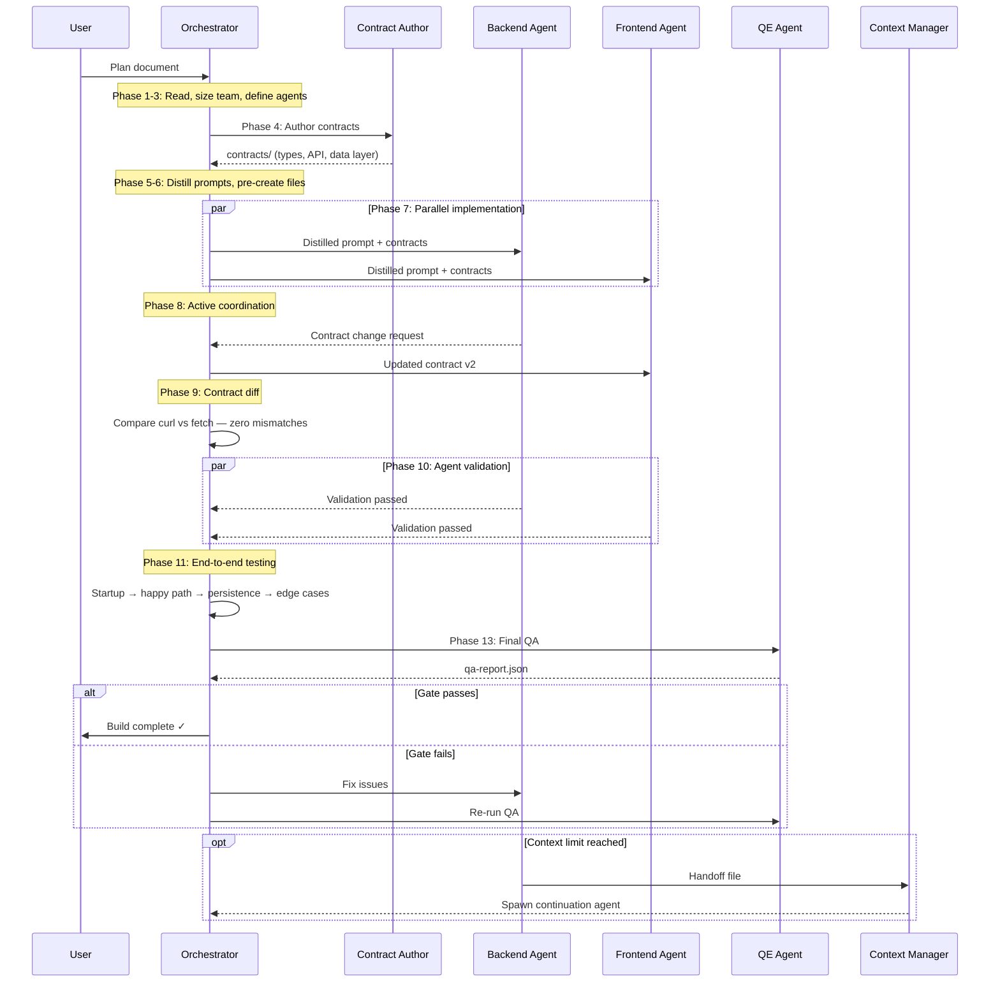
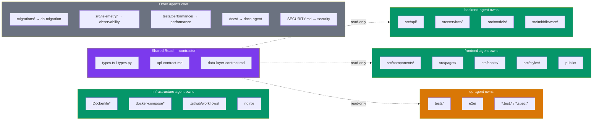
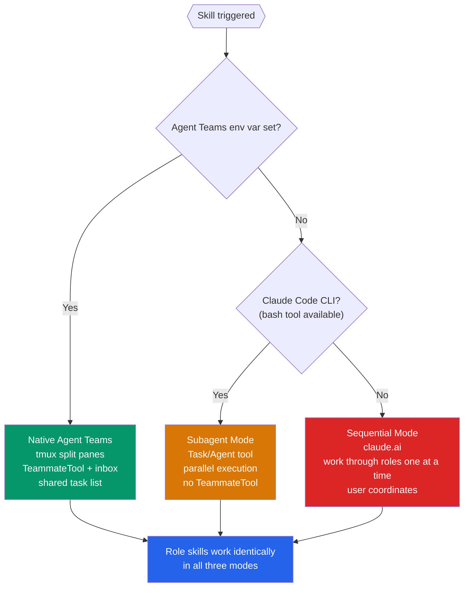

# Skill Ecosystem Architecture

## System Overview

```mermaid
graph TB
    subgraph entry["Entry Points"]
        USER([User Request])
        SW[skill-writer]
        PP[project-profiler]
    end

    subgraph orchestration["Orchestration Layer"]
        ORCH[orchestrator]
        CM[context-manager]
    end

    subgraph contracts_layer["Contract Layer — runs before implementation"]
        CA[contract-author]
        CAU[contract-auditor]
    end

    subgraph impl["Implementation Agents — run in parallel"]
        BE[backend-agent]
        FE[frontend-agent]
        INFRA[infrastructure-agent]
        DB[db-migration-agent]
        OBS[observability-agent]
    end

    subgraph review["Review Agents — run after implementation"]
        QE[qe-agent]
        SEC[security-agent]
        CR[code-reviewer]
        DOC[docs-agent]
        PERF[performance-agent]
    end

    subgraph gates["Quality Gates"]
        DC[deployment-checklist]
        QAR[(qa-report.json)]
    end

    USER -->|"plan document"| ORCH
    USER -->|"create a skill"| SW
    USER -->|"profile this codebase"| PP

    ORCH -->|"Phase 4: author"| CA
    ORCH -->|"Phase 7: spawn"| impl
    ORCH -->|"Phase 9: audit"| CAU
    ORCH -->|"Phase 13: QA"| QE
    ORCH -.->|"on context limit"| CM

    CA -->|"contracts/"| impl
    CA -->|"contracts/"| review

    BE <-->|"API contract"| FE
    BE -->|"schema"| DB
    INFRA -->|"Docker/CI"| BE
    INFRA -->|"Docker/CI"| FE
    OBS -->|"instrumentation"| BE

    QE -->|"qa-report.json"| QAR
    QAR -->|"gate decision"| ORCH
    SEC -->|"security report"| ORCH
    CR -->|"review report"| ORCH
    PERF -->|"perf report"| ORCH
    DOC -->|"README, docs/"| ORCH

    QE --> DC
    INFRA --> DC
    DC -->|"READY / NOT READY"| ORCH

    style ORCH fill:#2563eb,color:#fff,stroke:#1d4ed8
    style CA fill:#7c3aed,color:#fff,stroke:#6d28d9
    style CAU fill:#7c3aed,color:#fff,stroke:#6d28d9
    style QAR fill:#dc2626,color:#fff,stroke:#b91c1c
    style DC fill:#dc2626,color:#fff,stroke:#b91c1c

    style BE fill:#059669,color:#fff,stroke:#047857
    style FE fill:#059669,color:#fff,stroke:#047857
    style INFRA fill:#059669,color:#fff,stroke:#047857
    style DB fill:#059669,color:#fff,stroke:#047857
    style OBS fill:#059669,color:#fff,stroke:#047857

    style QE fill:#d97706,color:#fff,stroke:#b45309
    style SEC fill:#d97706,color:#fff,stroke:#b45309
    style CR fill:#d97706,color:#fff,stroke:#b45309
    style DOC fill:#d97706,color:#fff,stroke:#b45309
    style PERF fill:#d97706,color:#fff,stroke:#b45309

    style SW fill:#6b7280,color:#fff,stroke:#4b5563
    style PP fill:#6b7280,color:#fff,stroke:#4b5563
    style CM fill:#6b7280,color:#fff,stroke:#4b5563
```

## Build Phase Sequence

```mermaid
sequenceDiagram
    participant U as User
    participant O as Orchestrator
    participant CA as Contract Author
    participant BE as Backend Agent
    participant FE as Frontend Agent
    participant QE as QE Agent
    participant CM as Context Manager

    U->>O: Plan document
    Note over O: Phase 1-3: Read, size team, define agents

    O->>CA: Phase 4: Author contracts
    CA-->>O: contracts/ (types, API, data layer)

    Note over O: Phase 5-6: Distill prompts, pre-create files

    par Phase 7: Parallel implementation
        O->>BE: Distilled prompt + contracts
        O->>FE: Distilled prompt + contracts
    end

    Note over O: Phase 8: Active coordination
    BE-->>O: Contract change request
    O->>FE: Updated contract v2

    Note over O: Phase 9: Contract diff
    O->>O: Compare curl vs fetch — zero mismatches

    par Phase 10: Agent validation
        BE-->>O: Validation passed
        FE-->>O: Validation passed
    end

    Note over O: Phase 11: End-to-end testing
    O->>O: Startup → happy path → persistence → edge cases

    O->>QE: Phase 13: Final QA
    QE-->>O: qa-report.json

    alt Gate passes
        O->>U: Build complete ✓
    else Gate fails
        O->>BE: Fix issues
        O->>QE: Re-run QA
    end

    opt Context limit reached
        BE->>CM: Handoff file
        CM-->>O: Spawn continuation agent
    end
```

## File Ownership Map

```mermaid
graph LR
    subgraph backend_owns["backend-agent owns"]
        B1["src/api/"]
        B2["src/services/"]
        B3["src/models/"]
        B4["src/middleware/"]
    end

    subgraph frontend_owns["frontend-agent owns"]
        F1["src/components/"]
        F2["src/pages/"]
        F3["src/hooks/"]
        F4["src/styles/"]
        F5["public/"]
    end

    subgraph infra_owns["infrastructure-agent owns"]
        I1["Dockerfile*"]
        I2["docker-compose*"]
        I3[".github/workflows/"]
        I4["nginx/"]
    end

    subgraph qe_owns["qe-agent owns"]
        Q1["tests/"]
        Q2["e2e/"]
        Q3["*.test.* / *.spec.*"]
    end

    subgraph shared["Shared Read — contracts/"]
        S1["types.ts / types.py"]
        S2["api-contract.md"]
        S3["data-layer-contract.md"]
    end

    subgraph other_owns["Other agents own"]
        O1["migrations/ → db-migration"]
        O2["src/telemetry/ → observability"]
        O3["tests/performance/ → performance"]
        O4["docs/ → docs-agent"]
        O5["SECURITY.md → security"]
    end

    shared -.->|"read-only"| backend_owns
    shared -.->|"read-only"| frontend_owns
    shared -.->|"read-only"| qe_owns

    style shared fill:#7c3aed,color:#fff
    style backend_owns fill:#059669,color:#fff
    style frontend_owns fill:#059669,color:#fff
    style infra_owns fill:#059669,color:#fff
    style qe_owns fill:#d97706,color:#fff
    style other_owns fill:#6b7280,color:#fff
```

## Skill File Inventory

```mermaid
graph TD
    subgraph orch["orchestrator/ — 5 files"]
        O_S["SKILL.md"]
        O_R1["refs/phase-guide.md"]
        O_R2["refs/team-sizing.md"]
        O_R3["refs/circuit-breaker.md"]
        O_R4["refs/handoff-protocol.md"]
    end

    subgraph roles["roles/ — 20 files"]
        subgraph r_core["Core Agents"]
            BE_S["backend/ SKILL.md + validation-checklist"]
            FE_S["frontend/ SKILL.md + validation-checklist"]
            IN_S["infrastructure/ SKILL.md + validation-checklist"]
            QE_S["qe/ SKILL.md + validation-checklist + llm-judge-rubrics + qa-report-schema"]
        end
        subgraph r_spec["Specialist Agents"]
            SE_S["security/ SKILL.md + owasp-checklist"]
            DO_S["docs/ SKILL.md + doc-templates"]
            OB_S["observability/ SKILL.md + monitoring-patterns"]
            DB_S["db-migration/ SKILL.md + migration-checklist"]
            PE_S["performance/ SKILL.md + k6-patterns + neoload-patterns"]
        end
    end

    subgraph contracts["contracts/ — 8 files"]
        CA_S["contract-author/ SKILL.md"]
        CA_R["refs: openapi.yaml, asyncapi.yaml,<br/>pydantic.py, typescript.ts, json-schema.json"]
        AU_S["contract-auditor/ SKILL.md + pact-setup"]
    end

    subgraph meta["meta/ — 7 files"]
        SK_S["skill-writer/ SKILL.md + frontmatter-spec + description-patterns"]
        PP_S["project-profiler/ SKILL.md + profile-schema.yaml"]
        CR_S["code-reviewer/ SKILL.md + review-rubric"]
    end

    subgraph workflows["workflows/ — 4 files"]
        CM_S["context-manager/ SKILL.md + compaction-guide"]
        DC_S["deployment-checklist/ SKILL.md + pre-deploy"]
    end

    style orch fill:#2563eb,color:#fff
    style roles fill:#059669,color:#fff
    style r_core fill:#047857,color:#fff
    style r_spec fill:#065f46,color:#fff
    style contracts fill:#7c3aed,color:#fff
    style meta fill:#6b7280,color:#fff
    style workflows fill:#d97706,color:#fff
```

## Runtime Degradation

```mermaid
flowchart TD
    START{{"Skill triggered"}} --> CHECK1{"Agent Teams env var set?"}

    CHECK1 -->|Yes| TEAMS["Native Agent Teams<br/>tmux split panes<br/>TeammateTool + inbox<br/>shared task list"]

    CHECK1 -->|No| CHECK2{"Claude Code CLI?<br/>(bash tool available)"}

    CHECK2 -->|Yes| SUBAGENT["Subagent Mode<br/>Task/Agent tool<br/>parallel execution<br/>no TeammateTool"]

    CHECK2 -->|No| SEQ["Sequential Mode<br/>claude.ai<br/>work through roles one at a time<br/>user coordinates"]

    TEAMS --> WORKS["Role skills work identically<br/>in all three modes"]
    SUBAGENT --> WORKS
    SEQ --> WORKS

    style TEAMS fill:#059669,color:#fff
    style SUBAGENT fill:#d97706,color:#fff
    style SEQ fill:#dc2626,color:#fff
    style WORKS fill:#2563eb,color:#fff
```
