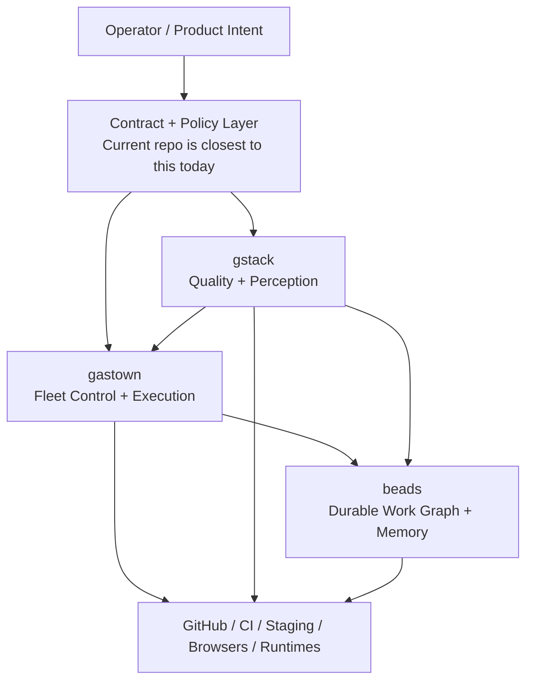

# 01 — System Atlas

## The shortest correct description

- `gstack` gives agents eyes, review instincts, design taste, and evals
- `gastown` gives agents identities, sandboxes, dispatch, patrol, and merge flow
- `beads` gives agents durable memory, dependencies, ready queues, and history

That is the right mental model.

## The stack at a glance

## What each repo really is

| Repo | Best mental model | Strongest primitives | Hard boundary |
|------|-------------------|----------------------|---------------|
| `gstack` | Quality brain with a browser | Browser daemon, cognitive review patterns, design intelligence, skill evals, shipping workflow | Single-session, Claude-centric, little durable shared state |
| `gastown` | Multi-agent operating system | Agent identity, worktree isolation, runtime abstraction, convoys, patrol loops, merge queue, tmux and dashboards | Weak quality reasoning, steep complexity, local-first operational model |
| `beads` | Durable task and memory substrate | Dependency graph, ready queue, Dolt-backed history, formulas, compaction, federation | Passive system, not a dispatcher, no real quality brain |

## What each repo is not

| Repo | Common misunderstanding | More accurate framing |
|------|-------------------------|-----------------------|
| `gstack` | "An orchestration framework" | It is a specialist workflow and quality system, not a fleet manager |
| `gastown` | "A better agent prompt pack" | It is an execution control plane with real process management |
| `beads` | "The orchestration system itself" | It is the graph database and memory layer underneath orchestration |

## Coverage by operating concern

| Concern | gstack | gastown | beads |
|---------|--------|---------|-------|
| Real browser interaction | Strong | Weak | None |
| Planning and review cognition | Strong | Medium | Weak |
| Parallel agent dispatch | Weak | Strong | None |
| Persistent task memory | Weak | Medium | Strong |
| Merge and integration flow | Weak | Strong | Weak |
| Runtime abstraction | Weak | Strong | None |
| Design system enforcement | Strong | Weak | None |
| Contract-first architecture | Weak alone | Weak alone | Weak alone |
| Eval of agent behavior | Strong | Weak | Weak |
| Federation and sync | Weak | Medium | Medium-Strong |

## Where each repo wins

### gstack wins when:

- One operator needs world-class review, QA, and design pressure
- Browser evidence matters
- The biggest risk is low-quality agent output, not lack of parallelism
- You need to validate prompts and skills as software

### gastown wins when:

- One operator needs 10 to 30 agents running at once
- Worktree isolation and session recovery matter
- The bottleneck is coordination, queueing, and merge management
- Multiple runtimes must coexist under one dispatcher

### beads wins when:

- The work graph must survive sessions, machines, and branches
- Dependencies must be queryable instead of implicit
- Agents need a ready queue instead of rereading markdown plans
- Work history must decay, compact, and stay queryable

## The hidden fourth layer

The current repo, `AllTheSkillsAllTheAgents`, is not one of the three target
repos, but it matters because it already models a missing layer:

- contract authoring
- file ownership
- QA gate schemas
- role prompts that can be generated and carried between sessions

This is important because the three target repos leave a contract and policy
gap in the middle of the stack.

## Strategic reading rule

Use the repo that is native to the problem:

- Problem is "the agent cannot see" -> `gstack`
- Problem is "too many agents are colliding" -> `gastown`
- Problem is "the work disappears between sessions" -> `beads`
- Problem is "all of these must behave like one product" -> build the missing layer

## Key conclusion

Do not choose one winner.

Choose a stable role for each:

- let `gstack` judge and observe
- let `gastown` dispatch and integrate
- let `beads` remember and coordinate state

Then build the missing policy fabric on top.
