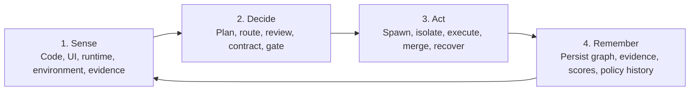
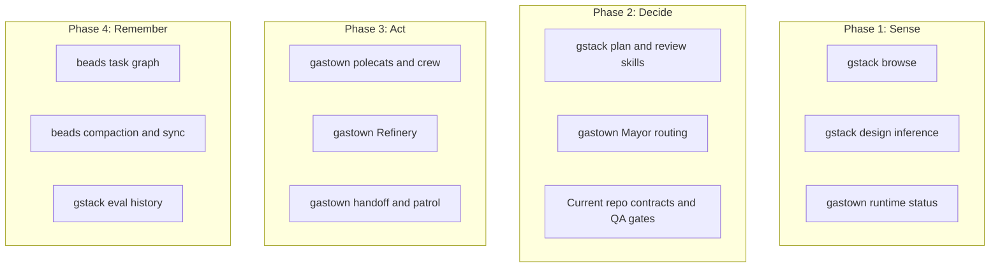

# 02 — Four-Phase Model

## Thesis

A fully orchestrated agentic software factory has four phases:

1. `Sense` what is true
2. `Decide` what should happen
3. `Act` through coordinated execution
4. `Remember` enough to govern, resume, and improve

The three repos collectively touch all four phases, but none closes the loop by
itself.

## The phase loop

## Phase definitions

### Phase 1: Sense

The platform must collect facts:

- repository structure
- runtime state
- UI behavior
- screenshots and artifacts
- logs and test outputs
- current task graph state

### Phase 2: Decide

The platform must convert facts into action:

- planning and decomposition
- role assignment
- contract authoring
- quality review
- gate evaluation
- priority and routing decisions

### Phase 3: Act

The platform must execute safely:

- spawn the right workers
- isolate files and environments
- coordinate handoffs
- process queues
- merge work
- recover from stalls and context exhaustion

### Phase 4: Remember

The platform must retain enough structure to improve:

- task graph and dependencies
- evidence and decisions
- eval scores and quality drift
- branch and run history
- policy outcomes
- federation across projects or towns

## Coverage heatmap

| Phase | gstack | gastown | beads | Biggest gap |
|-------|--------|---------|-------|-------------|
| Sense | Strong | Medium | Weak | Unified evidence capture |
| Decide | Strong | Medium | Medium | Shared policy and contract engine |
| Act | Weak | Strong | Weak | Quality-aware routing |
| Remember | Medium | Medium | Strong | Cross-system score and evidence model |

## Phase ownership in the current reality

## The important mismatch

The repos are strongest in different phases:

- `gstack` is strongest before and after code is written
- `gastown` is strongest while code is being written and integrated
- `beads` is strongest before, during, and after execution as durable state

The missing layer is the one that binds the transitions:

- Sense -> Decide
- Decide -> Act
- Act -> Remember
- Remember -> better Decide

## What is missing in each phase

| Phase | Missing capability |
|-------|--------------------|
| Sense | Shared evidence model for screenshots, traces, logs, QA reports |
| Decide | Runtime-neutral contract compiler and policy engine |
| Act | A router that uses quality scores and capability metadata, not only heuristics |
| Remember | A common data model for decisions, scores, evidence, contracts, and task outcomes |

## The build implication

If you want to "build the future," build the transitions, not just the nodes.

The three repos already provide strong nodes.
The future product is the transition layer:

- evidence ingestion
- contract and policy compilation
- quality-aware routing
- unified run memory and analytics

## Working rule

Use this question as a design filter:

`Does this feature improve one phase, or does it improve the handoff between phases?`

The highest leverage work is usually in the handoff.
