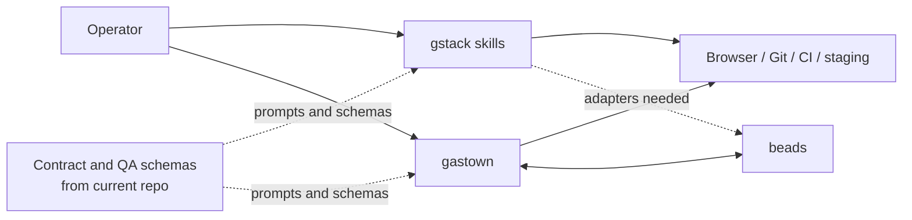
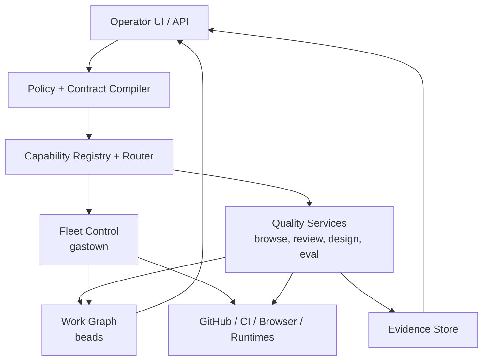

# 03 — Integration Topology

## Current-state topology

Today the integration story is uneven:

- `gastown -> beads` is native and structural
- `gstack -> gastown` is possible, but mostly by embedding prompts and tools
- `gstack -> beads` is possible, but only through adapters that persist review and QA output
- `beads -> gstack` is indirect; beads can feed context, but not quality reasoning

## Native versus adapter-driven connections

| Connection | Status today | Integration style | Why |
|------------|--------------|-------------------|-----|
| `gastown <-> beads` | Native | CLI, shared data model, runtime assumption | beads is already the data plane beneath gastown |
| `gstack -> gastown` | Partial | Skill extraction, browse service, runtime templates | gstack is Claude-centric and not fleet-aware |
| `gstack -> beads` | Partial | Findings-to-beads adapter, evidence publisher | gstack outputs reviews; beads wants structured work items |
| `beads -> gastown` | Native | Ready queue, claims, formulas, hooks | gastown already consumes this model |
| `beads -> gstack` | Weak | Context priming and artifact lookup | beads does not call tools or run reviews |
| `current repo -> gastown` | Partial | Contract compiler, role prompt generator | good fit for pre-spawn design work |
| `current repo -> beads` | Partial | contract and QA records persisted as beads | schema work is still needed |

## Current-state dataflow

## Target-state topology

The clean integration is not "load all three repos into every agent."

The clean integration is:

- extract portable services from `gstack`
- keep `gastown` as execution control
- keep `beads` as durable state
- add a thin policy and evidence layer between them

## Best connection seams

### Seam 1: gstack browse as a service

Best use:

- package the browser daemon and ref system as a runtime-neutral service
- let `gastown` workers call it
- persist screenshots and DOM snapshots as evidence records

Why this seam is clean:

- it is already a distinct binary boundary
- it does not require the full gstack prompt system
- it gives every runtime eyes

### Seam 2: gstack review output -> beads work items

Best use:

- convert review findings into beads issues
- attach severity, evidence, and affected files
- let `bd ready` schedule follow-up fixes

Why this seam is clean:

- review output is already structured enough to normalize
- beads is good at persistent actionable state
- this closes the loop between quality review and work tracking

### Seam 3: contract compiler -> gastown spawn flow

Best use:

- compile contracts and ownership maps before `gt sling`
- route only the relevant contract slices to each worker
- enforce conformance during merge

Why this seam is clean:

- `gastown` already has a spawn and merge lifecycle
- the current repo already models contract-first orchestration

### Seam 4: eval engine -> fleet monitoring

Best use:

- use gstack-style evals to score worker quality
- feed those scores into runtime routing and patrol alerts

Why this seam is clean:

- evals are a separate concern from execution
- `gastown` needs better quality observability

## Hard boundaries

These are the places not to force a direct integration:

### Do not force full gstack prompt packs into every gastown worker

Why:

- too much context
- too Claude-specific
- too much prompt drift risk across runtimes

Better approach:

- extract only the portable parts:
  - browse
  - review logic
  - design audit logic
  - eval harness

### Do not ask beads to become the orchestrator

Why:

- it is strongest as a passive durable substrate
- bolting a control plane directly into it creates a muddled responsibility

Better approach:

- keep beads as the graph and history layer
- let the orchestrator and policy engine sit above it

### Do not hard-fork gastown too early

Why:

- its complexity is high
- a fork inherits a large local operating model immediately

Better approach:

- integrate first through plugins, wrappers, and templates
- fork only after the target product shape is clearer

## Integration priority order

1. `gstack browse -> gastown workers`
2. `gstack review / qa -> beads issues + evidence`
3. `contract compiler -> gastown spawn + Refinery gates`
4. `eval scores -> routing, patrol, merge policy`

That order delivers real value without forcing a premature monolith.
