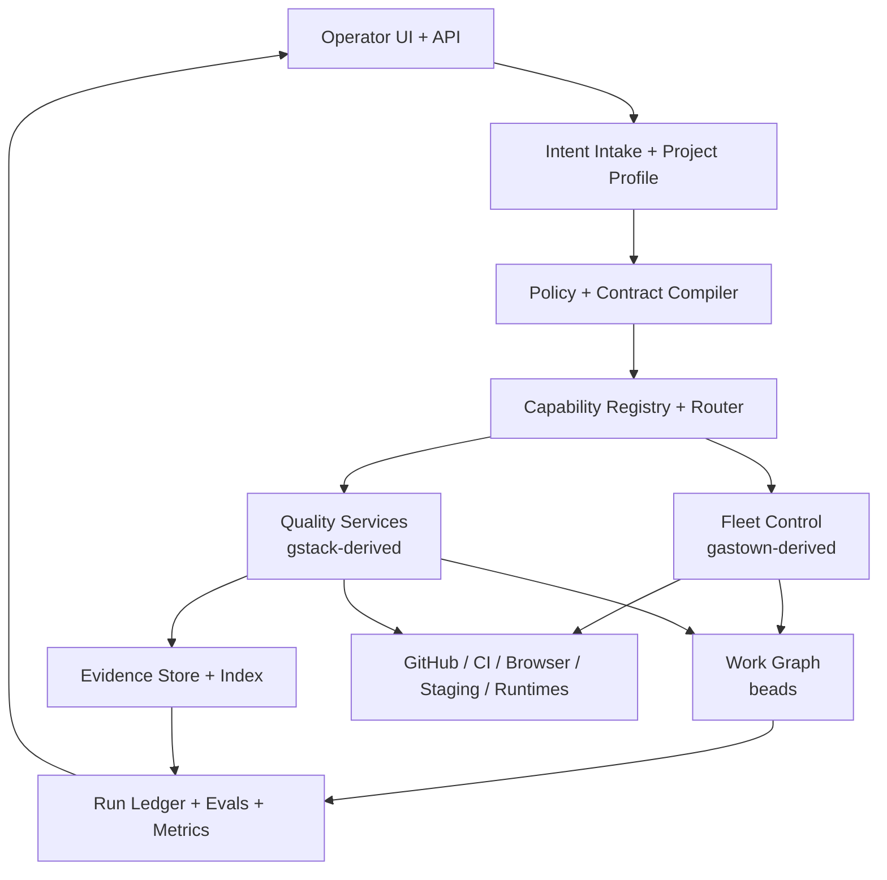
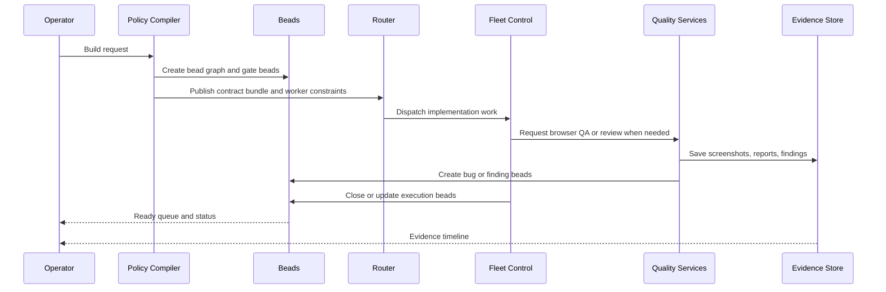

# 05 — Reference Architecture

## Design rule

Build the future stack as a layered system with narrow interfaces.
Do not merge the three repos into one codebase unless the interface approach
fails first.

## Reference architecture

## Component responsibilities

| Component | Reuse source | Responsibility |
|-----------|--------------|----------------|
| Intent Intake + Project Profile | current repo + custom | convert a request into structured project, environment, and risk metadata |
| Policy + Contract Compiler | current repo + custom | compile contracts, ownership, gate rules, and escalation rules |
| Capability Registry + Router | custom | decide which runtime or worker gets which task based on capability and score |
| Fleet Control | gastown | spawn workers, manage sessions, isolate worktrees, patrol, merge, recover |
| Quality Services | gstack | browser, review, QA, design audit, release checks, eval execution |
| Work Graph | beads | durable tasks, dependencies, ready queue, formulas, history, federation |
| Evidence Store + Index | custom | screenshots, DOM snapshots, review evidence, logs, attachments |
| Run Ledger + Analytics | custom + gstack ideas | cost, duration, success, retries, eval trend, policy outcomes |

## The most important new abstractions

### 1. Work Item

What it represents:

- a task, bug, finding, decision, gate, or escalation

System of record:

- `beads`

### 2. Evidence Record

What it represents:

- screenshot
- DOM snapshot
- log excerpt
- test result
- review note
- design finding

System of record:

- object store plus metadata index
- referenced from beads

### 3. Contract Bundle

What it represents:

- API contracts
- shared types
- data layer semantics
- event contracts
- file ownership
- gate rules

System of record:

- generated files in repo plus compiled policy metadata

### 4. Run Ledger Entry

What it represents:

- one execution attempt by one worker or service
- inputs, outputs, cost, duration, exit reason, evidence ids

System of record:

- analytics store

### 5. Worker Scorecard

What it represents:

- quality and efficiency history for a worker profile or runtime

Metrics:

- review precision
- QA catch rate
- retry rate
- merge failure rate
- cost per successful task

## Recommended data flow

## What to reuse directly

### Reuse from `beads`

- work graph
- dependency types
- ready queue
- formulas
- Dolt-backed history

### Reuse from `gastown`

- worker lifecycle
- runtime abstraction
- worktree isolation
- patrol logic
- merge queue concepts

### Reuse from `gstack`

- browse daemon
- cognitive review logic
- design audit logic
- eval architecture

### Reuse from current repo

- contract-first patterns
- file ownership discipline
- QA gate schema
- role decomposition ideas

## What to build net-new

- evidence store
- policy compiler
- capability registry
- run ledger
- operator control plane
- orchestration eval suite

## Architecture guardrails

1. Keep `beads` as the source of truth for work, not evidence blobs.
2. Keep `gastown` focused on execution, not quality semantics.
3. Keep `gstack` logic callable as services, not only as long prompts.
4. Generate prompts and contracts; do not hand-maintain large instruction sets everywhere.
5. Every cross-system handoff must produce a structured record.

## The product vision

If built correctly, the operator experience becomes:

1. describe the outcome
2. approve the compiled contract and gates
3. watch the fleet execute
4. inspect evidence when quality gates trip
5. accept or redirect

That is a software factory, not just a pile of agent tools.
