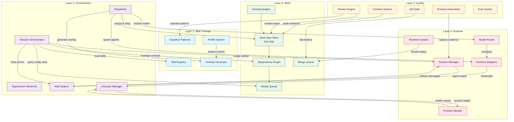
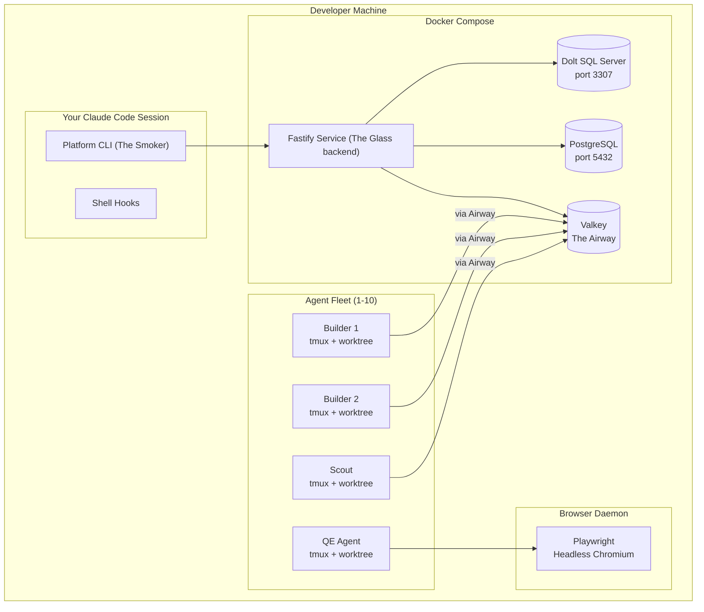
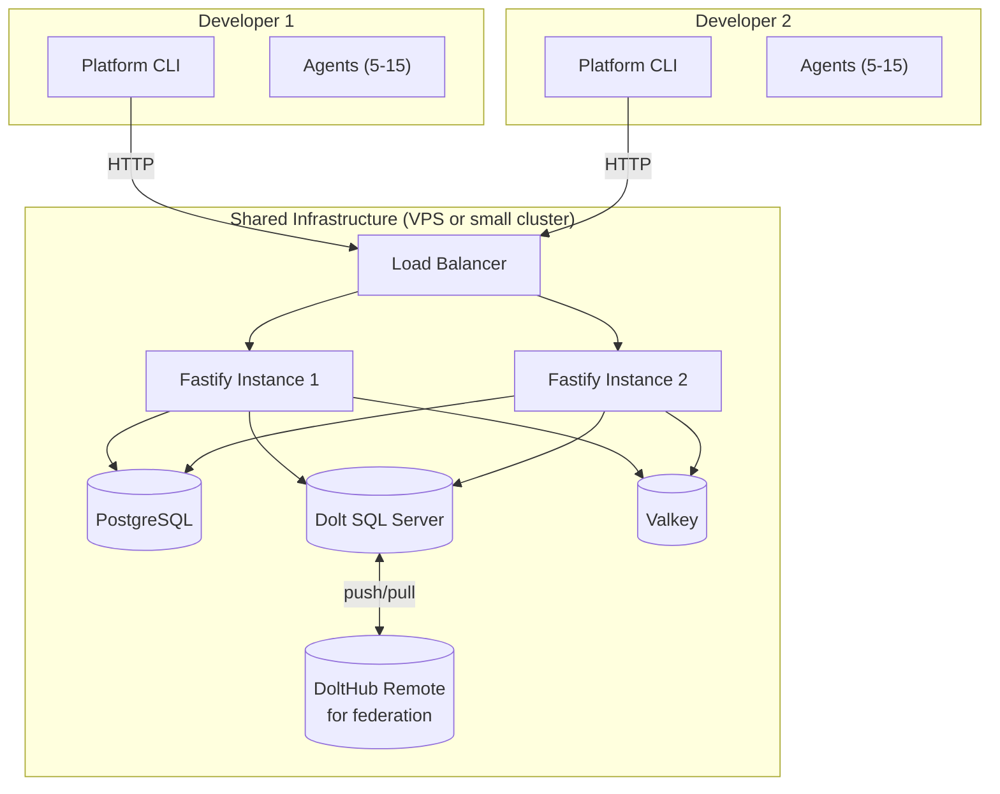
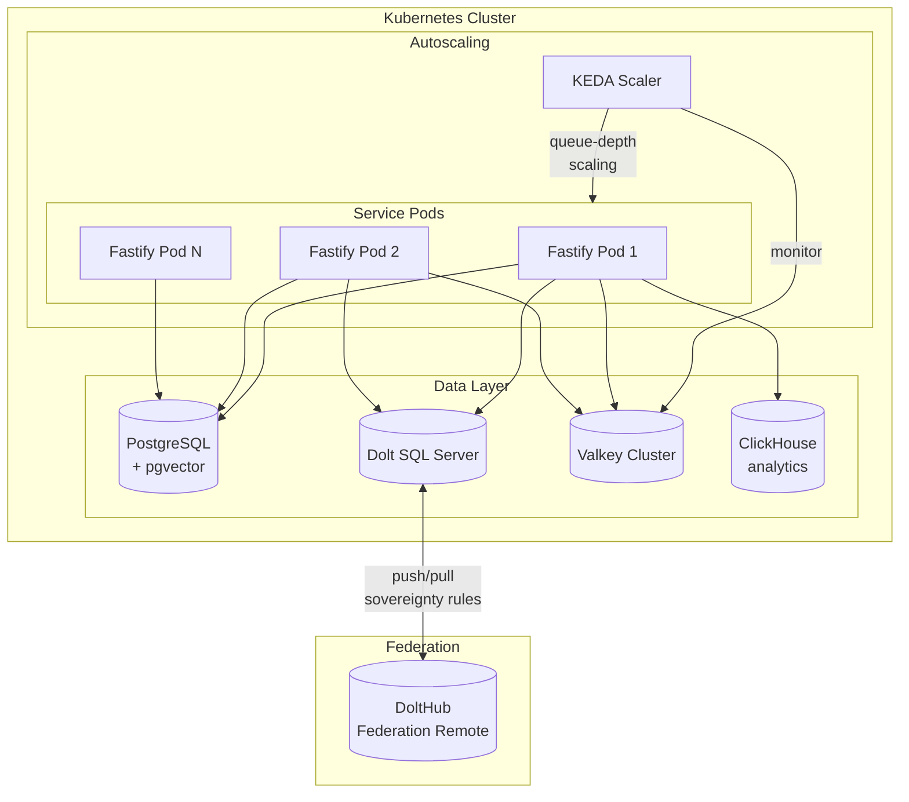

# 03 - System Architecture

Architecture specification for The Hive — an AI agent orchestration platform.
Synthesizes the best ideas from five existing systems: Beads, Gas Town, Overstory,
gstack, and ATSA. Service-hosted from day one. Designed for a solo developer
today and a federated team tomorrow.

---

## 1. Architecture Overview

The platform is organized into five layers. Each layer has a single responsibility,
a defined set of interfaces to adjacent layers, and clear provenance from the
source systems that informed its design.

```
┌─────────────────────────────────────────────────────────────────┐
│  Layer 1: Skill / Prompt Layer                                  │
│  What agents know. How they think. Progressive disclosure.      │
├─────────────────────────────────────────────────────────────────┤
│  Layer 2: Orchestration Layer                                   │
│  Who does what. Dispatch, lifecycle, coordination hierarchy.    │
├─────────────────────────────────────────────────────────────────┤
│  Layer 3: Quality Layer                                         │
│  Whether the work is good enough. Review, audit, evals, gates.  │
├─────────────────────────────────────────────────────────────────┤
│  Layer 4: Work Layer                                            │
│  What needs doing. Issues, dependencies, merge queue, formulas. │
├─────────────────────────────────────────────────────────────────┤
│  Layer 5: Runtime Layer                                         │
│  Where agents execute. Multi-LLM adapters, isolation, comms.    │
└─────────────────────────────────────────────────────────────────┘
```

### Layer 1: Skill / Prompt Layer

**Responsibility:** Define what agents know and how they think. Manage the
cognitive instructions that shape agent behavior, from high-level role definitions
to task-specific overlays.

**Provenance:**
- ATSA: Skill anatomy (SKILL.md frontmatter, `references/` directories),
  progressive disclosure (metadata ~100 tokens, body ~500 lines, references unlimited)
- gstack: Cognitive patterns (41 named patterns activating latent LLM knowledge),
  SKILL.md templates with command registries
- Overstory: Three-layer instruction model (base definition, canopy profile,
  dynamic overlay), template system for CLAUDE.md generation

**Components:**
- **Skill Registry** — Indexed catalog of all available skills. Each skill declares
  `name`, `version`, `description`, `owns`, `allowed_tools`, `composes_with`,
  `spawned_by` via YAML frontmatter. The registry supports deferred loading:
  skill metadata is always available (~100 tokens); full instructions load on
  trigger; reference files load on demand.
- **Cognitive Pattern Library** — Named thinking patterns (Bezos Doors, Munger
  Inversion, Rams Subtraction, etc.) that activate latent LLM knowledge. Patterns
  compose: applying multiple patterns to a single review produces richer analysis
  than any checklist. Organized by domain: strategic (14), engineering (15),
  design (12), with extension points for custom patterns.
- **Overlay Generator** — Produces per-agent instruction files from templates.
  Inputs: agent role definition, task specification, file scope, quality gates,
  pre-loaded expertise, profile content. Output: a single markdown file written
  to the agent's worktree. Template variables include `{{AGENT_NAME}}`,
  `{{FILE_SCOPE}}`, `{{QUALITY_GATES}}`, `{{EXPERTISE}}`.
- **Profile System** — Project-specific configuration that adapts generic skills
  to the current codebase. Generated by project analysis (project-profiler),
  stored as `profile.yaml`. Includes tech stack, conventions, directory structure,
  and domain-specific rules.

**Interface to Layer 2 (Orchestration):**
```typescript
interface SkillLayer {
  // Registry operations
  getSkill(name: string): SkillMetadata;
  findSkills(trigger: string): SkillMetadata[];
  loadFullSkill(name: string): SkillDefinition;
  loadReference(skill: string, ref: string): string;

  // Overlay generation
  generateOverlay(config: OverlayConfig): string;
  generateCLAUDEmd(project: ProjectProfile): string;

  // Pattern access
  getPatterns(domain: PatternDomain): CognitivePattern[];
}
```

### Layer 2: Orchestration Layer

**Responsibility:** Coordinate agent lifecycle, dispatch work, manage the
supervision hierarchy, and handle inter-agent communication.

**Provenance:**
- Gas Town: MEOW stack (formulas, protomolecules, molecules, wisps, epics, beads),
  GUPP (work-on-hook principle), convoys (multi-agent coordinated efforts),
  patrol loops (Witness, Deacon, Boot), sling dispatch, handoff protocol
- Overstory: Orchestrator-is-your-session model, hook-driven orchestration
  (SessionStart, UserPromptSubmit), depth-limited hierarchy (max 3 levels),
  sling command, mail-based communication

**Components:**
- **Session Orchestrator** — Your interactive session IS the orchestrator. No
  separate daemon for coordination. The orchestrator has the full reasoning power
  of the LLM, with CLI commands as tools. Hook-driven: `SessionStart` primes
  context, `UserPromptSubmit` surfaces agent mail.
- **Dispatcher** — Routes work items to agents. The `sling` command creates a
  worktree, deploys an overlay, starts a runtime session, and delivers the initial
  prompt. Agents receive only what they need: their file scope, relevant contracts,
  and quality gate commands.
- **Supervision Hierarchy** — Depth-limited to 3 levels:
  - Depth 0: Coordinator (single-project orchestrator)
  - Depth 1: Lead (team coordination, can spawn depth-2 workers)
  - Depth 2: Leaf workers (Scout, Builder, Reviewer, Merger)
  - Out-of-tree: Monitor (fleet health patrol, no worktree)
- **Mail System** — Message bus for asynchronous inter-agent communication,
  backed by Valkey Streams (The Airway) for real-time delivery and PostgreSQL
  for persistence. Supports direct messages, broadcast groups (`@all`,
  `@builders`, `@leads`), and typed protocol messages. Latency: ~1-5ms per
  operation.
- **Lifecycle Manager** — Tracks agent states: `spawning`, `running`, `working`,
  `stuck`, `done`, `stopped`, `dead`. Manages handoffs at context limits, restart
  on crash, and clean shutdown. GUPP principle: if there is work on your hook,
  you must run it.
- **Convoy Coordinator** — Groups related work items across agents into convoys
  for coordinated execution. Convoys track progress, dependencies, and completion
  across all participating agents.

**Interface to Layer 4 (Work):**
```typescript
interface OrchestrationToWork {
  // Work dispatch
  getReadyWork(filters?: WorkFilter): WorkItem[];
  assignWork(workId: string, agentId: string): void;
  sling(workId: string, agentId: string, config: SlingConfig): void;

  // Lifecycle
  reportStatus(agentId: string, state: AgentState): void;
  handoff(agentId: string, checkpoint: Checkpoint): void;
  complete(agentId: string, result: CompletionResult): void;

  // Communication
  sendMail(from: string, to: string, message: MailMessage): void;
  checkMail(agentId: string): MailMessage[];
}
```

**Interface to Layer 5 (Runtime):**
```typescript
interface OrchestrationToRuntime {
  spawn(agent: AgentConfig, runtime: RuntimeId): AgentHandle;
  nudge(agentId: string, content: string): void;
  terminate(agentId: string, reason: string): void;
  inspect(agentId: string): AgentSnapshot;
}
```

### Layer 3: Quality Layer

**Responsibility:** Ensure work meets standards before it is accepted. This is not
a phase that happens after implementation — quality checks are structural, embedded
into every layer's workflow.

**Provenance:**
- gstack: 41 cognitive patterns for review, Browse CLI (gives agents browser eyes),
  80-item design audit, AI slop detection (10 codified anti-patterns), 3-tier eval
  system (static validation, E2E tests, LLM-as-judge)
- ATSA: Contract system (OpenAPI, AsyncAPI, Pydantic, TypeScript, JSON Schema),
  QA gates (qa-report.json schema), contract-author and contract-auditor skills,
  QE agent as mandatory participant

**Components:**
- **Contract System** — Machine-readable interface specifications authored before
  implementation begins. Supported formats: OpenAPI (REST APIs), AsyncAPI (event
  streams), Pydantic (Python data models), TypeScript (type definitions), JSON
  Schema (data validation). The contract-author generates contracts from templates;
  the contract-auditor verifies implementations match.
- **Review Engine** — Multi-perspective code review powered by cognitive patterns.
  Two-pass review: CRITICAL issues first (blocking), then INFORMATIONAL (advisory).
  Each review activates relevant cognitive patterns rather than walking a checklist.
  Output: structured findings with severity, location, and suggested fix.
- **Design Audit** — 80-item audit across 10 categories: visual hierarchy,
  typography, color system, spacing, interactive elements, responsive design,
  motion, content quality, AI slop detection, performance perception. Powered by
  browser automation for evidence-based findings (screenshots, CSS computed values).
- **QA Gate** — Structured gate that blocks builds on failure. The QE agent
  produces `qa-report.json` conforming to a defined schema. Build is blocked when:
  `gate_decision.proceed = false`, any CRITICAL blocker exists,
  `contract_conformance.score < 3`, or `security.score < 3`. The gate cannot be
  overridden — fix the issues and re-run.
- **Eval System** — Three-tier validation for the skill system itself:
  - Tier 1: Static validation (free, <1s) — parse all commands, validate against
    registries, catch typos
  - Tier 2: E2E testing (~$3.85/run) — spawn real agent sessions, record tool
    calls and outcomes, extract diagnostics
  - Tier 3: LLM-as-judge (~$0.15/run) — planted-bug fixtures, structured rubrics,
    pass/fail extraction
  Diff-based test selection: only run evals whose file dependencies changed.
- **Browser Automation** — Persistent headless Chromium daemon (Playwright).
  Cold start 3-5s, subsequent commands 100-200ms. AI-native element addressing
  via ref system (`@e1`, `@e2` — not CSS selectors). Staleness detection prevents
  phantom clicks. Cookie import from Chrome/Arc/Brave/Edge for authenticated QA.
  50+ commands: navigation, interaction, inspection, visual diff, screenshots.

**Interface to Layer 2 (Orchestration):**
```typescript
interface QualityLayer {
  // Contract operations
  authorContract(spec: ContractSpec): Contract;
  auditContract(contract: Contract, implementation: FileSet): AuditResult;

  // Review
  reviewCode(files: FileSet, patterns: CognitivePattern[]): ReviewResult;
  auditDesign(url: string, audit: DesignAuditConfig): DesignAuditResult;

  // QA gate
  evaluateGate(report: QAReport): GateDecision;
  isBlocked(report: QAReport): boolean;

  // Browser
  browse(command: BrowseCommand): BrowseResult;
  screenshot(target: ScreenshotTarget): Evidence;
}
```

### Layer 4: Work Layer

**Responsibility:** Track what needs to be done, what depends on what, what is
ready for work, and what has been completed. Manage the merge queue for integrating
completed work.

**Provenance:**
- Beads: Dolt SQL as the work state database, single wide `issues` table (~50
  columns), 22 dependency types, `ready_issues` view (recursive CTE), hash-based
  IDs for distributed generation, content hashing for deduplication, wisp/issues
  split for ephemeral data, formula engine (TOML workflow definitions)
- Gas Town: MEOW stack (six-layer work abstraction), Refinery merge queue
  (Bors-style batch-then-bisect), two-tier beads (town-level + rig-level),
  cross-rig routing

**Components:**
- **Work Item Store** — Single wide table in Dolt SQL (~50 columns) storing all
  work variants: tasks, bugs, epics, molecules, agent beads, gates, events,
  messages. Sparse columns: a task uses `title`, `description`, `status`,
  `priority`; an agent bead uses `hook_bead`, `role_bead`, `agent_state`. Every
  write is a Dolt commit — full audit trail, time-travel queries, branch-and-merge.
- **Dependency Graph** — 22 typed edge relationships between work items. Four types
  affect scheduling: `blocks` (hard prerequisite), `parent-child` (hierarchical
  containment), `conditional-blocks` (run on failure), `waits-for` (fanout gate).
  The `ready_issues` view uses a recursive CTE to compute which items are unblocked
  and eligible for assignment.
- **Formula Engine** — Declarative workflow templates (TOML/JSON) that compile into
  issue hierarchies. Three-phase materialization: Proto (frozen template), Mol
  (persistent instance), Wisp (ephemeral instance). Supports sequential steps,
  parallel branches, conditional execution, advice hooks, and variable substitution.
- **Merge Queue** — Automated branch integration with conflict resolution. Four
  tiers: clean merge (no conflicts), auto-resolve (non-overlapping changes),
  AI-assisted resolution (semantic conflicts), reimagine (agent rewrites from
  scratch). Batch-then-bisect strategy: merge multiple branches, if CI fails,
  bisect to find the breaking change.
- **Ready Work Queue** — Continuously computed view of work items eligible for
  assignment. An item is ready when: status is `open`, not blocked by any active
  dependency, not deferred, not ephemeral, not a child of a deferred parent. Sort
  policies: hybrid (recent by priority, older by age), priority-first, oldest-first.

**Interface to Layer 2 (Orchestration):**
```typescript
interface WorkLayer {
  // CRUD
  createWorkItem(item: WorkItem): string;
  getWorkItem(id: string): WorkItem;
  updateWorkItem(id: string, updates: Partial<WorkItem>): void;
  closeWorkItem(id: string, reason: string): void;

  // Dependencies
  addDependency(from: string, to: string, type: DependencyType): void;
  getDependencies(id: string): Dependency[];
  isBlocked(id: string): boolean;

  // Ready queue
  getReadyWork(filter?: WorkFilter): WorkItem[];

  // Formulas
  cookFormula(formula: Formula): Proto;
  pourMolecule(protoId: string): Molecule;

  // Merge queue
  submitToMergeQueue(branch: string, workId: string): void;
  processMergeQueue(): MergeResult[];
}
```

### Layer 5: Runtime Layer

**Responsibility:** Provide the execution environment for agents. Abstract LLM
providers behind a standard interface. Manage isolation between concurrent agents.
Handle inter-process communication.

**Provenance:**
- Overstory: 9 runtime adapters (Claude, Pi, Codex, Gemini, Copilot, Sapling,
  OpenCode, Cursor, and more), `AgentRuntime` interface, mixed fleet support,
  RPC connections, headless runtimes, model routing
- Gas Town: tmux session management for interactive agents, worktree isolation
  per agent, daemon process management with auto-restart

**Components:**
- **Runtime Adapter Interface** — Standard contract that any LLM coding agent
  must implement. Required methods: `buildSpawnCommand()`, `deployConfig()`,
  `detectReady()`, `parseTranscript()`, `buildEnv()`. Optional: `connect()` for
  RPC, `headless` flag for non-interactive runtimes, `parseEvents()` for streaming.
  Each adapter is ~200-400 lines. Adding a new runtime is mechanical.
- **Session Manager** — Creates and manages agent execution environments. For
  interactive runtimes: tmux sessions with per-agent panes. For headless runtimes:
  direct `Bun.spawn` subprocesses with NDJSON stdout. Handles readiness detection,
  initial prompt delivery, nudge injection, and clean shutdown.
- **Worktree Isolator** — Each agent gets its own git worktree: a separate checkout
  at a unique branch. Provides file isolation (agents cannot overwrite each other),
  branch isolation (each agent commits independently), and cleanup on completion.
  Worktrees live under `.platform/worktrees/{agent-name}/`.
- **Model Router** — Maps capability requirements to specific models and providers.
  Supports per-role model selection: coordinators on Opus, builders on Sonnet,
  scouts on Haiku. Provider abstraction supports direct APIs and gateway services
  (OpenRouter). Environment variables for auth are resolved per-provider.
- **Process Monitor** — Background health checking for all running agents. Checks:
  process alive, tmux session alive, recent activity, state consistency. Actions
  escalate progressively: warn, nudge, escalate, terminate.

**Interface to Layer 2 (Orchestration):**
```typescript
interface RuntimeLayer {
  // Lifecycle
  spawn(config: SpawnConfig): AgentHandle;
  terminate(handle: AgentHandle, reason: string): void;
  restart(handle: AgentHandle): AgentHandle;

  // Communication
  sendKeys(handle: AgentHandle, text: string): void;
  captureOutput(handle: AgentHandle): string;
  sendRPC(handle: AgentHandle, method: string, params: unknown): unknown;

  // Monitoring
  isAlive(handle: AgentHandle): boolean;
  getState(handle: AgentHandle): RuntimeState;
  getTranscript(handle: AgentHandle): TranscriptSummary;

  // Model routing
  resolveModel(capability: string): ResolvedModel;
}
```

---

## 2. Layer Interaction Diagram



### Key Data Flows

1. **Dispatch cycle:** Orchestrator queries Ready Queue (L4) for unblocked work,
   resolves model via Model Router (L5), generates overlay via Overlay Generator
   (L1), spawns agent via Runtime Adapter (L5), delivers prompt via Session
   Manager (L5).

2. **Quality gate cycle:** Agent completes work and sends mail (L5 -> L2). QA
   Gate (L3) evaluates the qa-report. If passing, work enters the Merge Queue
   (L4). If failing, issues are created in the Work Item Store (L4) and the
   agent is notified via Mail (L2).

3. **Observability cycle:** Process Monitor (L5) detects anomaly. Lifecycle
   Manager (L2) escalates: first nudge via Session Manager (L5), then AI triage
   via a headless LLM call, then Monitor agent for persistent fleet patrol.

4. **Contract cycle:** Contract System (L3) generates contracts before any agent
   spawns. Contracts are stored as files in the repo. After implementation,
   Contract Auditor (L3) verifies the implementation matches. Mismatches create
   work items (L4) assigned back to the responsible agent.

---

## 3. Data Store Decisions

### Dolt SQL Server (Primary Data Plane)

**Stores:** Work items, dependencies, formulas, molecules, agent identity,
scorecards, federation state, merge queue entries.

**Why Dolt:**
- **Versioned SQL** — Every write is a commit. Full audit trail without a
  separate audit log. Time-travel queries via `AS OF`.
- **Git semantics** — Branch, merge, diff, push, pull. Experimentation on
  branches without affecting the main work queue.
- **Three-way merge** — Dolt understands schema and resolves merges at the
  row/column level, not line-by-line like text files.
- **SQL-queryable** — Standard MySQL wire protocol. Any SQL client works.
  No custom query language to learn.
- **Federation** — Push/pull via Dolt remotes. No separate sync protocol needed.
  Content hashing prevents duplicate work items across federated instances.

**Configuration:**
- Default port: 3307 (avoids MySQL 3306 collision)
- Auto-start: Transparent to users. CLI starts server automatically if not running.
  Reference counting ensures server stops only when last client disconnects.
- Connection pool: 10 connections (`MaxOpenConns`)
- Retry: Exponential backoff (max 30s) for transient errors
- Circuit breaker: Fail-fast when server is known to be down

**Schema highlights:**
- Single wide `issues` table (~50 columns, sparse per variant type)
- `wisps` table mirrors `issues` but is `dolt_ignore`'d (never committed)
- `dependencies` table with no FK on `depends_on_id` (enables cross-instance refs)
- `ready_issues` view (recursive CTE computing unblocked work)
- Hash-based IDs (`<prefix>-<short-hash>`) for distributed generation
- Content hash (SHA-256) for deduplication across federated instances
- UUID primary keys on auxiliary tables for merge safety

### PostgreSQL (Operational Data, Production)

Production operational data lives in PostgreSQL. Four logical schemas, all in a
single PostgreSQL instance:

| Schema | Purpose | Write Pattern |
|--------|---------|---------------|
| `mail` | Inter-agent messaging | Many writers, ~1-5ms |
| `sessions` | Agent lifecycle, run tracking | Moderate writes |
| `events` | Tool calls, spawns, errors | High-frequency writes |
| `metrics` | Token usage, cost tracking | Periodic writes |

**Why PostgreSQL for production operational data:**
- **Concurrent writes** — Connection pooling and MVCC handle 10+ agent
  processes without WAL contention limits.
- **pgvector extension** — Honey (agent semantic memory) uses pgvector with
  HNSW index for similarity search over agent experience embeddings.
- **Dashboard reads** — The Glass (dashboard) reads spec databases and
  maintains its own UI state database in PostgreSQL. Single connection pool
  for all dashboard queries.
- **Mature ecosystem** — Monitoring, backup, replication tooling out of the box.

**SQLite retained for local development fallback:**
For solo developer onboarding, SQLite databases provide zero-config operation.
The storage adapter pattern (see below) abstracts the backend so that the same
business logic runs against SQLite locally and PostgreSQL in production.

```sql
-- SQLite local dev configuration
PRAGMA journal_mode=WAL;
PRAGMA busy_timeout=5000;
```

### Valkey Streams (The Airway — Real-Time Event Bus)

All internal real-time events flow through Valkey Streams. This is The Airway —
the platform's nervous system for inter-service communication.

**Event categories:**
- Agent lifecycle events (spawn, running, stuck, done, dead)
- Work dispatch events (assigned, slung, completed)
- Quality gate events (pass, fail, block)
- Mail delivery (agent-to-agent messages)
- Observability events (tool calls, errors, health checks)

**Why Valkey Streams (not direct inter-process):**
- **Decoupled producers/consumers** — Services publish events without knowing
  who consumes them. The dashboard, the watchdog, and the orchestrator all
  subscribe independently.
- **Replay** — Consumer groups with acknowledgment. A crashed consumer resumes
  from its last checkpoint, not from the beginning.
- **AG-UI boundary** — AG-UI protocol is external-only. An AG-UI adapter at
  the dashboard boundary translates Airway events into AG-UI format for
  external consumers. Internal services never speak AG-UI.

**Configuration:** Single Valkey instance in Docker Compose. No cluster needed
until event volume exceeds 100K/day.

### ClickHouse (Analytics — The Trail and The Yield, At Scale)

ClickHouse is the analytics engine for high-volume trace data (The Trail) and
aggregated metrics (The Yield). It is not required at launch.

**Database Scaling Inflection Points:**
- Phase 1-2 (~1-20 agents): PostgreSQL handles all event and metric queries.
  No ClickHouse needed.
- Inflection trigger: Event volume exceeds 10K/day OR dashboard aggregate
  queries exceed 5 seconds.
- Phase 3+: Migrate event and metric tables to ClickHouse. PostgreSQL retains
  operational data (mail, sessions). The storage adapter pattern makes this
  migration a configuration change, not a rewrite.

### Storage Adapter Pattern

All data access is abstracted behind interfaces from day one. Concrete backends
are injected at startup based on configuration.

```typescript
interface EventStore {
  append(event: PlatformEvent): Promise<void>;
  query(filter: EventFilter): Promise<PlatformEvent[]>;
  aggregate(query: AggregateQuery): Promise<AggregateResult>;
}

// Implementations:
// - SqliteEventStore  (local dev)
// - PostgresEventStore (production, Phase 1-2)
// - ClickHouseEventStore (production, Phase 3+)
```

**Why abstract from day one:** The platform's data needs will evolve.
PostgreSQL is sufficient for early phases, but analytics workloads will
eventually require a columnar engine. Abstracting storage behind interfaces
means backend changes (SQLite to PostgreSQL, PostgreSQL to ClickHouse) do not
require business logic rewrites.

### Git-Native Files (Configuration, Skills)

| What | Location | Why Git |
|------|----------|---------|
| SKILL.md files | `skills/{category}/{name}/SKILL.md` | Version-controlled, human-readable, portable |
| Agent definitions | `agents/{role}.md` | Reusable across projects, diffable |
| CLAUDE.md templates | `templates/*.md.tmpl` | Generated from templates, project-specific |
| Contracts | `contracts/*.{yaml,json,ts}` | Machine-readable, auditable, diffable |
| Configuration | `config.yaml`, `config.local.yaml` | Project-level and machine-level settings |
| Formulas | `formulas/*.formula.toml` | Workflow definitions, reusable templates |

### NOT in Scope

**Blob storage for evidence** — Screenshots, log captures, test result artifacts,
and other binary evidence use the filesystem with hash-based naming. References
from Dolt point to filesystem paths. Rationale: Binary blobs in Dolt would bloat
commit history. The filesystem with content-addressable naming provides deduplication
without version-control overhead.

**Search engines** — No Elasticsearch, no Meilisearch. Full-text search uses
PostgreSQL's built-in tsvector/tsquery. Semantic search uses pgvector. The
platform does not need a dedicated search engine at current scale.

---

## 4. Cross-Cutting Concerns

### File Ownership

**Rule:** Exclusive per-agent. No two agents can modify the same file.

**Declaration:** Each agent skill declares `owns.directories` and `owns.patterns`
in its SKILL.md frontmatter. The orchestrator resolves conflicts before spawning.

**Resolution precedence:**
1. Directory ownership takes precedence over pattern ownership. A file matching
   agent A's glob but living in agent B's directory belongs to B.
2. Subdirectory carve-outs are explicit. `tests/performance/` can be carved out
   of `tests/` for a different agent.
3. Unresolvable conflicts escalate to the human operator.

**Enforcement:** Guard rules in the runtime layer restrict file writes to the
owning agent's declared scope. Write attempts outside scope are blocked before
they reach the filesystem.

**Source:** ATSA frontmatter spec + Overstory guard rules.

### Contracts

**Lifecycle:** Author before spawn, implement during work, audit after completion.

**Supported formats:**
- OpenAPI 3.x — REST API specifications
- AsyncAPI 2.x — Event stream specifications
- Pydantic models — Python data contracts
- TypeScript interfaces — Type definitions
- JSON Schema — Data validation contracts

**Contract-first prevents 42% of integration failures.** The most common failure
mode in multi-agent builds is specification drift: agents independently interpret
ambiguous requirements and produce incompatible implementations. Machine-readable
contracts eliminate ambiguity.

**Contract change protocol:** Pause all affected agents, update the contract,
bump the version, notify affected agents, confirm acknowledgment before resuming.
Verbal contract changes are an anti-pattern — always write the full updated
contract.

**Source:** ATSA contract-author and contract-auditor.

### Policy Fabric

**Responsibility:** Centralize the rules that govern how work flows through the
platform. The policy fabric is an explicit cross-cutting concern that sits between
the orchestration layer and the quality layer.

**Why a separate concern:** Codex research identified a "hidden fourth layer"
problem — policy logic (contract compilation, ownership enforcement, gate rules,
escalation paths, evidence routing) was distributed across Layers 1-3 with no
single owner. This created ownership ambiguity: when a gate rule changed, it was
unclear whether the change belonged to the orchestration layer, the quality layer,
or the skill layer. The policy fabric resolves this by giving policy a single home.

**Owns:**
- **Contract compilation** — Parsing contract definitions into enforceable rules
  that the quality layer evaluates and the orchestration layer sequences.
- **Ownership enforcement** — The canonical ownership map. Resolves conflicts
  before agents spawn. Provides the ground truth that guard rules enforce.
- **Gate rules** — Defines what constitutes a passing gate, which scores block,
  and which thresholds are configurable vs. hard-coded.
- **Escalation paths** — Rules for when to nudge, when to escalate to a lead,
  when to terminate, and when to involve a human. Consumed by the lifecycle
  manager and the watchdog.
- **Evidence routing** — Rules for which evidence artifacts are required for
  each gate, where they are stored, and how long they are retained.

**Interface:**
```typescript
interface PolicyFabric {
  // Ownership
  resolveOwnership(files: string[]): OwnershipMap;
  checkOwnership(agentId: string, file: string): boolean;

  // Gates
  getGateRules(gateType: GateType): GateRule[];
  evaluatePolicy(context: PolicyContext): PolicyDecision;

  // Escalation
  getEscalationPath(situation: SituationType): EscalationStep[];

  // Evidence
  getRequiredEvidence(gateType: GateType): EvidenceRequirement[];
}
```

**Interaction pattern:** The orchestration layer consults the policy fabric
before dispatching work (ownership check) and after receiving quality results
(gate evaluation). The quality layer produces evidence; the policy fabric
decides what that evidence means.

### Context Management

**Hook-driven loading:**
- `SessionStart` hook runs the `prime` command: loads project config, recent
  activity, expertise, active run status into context
- `UserPromptSubmit` hook runs `mail check --inject`: surfaces unread agent
  messages into the orchestrator's context

**Handoff at ~80% context usage:** When an agent approaches context limits, it
writes a checkpoint (JSON snapshot of current state, completed work, remaining
tasks) and signals the orchestrator. The orchestrator spawns a continuation agent
with the checkpoint as initial context.

**Checkpoint format:**
```typescript
interface Checkpoint {
  agentName: string;
  taskId: string;
  completedSteps: string[];
  remainingSteps: string[];
  currentState: Record<string, unknown>;
  filesModified: string[];
  openQuestions: string[];
  timestamp: string;
}
```

**Source:** Overstory hooks + ATSA context-manager.

### Observability

**Structured events:** Every significant agent action produces a typed event
stored in `events.db`. Event types: `tool_start`, `tool_end`, `session_start`,
`session_end`, `mail_sent`, `mail_received`, `spawn`, `error`, `progress`,
`result`. Smart arg filtering: file paths preserved, large bodies truncated,
secrets redacted.

**Metrics:** Token usage, cost tracking, session duration, merge results.
Per-agent and per-run aggregation. Runtime-agnostic pricing normalization.

**Three-tier watchdog:**
1. **Mechanical daemon** (Tier 0) — Background process checking agent health
   every 30s. Checks: process alive, tmux alive, recent activity, state
   consistency. Actions: warn, nudge, escalate, terminate.
2. **AI triage** (Tier 1) — Ephemeral LLM analysis for ambiguous situations.
   Captures tmux output, classifies: working, stuck, errored, completed.
3. **Monitor agent** (Tier 2) — Persistent agent session that patrols the fleet.
   Detects systemic issues (all builders stuck on same dependency). Sends
   recommendations to the coordinator.

**CLI commands:** `status`, `dashboard`, `inspect`, `trace`, `errors`, `replay`,
`feed`, `costs`, `logs`, `metrics`. All support `--json` for machine-readable
output.

**Source:** Overstory observability stack + Gas Town Witness/Deacon patrol.

### Security

**Guard rules per role:**
- **Tool restrictions** — Each capability has an allowed tool list. Scouts get
  read-only tools. Builders get read-write but scoped to their worktree. Leads
  get orchestration commands. Coordinators get everything.
- **Bash pattern guards** — Fine-grained control over which shell commands are
  allowed. Always allowed: `git status`, `git diff`, `git log`, quality gate
  commands. Builder additions: `git add`, `git commit`, mail commands. Never
  allowed for leaf nodes: `sling` (prevents unauthorized spawning), `git push`
  (merging handled by coordinator).
- **Path boundary enforcement** — Agents are restricted to their worktree path.
  File operations outside the worktree are blocked. Git operations scoped to the
  worktree's branch.

**Secret management:** Sensitive patterns (API keys, tokens, passwords, connection
strings) are automatically redacted before logging. Cookie decryption for browser
automation is in-memory only — values never written to logs or events.

**Source:** Overstory guard rules + ATSA allowed_tools.

---

## 5. Key Architectural Principles

### 1. Orchestrator-Is-Your-Session

No separate daemon for coordination. Your interactive Claude Code session IS the
orchestrator with full reasoning power. Infrastructure commands (CLI) are tools the
orchestrator uses, not a replacement for it.

**Why:** A daemon is a state machine. An orchestrator session is a thinking agent
that can reason about ambiguity, adapt strategy mid-build, and make judgment calls.
The daemon model (Gas Town) works but requires extensive state machine logic for
situations an LLM handles naturally.

**Implication:** The CLI is designed for LLM consumption. Commands produce
structured JSON output (`--json` flag on everything). Hooks surface information
at the right time without polling.

**Source:** Overstory.

### 2. Durable by Default

All work state survives session crashes. Work items are persistent in git-backed
SQL. Molecules are persistent chains of work items. Agent identity outlives
individual sessions.

**Recovery model: Nondeterministic Idempotence (NDI).** Unlike Temporal's
deterministic replay (which replays the exact same steps), NDI relies on the AI
to figure out the right recovery action. The agent reads its persistent state
(hook, molecule, completed steps) and decides what to do next. Different sessions
may take different paths to the same outcome.

**Why NDI over deterministic replay:** AI agents are fundamentally nondeterministic.
Forcing deterministic replay would mean recording and replaying every LLM call —
impractical, expensive, and fragile. NDI embraces nondeterminism: the state is
durable, the execution path is flexible.

**Source:** Gas Town / Beads.

### 3. Progressive Disclosure

Information is loaded in layers based on need:

| Layer | Size | When Loaded | Example |
|-------|------|-------------|---------|
| Metadata | ~100 tokens | Always | Skill name, version, description |
| Body | ~500 lines | On trigger | Full SKILL.md instructions |
| References | Unlimited | On demand | Validation checklists, schema definitions |
| Deferred tools | Per-tool | On search | Tool schemas loaded via ToolSearch |

**Why:** Context windows are finite and expensive. Loading all skill definitions
into every session would consume thousands of tokens on irrelevant instructions.
Progressive disclosure ensures agents have exactly the context they need — no more,
no less.

**Source:** ATSA + Anthropic patterns.

### 4. Contract-First

Shared types, API contracts, and data layer contracts are authored before any
implementation code is written. The sequence is always:

1. Shared types (single source of truth for all entities)
2. API contracts (exact URLs, methods, request/response shapes, status codes)
3. Data layer contracts (function signatures, storage semantics, cascade behavior)
4. Cross-cutting concerns (each assigned to exactly one agent)
5. Implementation (agents build against contracts, not ambiguous prose)

**Why:** Multi-agent builds fail when agents interpret requirements independently.
Contract-first prevents the 42% of integration failures caused by specification
problems. Machine-readable contracts are diffable, auditable, and testable.

**Source:** ATSA.

### 5. Quality Is Structural

Quality is not an optional phase that happens after implementation. Quality
patterns are built into every layer:

- **Layer 1 (Skill):** Cognitive patterns activate expert-level thinking, not
  checkbox compliance
- **Layer 2 (Orchestration):** QE agent is mandatory for every build
- **Layer 3 (Quality):** Contract auditing, design audit, eval system
- **Layer 4 (Work):** QA gate blocks merge queue on failure
- **Layer 5 (Runtime):** Guard rules prevent agents from exceeding their scope

**Browser automation gives agents eyes.** Most agent systems operate blind —
they write code but never see the result. The Browse CLI (persistent Playwright
daemon, sub-second latency, AI-native element refs) enables find-fix-verify
cycles with evidence.

**Source:** gstack.

### 6. Runtime-Neutral

The `AgentRuntime` interface abstracts LLM providers. Agents are defined in
markdown instructions, not provider-specific APIs. Guard rules translate to each
runtime's native mechanism. Cost tracking normalizes across runtimes.

**Mixed fleets are first-class:**
- Coordinators on Claude Opus (deep reasoning for orchestration)
- Builders on Claude Sonnet or Pi (fast coding iteration)
- Scouts on Claude Haiku (cheap read-only exploration)
- Reviewers on Codex (sandbox isolation for validation)
- Multi-modal tasks on Gemini (image and document understanding)

**Adding a new runtime:** Implement the 8 required methods of the `AgentRuntime`
interface (~200-400 lines), add to the registry. The hardest part is readiness
detection (each TUI is different).

**Source:** Overstory.

### 7. Evidence-Native

Every action produces verifiable evidence. The system verifies, not trusts.

| Action | Evidence |
|--------|----------|
| Code review | Structured findings with file:line references |
| QA testing | qa-report.json with test results and scores |
| Design audit | Before/after screenshots, CSS computed values |
| Contract audit | Diff between contract and implementation |
| Build completion | Agent validation checklists, integration test results |
| Health check | tmux capture, process state, activity timestamps |

Evidence is stored on the filesystem with hash-based naming. References from
work items point to evidence paths. Evidence is never deleted during active work —
only aged out during compaction.

### 8. Four-Phase Model (Design Filter)

Every feature and component in the platform maps to one of four phases. This
model, derived from Codex research, serves as a design filter for prioritization.

```
Sense → Decide → Act → Remember
```

| Phase | Responsibility | Platform Components |
|-------|---------------|-------------------|
| **Sense** | Gather information, detect state changes, collect evidence | Watchdog, Process Monitor, Browser Automation, event ingestion |
| **Decide** | Route work, evaluate gates, select strategy | Policy Fabric, Dispatcher, Model Router, QA Gate |
| **Act** | Execute tasks, write code, run tests, merge | Runtime Adapters, Worktree Isolator, Merge Queue, agents |
| **Remember** | Persist outcomes, update scorecards, build institutional memory | Work Item Store (Dolt), Honey (pgvector), RunLedger, The Trail |

**Prioritization rule:** Features that improve handoffs between phases are
higher priority than features that strengthen a single node. A better dispatcher
(Decide) matters less than a better evidence-to-routing pipeline (Sense→Decide).

**Most under-specified handoffs (fix these first):**
1. **Sense→Decide** — How does evidence from monitoring get routed to the right
   decision-maker? Currently implicit; needs explicit evidence→routing rules in
   the Policy Fabric.
2. **Act→Remember** — The RunLedger (what happened during a run, what worked,
   what failed) is not yet defined. Without it, the platform cannot learn from
   past executions.
3. **Remember→Decide** — Agent scorecards should influence future routing
   decisions (assign proven agents to critical paths). This feedback loop is
   not yet wired.

**Source:** Codex spec revision research.

---

## 6. Deployment Topology

### Scenario 1: Solo Developer

Docker Compose on a single machine, all services containerized.



**Characteristics:**
- `docker compose up` starts all services (PostgreSQL, Valkey, Dolt, Fastify)
- `platform serve` starts the Fastify HTTP service — TypeScript serves HTTP directly
- All inter-service communication via HTTP and Valkey Streams (The Airway)
- Worktrees provide file isolation; Dolt transactions provide data isolation
- Browser daemon starts on first Browse command, idles after 30 minutes
- Typical cost: $5-30/build depending on agent count and model selection
- SQLite fallback: `platform serve --local` skips Docker, uses SQLite for everything

### Scenario 2: Small Team

Single VPS or small cluster, shared services, 10-30 agents.



**Characteristics:**
- Shared PostgreSQL, Valkey, and Dolt instances for the team
- Work items sync via Dolt push/pull to a shared remote (DoltHub or self-hosted)
- Hash-based IDs prevent merge conflicts across instances
- Content hashing detects duplicate work items during sync
- Cross-developer references use `external:<instance>:<id>` format
- Events and metrics shared via PostgreSQL — all developers see fleet-wide state

### Scenario 3: Enterprise

Kubernetes with KEDA queue-depth autoscaling.



**Characteristics:**
- KEDA autoscales on Valkey Stream queue depth, not CPU — required because
  LLM workloads are I/O-bound (30-120s API waits, CPU at 1-6%), making
  standard HPA (CPU/memory) useless for scaling decisions
- ClickHouse added at this tier for analytics (The Trail traces, The Yield metrics)
- PostgreSQL with pgvector for Honey (agent semantic memory)
- Federation via DoltHub with sovereignty rules (who can modify what)
- Cross-org work references use the `external:<org>:<rig>:<id>` format
- Encrypted credentials for federation peer authentication
- Content deduplication across organizations via hash-based IDs
- Each organization maintains full autonomy — federation is opt-in, not required

---

## 7. Technology Stack Decisions

| Concern | Choice | Rationale |
|---------|--------|-----------|
| **Language** | TypeScript on Node.js | TypeScript gives type safety across the entire stack. Node.js for production runtime; Fastify for HTTP services. |
| **CLI Framework (The Smoker)** | Commander.js | Proven in Overstory. Supports subcommands, global flags, `--json` output, and help generation. Lightweight compared to Cobra (Go) but sufficient for 50+ commands. |
| **HTTP Framework (The Glass backend)** | Fastify | High-performance HTTP framework for all service endpoints. `platform serve` command starts Fastify directly — TypeScript serves HTTP, no reverse proxy required for development. Fastify's plugin architecture maps cleanly to platform layers. |
| **Work Graph (The Comb / The Frame)** | Dolt SQL Server | Versioned SQL with git semantics. Cell-level three-way merge (not line-level like text files). MySQL wire protocol for standard tooling. Federation via remotes. The only database that provides time-travel, branching, and merge at the row/column level. |
| **Operational Data** | PostgreSQL (production) / SQLite (local dev) | PostgreSQL for production: robust concurrent writes, pgvector for Honey (agent semantic memory with HNSW index), mature ecosystem. SQLite retained as local development fallback — zero-config single-file databases for solo developer onboarding. Storage adapter pattern ensures business logic is backend-agnostic. |
| **Real-Time Events (The Airway)** | Valkey Streams | Pub/sub event streaming for inter-service communication. All internal events flow through Valkey Streams — agent lifecycle, work dispatch, quality gate results, mail delivery. AG-UI protocol is external-only: an AG-UI adapter at the dashboard boundary translates Airway events for external consumers. |
| **Analytics (The Trail / The Yield)** | ClickHouse (at scale) | Columnar analytics engine for traces (The Trail) and metrics (The Yield). Not required at launch — PostgreSQL is sufficient through Phase 2 (~20 agents). Add ClickHouse when event volume exceeds 10K/day or dashboard queries exceed 5 seconds. |
| **Process Isolation** | tmux (interactive) + subprocess (headless) | tmux provides named sessions with capture/send-keys for interactive agents. Subprocess with NDJSON stdout for headless runtimes. Both are standard Unix primitives. |
| **Git Worktrees** | Native git | `git worktree add` for per-agent file isolation. No custom filesystem abstraction. Cleanup via `git worktree remove`. |
| **Browser Automation** | Playwright | Persistent daemon model. Cold start 3-5s, subsequent 100-200ms. AI-native ref system, staleness detection, cookie import. |
| **Templates** | Handlebars / Mustache | CLAUDE.md generation, overlay generation, hook deployment. Simple variable substitution with partials. No logic in templates — data preparation happens in TypeScript. |
| **Configuration** | YAML (project) + YAML (local, gitignored) | `config.yaml` committed to the repo (shared settings). `config.local.yaml` gitignored (machine-specific: ports, paths, API keys). Layered resolution: defaults < project < local < env vars < CLI flags. |
| **Testing** | Vitest + custom eval harness | Vitest for unit and integration tests. Custom eval harness for skill validation (3-tier: static, E2E, LLM-judge). |
| **Local Dev Environment** | Docker Compose | All services (PostgreSQL, Valkey, Dolt, ClickHouse when needed) run in containers. Single `docker compose up` for full local stack. |
| **Production Deployment** | Kubernetes + KEDA | Kubernetes for container orchestration. KEDA for queue-depth autoscaling — required because LLM workloads are I/O-bound (30-120s API waits, CPU at 1-6%), making standard HPA useless. |

---

## 8. Non-Negotiables

These architectural constraints are load-bearing. Changing any of them would
invalidate the design rationale and require rethinking dependent systems.

### 1. Work graph MUST be in Dolt

The work graph (The Comb / The Frame) — work items, dependencies, formulas,
and agent identity — lives in Dolt SQL. Not PostgreSQL, not SQLite, not
filesystem. Dolt's cell-level merge, branching, and federation are essential
for the work graph. This is the foundation of durability (survives crashes),
federation (sync via push/pull), auditability (every write is a commit), and
time-travel (query historical state). Operational data (mail, events, metrics,
sessions) lives in PostgreSQL — it needs concurrent write performance, not
version control.

**Consequence:** The Dolt server is a hard dependency for the work graph. The
system cannot operate without it. Docker Compose manages its lifecycle.

### 2. File ownership MUST be exclusive

No two agents can modify the same file. Ownership is declared in skill frontmatter,
resolved by the orchestrator before spawning, and enforced by guard rules at
runtime. This eliminates merge conflicts between concurrent agents, which are the
most expensive failure mode (agent time wasted, human intervention required).

**Consequence:** Work decomposition must respect file boundaries. Some tasks
require careful ownership assignment before they can be parallelized.

### 3. Contracts MUST be authored before implementation

Shared types and API contracts are defined before any agent writes implementation
code. Contract-first is what makes parallel agent builds reliable. Without
contracts, agents independently interpret requirements and produce incompatible
implementations.

**Consequence:** Every build has a design phase that cannot be skipped. The
orchestrator spends 50% of effort on design (architecture, contracts, file
ownership) before any agent is spawned.

### 4. Quality gates MUST block on failure

The QA gate is not advisory. When `gate_decision.proceed = false`, work does not
enter the merge queue. When a CRITICAL blocker exists, the build stops. The
orchestrator cannot override the gate — the issues must be fixed and the gate
re-evaluated.

**Consequence:** QE agent is mandatory for every build. Builds take longer
because quality is enforced, but they ship fewer defects.

### 5. Runtime adapters MUST implement a standard interface

Every LLM runtime (Claude, Pi, Codex, Gemini, etc.) implements the same
`AgentRuntime` interface. The orchestration, quality, and work layers do not
know or care which runtime is executing an agent. This preserves the ability to
run mixed fleets, switch providers, and add new runtimes without touching
orchestration logic.

**Consequence:** Runtime-specific features (Claude's artifacts, Codex's sandbox,
Pi's RPC) are accessible only through the adapter's optional methods. The core
platform cannot depend on any single runtime's capabilities.

### 6. Agent depth MUST be limited

Maximum 3 levels: Coordinator (depth 0), Lead (depth 1), Leaf workers (depth 2).
Leaf workers cannot spawn sub-agents. This prevents unbounded agent spawning,
which leads to context explosion, cost runaway, and coordination breakdown.

**Consequence:** Complex tasks must be decomposed by Leads into leaf-sized units.
If a leaf task is still too large, the Lead must re-decompose, not the leaf.

### 7. Service-hosted from day one

All services communicate via HTTP and Valkey Streams. No in-process coupling.
The `platform serve` command starts a Fastify HTTP server. CLI commands are
HTTP clients to that server. Agents publish and subscribe to Valkey Streams
(The Airway) for real-time events.

**Consequence:** Every component is independently deployable. Local development
uses Docker Compose; production uses Kubernetes. The jump from one to the other
is a deployment configuration change, not an architecture change.

### 8. Storage MUST be abstracted behind interfaces

Backend changes (SQLite→PostgreSQL, PostgreSQL→ClickHouse) should not require
business logic rewrites. All data access goes through storage adapter interfaces.
Concrete implementations are injected at startup based on configuration.

**Consequence:** Adding a new storage backend (e.g., ClickHouse for analytics)
is a new adapter implementation, not a refactor of every consumer. The platform
can evolve its data layer without touching orchestration or quality logic.

### 9. A2A protocol is deferred

A2A (Agent-to-Agent protocol) solves cross-organization federation — agents in
different security domains discovering and communicating with each other. Within
a single Docker network or Kubernetes cluster, HTTP + Valkey Streams are
sufficient and simpler.

**Trigger for adoption:** Cross-organization federation requirement — when
agents owned by different organizations need to collaborate. Until then, A2A
adds protocol overhead without solving a problem the platform actually has.

**Consequence:** Internal agent communication uses The Airway (Valkey Streams).
The A2A adoption path is documented but not implemented.

---

## Appendix A: Component-to-Source Traceability

Every architectural component traces back to a specific system and source
document. This table serves as the provenance record.

| Component | Primary Source | Secondary Source | Source Doc |
|-----------|---------------|-----------------|------------|
| Skill Registry | ATSA | gstack | `skills/meta/skill-writer/references/frontmatter-spec.md` |
| Cognitive Patterns | gstack | — | `gstack_deepdive/source-material/04-cognitive-patterns.md` |
| Overlay Generator | Overstory | ATSA | `overstory_deepdive/source-material/02-architecture.md` |
| Session Orchestrator | Overstory | — | `overstory_deepdive/source-material/09-hooks-and-config.md` |
| Dispatcher (sling) | Overstory | Gas Town | `overstory_deepdive/source-material/03-agent-system.md` |
| Mail System | Overstory | Gas Town | `overstory_deepdive/source-material/04-messaging-and-coordination.md` |
| Supervision Hierarchy | Overstory | Gas Town | `05-platform-comparison.md` |
| GUPP / Lifecycle | Gas Town | Overstory | `gastown_deepdive/source-material/05-gupp-and-ndi.md` |
| Contract System | ATSA | — | `skills/contracts/contract-author/SKILL.md` |
| Review Engine | gstack | ATSA | `gstack_deepdive/source-material/05-the-13-skills.md` |
| Design Audit | gstack | — | `gstack_deepdive/source-material/08-design-intelligence.md` |
| QA Gate | ATSA | — | `skills/roles/qe-agent/SKILL.md` |
| Eval System | gstack | — | `gstack_deepdive/source-material/06-eval-system.md` |
| Browser Automation | gstack | — | `gstack_deepdive/source-material/02-browse-cli.md` |
| Work Item Store | Beads | Gas Town | `beads_deepdive/source-material/02-data-model.md` |
| Dependency Graph | Beads | — | `beads_deepdive/source-material/04-dependency-graph.md` |
| Formula Engine | Beads | Gas Town | `beads_deepdive/source-material/05-formula-engine.md` |
| Merge Queue | Gas Town | Overstory | `gastown_deepdive/source-material/02-architecture.md` |
| Runtime Adapters | Overstory | — | `overstory_deepdive/source-material/06-runtime-adapters.md` |
| Worktree Isolation | Overstory | Gas Town | `overstory_deepdive/source-material/02-architecture.md` |
| Watchdog (3-tier) | Overstory | Gas Town | `overstory_deepdive/source-material/07-observability-stack.md` |
| Guard Rules | Overstory | ATSA | `overstory_deepdive/source-material/09-hooks-and-config.md` |
| NDI (recovery) | Gas Town | — | `gastown_deepdive/source-material/05-gupp-and-ndi.md` |
| Federation | Beads | Gas Town | `beads_deepdive/source-material/10-federation.md` |

## Appendix B: Interface Summary

All inter-layer interfaces at a glance. Each interface is implemented as a
TypeScript module exposing the listed methods. Layers communicate only through
their declared interfaces — no layer reaches into another layer's internals.

```
Layer 1 (Skill)
  exports: SkillLayer
  consumed by: Layer 2 (Orchestration), Layer 3 (Quality)

Layer 2 (Orchestration)
  exports: OrchestrationToWork, OrchestrationToRuntime
  consumes: SkillLayer, WorkLayer, RuntimeLayer, QualityLayer
  consumed by: CLI (user-facing commands)

Layer 3 (Quality)
  exports: QualityLayer
  consumed by: Layer 2 (Orchestration), Layer 4 (Work — merge queue gating)

Layer 4 (Work)
  exports: WorkLayer
  consumed by: Layer 2 (Orchestration)

Layer 5 (Runtime)
  exports: RuntimeLayer
  consumed by: Layer 2 (Orchestration)
```

The orchestration layer is the central hub — it consumes interfaces from all
other layers and is the only layer that talks to more than two others. This is
by design: coordination logic lives in one place, not scattered across layers.
