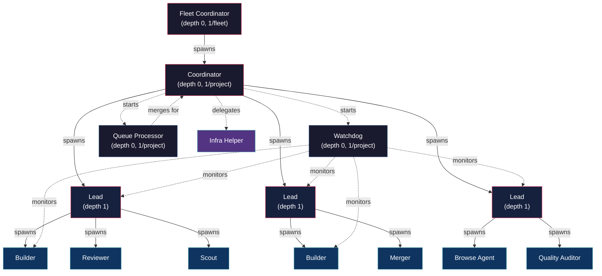
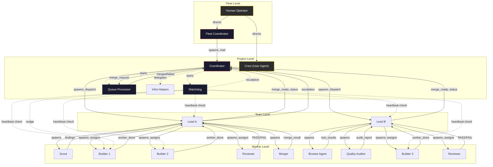
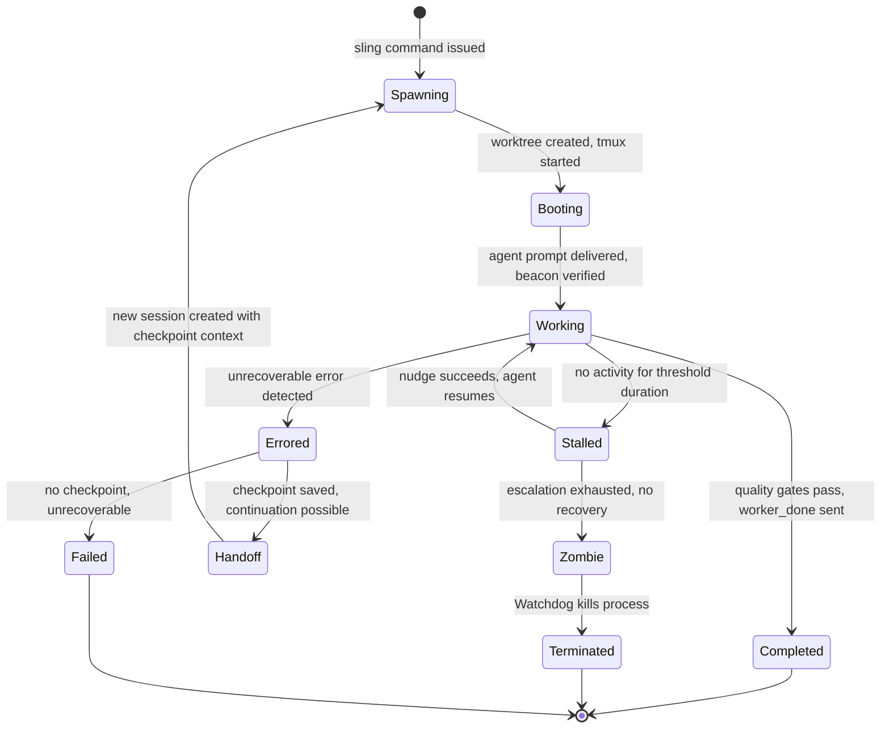

# 04 - Role Taxonomy: Unified Agent Role Specification

A comprehensive specification of the agent role system for a clean-sheet AI agent
orchestration platform, synthesizing operational roles from Gas Town and Overstory,
cognitive patterns from gstack, and domain specialization from ATSA.

---

## 1. Design Philosophy

### Separate Operational Roles from Cognitive Modes

The central insight of this taxonomy is a clean separation between two orthogonal concerns:

**Operational roles** define an agent's position in the hierarchy, its lifecycle,
tool access, communication channels, and spawning authority. These are about
_what an agent is allowed to do_ and _who it reports to_.

**Cognitive modes** define the thinking patterns loaded into an agent's prompt context.
These activate latent LLM knowledge about how specific leaders, engineers, and
designers reason. These are about _how an agent thinks_ while doing its work.

A Builder with Staff Engineer cognitive patterns writes different code than a Builder
with Release Engineer cognitive patterns, even though both have identical operational
capabilities. The role determines the tools and boundaries; the cognitive mode
determines the quality and character of the work.

### Four Platform Insights

**Gas Town's insight: use operational coordination roles, not SDLC personas.**
CrewAI and BMAD define agents as "Product Manager," "Tech Lead," "QA Engineer" --
mapping the human org chart onto agents. Gas Town proved this is wrong. Agents need
roles defined by their _operational function_: who spawns them, what they can modify,
how they communicate, when they die. A Polecat is not a "Backend Engineer" -- it is an
ephemeral worker that receives a work unit, implements it in a scoped worktree, submits
a merge request, and terminates. What _kind_ of engineering it does is determined by
the work unit, not the role.

**Overstory's insight: depth-limited hierarchy prevents runaway spawning.**
Without hard limits, coordinator agents spawn leads that spawn helpers that spawn
sub-helpers, consuming exponential resources. Overstory caps the hierarchy at 3 levels
(coordinator, lead, leaf) and enforces it in the spawning mechanism. Leaf nodes
_cannot_ spawn other agents. This is a structural constraint, not a policy suggestion.

**gstack's insight: cognitive patterns activate latent LLM knowledge.**
The instruction "think like Andy Grove" activates a coherent worldview that the LLM
already understands deeply -- paranoid scanning, strategic inflection points, the
whole _Only the Paranoid Survive_ framework. This is categorically more powerful than
a checklist. Cognitive patterns compose: Bezos Doors + Altman Leverage = "Is this a
reversible high-leverage bet? Ship it fast." The 41 patterns across CEO, Engineering,
and Design modes represent reusable thinking amplifiers that work regardless of
operational role.

**ATSA's insight: domain specialization is about file ownership and skill loading,
not role hierarchy.** A backend-agent and a frontend-agent have the same operational
capabilities (both are Builders). They differ in which directories they own, which
SKILL.md files are loaded into their context, and which cognitive patterns activate.
Domain specialization is orthogonal to the role taxonomy -- it is a configuration
axis, not a hierarchy level.

---

## 2. The Unified Role Taxonomy

### Core Operational Roles (7)

These roles are required for any multi-agent project. Every deployment uses some
subset of these.

| Role | Depth | Count | Lifecycle | Purpose |
|------|-------|-------|-----------|---------|
| **Coordinator** | 0 | 1/project | Persistent | Project-level orchestrator. Dispatches work, monitors fleet, triggers merges, checks exit conditions |
| **Lead** | 1 | 1-3/project | Persistent | Team coordinator. Decomposes tasks, spawns workers, verifies results |
| **Builder** | 2 (leaf) | N | Session-scoped | Implementation. Writes code in declared file scope. Must pass quality gates before completion |
| **Reviewer** | 2 (leaf) | N | Session-scoped | Independent verification. Read-only. Never communicates with the builder it reviews |
| **Scout** | 2 (leaf) | N | Session-scoped | Read-only exploration and analysis. Research, codebase understanding |
| **Merger** | 2 (leaf) | N | Session-scoped | Merge conflict resolution specialist |
| **Watchdog** | 0 | 1/project | Persistent | Fleet health patrol. Detects stuck/zombie agents, progressive escalation |

### Extended Roles (6)

These roles address cross-project coordination, infrastructure maintenance,
specialized quality work, and user-facing collaboration.

| Role | Depth | Count | Lifecycle | Purpose |
|------|-------|-------|-----------|---------|
| **Fleet Coordinator** | 0 | 1/fleet | Persistent | Cross-project coordination. Manages convoys across projects, routes work to the right project |
| **Infrastructure Helper** | varies | N | Ephemeral | Cleanup, backup, compaction, database maintenance tasks |
| **Queue Processor** | 0 | 1/project | Persistent | Merge queue management. Batch-then-bisect merge strategy |
| **Browse Agent** | 2 (leaf) | N | Session-scoped | Browser automation for QA, screenshots, interaction testing |
| **Quality Auditor** | 2 (leaf) | N | Session-scoped | Contract conformance checking, design audit, AI slop detection |
| **Crew (User Agent)** | varies | N | Persistent | User's personal long-lived agent for ad-hoc work and exploration |

---

## 3. Hierarchy Model

### Depth Limits

The hierarchy is hard-capped at 3 levels. This is enforced at spawn time -- the
sling mechanism validates depth before creating a worktree or session.

```
Depth 0: Coordinator / Fleet Coordinator / Watchdog / Queue Processor
  └── Depth 1: Lead
        └── Depth 2: Builder, Reviewer, Scout, Merger, Browse Agent, Quality Auditor
```

### Spawning Rules

- **Leaf nodes (depth 2)** CANNOT spawn other agents. This is non-negotiable.
  Builders, Reviewers, Scouts, Mergers, Browse Agents, and Quality Auditors
  do their own work and report results. They never create sub-agents.
- **Leads (depth 1)** CAN spawn leaf nodes. A Lead assesses task complexity
  and decides the workforce composition: scouts for exploration, builders for
  implementation, reviewers for verification, mergers for conflict resolution.
- **Coordinators (depth 0)** CAN spawn Leads. The Coordinator decomposes the
  project into team-sized chunks and assigns each to a Lead.
- **Fleet Coordinator** CAN spawn Coordinators. One per project.
- **Watchdog** CANNOT spawn agents. It monitors and escalates only.
- **Queue Processor** CANNOT spawn agents. It processes merge requests only.
- **Infrastructure Helpers** CANNOT spawn agents. They execute maintenance tasks.
- **Crew** follows special rules -- user-managed, can operate at any depth
  based on the user's direct instructions.

### Agent Limits

| Limit | Default | Configurable |
|-------|---------|--------------|
| Max agents per Lead | 5 | Yes |
| Max Leads per Coordinator | 3 | Yes |
| Max total agents per project | 15 | Yes |
| Max hierarchy depth | 3 (0, 1, 2) | No |

### Hierarchy Diagram



---

## 4. Per-Role Specification

### 4.1 Coordinator

- **Purpose:** Top-level orchestrator for a single project. Decomposes work into
  team-sized chunks, dispatches to Leads, monitors progress, triggers merges, and
  checks exit conditions.
- **Tools Available:** Read, Write, Edit, Glob, Grep, Bash (full access). All
  platform CLI commands including sling, mail, status, merge, costs.
- **Can Spawn:** Leads, Watchdog, Queue Processor, Infrastructure Helpers
- **Ownership Scope:** Project-level configuration files, task specifications,
  coordination state. Does not own implementation files.
- **Communication:**
  - Receives: status updates from Leads, merge_ready signals, escalations, Watchdog alerts
  - Sends: dispatch assignments to Leads, merge triggers to Queue Processor, shutdown signals
  - Channel: mail system (persistent, typed protocol messages)
- **Lifecycle:**
  - _Start:_ Spawned by Fleet Coordinator, or directly by the user
  - _Work:_ Runs in a tmux session at the project root (no worktree). Operates
    in a hook-driven loop -- checks mail on each prompt, dispatches work, monitors progress.
  - _End:_ Self-terminates when all exit triggers are satisfied (all agents done,
    task tracker empty, shutdown signal received). Configurable exit conditions.
- **Quality Gates:** All dispatched work merged and verified. No unresolved
  escalations. Task tracker empty.
- **Cognitive Modes:** CEO patterns (Bezos Doors for scope decisions, Altman
  Leverage for prioritization, Horowitz Wartime/Peacetime for urgency calibration).
  Eng Manager patterns (Larson Team State for assessing team health, Conway's Law
  for architecture alignment).

### 4.2 Lead

- **Purpose:** Team coordinator. Receives a chunk of work from the Coordinator,
  assesses complexity, decomposes into individual tasks, spawns the right workers,
  and verifies results before reporting completion.
- **Tools Available:** Read, Write, Edit, Glob, Grep, Bash (scoped to project).
  Platform CLI: sling, mail send/check, status, nudge.
- **Can Spawn:** Scouts, Builders, Reviewers, Mergers, Browse Agents, Quality Auditors
- **Ownership Scope:** Task specification files, team coordination state.
  May do simple implementation directly (see complexity assessment below).
- **Communication:**
  - Receives: dispatch from Coordinator, worker_done from Builders, PASS/FAIL from
    Reviewers, findings from Scouts, escalations from workers
  - Sends: assignments to workers, merge_ready to Coordinator, escalations to Coordinator
  - Channel: mail system
- **Lifecycle:**
  - _Start:_ Spawned by Coordinator via sling
  - _Work:_ Assesses task complexity, spawns appropriate workforce, monitors progress,
    verifies results, triggers reviews
  - _End:_ Reports completion to Coordinator when all sub-tasks are done and verified
- **Quality Gates:** All assigned work reviewed and passing. No outstanding worker
  failures. All file scopes properly isolated (no overlapping ownership).
- **Cognitive Modes:** Eng Manager patterns (McKinley Boring Default for technology
  choices, Brooks Essential/Accidental for complexity triage). Founder Mode
  (Chesky -- stay close to details on critical path items).
- **Task Complexity Assessment:**
  - _Simple_ (1-3 files, well-understood): Lead does it directly, no spawning
  - _Moderate_ (3-6 files, clear spec): Skip scout, spawn one Builder, self-verify
  - _Complex_ (6+ files, multi-subsystem): Full scout -> build -> review pipeline

### 4.3 Builder

- **Purpose:** Implementation worker. Receives a task specification and file scope,
  writes code, runs tests, and reports completion. The workhorse of the system.
- **Tools Available:** Read, Write, Edit, Glob, Grep, Bash (scoped to worktree).
  Git: add, commit, push to feature branch. Mail: send (to report completion/errors),
  check (for instructions). Quality gate commands.
- **Can Spawn:** Nothing. Leaf node.
- **Ownership Scope:** Exclusively the files declared in its assignment. Cannot
  modify files outside its scope. The sling mechanism configures path boundary
  enforcement in Bash.
- **Communication:**
  - Receives: assignment from Lead (via sling overlay), instructions for rework
  - Sends: worker_done to Lead (with branch, files modified, exit code), error
    reports if blocked
  - Channel: mail system. Never communicates with Reviewers.
- **Lifecycle:**
  - _Start:_ Spawned by Lead via sling. Receives worktree on a feature branch,
    task spec, file scope, and cognitive mode overlay.
  - _Work:_ Follows the propulsion principle -- starts implementing immediately,
    no planning phase. Writes code, writes tests, runs quality gates. Commits to
    feature branch.
  - _End:_ Sends worker_done when quality gates pass. Session terminates.
    Worktree persists until merge completes.
- **Quality Gates:**
  - All tests passing within owned file scope
  - Linter/formatter clean
  - No files modified outside declared scope
  - Type checking passes (if applicable)
  - Self-review completed (diff review before reporting done)
- **Cognitive Modes:** Staff Engineer patterns (Beck "make the change easy,"
  Kernighan debugging principle, Unix Philosophy). Domain-specific patterns
  loaded based on specialization (see Section 10).

### 4.4 Reviewer

- **Purpose:** Independent read-only verification of a Builder's work. Produces
  a structured PASS/FAIL verdict with actionable feedback.
- **Tools Available:** Read, Glob, Grep, Bash (read-only: git status, git diff,
  git log, quality gate commands, test runners in dry-run mode).
- **Can Spawn:** Nothing. Leaf node.
- **Ownership Scope:** None. Cannot modify any files. Read-only access to the
  Builder's branch.
- **Communication:**
  - Receives: assignment from Lead with branch to review and review criteria
  - Sends: result (PASS or FAIL with detailed feedback) to Lead
  - Channel: mail system. **Never communicates with the Builder it reviews.**
    This independence guarantee is structural -- the Reviewer does not know the
    Builder's agent name, and cannot address mail to it.
- **Lifecycle:**
  - _Start:_ Spawned by Lead after a Builder reports worker_done.
  - _Work:_ Reads the diff, runs quality gates, checks contract conformance,
    assesses code quality. Produces a structured verdict.
  - _End:_ Sends verdict to Lead and terminates.
- **Quality Gates:** Verdict must include: files reviewed, issues found (with
  severity), contract conformance score, recommendation (PASS/FAIL/PASS_WITH_NOTES).
- **Cognitive Modes:** Staff Engineer patterns (two-pass review: CRITICAL then
  INFORMATIONAL). Chesterton's Fence (understand before criticizing). Dijkstra
  Simplicity (flag unnecessary complexity).

### 4.5 Scout

- **Purpose:** Read-only exploration and analysis. Researches the codebase to
  produce findings that inform task decomposition and Builder assignments.
- **Tools Available:** Read, Glob, Grep, Bash (read-only: git status, git diff,
  git log, directory listings, dependency analysis commands).
- **Can Spawn:** Nothing. Leaf node.
- **Ownership Scope:** None. Cannot modify any files.
- **Communication:**
  - Receives: exploration brief from Lead (what to find, what questions to answer)
  - Sends: findings report to Lead (file inventory, architecture analysis,
    dependency map, risk assessment)
  - Channel: mail system
- **Lifecycle:**
  - _Start:_ Spawned by Lead before Builder assignment on complex tasks.
  - _Work:_ Explores codebase using read-only tools. Maps file dependencies,
    identifies interfaces, locates relevant tests, assesses complexity.
  - _End:_ Sends findings to Lead and terminates.
- **Quality Gates:** Findings must include: files relevant to the task, existing
  test coverage, interface boundaries, suggested file scope partitioning for Builders.
- **Cognitive Modes:** Eng patterns (Fowler Refactoring awareness -- identify
  existing patterns before changing them). Munger Latticework (apply multiple
  mental models to understand the codebase structure).

### 4.6 Merger

- **Purpose:** Resolves merge conflicts that automated strategies cannot handle.
  Specializes in understanding both sides of a conflict and producing correct
  resolutions.
- **Tools Available:** Read, Write, Edit, Glob, Grep, Bash (git merge, git
  rebase, git diff, conflict resolution commands). Scoped to merge-related
  file operations.
- **Can Spawn:** Nothing. Leaf node.
- **Ownership Scope:** Limited to files with active merge conflicts. Cannot
  modify files that are not in conflict.
- **Communication:**
  - Receives: merge assignment from Lead or Queue Processor with the two
    branches and conflict details
  - Sends: merge result (success/failure, resolution strategy used, files
    resolved) to assigning role
  - Channel: mail system
- **Lifecycle:**
  - _Start:_ Spawned when automated merge (tier 1-2) fails and AI resolution
    (tier 3) is needed.
  - _Work:_ Analyzes both sides of conflicts, understands semantic intent,
    produces correct resolutions. May need to understand business logic to
    resolve correctly.
  - _End:_ Reports merge result and terminates.
- **Quality Gates:** Merged code must compile. Tests must pass on the merged
  result. No silent conflict drops (every conflict marker must be resolved).
- **Cognitive Modes:** Staff Engineer patterns (Hyrum's Law awareness --
  understand observable behavior dependencies when merging). Postel's Law
  (be conservative in what you produce during resolution).

### 4.7 Watchdog

- **Purpose:** Continuous fleet health patrol. Detects stuck, zombie, and
  errored agents. Escalates progressively. Does not do project work.
- **Tools Available:** Read (agent state, session databases, mail archives),
  Glob, Grep, Bash (process inspection, tmux queries, health check commands).
  Platform CLI: status, inspect, nudge, trace.
- **Can Spawn:** Nothing. Monitoring only.
- **Ownership Scope:** None. Read-only access to all project state.
- **Communication:**
  - Receives: heartbeats from active agents (implicit via activity timestamps)
  - Sends: nudges to stalled agents, escalation mail to Coordinator, health
    reports
  - Channel: mail system for escalations, tmux send-keys for nudges
- **Lifecycle:**
  - _Start:_ Started by Coordinator at the beginning of a run.
  - _Work:_ Runs continuous patrol cycles on a configurable interval
    (default 30 seconds). Checks process liveness, tmux session existence, PID
    validity, recent activity timestamps.
  - _End:_ Terminates when the Coordinator signals shutdown.
- **Quality Gates:** N/A -- monitoring role.
- **Cognitive Modes:** Grove Paranoid Scanning (what failure am I not seeing?).
  Majors Own Your Code (operational awareness, production-mindset monitoring).
- **Progressive Escalation Levels:**
  1. Level 0 -- _Warn:_ Log a warning, update health state
  2. Level 1 -- _Nudge:_ Inject a status check prompt into the agent's tmux session
  3. Level 2 -- _Escalate:_ Send escalation mail to the agent's parent (Lead or Coordinator)
  4. Level 3 -- _Terminate:_ Kill the agent process after timeout

### 4.8 Fleet Coordinator

- **Purpose:** Cross-project coordination for multi-project builds. Manages
  convoys (coordinated multi-project efforts), routes work to the right
  project Coordinator, and handles cross-project dependencies.
- **Tools Available:** All platform CLI commands. Full Bash access.
- **Can Spawn:** Coordinators (one per project)
- **Ownership Scope:** Fleet-level configuration, cross-project dependency maps.
- **Communication:**
  - Receives: convoy requests from user, completion signals from Coordinators,
    cross-project dependency notifications
  - Sends: project assignments to Coordinators, dependency resolution instructions
  - Channel: mail system
- **Lifecycle:**
  - _Start:_ Started by the user for multi-project work.
  - _Work:_ Decomposes convoy into per-project chunks, spawns Coordinators,
    monitors cross-project dependencies and ordering constraints.
  - _End:_ Terminates when all Coordinators have completed.
- **Quality Gates:** All projects in convoy completed. Cross-project integration
  tests passing (if defined).
- **Cognitive Modes:** CEO patterns (Bezos Doors for cross-project scope decisions,
  Lütke Scale thinking for system-wide architecture). Conway's Law awareness for
  cross-project boundary design.

### 4.9 Infrastructure Helper

- **Purpose:** Executes maintenance and infrastructure tasks: database backup,
  log compaction, stale data cleanup, worktree garbage collection, session
  archive rotation.
- **Tools Available:** Bash (scoped to maintenance commands), Read, Write
  (configuration files only).
- **Can Spawn:** Nothing. Task-scoped.
- **Ownership Scope:** Infrastructure state files, backup directories, log
  archives. Never touches project source code.
- **Communication:**
  - Receives: task assignment from Coordinator or Watchdog
  - Sends: completion report with results (bytes freed, records purged, etc.)
  - Channel: mail system
- **Lifecycle:**
  - _Start:_ Spawned on-demand for a specific maintenance task.
  - _Work:_ Executes the assigned maintenance formula.
  - _End:_ Reports results and terminates immediately.
- **Quality Gates:** Task-specific. Backup tasks must verify backup integrity.
  Cleanup tasks must not delete active state.
- **Cognitive Modes:** None. Infrastructure Helpers execute mechanical procedures.

### 4.10 Queue Processor

- **Purpose:** Manages the merge queue for a project. Receives merge requests,
  orders them, applies the batch-then-bisect strategy, and reports results.
- **Tools Available:** Bash (git merge, git rebase, test runners), Read, Glob,
  Grep. Platform CLI: mail, status.
- **Can Spawn:** Mergers (for tier 3 AI-assisted resolution)
- **Ownership Scope:** Merge queue state. Does not own source code.
- **Communication:**
  - Receives: merge_ready signals from Coordinators/Leads, test results
  - Sends: merged confirmations, merge_failed notifications (with rework instructions)
  - Channel: mail system
- **Lifecycle:**
  - _Start:_ Started by Coordinator at the beginning of a run.
  - _Work:_ Continuously processes the merge queue. Batches pending MRs,
    tests the tip, bisects on failure.
  - _End:_ Terminates when the Coordinator signals shutdown.
- **Quality Gates:** Every merged commit passes the full test suite. No silent
  merge failures. Failed merges escalated within retry limits.
- **Cognitive Modes:** Release Engineer patterns (systematic pipeline execution,
  no confirmation dialogs, fail-fast-and-report).
- **Merge Strategy (Batch-then-Bisect):**
  1. Collect pending merge requests: [A, B, C, D]
  2. Rebase as a stack on main
  3. Test the tip (D). If PASS: fast-forward merge all. Done.
  4. If FAIL: binary bisect. Test midpoint (B).
  5. If B passes: problem is in [C, D]. Bisect further.
  6. If B fails: problem is in [A, B]. Bisect further.
  7. Isolate the failing MR. Send merge_failed to its Lead.

### 4.11 Browse Agent

- **Purpose:** Browser automation for visual QA, screenshot capture, interaction
  testing, and authenticated session validation. Operates a real browser via
  Playwright.
- **Tools Available:** Read, Glob, Grep, Bash (read-only for codebase). Full
  Playwright MCP tool access: navigate, click, fill, screenshot, snapshot,
  evaluate, console messages, network requests.
- **Can Spawn:** Nothing. Leaf node.
- **Ownership Scope:** Screenshot output directories, test result files. Does
  not modify source code.
- **Communication:**
  - Receives: test plan from Lead (URLs to visit, interactions to perform,
    assertions to check)
  - Sends: test results with screenshots and evidence to Lead
  - Channel: mail system
- **Lifecycle:**
  - _Start:_ Spawned by Lead for visual verification tasks.
  - _Work:_ Launches browser, navigates to target URLs, performs interactions,
    captures screenshots, validates visual/functional assertions.
  - _End:_ Sends results with evidence and terminates.
- **Quality Gates:** All specified interactions completed. Screenshots captured
  for each assertion point. Console errors reported. Network failures flagged.
- **Cognitive Modes:** QA patterns (systematic coverage). Design patterns
  (Norman 3 Levels for UX assessment, Krug "Don't Make Me Think" for usability,
  AI slop detection for visual quality).

### 4.12 Quality Auditor

- **Purpose:** Specialized verification beyond code review: contract conformance,
  design system compliance, accessibility audit, security posture check, and
  AI output quality assessment.
- **Tools Available:** Read, Glob, Grep, Bash (read-only: linters, validators,
  contract comparison tools, accessibility scanners).
- **Can Spawn:** Nothing. Leaf node.
- **Ownership Scope:** None. Read-only. Produces audit report files.
- **Communication:**
  - Receives: audit assignment from Lead with scope and criteria
  - Sends: structured audit report with scores, findings, and recommendations
  - Channel: mail system
- **Lifecycle:**
  - _Start:_ Spawned by Lead for quality gate verification.
  - _Work:_ Runs contract conformance checks, validates against design system
    tokens, checks accessibility standards, scans for AI slop patterns.
  - _End:_ Sends audit report and terminates.
- **Quality Gates:** Audit must produce: conformance score (1-5), findings list
  with severity, blocking issues flagged, recommendation (PASS/BLOCK/CONDITIONAL).
- **Cognitive Modes:** Staff Engineer patterns (systematic audit). Design patterns
  (Rams Subtraction, Tufte Data-Ink for visual audits). QA Lead patterns
  (find-fix-verify methodology). AI slop detection (10 codified anti-patterns).

### 4.13 Crew (User Agent)

- **Purpose:** Long-lived, user-managed agent for persistent collaboration.
  The user's direct replacement for raw Claude Code sessions. Not subject to
  the usual orchestrator dispatch -- the user controls it directly.
- **Tools Available:** All tools. No restrictions. The user decides what the
  Crew agent does.
- **Can Spawn:** Follows user instructions. Can operate at any depth.
- **Ownership Scope:** User-directed. No automatic scope restrictions.
- **Communication:**
  - Receives: direct instructions from the user
  - Sends: results directly to the user
  - Channel: direct tmux interaction, plus mail system for cross-agent coordination
- **Lifecycle:**
  - _Start:_ Created by the user on demand.
  - _Work:_ Persistent. Works on whatever the user directs. Can be attached,
    detached, and reattached across sessions.
  - _End:_ User-terminated. Not subject to Watchdog monitoring or automatic
    cleanup.
- **Quality Gates:** None automatic. User applies their own judgment.
- **Cognitive Modes:** User-selected. Can load any cognitive pattern set.
- **Key Differences from Orchestrated Agents:**

| Aspect | Crew | Orchestrated Agent |
|--------|------|--------------------|
| Lifecycle | Persistent (user controls) | Session-scoped (Lead controls) |
| Monitoring | None (Watchdog ignores) | Full Watchdog patrol |
| Work assignment | Human-directed | Dispatched via sling |
| Git state | Full clone, may push to main | Worktree, feature branch only |
| Cleanup | Manual | Automatic on completion |
| Best for | Design, exploration, long-running | Discrete, well-defined tasks |

---

## 5. Tool Guard Rules

Tool access is enforced structurally through the runtime's guard mechanism. Guards
are not advisory -- an agent physically cannot call tools outside its allowed set.

### Tool Access Matrix

| Role | Read | Write | Edit | Glob | Grep | Bash | Browser | Platform CLI |
|------|------|-------|------|------|------|------|---------|-------------|
| Coordinator | Y | Y | Y | Y | Y | Full | N | All |
| Lead | Y | Y | Y | Y | Y | Scoped | N | sling, mail, status, nudge |
| Builder | Y | Y | Y | Y | Y | Scoped | N | mail send/check, git add/commit |
| Reviewer | Y | N | N | Y | Y | Read-only | N | mail send/check |
| Scout | Y | N | N | Y | Y | Read-only | N | mail send |
| Merger | Y | Y | Y | Y | Y | Merge-scoped | N | mail send/check |
| Watchdog | Y | N | N | Y | Y | Read-only | N | status, inspect, nudge, trace |
| Fleet Coord | Y | Y | Y | Y | Y | Full | N | All |
| Infra Helper | Y | Y* | N | Y | Y | Maintenance | N | mail send |
| Queue Proc | Y | N | N | Y | Y | Merge/test | N | mail, status |
| Browse Agent | Y | N | N | Y | Y | Read-only | Full | mail send |
| Quality Auditor | Y | N | N | Y | Y | Read-only | N | mail send |
| Crew | Y | Y | Y | Y | Y | Full | Full | All |

*Infra Helper Write access is limited to infrastructure state files.

### Bash Pattern Guards

| Pattern Category | Allowed Roles | Example Commands |
|------------------|---------------|------------------|
| Git read | All | `git status`, `git diff`, `git log`, `git show` |
| Git write | Builder, Lead, Merger, Coordinator | `git add`, `git commit`, `git push` |
| Git merge | Merger, Queue Processor, Coordinator | `git merge`, `git rebase` |
| Quality gates | Builder, Reviewer, Lead | `npm test`, `npm run lint`, `tsc --noEmit` |
| Agent dispatch | Lead, Coordinator | `sling`, `nudge` |
| Process inspection | Watchdog, Coordinator | `tmux list-sessions`, `ps`, `pgrep` |
| Maintenance | Infra Helper | `backup`, `compact`, `purge`, `vacuum` |
| Path boundary | Builder, Lead | Commands restricted to worktree path |

### Guard Enforcement Points

1. **Tool-level:** The runtime adapter strips disallowed tools from the agent's
   tool manifest before session start.
2. **Bash-level:** A Bash wrapper validates each command against the agent's
   allowed patterns before execution. Blocked commands return an error message
   explaining what is not allowed and why.
3. **Path-level:** File operations (Read, Write, Edit) are validated against
   the agent's declared file scope. Out-of-scope paths are rejected.

---

## 6. Supervision Hierarchy Diagram



### Communication Channels

| Channel | Mechanism | Latency | Persistence | Use Case |
|---------|-----------|---------|-------------|----------|
| **Mail** | SQLite message bus | ~1-5ms | Persistent (survives restarts) | All structured communication |
| **Nudge** | tmux send-keys injection | Immediate | Ephemeral | Unsticking stalled agents |
| **Broadcast** | Mail to group addresses | ~1-5ms | Persistent | Fleet-wide announcements |
| **Sling** | Worktree + tmux + overlay | ~5-10s | N/A (spawning) | Agent creation |
| **Checkpoint** | JSON file in agent directory | N/A | Persistent | Context handoff on compaction |

### Heartbeat Cascade

```
Daemon (mechanical, every 30s)
  └── checks Watchdog liveness
        └── Watchdog patrols all agents
              ├── checks Lead sessions (tmux alive, PID alive, recent activity)
              │     └── Leads track their own workers via mail response times
              └── checks worker sessions directly
                    └── progressive escalation: warn → nudge → escalate → terminate
```

---

## 7. Agent Identity Model

Every agent has a layered identity system with different persistence horizons.
This model combines Gas Town's persistent identity with CV chain and Overstory's
three-layer architecture.

### Identity (Permanent)

Persists across all assignments. Accumulates over the agent's lifetime.

```typescript
interface AgentIdentity {
  name: string;                 // Unique agent name (e.g., "builder-alpha")
  capability: string;           // Role: "builder", "reviewer", "lead", etc.
  created: string;              // ISO timestamp
  expertiseDomains: string[];   // Accumulated expertise areas
  sessionsCompleted: number;    // Lifetime session count
  recentTasks: TaskRecord[];    // Last N completed tasks
}

interface TaskRecord {
  taskId: string;
  summary: string;
  completedAt: string;
  outcome: "success" | "failure" | "partial";
  filesModified: string[];
}
```

### Sandbox (Per-Assignment)

Persists across sessions within a single assignment. Defines the agent's
working environment.

```typescript
interface AgentSandbox {
  worktreePath: string;         // Git worktree location
  branchName: string;           // Feature branch
  taskId: string;               // Current task assignment
  fileScope: string[];          // Exclusively owned files/directories
  baseBranch: string;           // Branch to merge into
  specialization: string;       // Domain specialization (see Section 10)
  cognitiveProfile: string[];   // Loaded cognitive patterns
}
```

### Session (Ephemeral)

One Claude Code runtime session. Destroyed on compaction, crash, or completion.

```typescript
interface AgentSession {
  sessionId: string;            // Unique session identifier
  pid: number | null;           // OS process ID
  tmuxSession: string;          // tmux session name
  startedAt: string;            // ISO timestamp
  checkpoint: SessionCheckpoint | null;  // Saved progress for handoff
  state: AgentState;            // Current state machine position
  escalationLevel: number;      // Watchdog escalation counter (0-3)
  lastActivity: string;         // Timestamp of last tool call
}
```

### Scorecard (Accumulating)

Performance metrics that build over time, enabling the system to make informed
assignment decisions.

```typescript
interface AgentScorecard {
  tasksCompleted: number;
  tasksSucceeded: number;
  tasksFailed: number;
  reviewPrecision: number;      // For Reviewers: % of flagged issues confirmed
  qaCatchRate: number;          // For Quality Auditors: % of bugs caught
  retryRate: number;            // How often work needed rework
  mergeFailures: number;        // How often merge attempts failed
  avgTaskDurationMs: number;    // Average time to complete a task
  avgTokenCost: number;         // Average token cost per task
  costPerTask: number;          // Average USD cost per task
}
```

### Attribution

All work is attributed to the agent identity:

```
Git commits:    Author: platform/builder-alpha <agent@platform.local>
Mail messages:  from: builder-alpha
Events:         agentName: builder-alpha
Audit trail:    actor: builder-alpha, session: sess-abc123
```

---

## 8. Lifecycle State Machine

### State Transitions



### State Definitions

| State | Description | Duration | Exit Condition |
|-------|-------------|----------|----------------|
| **Spawning** | Sling is creating worktree, tmux session, overlay | 5-10 seconds | Worktree and session exist |
| **Booting** | Agent runtime starting, processing initial prompt | 10-30 seconds | First tool call observed |
| **Working** | Actively making tool calls, writing code, communicating | Minutes to hours | Task complete or stall detected |
| **Completed** | Work done, quality gates passed, results reported | Terminal | N/A |
| **Stalled** | No activity for configured threshold (default 2 min) | Until nudge or escalation | Activity resumes or escalation limit hit |
| **Errored** | Agent reported an unrecoverable error | Until handoff or failure | Checkpoint saved or timeout |
| **Zombie** | Stalled past all escalation levels, unresponsive | Until termination | Watchdog terminates |
| **Handoff** | Session ending, checkpoint being saved for continuation | Seconds | Checkpoint persisted |
| **Terminated** | Process killed by Watchdog | Terminal | N/A |
| **Failed** | Unrecoverable failure, no continuation possible | Terminal | N/A |

### Checkpoint and Handoff

When an agent hits context limits or crashes, a handoff occurs:

1. Agent saves checkpoint (progress summary, files modified, pending work)
2. Session transitions to Handoff state
3. Coordinator receives handoff notification
4. Coordinator spawns a continuation agent in the same sandbox
5. New agent boots with checkpoint context loaded
6. New session transitions to Working, picks up where the previous left off

```typescript
interface SessionCheckpoint {
  agentName: string;
  taskId: string;
  sessionId: string;
  timestamp: string;
  progressSummary: string;      // Human-readable: what was done
  filesModified: string[];      // Files changed so far
  currentBranch: string;        // Git branch state
  pendingWork: string;          // Human-readable: what remains
  completionEstimate: number;   // 0-100 percentage
}
```

---

## 9. Role Interaction Map

### Who Talks to Whom

| From → To | Coordinator | Lead | Builder | Reviewer | Scout | Merger | Watchdog | Queue Proc | Fleet Coord |
|-----------|-------------|------|---------|----------|-------|--------|----------|------------|-------------|
| **Coordinator** | - | dispatch, instructions | - | - | - | - | shutdown | merge_request | status, completion |
| **Lead** | merge_ready, status, escalation | - | assignment, rework | assignment | exploration brief | assignment | - | - | - |
| **Builder** | - | worker_done, error | - | - | - | - | - | - | - |
| **Reviewer** | - | PASS/FAIL verdict | - | - | - | - | - | - | - |
| **Scout** | - | findings report | - | - | - | - | - | - | - |
| **Merger** | - | merge_result | - | - | - | - | - | merge_result | - |
| **Watchdog** | escalation, health report | nudge | nudge | nudge | nudge | nudge | - | nudge | escalation |
| **Queue Proc** | merged/failed | - | - | - | - | - | - | - | - |
| **Fleet Coord** | dispatch, instructions | - | - | - | - | - | - | - | - |

### Key Interaction Flows

**Happy Path: Task Completion**
```
Coordinator → (dispatch) → Lead → (scout brief) → Scout
                                                      ↓
                                              (findings report)
                                                      ↓
                           Lead → (assignment) → Builder
                                                      ↓
                                              (worker_done)
                                                      ↓
                           Lead → (assignment) → Reviewer
                                                      ↓
                                                (PASS verdict)
                                                      ↓
                           Lead → (merge_ready) → Coordinator
                                                      ↓
                           Coordinator → (merge_request) → Queue Processor
                                                              ↓
                                                         (merged)
                                                              ↓
                           Coordinator records completion
```

**Failure Path: Review Rejection**
```
Reviewer → (FAIL verdict with feedback) → Lead
                                            ↓
                           Lead → (rework instructions) → Builder
                                                              ↓
                                                       (worker_done, attempt 2)
                                                              ↓
                           Lead → (assignment) → Reviewer (new instance)
                                                              ↓
                                                       (PASS verdict)
```

**Failure Path: Stalled Agent**
```
Watchdog detects no activity on Builder for 2 minutes
  → Level 0: logs warning
  → (2 more minutes)
  → Level 1: sends nudge via tmux
  → (2 more minutes, still no activity)
  → Level 2: sends escalation mail to Lead
  → Lead reassesses: retry or reassign
  → (2 more minutes, still no activity)
  → Level 3: Watchdog terminates Builder process
  → Lead spawns replacement Builder with checkpoint
```

---

## 10. Domain Specialization (Orthogonal to Roles)

### The Key Insight

Domain specialization and operational role are independent axes. A Builder is always
a Builder -- same depth, same lifecycle, same tool access, same spawning rules. But a
Builder specialized as "backend" writes different code than one specialized as "frontend"
because different skills are loaded, different files are owned, and different cognitive
patterns are activated.

```
              Role (operational)
              ┌──────────────────────────────────────┐
              │ Builder  Reviewer  Scout  Lead  ...  │
   Domain     ├──────────────────────────────────────┤
   (config)   │ backend     ✓        ✓      ✓       │
              │ frontend    ✓        ✓      ✓       │
              │ infra       ✓        ✓      ✓       │
              │ security    ✓        ✓               │
              │ database    ✓        ✓      ✓       │
              │ docs        ✓        ✓               │
              │ observ.     ✓        ✓               │
              │ perf.       ✓        ✓               │
              └──────────────────────────────────────┘
```

### What Specialization Controls

| Dimension | What Changes | Example |
|-----------|-------------|---------|
| **Skill Loading** | Which SKILL.md is injected into the agent's prompt | backend-builder gets `backend-agent/SKILL.md` with API patterns, data layer guidance |
| **File Ownership** | Which directories/files the agent can modify | backend-builder owns `services/`, `packages/shared/`; frontend-builder owns `apps/`, `packages/ui/` |
| **Cognitive Patterns** | Which thinking patterns are activated | backend-builder: Unix Philosophy, Postel's Law; frontend-builder: Norman 3 Levels, Krug usability |
| **Quality Gates** | Which validators and checks run | backend-builder: API contract conformance, migration safety; frontend-builder: accessibility, responsive checks |
| **Reference Material** | Which reference docs are available on-demand | backend-builder: OpenAPI spec, database schema; frontend-builder: design system tokens, component library docs |

### What Specialization Does NOT Control

- Hierarchy position (always depth 2 for Builders)
- Tool access (all Builders get the same tools)
- Lifecycle mechanics (all Builders follow the same state machine)
- Communication protocol (all Builders use the same mail types)
- Spawning authority (no Builders can spawn, regardless of specialization)

### Standard Specializations

| Specialization | File Scope | Skill Context | Cognitive Patterns |
|----------------|-----------|---------------|-------------------|
| **backend** | `services/`, `packages/shared/`, `src/api/` | API design, business logic, data access | Unix Philosophy, Postel's Law, Hyrum's Law |
| **frontend** | `apps/`, `packages/ui/`, `src/components/` | React/Vue/Svelte, client state, routing | Norman 3 Levels, Krug usability, Victor Immediate Feedback |
| **infrastructure** | `infra/`, `.github/`, `docker/`, CI/CD configs | Docker, K8s, deployment, networking | Majors Own Your Code, Google SRE Error Budgets |
| **database** | `migrations/`, `seeds/`, `src/models/` | Schema evolution, query optimization, migration safety | Brooks Essential/Accidental, Dijkstra Simplicity |
| **security** | Audit scope (cross-cutting, read-heavy) | OWASP, auth patterns, secrets management | Grove Paranoid Scanning, Munger Inversion |
| **docs** | `docs/`, `README*`, `CHANGELOG*`, `*.md` | Technical writing, API docs, onboarding | Tufte Data-Ink, Munari Simplicity |
| **observability** | `monitoring/`, `src/logging/`, `src/metrics/` | Logging, tracing, alerting, dashboards | Majors Own Your Code, Google SRE |
| **performance** | `benchmarks/`, `load-tests/`, `k6/` | Load testing, profiling, baseline measurement | Knuth Premature Optimization, measurement rigor |

### Specialization at Different Roles

The same specialization applies differently depending on the role:

**Backend specialization:**
- _Backend Scout:_ Maps API routes, traces data flow, identifies integration points
- _Backend Builder:_ Implements endpoints, writes data access layers, creates migration files
- _Backend Reviewer:_ Validates API contract conformance, checks SQL injection vectors, verifies error handling
- _Backend Lead:_ Decomposes backend work, understands service boundaries, assigns with data flow awareness

**Frontend specialization:**
- _Frontend Scout:_ Maps component tree, identifies shared state, catalogs design tokens in use
- _Frontend Builder:_ Implements components, connects to APIs, handles client-side state
- _Frontend Reviewer:_ Validates accessibility, checks responsive behavior, detects AI slop
- _Frontend Lead:_ Decomposes UI work by feature area, manages component ownership boundaries

### Custom Specializations

The specialization system is extensible. Teams can define project-specific
specializations by providing:

1. A SKILL.md file with domain-specific instructions
2. A file scope declaration (directories and patterns)
3. A cognitive pattern set
4. Quality gate definitions
5. Reference material in a `references/` directory

This maps directly to ATSA's skill architecture: each specialization IS a skill,
loaded into the agent's context at spawn time via the sling overlay mechanism.

---

## Appendix A: Platform Role Mapping

How the unified taxonomy maps back to each source platform:

| Unified Role | Gas Town | Overstory | gstack | ATSA |
|-------------|----------|-----------|--------|------|
| Coordinator | Mayor | Coordinator | (none) | Orchestrator |
| Lead | (implicit in Mayor) | Lead | (none) | (implicit in Orchestrator) |
| Builder | Polecat | Builder | (implicit) | backend/frontend/etc-agent |
| Reviewer | (in Polecat workflow) | Reviewer | Staff Engineer `/review` | code-reviewer |
| Scout | (none) | Scout | (none) | (none) |
| Merger | Refinery (partial) | Merger | Release Engineer `/ship` | (none) |
| Watchdog | Witness + Deacon | Monitor | (none) | (none) |
| Fleet Coordinator | Mayor (cross-rig) | Orchestrator | (none) | (none) |
| Infra Helper | Dogs | (none) | (none) | (none) |
| Queue Processor | Refinery | (merge queue) | (none) | (none) |
| Browse Agent | (none) | (none) | QA Lead `/qa` | (none) |
| Quality Auditor | (none) | (none) | Designer `/plan-design-review` | contract-auditor, qe-agent |
| Crew | Crew | (none) | (none) | (none) |

## Appendix B: Cognitive Pattern Catalog

The full set of 41 cognitive patterns, grouped by mode, available for loading
into any agent role:

**CEO Mode (14 patterns):** Bezos Doors, Day 1 Proxy, Regret Minimization,
Grove Paranoid Scanning, Munger Inversion, Munger Latticework,
Horowitz Wartime/Peacetime, Chesky Founder Mode, Altman Leverage,
Collison Stripe Think, Lutke Shopify Scale, Graham Schlep Blindness,
Thiel Zero to One, Tan Founder Density.

**Engineering Mode (15 patterns):** Larson Team State, McKinley Boring Default,
Brooks Essential/Accidental, Beck Make Change Easy, Majors Own Your Code,
Google SRE Error Budgets, Fowler Refactoring, Hyrum's Law, Conway's Law,
Kernighan Debugging, Unix Philosophy, Knuth Premature Optimization,
Postel's Law, Chesterton's Fence, Dijkstra Simplicity.

**Design Mode (12 patterns):** Rams Subtraction, Norman 3 Levels, Zhuo
Principled Taste, Gebbia Trust Design, Ive Care Is Visible, Tufte Data-Ink,
Krug Don't Make Me Think, Victor Immediate Feedback, Chimero Shape of Design,
Eames Constraints, Muller-Brockmann Grid, Munari Simplicity.

Patterns are loaded via the sling overlay based on the agent's role and
specialization. A Coordinator gets CEO + Eng Manager patterns. A Builder gets
Staff Engineer patterns plus domain-specific patterns. A Reviewer gets Staff
Engineer patterns with emphasis on verification. The mapping is configured in
the agent manifest, not hardcoded.
