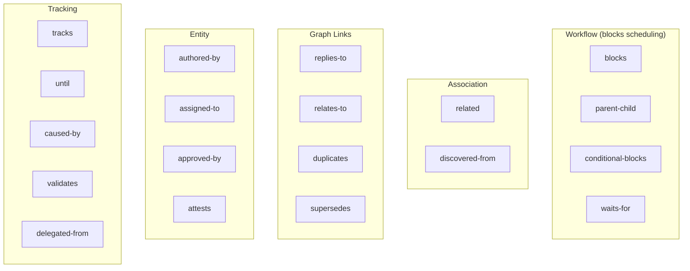
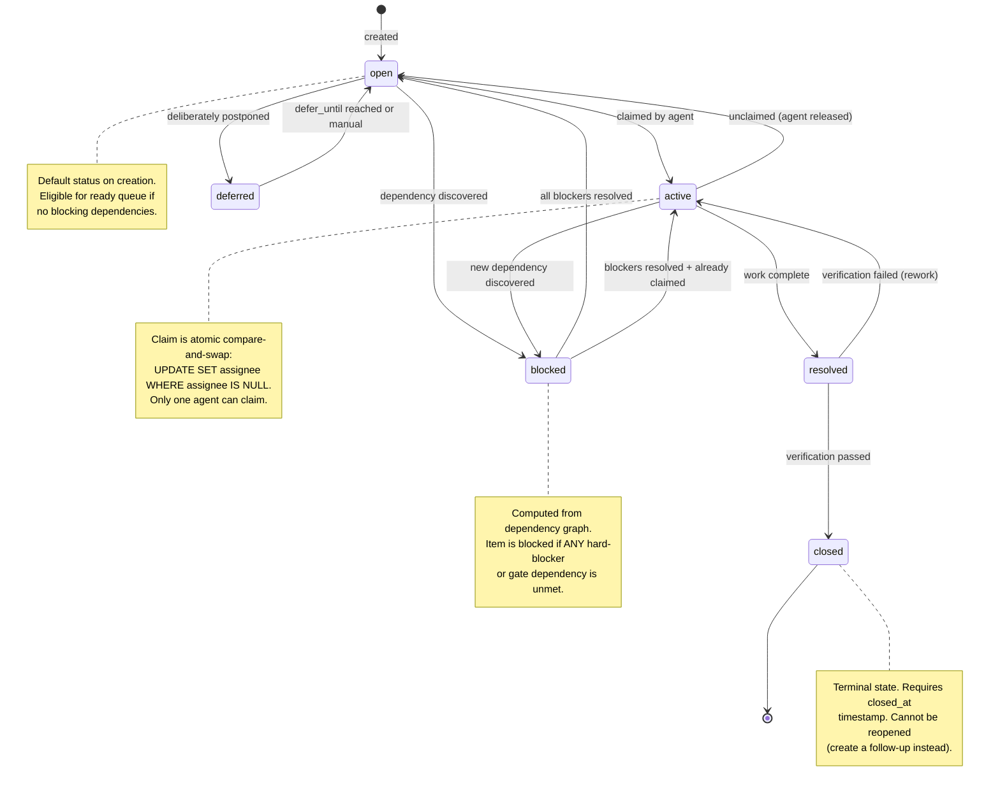
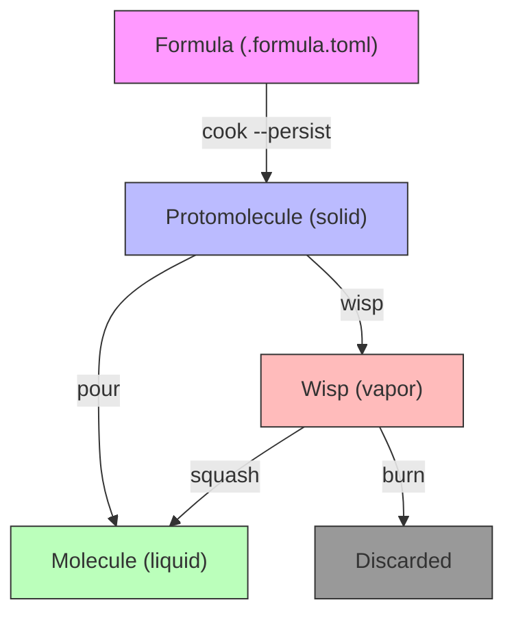
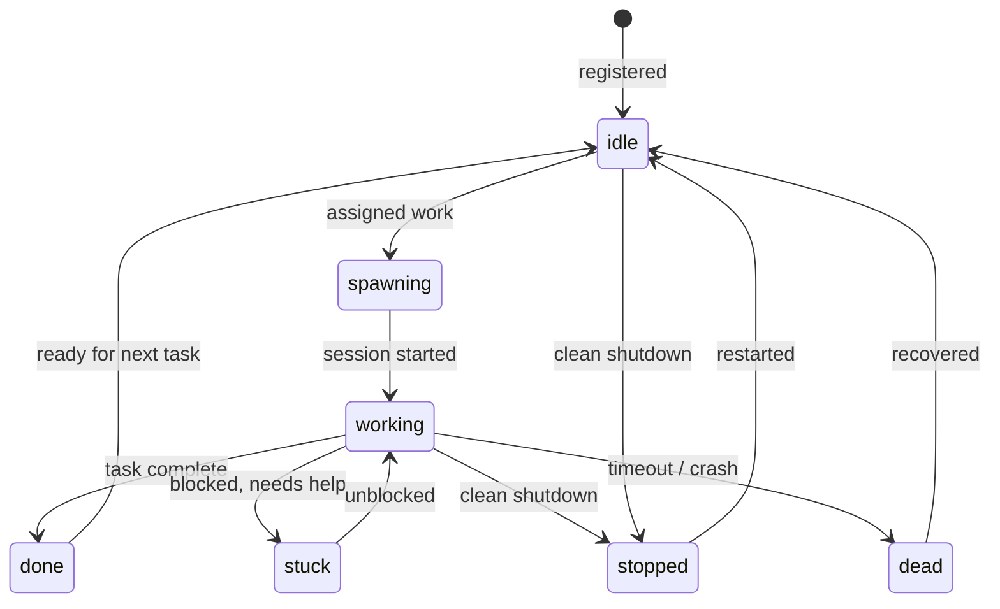
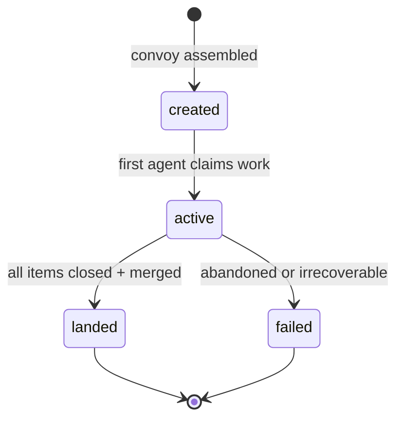

# 05 - Data Model Specification

Unified data model for the AI agent orchestration platform. Synthesized from
Beads' single-wide-table schema, Gas Town's MEOW hierarchy, Overstory's
git-native Seeds tracker, and the design decisions documented across the
deep-dive series.

---

## 1. Core Entity: Work Item

All work -- tasks, bugs, features, epics, molecules, gates, wisps -- lives in
one wide table. Sparse columns keep the schema unified; not every row uses
every column. This avoids JOIN-heavy normalization while keeping the query
surface simple for agents that need to read/write work items at high frequency.

### Why a Single Wide Table

- **Agent simplicity.** Every agent queries one table. No ORM, no polymorphic
  dispatch, no inheritance hierarchies to navigate.
- **Merge safety.** Hash-based IDs (`wi-a1b2c3`) eliminate merge conflicts
  when multiple agents create work concurrently on different branches.
- **Sparse columns are cheap.** NULL columns in Dolt/SQL cost near-zero
  storage. The alternative -- a normalized schema with 8+ tables and JOIN
  queries -- adds latency and connection pressure for every operation.
- **Type flexibility.** New work item types (convoy, gate, slot) are added by
  populating new column subsets, not by schema migration.

### Full Schema

```sql
CREATE TABLE work_items (

  -- ═══════════════════════════════════════════════════════════
  -- IDENTITY
  -- ═══════════════════════════════════════════════════════════
  id              VARCHAR(255) PRIMARY KEY,   -- hash-based "wi-a1b2c3" or counter "wi-42"
  content_hash    VARCHAR(64),                -- SHA-256 of canonical fields for cross-clone dedup
  title           VARCHAR(500) NOT NULL,      -- required, max 500 chars
  description     TEXT NOT NULL DEFAULT '',    -- full description / problem statement
  type            VARCHAR(32) NOT NULL DEFAULT 'task',
                  -- core: bug, feature, task, chore, epic, decision, message, molecule
                  -- system: event, gate, convoy, agent, role, rig, slot
  spec_id         VARCHAR(1024),              -- external specification reference

  -- ═══════════════════════════════════════════════════════════
  -- STATUS & PRIORITY
  -- ═══════════════════════════════════════════════════════════
  status          VARCHAR(32) NOT NULL DEFAULT 'open',
                  -- open, active, blocked, deferred, resolved, closed, pinned, hooked
  priority        INT NOT NULL DEFAULT 2 CHECK (priority BETWEEN 0 AND 4),
                  -- 0=P0/critical, 1=urgent, 2=normal, 3=low, 4=backlog
  assignee        VARCHAR(255),               -- current worker (agent name or human)
  owner           VARCHAR(255) DEFAULT '',    -- human owner for attribution (git author email)

  -- ═══════════════════════════════════════════════════════════
  -- HIERARCHY
  -- ═══════════════════════════════════════════════════════════
  parent_id       VARCHAR(255),               -- epic or molecule parent (via parent-child dep)
  epic_id         VARCHAR(255),               -- top-level epic container (denormalized for queries)
  molecule_id     VARCHAR(255),               -- molecule this item belongs to (if any)

  -- ═══════════════════════════════════════════════════════════
  -- WORKFLOW / FORMULA
  -- ═══════════════════════════════════════════════════════════
  formula_id          VARCHAR(255),           -- source formula name (e.g., "mol-build")
  source_formula      VARCHAR(255),           -- formula file where step was defined
  source_location     VARCHAR(255),           -- path within formula: "steps[0]", "advice[0].after"
  step_index          INT,                    -- position within formula step list
  acceptance_criteria TEXT NOT NULL DEFAULT '',-- completion requirements
  is_template         TINYINT(1) DEFAULT 0,   -- true = proto (read-only template molecule)

  -- ═══════════════════════════════════════════════════════════
  -- DESIGN
  -- ═══════════════════════════════════════════════════════════
  design_notes    TEXT NOT NULL DEFAULT '',    -- architecture / design documentation
  design_status   VARCHAR(32) DEFAULT '',     -- draft, reviewed, approved, rejected
  design_reviewer VARCHAR(255),               -- who reviewed the design

  -- ═══════════════════════════════════════════════════════════
  -- EVIDENCE
  -- ═══════════════════════════════════════════════════════════
  evidence_ids    JSON DEFAULT (JSON_ARRAY()),   -- references to evidence table entries
  contract_id     VARCHAR(255),                  -- linked contract for verification

  -- ═══════════════════════════════════════════════════════════
  -- TIMESTAMPS
  -- ═══════════════════════════════════════════════════════════
  created_at      DATETIME NOT NULL DEFAULT CURRENT_TIMESTAMP,
  created_by      VARCHAR(255) DEFAULT '',
  updated_at      DATETIME NOT NULL DEFAULT CURRENT_TIMESTAMP ON UPDATE CURRENT_TIMESTAMP,
  started_at      DATETIME,                   -- when status first changed to active
  resolved_at     DATETIME,                   -- when work completed (pending verification)
  closed_at       DATETIME,                   -- set iff status=closed
  closed_by       VARCHAR(255) DEFAULT '',    -- session or agent that closed
  close_reason    TEXT DEFAULT '',             -- reason text (checked for failure keywords)
  due_at          DATETIME,                   -- deadline
  defer_until     DATETIME,                   -- hidden from ready queue until this time

  -- ═══════════════════════════════════════════════════════════
  -- METRICS / EFFORT
  -- ═══════════════════════════════════════════════════════════
  estimated_effort INT,                       -- estimated minutes (>= 0)
  actual_effort    INT,                       -- actual minutes spent
  retry_count      INT DEFAULT 0,             -- how many times work was restarted
  quality_score    DOUBLE,                    -- 0.0-1.0, set by QA/refinery on merge
  crystallizes     TINYINT(1) DEFAULT 0,      -- compounds (code) vs evaporates (ops)

  -- ═══════════════════════════════════════════════════════════
  -- AGENT
  -- ═══════════════════════════════════════════════════════════
  assigned_agent      VARCHAR(255),           -- agent identity (distinct from assignee for humans)
  assigned_runtime    VARCHAR(64),            -- runtime executing: claude, codex, gemini, cursor
  agent_scorecard_id  VARCHAR(255),           -- link to agent's cumulative scorecard
  hook_bead           VARCHAR(255) DEFAULT '',-- current work on agent's hook (0..1)
  role_bead           VARCHAR(255) DEFAULT '',-- role definition bead (required for agent items)
  agent_state         VARCHAR(32) DEFAULT '', -- idle, spawning, running, working, stuck, done, stopped, dead
  role_type           VARCHAR(32) DEFAULT '', -- application-defined agent role type
  rig                 VARCHAR(255) DEFAULT '',-- rig/project this agent belongs to
  last_activity       DATETIME,              -- updated on each action (timeout detection)

  -- ═══════════════════════════════════════════════════════════
  -- GATE (async wait conditions)
  -- ═══════════════════════════════════════════════════════════
  await_type      VARCHAR(32) DEFAULT '',     -- gh:run, gh:pr, timer, human, mail, contract
  await_id        VARCHAR(255) DEFAULT '',    -- condition identifier (run ID, PR number, etc.)
  await_timeout   BIGINT DEFAULT 0,           -- max wait nanoseconds before escalation
  waiters         TEXT DEFAULT '',             -- addresses to notify when gate clears

  -- ═══════════════════════════════════════════════════════════
  -- WISP (ephemeral work items)
  -- ═══════════════════════════════════════════════════════════
  is_ephemeral    TINYINT(1) DEFAULT 0,       -- if true, stored in wisps table (not versioned)
  no_history      TINYINT(1) DEFAULT 0,       -- stored in wisps but NOT GC-eligible
  wisp_type       VARCHAR(32) DEFAULT '',     -- TTL category: heartbeat, ping, patrol, gc_report,
                                              -- recovery, error, escalation
  wisp_parent     VARCHAR(255),               -- parent work item for wisp tracking

  -- ═══════════════════════════════════════════════════════════
  -- MOLECULE / WORKFLOW TYPE
  -- ═══════════════════════════════════════════════════════════
  mol_type        VARCHAR(32) DEFAULT '',     -- swarm, patrol, work
  work_type       VARCHAR(32) DEFAULT 'mutex',-- mutex (exclusive) or open_competition (many submit)

  -- ═══════════════════════════════════════════════════════════
  -- EVENT (for event-type work items)
  -- ═══════════════════════════════════════════════════════════
  event_kind      VARCHAR(32) DEFAULT '',     -- namespaced: patrol.muted, agent.started
  actor           VARCHAR(255) DEFAULT '',    -- entity URI who caused this event
  target          VARCHAR(255) DEFAULT '',    -- entity URI or work item affected
  payload         TEXT DEFAULT '',            -- event-specific JSON data

  -- ═══════════════════════════════════════════════════════════
  -- MESSAGING
  -- ═══════════════════════════════════════════════════════════
  sender          VARCHAR(255) DEFAULT '',    -- who sent this (for message-type items)

  -- ═══════════════════════════════════════════════════════════
  -- COMPACTION
  -- ═══════════════════════════════════════════════════════════
  compaction_level     INT DEFAULT 0,         -- how many times compacted
  compacted_at         DATETIME,              -- when last compaction ran
  compacted_at_commit  VARCHAR(64),           -- git commit hash at compaction time
  original_size        INT,                   -- pre-compaction content size in bytes

  -- ═══════════════════════════════════════════════════════════
  -- EXTERNAL INTEGRATION
  -- ═══════════════════════════════════════════════════════════
  external_ref    VARCHAR(255),               -- external system ref (gh-9, jira-ABC)
  source_system   VARCHAR(255) DEFAULT '',    -- adapter that created this (federation)
  source_repo     VARCHAR(512) DEFAULT '',    -- which repo owns this (multi-repo)
  metadata        JSON DEFAULT (JSON_OBJECT()),-- arbitrary extension point

  -- ═══════════════════════════════════════════════════════════
  -- CONTEXT
  -- ═══════════════════════════════════════════════════════════
  pinned          TINYINT(1) DEFAULT 0,       -- persistent context marker, not a work item
  notes           TEXT NOT NULL DEFAULT ''     -- free-form notes / comments
);
```

### Indexes

```sql
CREATE INDEX idx_work_items_status      ON work_items (status);
CREATE INDEX idx_work_items_priority    ON work_items (priority);
CREATE INDEX idx_work_items_type        ON work_items (type);
CREATE INDEX idx_work_items_assignee    ON work_items (assignee);
CREATE INDEX idx_work_items_created_at  ON work_items (created_at);
CREATE INDEX idx_work_items_parent_id   ON work_items (parent_id);
CREATE INDEX idx_work_items_epic_id     ON work_items (epic_id);
CREATE INDEX idx_work_items_molecule_id ON work_items (molecule_id);
CREATE INDEX idx_work_items_spec_id     ON work_items (spec_id);
CREATE INDEX idx_work_items_external    ON work_items (external_ref);
CREATE INDEX idx_work_items_agent_state ON work_items (agent_state);
```

### ID Generation

Two modes, configurable per-instance:

| Mode | Format | Example | Use Case |
|------|--------|---------|----------|
| Hash | `wi-{base36(random)}` | `wi-a1b2c3` | Multi-agent, merge-safe (default) |
| Counter | `wi-{sequential}` | `wi-42` | Human-friendly, single-writer environments |

Hash-based IDs prevent merge conflicts when agents create work items
concurrently on different branches. Counter mode is available for teams that
prefer sequential numbering and operate in single-writer configurations.

Child items use hierarchical IDs: `{parent_id}.{step_id}` (e.g.,
`wi-a1b2c3.implement`). Gate items follow `{parent_id}.gate-{step_id}`.

### Validation Rules

| Rule | Error |
|------|-------|
| Title required, max 500 chars | `title is required` / `title must be 500 characters or less` |
| Priority 0-4 | `priority must be between 0 and 4` |
| Status must be valid (built-in or custom) | `invalid status` |
| Type must be valid (built-in or custom) | `invalid type` |
| estimated_effort >= 0 if set | `estimated_effort cannot be negative` |
| status=closed requires closed_at | `closed items must have closed_at timestamp` |
| status!=closed forbids closed_at | `non-closed items cannot have closed_at timestamp` |
| is_ephemeral and no_history are mutually exclusive | `ephemeral and no_history are mutually exclusive` |
| Metadata must be valid JSON if set | `metadata must be valid JSON` |

---

## 2. Dependency System

Dependencies are typed directed edges between work items. They control
scheduling (what can start), provenance (where things came from), entity
relationships (who did what), and inter-agent coordination.

### Dependency Table

```sql
CREATE TABLE dependencies (
  source_id     VARCHAR(255) NOT NULL,       -- the item that depends
  target_id     VARCHAR(255) NOT NULL,       -- the item depended upon
  type          VARCHAR(32) NOT NULL DEFAULT 'blocks',
  created_at    DATETIME NOT NULL DEFAULT CURRENT_TIMESTAMP,
  created_by    VARCHAR(255) NOT NULL,
  metadata      JSON DEFAULT (JSON_OBJECT()),-- type-specific edge data
  thread_id     VARCHAR(255) DEFAULT '',     -- conversation threading group

  PRIMARY KEY (source_id, target_id),
  INDEX idx_dep_source (source_id),
  INDEX idx_dep_target (target_id),
  INDEX idx_dep_target_type (target_id, type),
  INDEX idx_dep_thread (thread_id),
  CONSTRAINT fk_dep_source FOREIGN KEY (source_id)
    REFERENCES work_items(id) ON DELETE CASCADE
  -- No FK on target_id: allows cross-instance references ("external:rig:id")
);
```

### 22 Dependency Types by Category

#### Workflow Types (affect scheduling -- `AffectsReadyWork()` = true)

| Type | Semantics | Scheduling Impact |
|------|-----------|-------------------|
| `blocks` | Hard prerequisite. B cannot start until A is closed. | **Blocks.** Ready queue excludes B while A is active. |
| `parent-child` | Hierarchical containment (epic -> tasks). | **Propagates.** Blocked status flows transitively from parent to children (depth limit 50). |
| `conditional-blocks` | B runs only if A **fails** (close reason contains failure keywords). | **Conditional block.** B is blocked while A is active; unblocks only on A's failure close. |
| `waits-for` | Fanout gate. Parent waits for dynamic children to complete. | **Gate block.** Metadata specifies `all-children` (ALL must close) or `any-children` (first close unblocks). |

Failure keywords for `conditional-blocks`: `failed`, `rejected`, `wontfix`,
`won't fix`, `canceled`, `cancelled`, `abandoned`, `blocked`, `error`,
`timeout`, `aborted`.

#### Association Types (no scheduling impact)

| Type | Semantics |
|------|-----------|
| `related` | Loose relationship, informational |
| `discovered-from` | Provenance: agent found new work while on another item |

#### Graph Link Types (no scheduling impact)

| Type | Semantics |
|------|-----------|
| `replies-to` | Conversation threading; `thread_id` groups edges |
| `relates-to` | Knowledge graph edges |
| `duplicates` | Deduplication link |
| `supersedes` | Version chain link (newer replaces older) |

#### Entity Types (identity and attribution)

| Type | Semantics | Metadata |
|------|-----------|----------|
| `authored-by` | Creator relationship | -- |
| `assigned-to` | Assignment relationship | -- |
| `approved-by` | Approval relationship | -- |
| `attests` | Skill attestation | `{skill, level, date, evidence, notes}` |

#### Convoy Tracking

| Type | Semantics |
|------|-----------|
| `tracks` | Non-blocking cross-project reference |

#### Reference Types

| Type | Semantics |
|------|-----------|
| `until` | Active until target closes (e.g., muted patrol until issue resolved) |
| `caused-by` | Audit trail: triggered by target |
| `validates` | Approval/validation relationship |

#### Delegation

| Type | Semantics |
|------|-----------|
| `delegated-from` | Completion cascades up the delegation chain |

### Type Extensibility

Any non-empty string up to 50 characters is a valid dependency type. Only the
22 types above are "well-known" and have built-in scheduling semantics. Custom
types are permitted for domain-specific relationships without requiring schema
changes.

### Dependency Validation

- **Cycle detection:** Before adding a `blocks` dependency, a recursive CTE
  checks whether the target can reach the source through existing `blocks`
  edges (depth limit 100). If reachable, the edge is rejected.
- **Cross-type blocking:** Tasks can only block tasks; epics can only block
  epics. This prevents confusing scheduling interactions across hierarchy
  levels.
- **Idempotent upsert:** Adding a dependency with the same source, target, and
  type updates metadata only. Adding with a different type for the same pair
  is an error (remove first).



---

## 3. Status State Machine

Work items follow a defined lifecycle. Transitions are enforced in application
code, not SQL constraints, because agents need clear error messages when
attempting invalid transitions.

### States

| Status | Description | Appears in Ready Queue |
|--------|-------------|----------------------|
| `open` | Available for work, unclaimed | Yes (if not blocked/deferred) |
| `active` | Claimed by an agent, in progress | No |
| `blocked` | Waiting on unmet dependency | No |
| `deferred` | Deliberately postponed | No |
| `resolved` | Work complete, pending verification | No |
| `closed` | Verified complete (terminal) | No |
| `pinned` | Persistent context, not a work item | No |
| `hooked` | Attached to an agent's hook | No |

Custom statuses can be configured at runtime. The ready queue uses
`NOT IN ('closed', 'pinned')` so custom statuses are automatically treated as
active (eligible for blocking calculations).

### Transition Diagram



### Atomic Claim

Claiming a work item uses compare-and-swap to prevent double-assignment:

```sql
UPDATE work_items
SET assignee = ?, status = 'active', updated_at = NOW(), started_at = COALESCE(started_at, NOW())
WHERE id = ? AND (assignee = '' OR assignee IS NULL);
-- RowsAffected = 0 means already claimed -> return ErrAlreadyClaimed
```

This is lock-free. Two concurrent claims produce exactly one winner.

---

## 4. MEOW-Style Workflow Templates

The formula engine transforms declarative workflow definitions into work item
hierarchies through a chemistry metaphor with three material phases.

### Overview

| Phase | Name | In Git | ID Prefix | What It Is |
|-------|------|--------|-----------|------------|
| Solid | Protomolecule | Yes | `mol-` | Frozen template. All steps are work items with `is_template=true`. |
| Liquid | Molecule | Yes | project prefix | Active workflow. Variables substituted, real work items created. |
| Vapor | Wisp | No | wisp prefix | Ephemeral workflow. Not written to git. Burned after completion. |

### Formula (TOML Source)

Formulas are declarative workflow definitions stored as `.formula.toml` files.
They define steps, variables, dependencies, and composition rules.

```toml
formula = "mol-standard-build"
description = "Standard feature build workflow"
version = 1
type = "workflow"
phase = "liquid"        # recommended instantiation phase

[vars]
feature = { description = "Feature name", required = true }
reviewer = { description = "Code reviewer", default = "auto" }

[[steps]]
id = "design"
title = "Design {{feature}}"
type = "task"
priority = 1
description = "Create design document for {{feature}}"
acceptance_criteria = "Design doc approved by {{reviewer}}"

[[steps]]
id = "implement"
title = "Implement {{feature}}"
type = "task"
needs = ["design"]
acceptance_criteria = "Tests passing, lint clean"

[[steps]]
id = "review"
title = "Review {{feature}}"
type = "task"
needs = ["implement"]
assignee = "{{reviewer}}"
acceptance_criteria = "Code review approved"

[steps.gate]
type = "gh:pr"
id = "{{feature}}-pr"
timeout = "24h"

[[steps]]
id = "verify"
title = "Verify {{feature}}"
type = "task"
needs = ["review"]
waits_for = "all-children"
acceptance_criteria = "QA verification complete"
```

### Formula Types

| Type | Purpose | Key Fields |
|------|---------|------------|
| `workflow` | Standard step sequence -> issue hierarchy (default) | `steps[]` |
| `expansion` | Reusable macro with target placeholders | `template[]` |
| `aspect` | Cross-cutting concern with advice rules (before/after/around) | `advice[]`, `pointcuts[]` |

### Protomolecule (Frozen Template)

Created by the `cook` command from a formula:

1. Parse formula and resolve inheritance chain
2. Apply control flow (loops, branches, gates)
3. Apply advice rules (AOP-style before/after/around)
4. Apply inline expansions and composition rules
5. Filter steps by compile-time conditions
6. Create root epic with `is_template=true`
7. Create child work items for each step, all `is_template=true`
8. Wire dependencies between steps

The protomolecule is a reusable template stored in the database. It can be
"poured" multiple times to create independent workflow instances.

### Molecule (Active Workflow)

Created by `pour` from a protomolecule:

1. Clone all template work items with new IDs
2. Substitute `{{variable}}` placeholders with provided values
3. Create real work items in the database
4. Wire all dependencies between the new items
5. Set root epic status to `open`

Molecules are git-backed and durable. They survive crashes, agent restarts,
and context window exhaustion. Each step is independently trackable.

### Wisp (Ephemeral Workflow)

Created by `wisp` from a protomolecule:

1. Same as molecule, but items written to the `wisps` table
2. Wisps table is `dolt_ignore`'d -- never committed to git history
3. By default, only root epic is stored; children are implicit
4. If formula sets `pour=true`, children are also materialized
5. Burned after completion (deleted, no archive)

Wisps exist for operational workflows that would pollute git history:
patrol loops, health checks, garbage collection, heartbeats. Without wisps,
a busy system generates ~6000 rows/day of noise; with wisps, ~400 durable
rows/day.

### Wisp Types and TTLs

| Category | Types | TTL | Purpose |
|----------|-------|-----|---------|
| High-churn, low forensic value | `heartbeat`, `ping` | 6h | Liveness pings, health check ACKs |
| Operational state | `patrol`, `gc_report` | 24h | Patrol cycle reports, GC reports |
| Significant events | `recovery`, `error`, `escalation` | 7d | Force-kill actions, errors, human escalations |

### Phase Transition Diagram



---

## 5. Ready Queue Algorithm

The ready queue determines which work items are available for agents to claim.
It is the central scheduling primitive.

### Algorithm: computeBlockedIDs

This is the authoritative source of truth for blocked status. The SQL view
(`ready_items`) is an approximation; runtime queries use this algorithm.

```
FUNCTION computeBlockedIDs(includeWisps: bool) -> Set<ID>:

  1. COLLECT all active item IDs
     SELECT id FROM work_items WHERE status NOT IN ('closed', 'pinned')
     IF includeWisps:
       UNION SELECT id FROM wisps WHERE status NOT IN ('closed', 'pinned')

  2. LOAD all blocking dependencies
     SELECT * FROM dependencies WHERE type IN ('blocks', 'waits-for', 'conditional-blocks')
     IF includeWisps:
       UNION SELECT * FROM wisp_dependencies WHERE type IN (...)

  3. COMPUTE directly blocked set:
     FOR EACH dependency of type 'blocks' or 'conditional-blocks':
       IF source AND target are both in active set:
         ADD source to blocked set

  4. EVALUATE waits-for gates:
     FOR EACH waits-for dependency:
       LOAD direct children of spawner via parent-child edges
       IF gate = 'all-children':
         BLOCKED while ANY child remains active (not closed)
       IF gate = 'any-children':
         BLOCKED while NO child has closed AND at least one is active

  5. PROPAGATE through parent-child:
     FOR EACH blocked item:
       RECURSIVELY add children (via parent-child edges, depth limit 50)

  RETURN blocked set
```

### Ready Queue Construction

```
FUNCTION getReadyWork(filter: WorkFilter) -> List<WorkItem>:

  1. blocked = computeBlockedIDs(filter.includeEphemeral)
  2. children_of_blocked = getChildrenOfBlockedParents(blocked)
  3. all_blocked = blocked UNION children_of_blocked

  4. SELECT * FROM work_items
     WHERE status = 'open'
       AND id NOT IN (all_blocked)
       AND (defer_until IS NULL OR defer_until <= NOW())
       AND NOT child_of_deferred_parent
       AND (is_ephemeral = 0 OR is_ephemeral IS NULL)
       -- apply filter: type, priority, assignee, labels

  5. SORT by policy:
       'priority':  ORDER BY priority ASC, created_at DESC
       'oldest':    ORDER BY created_at ASC
       'hybrid':    recent items (48h) by priority, older by age
                    (prevents starvation of low-priority work)

  RETURN sorted results
```

### Ready Queue SQL View

For lightweight queries that don't need the full Go-level algorithm:

```sql
CREATE OR REPLACE VIEW ready_items AS
WITH RECURSIVE
  blocked_directly AS (
    SELECT DISTINCT d.source_id
    FROM dependencies d
    WHERE d.type = 'blocks'
      AND EXISTS (
        SELECT 1 FROM work_items blocker
        WHERE blocker.id = d.target_id
          AND blocker.status NOT IN ('closed', 'pinned')
      )
  ),
  blocked_transitively AS (
    SELECT source_id AS item_id, 0 AS depth
    FROM blocked_directly
    UNION ALL
    SELECT d.source_id, bt.depth + 1
    FROM blocked_transitively bt
    JOIN dependencies d ON d.target_id = bt.item_id
    WHERE d.type = 'parent-child'
      AND bt.depth < 50
  )
SELECT wi.*
FROM work_items wi
LEFT JOIN blocked_transitively bt ON bt.item_id = wi.id
WHERE wi.status = 'open'
  AND (wi.is_ephemeral = 0 OR wi.is_ephemeral IS NULL)
  AND bt.item_id IS NULL
  AND (wi.defer_until IS NULL OR wi.defer_until <= NOW())
  AND NOT EXISTS (
    SELECT 1 FROM dependencies d_parent
    JOIN work_items parent ON parent.id = d_parent.target_id
    WHERE d_parent.source_id = wi.id
      AND d_parent.type = 'parent-child'
      AND parent.defer_until IS NOT NULL
      AND parent.defer_until > NOW()
  );
```

Design notes:
- Uses `LEFT JOIN` (not `NOT EXISTS`) for the transitive block check to
  avoid query planner panics in Dolt.
- Uses `NOT IN ('closed', 'pinned')` so custom statuses are automatically
  included in the "active" set.
- Depth limit 50 prevents unbounded recursion on deep hierarchies.

### Sort Policies

| Policy | Behavior | When to Use |
|--------|----------|-------------|
| `hybrid` | Recent (48h) by priority, older by age | Default. Prevents starvation. |
| `priority` | Always priority first, then creation date | Strict prioritization. |
| `oldest` | Always creation date, oldest first | FIFO fairness. |

---

## 6. Agent Identity Schema

Agents are stored in the same work_items table (agents-as-work-items pattern),
using agent-specific columns. This unifies agent lifecycle tracking with the
same dependency, event, and query infrastructure used for all work.

### Agent-Specific Fields (subset of work_items)

When `type = 'agent'`, these columns are populated:

| Column | Purpose |
|--------|---------|
| `role_type` | Capability class: coordinator, lead, builder, reviewer, scout, merger, watchdog, queue_processor, browse_agent, quality_auditor, crew, infrastructure_helper, fleet_coordinator |
| `agent_state` | Self-reported state: idle, spawning, running, working, stuck, done, stopped, dead |
| `hook_bead` | Current work assignment (0 or 1 items) |
| `role_bead` | Role definition work item (required for agent items) |
| `rig` | Project/rig this agent belongs to (empty for town-level) |
| `last_activity` | Updated on each action; used for timeout/zombie detection |
| `assigned_runtime` | Which runtime is executing: claude, codex, gemini, cursor |

### Agent State Machine



### Agent Scorecard

Agent performance is tracked via the `metadata` JSON column or a linked
scorecard work item:

```json
{
  "tasks_completed": 47,
  "review_precision": 0.92,
  "retry_rate": 0.08,
  "merge_failures": 2,
  "cost_total_usd": 12.50,
  "avg_task_duration_min": 18,
  "expertise_domains": ["backend", "testing", "go"]
}
```

### Hook Cardinality

Each agent has at most one item on its hook (`hook_bead`). This is the
agent's current assignment. When an agent picks up work, the item's status
changes to `hooked` and the agent's `hook_bead` points to it. When work
completes, the hook is cleared.

---

## 7. Convoy Schema

Convoys track multi-agent coordinated efforts -- a group of related work items
that ship together. They provide a higher-level view of progress than
individual work items.

```sql
CREATE TABLE convoys (
  id              VARCHAR(255) PRIMARY KEY,
  title           TEXT NOT NULL,
  status          VARCHAR(32) NOT NULL DEFAULT 'created',
                  -- created: assembled, not yet started
                  -- active:  agents working on constituent items
                  -- landed:  all items complete, changes merged
                  -- failed:  convoy abandoned or blocked
  work_item_ids   JSON NOT NULL DEFAULT (JSON_ARRAY()),  -- items in this convoy
  agent_ids       JSON DEFAULT (JSON_ARRAY()),           -- agents assigned
  created_at      DATETIME NOT NULL DEFAULT CURRENT_TIMESTAMP,
  updated_at      DATETIME NOT NULL DEFAULT CURRENT_TIMESTAMP ON UPDATE CURRENT_TIMESTAMP,
  landed_at       DATETIME,                              -- when convoy completed
  created_by      VARCHAR(255),
  notify          TINYINT(1) DEFAULT 1,                  -- send notifications on state changes
  metadata        JSON DEFAULT (JSON_OBJECT())           -- extension point
);

CREATE INDEX idx_convoys_status ON convoys (status);
CREATE INDEX idx_convoys_created_at ON convoys (created_at);
```

### Convoy Lifecycle



---

## 8. Evidence Schema

Evidence records attach artifacts to work items -- screenshots, test results,
review findings, contract diffs, design audits. They provide the audit trail
that QA and human reviewers need to verify work.

```sql
CREATE TABLE evidence (
  id              VARCHAR(255) PRIMARY KEY,
  work_item_id    VARCHAR(255) NOT NULL,
  type            VARCHAR(32) NOT NULL,
                  -- screenshot, test_result, review_finding, contract_diff,
                  -- log, design_audit, eval_result, coverage_report
  title           VARCHAR(500),
  path            TEXT,                           -- filesystem path to artifact
  content_hash    VARCHAR(64),                    -- SHA-256 of file content
  content_summary TEXT,                           -- optional LLM-generated summary
  created_at      DATETIME NOT NULL DEFAULT CURRENT_TIMESTAMP,
  agent_id        VARCHAR(255),                   -- which agent produced this
  metadata        JSON DEFAULT (JSON_OBJECT()),   -- type-specific data

  INDEX idx_evidence_work_item (work_item_id),
  INDEX idx_evidence_type (type),
  INDEX idx_evidence_created_at (created_at),
  CONSTRAINT fk_evidence_item FOREIGN KEY (work_item_id)
    REFERENCES work_items(id) ON DELETE CASCADE
);
```

### Evidence Path Convention

Evidence files use hash-based naming to prevent collisions:

```
.platform/evidence/{work_item_id}/{content_hash[:8]}-{type}.{ext}
```

Example: `.platform/evidence/wi-a1b2c3/f8e2d1c0-screenshot.png`

---

## 9. Compaction Strategy

As the system runs, closed work items accumulate. Without intervention, the
work_items table grows unbounded, slowing queries and bloating git history.
Compaction uses AI-powered summarization to compress old items while preserving
essential context.

### Tier System

| Tier | Eligibility | Target Reduction | Max Summary Tokens |
|------|-------------|------------------|--------------------|
| 1 | Closed for 30+ days | ~70% | 1024 |
| 2 | Closed for 90+ days AND already Tier 1 | ~85% | 512 |

### Compaction Process

```
FUNCTION compactItem(item: WorkItem) -> CompactionResult:

  1. CHECK eligibility:
     - status = 'closed'
     - closed_at < NOW() - tier_threshold_days
     - compaction_level < target_tier

  2. SNAPSHOT original content:
     INSERT INTO compaction_snapshots (
       issue_id, compaction_level, snapshot_json, created_at
     ) VALUES (item.id, item.compaction_level, serialize(item), NOW())

  3. SUMMARIZE via LLM:
     prompt = """
     You are summarizing a closed software issue for long-term storage.
     Compress the content -- output MUST be significantly shorter than input
     while preserving key technical decisions and outcomes.

     **Title:** {item.title}
     **Description:** {item.description}
     **Design:** {item.design_notes}
     **Acceptance Criteria:** {item.acceptance_criteria}
     **Notes:** {item.notes}

     Provide a summary:
     **Summary:** [2-3 concise sentences]
     **Key Decisions:** [bullet points of important choices]
     **Resolution:** [one sentence on outcome]
     """

  4. VALIDATE: if len(summary) >= item.original_size, SKIP (warn)

  5. APPLY:
     UPDATE work_items SET
       description = summary,
       design_notes = '',
       notes = '',
       acceptance_criteria = '',
       compaction_level = compaction_level + 1,
       compacted_at = NOW(),
       compacted_at_commit = current_git_commit(),
       original_size = len(original_content)
     WHERE id = item.id

  6. COMMENT: "Tier {N} compaction: {original} -> {compressed} bytes (saved {pct}%)"
```

### Recovery

Original content is preserved in two ways:

1. **compaction_snapshots table** -- Full JSON snapshot queryable at any time.
2. **Dolt history** -- `SELECT * FROM work_items AS OF '{commit_hash}'`
   retrieves the pre-compaction state from git history.

### Configuration

```sql
INSERT IGNORE INTO config (`key`, value) VALUES
  ('compaction_enabled',         'false'),
  ('compact_tier1_days',         '30'),
  ('compact_tier2_days',         '90'),
  ('compact_batch_size',         '50'),
  ('compact_parallel_workers',   '5'),
  ('auto_compact_enabled',       'false');
```

---

## 10. Storage Architecture

The platform splits data across four storage backends based on durability,
query pattern, and git-sync requirements.

### Storage Split

```
┌─────────────────────────────────────────────────────────────┐
│                    PRIMARY: Dolt SQL Server                  │
│                                                             │
│  work_items, dependencies, labels, comments, events,        │
│  convoys, evidence, config, compaction_snapshots,            │
│  federation_peers, interactions                              │
│                                                             │
│  Why: Git-versioned SQL. Branch, merge, diff, time-travel.  │
│  Every write is a git commit. Full audit trail.              │
│  Merge-safe across concurrent agents.                        │
├─────────────────────────────────────────────────────────────┤
│                 EPHEMERAL: Wisps Tables                      │
│                                                             │
│  wisps, wisp_dependencies, wisp_labels, wisp_events,        │
│  wisp_comments                                               │
│                                                             │
│  Why: Same Dolt server, but dolt_ignore'd. Never committed  │
│  to git history. Recreated each server session. For patrol   │
│  loops, heartbeats, and orchestration noise.                 │
├─────────────────────────────────────────────────────────────┤
│               OPERATIONAL: SQLite (per-instance)            │
│                                                             │
│  mail (inter-agent messages)                                 │
│  sessions (agent session tracking)                           │
│  metrics (counters, histograms)                              │
│  events (high-frequency operational events)                  │
│                                                             │
│  Why: Per-process, no coordination. High write throughput.   │
│  No git overhead. Data is instance-local.                    │
├─────────────────────────────────────────────────────────────┤
│                    FILES: Git-native                         │
│                                                             │
│  skills/          -- SKILL.md files and references           │
│  contracts/       -- OpenAPI, AsyncAPI, JSON Schema          │
│  formulas/        -- .formula.toml workflow definitions       │
│  config.yaml      -- project configuration                   │
│  agent-manifest.json -- agent registry                       │
│                                                             │
│  Why: Human-readable, diffable, reviewable in PRs.           │
│  Agents read these as context. Humans edit directly.         │
├─────────────────────────────────────────────────────────────┤
│                 EVIDENCE: Filesystem + Hashes               │
│                                                             │
│  .platform/evidence/{work_item_id}/{hash}-{type}.{ext}      │
│                                                             │
│  Why: Binary artifacts (screenshots, logs) don't belong in  │
│  SQL or git. Content-addressed naming prevents duplicates.   │
│  Referenced by evidence table rows.                          │
└─────────────────────────────────────────────────────────────┘
```

### When to Use Each

| Data Type | Backend | Rationale |
|-----------|---------|-----------|
| Work items, dependencies, convoys | Dolt | Needs versioning, branching, merge safety |
| Agent state, scorecards | Dolt | Persistent identity, queryable across sessions |
| Patrol heartbeats, pings | Wisps | High churn, no forensic value, burns after TTL |
| Inter-agent mail | SQLite | Instance-local, high frequency, no cross-instance needs |
| Session metrics | SQLite | Per-process counters, not globally meaningful |
| Skill definitions | Git files | Human-authored, PR-reviewable, version-controlled |
| Contracts | Git files | Schema definitions, diffable, part of build artifacts |
| Screenshots, logs | Filesystem | Binary blobs, content-addressed |
| Configuration | Dolt config table + Git YAML | Structured config in SQL, human-editable in YAML |

### Supporting Tables

These auxiliary tables complete the data model:

```sql
-- Labels (many-to-many)
CREATE TABLE labels (
  work_item_id  VARCHAR(255) NOT NULL,
  label         VARCHAR(255) NOT NULL,
  PRIMARY KEY (work_item_id, label),
  INDEX idx_labels_label (label),
  CONSTRAINT fk_label_item FOREIGN KEY (work_item_id)
    REFERENCES work_items(id) ON DELETE CASCADE
);

-- Comments (discussion threads)
CREATE TABLE comments (
  id            CHAR(36) NOT NULL DEFAULT (UUID()),
  work_item_id  VARCHAR(255) NOT NULL,
  author        VARCHAR(255) NOT NULL,
  text          TEXT NOT NULL,
  created_at    DATETIME NOT NULL DEFAULT CURRENT_TIMESTAMP,
  PRIMARY KEY (id),
  INDEX idx_comments_item (work_item_id),
  INDEX idx_comments_created (created_at),
  CONSTRAINT fk_comment_item FOREIGN KEY (work_item_id)
    REFERENCES work_items(id) ON DELETE CASCADE
);

-- Events (audit trail)
CREATE TABLE events (
  id            CHAR(36) NOT NULL DEFAULT (UUID()),
  work_item_id  VARCHAR(255) NOT NULL,
  event_type    VARCHAR(32) NOT NULL,
    -- created, updated, status_changed, commented, closed,
    -- reopened, dependency_added, dependency_removed,
    -- label_added, label_removed, compacted
  actor         VARCHAR(255) NOT NULL,
  old_value     TEXT,
  new_value     TEXT,
  comment       TEXT,
  created_at    DATETIME NOT NULL DEFAULT CURRENT_TIMESTAMP,
  PRIMARY KEY (id),
  INDEX idx_events_item (work_item_id),
  INDEX idx_events_created (created_at),
  CONSTRAINT fk_event_item FOREIGN KEY (work_item_id)
    REFERENCES work_items(id) ON DELETE CASCADE
);

-- Interactions (agent audit log for AI tool invocations)
CREATE TABLE interactions (
  id            VARCHAR(32) PRIMARY KEY,
  kind          VARCHAR(64) NOT NULL,
  created_at    DATETIME NOT NULL,
  actor         VARCHAR(255),
  work_item_id  VARCHAR(255),
  model         VARCHAR(255),
  prompt        TEXT,
  response      TEXT,
  error         TEXT,
  tool_name     VARCHAR(255),
  exit_code     INT,
  parent_id     VARCHAR(32),
  label         VARCHAR(64),
  reason        TEXT,
  extra         JSON,
  INDEX idx_interactions_kind (kind),
  INDEX idx_interactions_created (created_at),
  INDEX idx_interactions_item (work_item_id),
  INDEX idx_interactions_parent (parent_id)
);

-- Key-value configuration
CREATE TABLE config (
  `key`   VARCHAR(255) PRIMARY KEY,
  value   TEXT NOT NULL
);

-- ID counters (for sequential ID mode)
CREATE TABLE id_counters (
  prefix    VARCHAR(255) PRIMARY KEY,
  last_id   INT NOT NULL DEFAULT 0
);

-- Child counters (hierarchical ID generation)
CREATE TABLE child_counters (
  parent_id   VARCHAR(255) PRIMARY KEY,
  last_child  INT NOT NULL DEFAULT 0,
  CONSTRAINT fk_child_parent FOREIGN KEY (parent_id)
    REFERENCES work_items(id) ON DELETE CASCADE
);

-- Compaction snapshots (recovery data)
CREATE TABLE compaction_snapshots (
  id                CHAR(36) NOT NULL DEFAULT (UUID()),
  work_item_id      VARCHAR(255) NOT NULL,
  compaction_level  INT NOT NULL,
  snapshot_json     BLOB NOT NULL,
  created_at        DATETIME NOT NULL DEFAULT CURRENT_TIMESTAMP,
  PRIMARY KEY (id),
  INDEX idx_comp_snap (work_item_id, compaction_level, created_at DESC),
  CONSTRAINT fk_snap_item FOREIGN KEY (work_item_id)
    REFERENCES work_items(id) ON DELETE CASCADE
);

-- Federation peers (cross-instance sync)
CREATE TABLE federation_peers (
  name               VARCHAR(255) PRIMARY KEY,
  remote_url         VARCHAR(1024) NOT NULL,
  username           VARCHAR(255),
  password_encrypted BLOB,
  sovereignty        VARCHAR(8) DEFAULT '',
  last_sync          DATETIME,
  created_at         DATETIME NOT NULL DEFAULT CURRENT_TIMESTAMP,
  updated_at         DATETIME NOT NULL DEFAULT CURRENT_TIMESTAMP ON UPDATE CURRENT_TIMESTAMP,
  INDEX idx_federation_sovereignty (sovereignty)
);
```

### Content Hash

The content hash provides deduplication across clones and federation peers.
It includes identity fields, workflow fields, gate fields, agent fields, and
entity tracking -- but excludes timestamps, compaction metadata, and
ephemeral routing flags. This means two items with identical logical content
produce the same hash regardless of when or where they were created.

---

## Summary of Design Decisions

| Decision | Choice | Rationale |
|----------|--------|-----------|
| Single wide table | One `work_items` table with sparse columns | Agent simplicity, merge safety, zero-cost NULLs |
| Hash-based IDs | `wi-{base36(random)}` by default | Prevents merge conflicts in concurrent multi-agent writes |
| 22 dependency types | Only 4 affect scheduling; rest are informational | Rich graph without over-constraining the scheduler |
| No FK on dependency target | Allows `external:rig:id` cross-instance refs | Federation requires referencing items in other databases |
| Wisps in dolt_ignore'd tables | Identical schema, never committed | Prevents 6000 rows/day of operational noise in git history |
| Atomic claim via CAS | `UPDATE WHERE assignee IS NULL` | Lock-free, exactly-one-winner semantics |
| Hybrid sort policy | Recent by priority, older by age | Prevents starvation of low-priority work |
| AI-powered compaction | LLM summarization with snapshot recovery | Bounded growth without losing queryable history |
| Four storage backends | Dolt + wisps + SQLite + filesystem | Each optimized for its access pattern and durability needs |
| Custom types/statuses | Any string is valid; built-ins have special behavior | Extensible without schema migrations |
