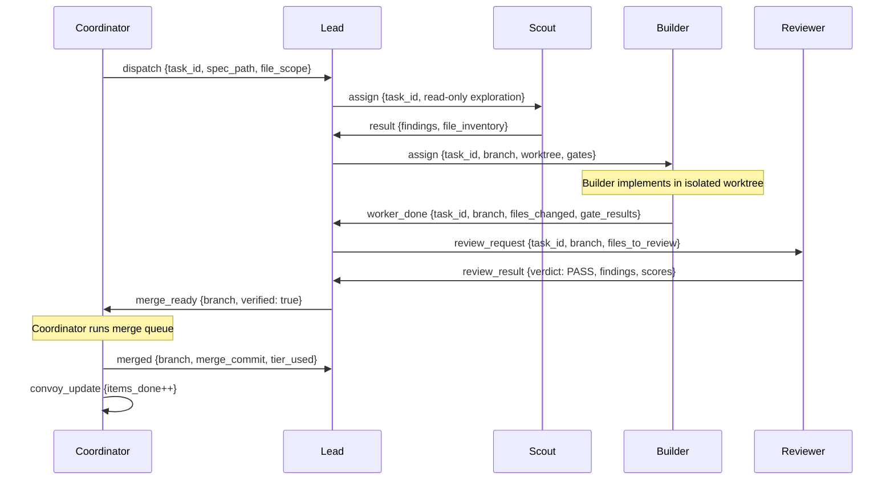
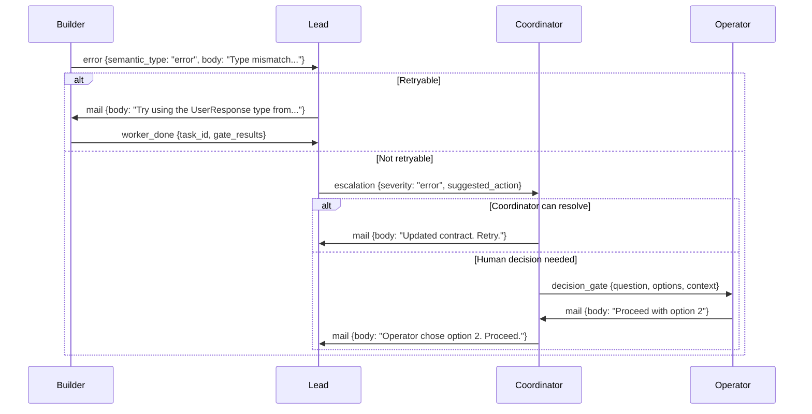
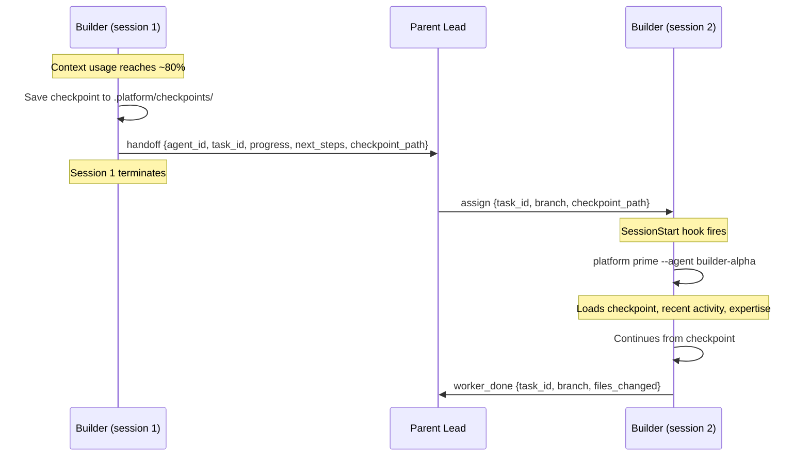
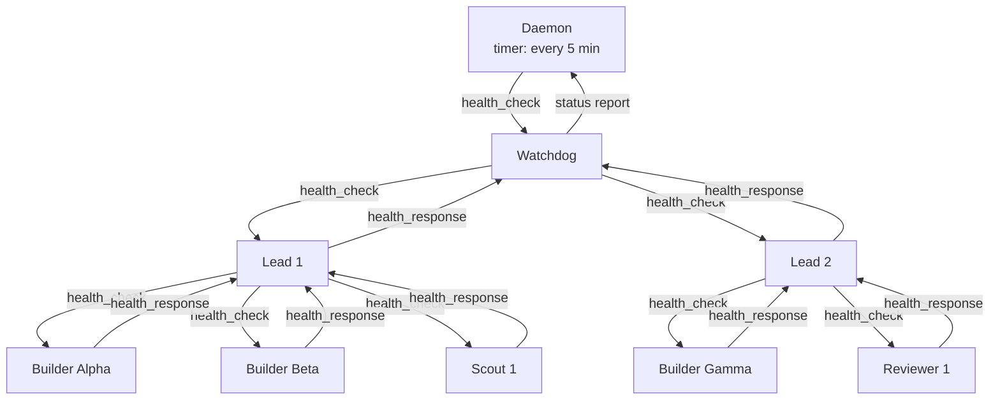

# 06 — Communication Model

**Document type:** Technical specification
**Status:** DRAFT
**Date:** 2026-03-18
**Scope:** Inter-agent communication system for the unified platform
**Prerequisites:** 01-product-charter.md, 05-platform-comparison.md

---

## 1. Communication Architecture Overview

### Why Persistent Messaging Matters

Agents crash. Sessions restart. Context windows fill up at 200K tokens and the agent must hand off. Model APIs go down mid-task. The fundamental reality of multi-agent systems is that **no session is permanent, but the work must continue.**

Without persistent messaging, any of these events severs communication. A builder that finishes its task while the coordinator is in a handoff has no way to report completion. A reviewer that finds a critical bug cannot escalate if the lead's session crashed. An error that occurs at 3 AM sits undelivered until a human notices.

Three source platforms converged on the same solution independently:

| Platform | Messaging System | Key Property |
|----------|-----------------|--------------|
| **Overstory** | SQLite WAL-mode mail.db | ~1-5ms queries, concurrent-safe for 10+ writers, typed protocol messages |
| **Gas Town** | Bead-backed persistent mail | Survives session restarts, stored in Dolt, nudge for real-time delivery |
| **ATSA** | Agent tool spawn + SendMessage | Context-window scoped, no persistence, circuit breaker on failure |

ATSA's approach is the weakest — ephemeral communication that dies with the session. The unified platform adopts the persistence model proven by Overstory and Gas Town.

### Why SQLite Mail

| Alternative | Why Not |
|-------------|---------|
| In-memory queues (Redis, RabbitMQ) | Requires a server process. Adds operational complexity. Single point of failure. |
| Filesystem (JSON files) | No concurrent-write safety. No queryability. Glob-based "inbox" is fragile. |
| LLM context passing (Agent tool) | Dies with the session. Not observable. Not queryable. Not runtime-neutral. |
| Dolt SQL | Slower (~50-200ms vs ~1-5ms). Heavier dependency. Better suited for work state than ephemeral messaging. |
| **SQLite WAL mode** | **Fast (~1-5ms). Concurrent-safe. Queryable. No server. Single file. Proven by Overstory at 10+ agents.** |

SQLite WAL (Write-Ahead Logging) mode allows multiple readers and one writer without blocking. In practice, with agent message volumes (dozens per minute, not thousands per second), multiple concurrent writers work reliably because write transactions are sub-millisecond.

### The Two-Channel Model

The platform uses two distinct communication channels, each solving a different problem:

```
┌─────────────────────────────────────────────────────────┐
│                  PERSISTENT CHANNEL                      │
│                                                          │
│   SQLite mail.db  ──  Durable, queryable, typed          │
│   Delivery: hook-driven injection into agent context     │
│   Survives: crashes, restarts, handoffs, model failures  │
│   Latency: next hook cycle (~seconds)                    │
│                                                          │
├─────────────────────────────────────────────────────────┤
│                  REAL-TIME CHANNEL                        │
│                                                          │
│   Nudge system  ──  Direct session injection             │
│   Delivery: tmux send-keys or RPC followUp               │
│   Survives: nothing (session-scoped)                     │
│   Latency: immediate                                     │
│   Purpose: wake stalled agents, trigger hook check        │
│                                                          │
└─────────────────────────────────────────────────────────┘
```

The persistent channel is the source of truth. The real-time channel is a notification mechanism — it tells agents to check their mail, not what the mail contains.

### The Injection Pattern

Agents do not poll for messages. Messages are injected into their context by shell hooks that fire on every interaction turn:

```
Agent receives input (user message or orchestrator turn)
  --> UserPromptSubmit hook fires automatically
    --> platform mail check --agent {name} --inject
      --> Queries mail.db for unread messages
      --> Formats as structured text block
      --> Injects into LLM context as prefixed content
  --> LLM processes: original input + injected mail
  --> LLM decides next action based on both
```

This is the architectural insight from Overstory that makes persistent messaging practical: **hooks convert pull-based messaging into push-based delivery without polling overhead.**

---

## 2. Message Bus Design

### Storage

A single SQLite database in WAL mode, located at the project root:

```
.platform/mail.db
```

WAL mode is set on database creation and provides:
- Multiple concurrent readers with zero blocking
- Single writer with sub-millisecond transaction times
- Crash recovery (WAL replay on next open)
- No server process required

### Mail Delivery Guarantees

The mail bus provides **at-least-once** delivery. Messages may be delivered more than once under failure conditions (e.g., hook fires, agent crashes before marking as read, hook fires again on respawn). Receivers must handle duplicate messages gracefully by checking `message_id` before acting on protocol messages.

| Property | Guarantee | Implementation |
|----------|-----------|----------------|
| **Delivery** | At-least-once | Messages persist in PostgreSQL; hook re-delivers unread messages on every turn |
| **Idempotency** | Receiver responsibility | Agents must check `id` field before processing — duplicate `worker_done` for the same `task_id` is a no-op |
| **Durable store** | PostgreSQL | All messages written to PostgreSQL as the source of truth |
| **Real-time notification** | Valkey Streams (The Airway) | Provides instant notification that new mail exists; not the durable store |
| **Degraded mode** | PostgreSQL polling | If The Airway (Valkey Streams) is temporarily unavailable, agents poll PostgreSQL directly — higher latency but fully functional |

The separation of concerns is deliberate: PostgreSQL guarantees durability and queryability, while Valkey Streams (The Airway) provides low-latency real-time notification. Neither depends on the other for correctness — The Airway is an optimization, not a requirement.

### Message Schema

```sql
CREATE TABLE messages (
    id TEXT PRIMARY KEY,
    thread_id TEXT,
    from_agent TEXT NOT NULL,
    to_agent TEXT NOT NULL,
    subject TEXT,
    body TEXT,
    priority TEXT CHECK (priority IN ('low', 'normal', 'high', 'urgent'))
        DEFAULT 'normal',
    semantic_type TEXT CHECK (semantic_type IN ('status', 'question', 'result', 'error')),
    protocol_type TEXT,
    payload JSON,
    read BOOLEAN DEFAULT FALSE,
    created_at TIMESTAMP DEFAULT CURRENT_TIMESTAMP,
    read_at TIMESTAMP
);

CREATE INDEX idx_messages_to_agent ON messages(to_agent, read, created_at);
CREATE INDEX idx_messages_thread ON messages(thread_id);
CREATE INDEX idx_messages_protocol ON messages(protocol_type);
CREATE INDEX idx_messages_from_agent ON messages(from_agent, created_at);
```

### Field Semantics

| Field | Purpose | Example |
|-------|---------|---------|
| `id` | Unique identifier | `msg-k7x9m2p4q1w3` (nanoid) |
| `thread_id` | Conversation threading — groups related messages | `thread-a8b2c4d6` |
| `from_agent` | Sender identity | `builder-alpha`, `coordinator` |
| `to_agent` | Recipient or broadcast group | `lead-1`, `@builders`, `@all` |
| `subject` | Human-readable summary | `Task wi-a1b2c3 complete` |
| `body` | Free-text message content | Detailed status, question, or result |
| `priority` | Delivery urgency | `urgent` triggers immediate nudge |
| `semantic_type` | Human-oriented category | `status`, `question`, `result`, `error` |
| `protocol_type` | Machine-readable message class | `worker_done`, `merge_ready`, `escalation` |
| `payload` | Structured JSON for protocol messages | `{"task_id": "wi-a1b2c3", "branch": "feat/auth"}` |
| `read` | Whether recipient has seen this message | `FALSE` until `mail read` or `--inject` |
| `created_at` | When the message was sent | ISO 8601 timestamp |
| `read_at` | When the message was read | `NULL` until read |

### Semantic Types vs Protocol Types

Messages have two type dimensions:

**Semantic types** are for human-oriented communication — an agent asking a question, reporting status, or sharing a result. Any agent can send any semantic type at any time.

**Protocol types** are machine-readable coordination signals with structured payloads. They drive the orchestration state machine. Protocol types are defined exhaustively in Section 3.

A message can have both: `semantic_type: "result"` with `protocol_type: "worker_done"` means "this is a result message that is specifically a worker completion signal."

---

## 3. Protocol Messages

Each protocol message type has a defined sender, recipient, payload schema, and trigger condition. These are the coordination primitives that drive the orchestration loop.

### Protocol Type Registry

| Protocol Type | Direction | Payload Schema | Trigger |
|---|---|---|---|
| `dispatch` | Coordinator --> Lead | DispatchPayload | Work decomposition complete |
| `assign` | Lead --> Builder | AssignPayload | Task delegation to worker |
| `worker_done` | Builder --> Lead | WorkerDonePayload | Implementation complete |
| `review_request` | Lead --> Reviewer | ReviewRequestPayload | Work needs verification |
| `review_result` | Reviewer --> Lead | ReviewResultPayload | Verification complete |
| `merge_ready` | Lead --> Coordinator | MergeReadyPayload | Branch verified, ready to land |
| `merged` | Coordinator --> Lead | MergedPayload | Branch successfully merged |
| `merge_failed` | Coordinator --> Lead | MergeFailedPayload | Merge could not complete |
| `escalation` | Any --> Parent | EscalationPayload | Problem exceeds agent scope |
| `health_check` | Watchdog --> Agent | HealthCheckPayload | Liveness probe |
| `health_response` | Agent --> Watchdog | HealthResponsePayload | Liveness confirmation |
| `decision_gate` | Any --> Coordinator | DecisionGatePayload | Human judgment required |
| `convoy_update` | Coordinator --> Fleet | ConvoyUpdatePayload | Multi-agent progress tracking |
| `handoff` | Agent --> Parent | HandoffPayload | Context exhaustion, continuation needed |
| `shutdown` | Coordinator --> @all | ShutdownPayload | Orderly system shutdown |

### Payload Schemas

**DispatchPayload** — Coordinator decomposes work and dispatches to a lead:

```json
{
  "task_id": "wi-a1b2c3",
  "spec_path": ".platform/specs/wi-a1b2c3.md",
  "file_scope": ["src/services/auth.ts", "src/middleware/jwt.ts"],
  "priority": "high",
  "convoy_id": "convoy-x7y8z9",
  "quality_gates": ["tests", "lint", "types"],
  "skip_scouts": false,
  "max_agents": 3
}
```

**AssignPayload** — Lead assigns a specific task to a builder:

```json
{
  "task_id": "wi-a1b2c3",
  "branch": "worker/builder-alpha/wi-a1b2c3",
  "worktree_path": ".platform/worktrees/builder-alpha",
  "spec_path": ".platform/specs/wi-a1b2c3.md",
  "file_scope": ["src/services/auth.ts", "src/middleware/jwt.ts"],
  "quality_gates": ["tests", "lint", "types"],
  "contract_ids": ["contract-api-auth-v1"]
}
```

**WorkerDonePayload** — Builder signals task completion:

```json
{
  "task_id": "wi-a1b2c3",
  "branch": "worker/builder-alpha/wi-a1b2c3",
  "files_changed": ["src/services/auth.ts", "src/services/auth.test.ts"],
  "tests_passed": true,
  "gate_results": {
    "tests": "pass",
    "lint": "pass",
    "types": "pass"
  },
  "evidence": {
    "test_output_path": ".platform/evidence/wi-a1b2c3/test-results.json",
    "screenshot_paths": []
  }
}
```

**ReviewRequestPayload** — Lead requests verification of completed work:

```json
{
  "task_id": "wi-a1b2c3",
  "branch": "worker/builder-alpha/wi-a1b2c3",
  "files_to_review": ["src/services/auth.ts", "src/services/auth.test.ts"],
  "contract_id": "contract-api-auth-v1",
  "review_type": "code",
  "cognitive_patterns": ["mckinley-boring", "kernighan-debugging"]
}
```

**ReviewResultPayload** — Reviewer delivers verdict:

```json
{
  "task_id": "wi-a1b2c3",
  "verdict": "PASS",
  "findings": [
    {
      "severity": "informational",
      "file": "src/services/auth.ts",
      "line": 42,
      "message": "Consider extracting token validation to a shared utility",
      "pattern": "kernighan-debugging"
    }
  ],
  "scores": {
    "contract_conformance": 5,
    "security": 4,
    "maintainability": 4,
    "test_coverage": 5,
    "design_quality": 4
  }
}
```

**MergeReadyPayload** — Lead certifies a branch for merging:

```json
{
  "branch": "worker/builder-alpha/wi-a1b2c3",
  "task_id": "wi-a1b2c3",
  "verified": true,
  "review_result_id": "msg-r3v1ew123",
  "files_changed": ["src/services/auth.ts", "src/services/auth.test.ts"],
  "agent_name": "builder-alpha"
}
```

**MergedPayload** — Coordinator confirms successful merge:

```json
{
  "branch": "worker/builder-alpha/wi-a1b2c3",
  "task_id": "wi-a1b2c3",
  "merge_commit": "a1b2c3d4e5f6",
  "tier_used": 1,
  "conflict_files": []
}
```

**MergeFailedPayload** — Coordinator reports merge failure:

```json
{
  "branch": "worker/builder-alpha/wi-a1b2c3",
  "task_id": "wi-a1b2c3",
  "conflict_files": ["src/services/auth.ts"],
  "tier_attempted": 2,
  "error_message": "Conflicting changes in auth service — both builder-alpha and builder-beta modified the same function",
  "suggested_action": "reimagine"
}
```

**EscalationPayload** — Any agent reports a problem beyond its scope:

```json
{
  "issue": "Builder cannot resolve type mismatch between auth contract and user service contract",
  "context": "The UserResponse type in contract-api-auth-v1 expects 'email' but contract-api-users-v1 returns 'emailAddress'",
  "severity": "error",
  "task_id": "wi-a1b2c3",
  "suggested_action": "Update one of the contracts to align field names"
}
```

**HealthCheckPayload** — Watchdog probes agent liveness:

```json
{}
```

**HealthResponsePayload** — Agent confirms it is alive and reports status:

```json
{
  "status": "working",
  "current_task": "wi-a1b2c3",
  "progress_pct": 65,
  "last_action": "Implementing password hashing in src/services/auth.ts",
  "estimated_remaining_minutes": 8
}
```

**DecisionGatePayload** — Agent requests human decision:

```json
{
  "question": "The existing codebase uses REST but the spec requests GraphQL. Which should we use?",
  "options": ["Proceed with REST (matches existing patterns)", "Switch to GraphQL (matches spec)", "Implement both with adapter pattern"],
  "context": "3 existing services use REST. New spec explicitly requests GraphQL. Migration cost is ~4 hours.",
  "deadline": "2026-03-18T18:00:00Z",
  "task_id": "wi-d4e5f6"
}
```

**ConvoyUpdatePayload** — Coordinator broadcasts progress on multi-agent efforts:

```json
{
  "convoy_id": "convoy-x7y8z9",
  "title": "User Authentication Feature",
  "status": "active",
  "items_done": 3,
  "items_total": 7,
  "items_in_progress": ["wi-a1b2c3", "wi-d4e5f6"],
  "items_completed": ["wi-g7h8i9", "wi-j1k2l3", "wi-m4n5o6"],
  "estimated_completion": "2026-03-18T16:00:00Z"
}
```

**HandoffPayload** — Agent checkpoints before context exhaustion:

```json
{
  "agent_id": "builder-alpha",
  "task_id": "wi-a1b2c3",
  "branch": "feat/user-auth",
  "progress": "step 3 of 7 complete",
  "next_steps": ["implement password hashing", "add rate limiting"],
  "files_modified": ["src/auth.ts", "src/middleware.ts"],
  "context_summary": "Implementing user auth. Login endpoint done, registration endpoint done, need password hashing next.",
  "checkpoint_path": ".platform/checkpoints/builder-alpha-wi-a1b2c3.json"
}
```

**ShutdownPayload** — Coordinator orders system shutdown:

```json
{
  "reason": "All convoy items landed. Build complete.",
  "graceful": true,
  "checkpoint_required": true,
  "timeout_seconds": 60
}
```

---

## 4. Broadcast Groups

Messages can be addressed to broadcast groups that resolve to multiple agents at delivery time. Group membership is determined by querying the active sessions database.

### Group Registry

| Group | Members | Resolution Query | Use Case |
|---|---|---|---|
| `@all` | Every active agent | `SELECT name FROM sessions WHERE status = 'active'` | System announcements, shutdown |
| `@builders` | All builder-role agents | `WHERE capability = 'builder' AND status = 'active'` | Build-wide instructions, dependency alerts |
| `@leads` | All lead-role agents | `WHERE capability = 'lead' AND status = 'active'` | Coordination updates, merge queue status |
| `@scouts` | All scout-role agents | `WHERE capability = 'scout' AND status = 'active'` | Research coordination, findings sharing |
| `@reviewers` | All reviewer-role agents | `WHERE capability = 'reviewer' AND status = 'active'` | Review queue updates, standard changes |
| `@project:{name}` | All agents in a specific project | `WHERE project = '{name}' AND status = 'active'` | Project-scoped broadcasts |

### Broadcast Delivery

When a message is sent to a broadcast group, the system:

1. Resolves the group to a list of active agent names
2. Inserts one message row per recipient (with shared `thread_id`)
3. Each recipient receives the message via their normal hook injection

```bash
# Send announcement to all agents
platform mail send --to @all --subject "Dependency update" \
  --body "Package @auth/core updated to v2.0. Rebuild if you import it." \
  --priority high

# Notify all builders of a contract change
platform mail send --to @builders --subject "Contract updated" \
  --body "contract-api-auth-v1 field 'email' renamed to 'emailAddress'" \
  --protocol-type contract_update \
  --priority urgent
```

---

## 5. Hook-Driven Injection

The injection pattern is the architectural centerpiece of the communication system. It converts persistent messages into context-window content without polling, background threads, or daemon processes.

### Hook Configuration

When an agent is spawned, hooks are deployed to its worktree:

```json
{
  "hooks": {
    "SessionStart": [
      {
        "command": "platform prime --agent builder-alpha",
        "timeout": 10000
      }
    ],
    "UserPromptSubmit": [
      {
        "command": "platform mail check --agent builder-alpha --inject",
        "timeout": 5000
      }
    ]
  }
}
```

### SessionStart Hook

Fires once when the agent session begins. Loads the agent's full operational context:

```bash
platform prime --agent builder-alpha
```

This command queries multiple databases and outputs a structured context block:

```
=== AGENT CONTEXT: builder-alpha ===

Role: builder
Project: user-auth-service
Worktree: .platform/worktrees/builder-alpha
Branch: worker/builder-alpha/wi-a1b2c3
Parent: lead-1

Active Task: wi-a1b2c3 — Implement user authentication
Spec: .platform/specs/wi-a1b2c3.md
File Scope: src/services/auth.ts, src/middleware/jwt.ts
Quality Gates: tests, lint, types
Contracts: contract-api-auth-v1

Recent Activity:
  - 2 unread messages in inbox
  - Last checkpoint: step 3 of 7 complete (12 min ago)

Expertise (from mulch):
  - auth patterns: JWT validation, bcrypt hashing
  - project conventions: barrel exports, Zod schemas for validation

=== END CONTEXT ===
```

### UserPromptSubmit Hook

Fires on every turn of the agent's conversation. Checks for and injects unread mail:

```bash
platform mail check --agent builder-alpha --inject
```

If unread messages exist, outputs them as a structured text block that gets injected into the LLM's context:

```
=== INCOMING MAIL (2 unread) ===

[URGENT] From: lead-1 | Subject: Contract field renamed
  The auth contract field 'email' has been renamed to 'emailAddress'.
  Update your implementation to match.
  (protocol: contract_update | thread: thread-c4d5e6)

[NORMAL] From: coordinator | Subject: Convoy progress
  User Auth convoy: 3/7 items complete. You are working on item 4.
  (protocol: convoy_update | thread: thread-a1b2c3)

=== END MAIL ===
```

If no unread messages exist, the hook outputs nothing (zero tokens injected).

### The Orchestrator Loop

The orchestrator is the primary consumer of injected mail. Its loop:

```
┌──────────────────────────────────────────────────────┐
│                                                       │
│   Operator sends message (or orchestrator self-turns) │
│              │                                        │
│              v                                        │
│   UserPromptSubmit hook fires                         │
│              │                                        │
│              v                                        │
│   platform mail check --inject                        │
│              │                                        │
│              ├── worker_done from builder-alpha        │
│              ├── escalation from builder-beta          │
│              └── merge_ready from lead-1               │
│              │                                        │
│              v                                        │
│   LLM processes: operator message + injected mail     │
│              │                                        │
│              ├──> platform sling (spawn new agent)     │
│              ├──> platform mail send (reply to agent)  │
│              ├──> platform merge (land verified work)  │
│              ├──> platform status (check fleet)        │
│              └──> platform mail send (answer question) │
│              │                                        │
│              v                                        │
│   Wait for next input (operator or self-turn)         │
│              │                                        │
└──────────────┘                                        │
                                                        │
```

### Injection Formatting Rules

Messages are formatted for minimal token consumption while preserving all actionable information:

1. **Priority indicator** — `[URGENT]`, `[HIGH]`, `[NORMAL]`, `[LOW]`
2. **Sender and subject** — one line, human-readable
3. **Body** — indented, truncated to 500 chars for non-protocol messages
4. **Protocol metadata** — parenthetical on last line
5. **Urgent messages** — sorted first regardless of timestamp
6. **Max injection** — 20 messages per hook cycle; remainder noted as "and N more unread"

---

## 6. Nudge System

The nudge system provides real-time intervention for stalled agents. It is the complement to persistent mail: where mail waits for the next hook cycle, nudges interrupt immediately.

### Progressive Escalation

Stalled agent detection triggers a four-level escalation:

```
┌─────────────────────────────────────────────────────┐
│  Level 0: WARN                                       │
│  Action: Log warning to event store                  │
│  Effect: No intervention. Monitoring only.           │
│  Trigger: Agent idle > staleThresholdMs (5 min)      │
│                                                      │
│         │  (nudgeIntervalMs passes, still stalled)   │
│         v                                            │
│  Level 1: NUDGE                                      │
│  Action: Send text to agent's session                │
│  Effect: Agent's GUPP prompting triggers hook check  │
│  Trigger: Level 0 + nudgeIntervalMs (1 min)          │
│                                                      │
│         │  (nudgeIntervalMs passes, still stalled)   │
│         v                                            │
│  Level 2: ESCALATE                                   │
│  Action: Send escalation mail to parent agent        │
│  Effect: Parent decides: retry, reassign, or ask     │
│  Trigger: Level 1 + nudgeIntervalMs (1 min)          │
│                                                      │
│         │  (nudgeIntervalMs passes, still stalled)   │
│         v                                            │
│  Level 3: TERMINATE                                  │
│  Action: Kill agent process, mark as zombie          │
│  Effect: Parent reassigns work to new agent          │
│  Trigger: Level 2 + zombieThresholdMs (10 min)       │
│                                                      │
└─────────────────────────────────────────────────────┘
```

### Nudge Delivery by Runtime

Different LLM runtimes have different injection mechanisms:

| Runtime | Delivery Mechanism | Command |
|---------|-------------------|---------|
| Claude Code | tmux send-keys | `tmux send-keys -t {session} "{text}" Enter` |
| Pi (Inflection) | RPC followUp | `runtime.followUp("{text}")` via JSON-RPC 2.0 stdin/stdout |
| Gemini | tmux send-keys | Same as Claude Code |
| Codex (OpenAI) | Not supported | Headless runtime, rely on mail only |
| Sapling | Not supported | Headless runtime, rely on mail only |
| Cursor | Not supported | IDE-integrated, no tmux session |

For runtimes that do not support nudge, the watchdog skips Level 1 and escalates directly from Level 0 to Level 2.

### The GUPP Principle

Gas Town discovered that nudge content is irrelevant. What matters is the act of nudging — it triggers the agent's UserPromptSubmit hook, which runs `mail check --inject`, which surfaces pending work.

The platform adopts this principle: **agents are instructed to check their hook on any input, including nudges.** The nudge text is a courtesy, not a command.

```bash
# Nudge a specific agent
platform nudge builder-alpha "Status check — are you blocked?"

# Force nudge (skip debounce timer)
platform nudge builder-alpha --force

# Nudge all agents in a group
platform nudge @builders "Dependency updated — check your mail"
```

### Nudge CLI

```bash
# Basic nudge
platform nudge <agent-name> [message]

# Options
--force              # Skip debounce (default: 60s between nudges to same agent)
--level <0-3>        # Override escalation level
--reason <text>      # Logged reason for the nudge

# Examples
platform nudge builder-alpha "Check your mail"
platform nudge builder-alpha --force --reason "watchdog detected stall"
platform nudge @all "System update — check mail for details"
```

---

## 7. Message Flow Diagrams

### Standard Work Lifecycle



### Error Escalation Flow



### Handoff Flow (Context Exhaustion)



---

## 8. Convoy Coordination

Convoys group related work items into a trackable unit of delivery. They answer the question "what is the status of Feature X?" when Feature X spans 7 work items across 4 agents.

### Convoy Lifecycle

```
Created ──> Active ──> Landed
               │
               └──> Failed (if items cannot complete)
```

A convoy transitions to `active` when its first work item begins. It transitions to `landed` when all work items are complete and merged. If any work item is permanently blocked, the convoy transitions to `failed` with a reason.

### Convoy Schema

```sql
CREATE TABLE convoys (
    id TEXT PRIMARY KEY,
    title TEXT NOT NULL,
    status TEXT CHECK (status IN ('created', 'active', 'landed', 'failed'))
        DEFAULT 'created',
    created_by TEXT NOT NULL,
    created_at TIMESTAMP DEFAULT CURRENT_TIMESTAMP,
    landed_at TIMESTAMP,
    notify_on_land BOOLEAN DEFAULT TRUE,
    notify_operator BOOLEAN DEFAULT FALSE
);

CREATE TABLE convoy_items (
    convoy_id TEXT NOT NULL REFERENCES convoys(id),
    work_item_id TEXT NOT NULL,
    status TEXT CHECK (status IN ('pending', 'in_progress', 'done', 'failed'))
        DEFAULT 'pending',
    assigned_agent TEXT,
    completed_at TIMESTAMP,
    PRIMARY KEY (convoy_id, work_item_id)
);
```

### Convoy CLI

```bash
# Create a convoy from work items
platform convoy create "User Authentication" wi-a1b2c3 wi-d4e5f6 wi-g7h8i9 \
  --notify --notify-operator

# List active convoys
platform convoy list
# Output:
# CONVOY-ID     STATUS   PROGRESS  TITLE
# convoy-x7y8z9 active   3/7       User Authentication
# convoy-p4q5r6 created  0/3       API Rate Limiting

# Show convoy details
platform convoy show convoy-x7y8z9
# Output:
# Convoy: User Authentication (convoy-x7y8z9)
# Status: active | Created: 2026-03-18T10:00:00Z
# Progress: 3/7 items complete
#
# WORK ITEM     STATUS       AGENT           COMPLETED
# wi-g7h8i9     done         builder-alpha   2026-03-18T11:23:00Z
# wi-j1k2l3     done         builder-beta    2026-03-18T11:45:00Z
# wi-m4n5o6     done         builder-alpha   2026-03-18T12:10:00Z
# wi-a1b2c3     in_progress  builder-gamma   —
# wi-d4e5f6     in_progress  builder-delta   —
# wi-p7q8r9     pending      —               —
# wi-s1t2u3     pending      —               —

# Add items to existing convoy
platform convoy add convoy-x7y8z9 wi-v4w5x6

# Launch all pending items (auto-spawn agents)
platform convoy launch convoy-x7y8z9
```

### Convoy Notifications

When a convoy lands (all items complete), the system:

1. Sends `convoy_update` with `status: "landed"` to all participating agents
2. If `notify_operator` is true, sends a `decision_gate` message to the coordinator for operator notification
3. Records the convoy completion in the event store with total duration and agent breakdown

---

## 9. Handoff Protocol

When an agent's context fills, work must transfer to a fresh session without loss. The handoff protocol ensures continuity across session boundaries.

### Context Pressure Detection

Agents monitor their own context usage. When token consumption reaches approximately 80% of the context window, the agent initiates handoff:

1. **Stop new work** — do not start the next step
2. **Complete current atomic action** — finish the current file write or test run
3. **Checkpoint** — save state to a structured file

### Checkpoint Schema

```json
{
  "version": 1,
  "agent_id": "builder-alpha",
  "task_id": "wi-a1b2c3",
  "branch": "feat/user-auth",
  "worktree_path": ".platform/worktrees/builder-alpha",
  "created_at": "2026-03-18T14:30:00Z",
  "progress": {
    "current_step": 3,
    "total_steps": 7,
    "description": "Login and registration endpoints implemented. Password hashing next."
  },
  "next_steps": [
    "Implement bcrypt password hashing in src/services/auth.ts",
    "Add rate limiting middleware for auth endpoints",
    "Write integration tests for the full auth flow",
    "Run quality gates and fix any failures"
  ],
  "files_modified": [
    "src/services/auth.ts",
    "src/middleware/jwt.ts",
    "src/routes/auth.routes.ts",
    "src/services/auth.test.ts"
  ],
  "files_created": [
    "src/routes/auth.routes.ts"
  ],
  "context_summary": "Implementing user authentication per contract-api-auth-v1. Login endpoint (POST /auth/login) returns JWT. Registration endpoint (POST /auth/register) creates user with email validation. Both pass lint and type checking. Tests cover happy path only — need adversarial tests.",
  "decisions_made": [
    "Using bcrypt over argon2 (project convention from mulch)",
    "JWT expiry set to 15 minutes with refresh token pattern",
    "Email validation using Zod schema, not regex"
  ],
  "blockers": [],
  "git_status": {
    "staged_files": [],
    "unstaged_changes": ["src/services/auth.ts"],
    "last_commit": "a1b2c3d — Add registration endpoint"
  }
}
```

### Handoff Sequence

```bash
# 1. Agent saves checkpoint
platform checkpoint save --agent builder-alpha --task wi-a1b2c3

# 2. Agent sends handoff mail to parent
platform mail send --to lead-1 \
  --subject "Handoff: builder-alpha context exhaustion" \
  --protocol-type handoff \
  --payload '{"agent_id":"builder-alpha","task_id":"wi-a1b2c3","checkpoint_path":".platform/checkpoints/builder-alpha-wi-a1b2c3.json"}'

# 3. Agent session terminates

# 4. Parent spawns new session for the same agent identity
platform sling wi-a1b2c3 --agent builder-alpha \
  --checkpoint .platform/checkpoints/builder-alpha-wi-a1b2c3.json

# 5. New session starts, SessionStart hook loads checkpoint
# 6. New session continues from checkpoint
```

### Séance Handoff Protocol

A checkpoint file alone is insufficient for reliable context transfer. Static summaries inevitably omit nuance — half-formed hypotheses, rejected approaches, implicit assumptions about code structure. The séance protocol addresses this by making the handoff conversational rather than documentary.

**How it works:**

1. When a Worker's context window approaches capacity (~80%), it writes a checkpoint file as described above
2. The Worker sends a `handoff` message to its parent and terminates
3. The parent spawns a **new session** for the same agent identity in the same sandbox
4. The new session starts by **resuming the previous session's conversation** — it receives the checkpoint file plus an `inject` message containing a prompt to query unresolved items
5. The new session explicitly asks questions about the previous session's state **before** proceeding with implementation

**The inject message template:**

```
You are continuing work from a previous session that exhausted its context.

Checkpoint: {checkpoint_path}
Previous session completed: {progress_summary}
Remaining work: {next_steps}

BEFORE continuing implementation, review the checkpoint and identify:
1. Any decisions that seem incomplete or ambiguous
2. Any "next steps" that lack sufficient context to execute
3. Any files that were modified but may have uncommitted partial changes

If the previous session is still accessible (within the séance window),
query it directly about unresolved items. Do not guess — ask.
```

**Why séance, not just checkpoint:** The checkpoint captures what was done and what remains. The séance captures *why* — the reasoning behind decisions, the approaches that were tried and rejected, the edge cases that were discovered but not yet addressed. This prevents the new session from re-exploring dead ends or making contradictory decisions.

**Implementation:** The séance is implemented via the `inject` message type. When the platform detects a handoff-triggered spawn, it composes the inject message from the checkpoint data and delivers it as part of the SessionStart hook output, before the agent's first turn.

### Checkpoint Storage

Checkpoints are stored at:

```
.platform/checkpoints/{agent_id}-{task_id}.json
```

They are retained until the task is complete and merged, then archived to the evidence store. The last 5 checkpoints per agent are kept for debugging handoff issues.

---

## 10. Heartbeat Cascade

The heartbeat system ensures that stalled or crashed agents are detected and remediated within minutes. It uses a cascading supervision hierarchy where each level monitors the level below.

### Cascade Architecture



### Cascade Sequence

```
1. Daemon fires on timer (configurable, default 5 minutes)
   │
2. Daemon sends health_check to Watchdog
   │
   ├── Watchdog checks all Leads
   │   │
   │   ├── Lead 1 checks its workers (builders, scouts, reviewers)
   │   │   ├── Builder-alpha responds: {status: "working", progress: 65%}
   │   │   ├── Builder-beta responds: {status: "working", progress: 30%}
   │   │   └── Scout-1: NO RESPONSE → Level 0 (warn)
   │   │
   │   └── Lead 2 checks its workers
   │       ├── Builder-gamma responds: {status: "idle"}
   │       └── Reviewer-1 responds: {status: "working", progress: 90%}
   │
3. Watchdog aggregates responses
   │
4. Non-responders enter escalation ladder:
   │
   ├── First miss: Level 0 (warn, log it)
   ├── Second miss: Level 1 (nudge via tmux)
   ├── Third miss: Level 2 (escalation mail to parent)
   └── Fourth miss: Level 3 (terminate, reassign)
```

### Watchdog Configuration

```yaml
watchdog:
  enabled: true
  daemon_interval_ms: 300000      # 5 minutes between cascade runs
  stale_threshold_ms: 300000      # 5 minutes with no activity = stale
  zombie_threshold_ms: 600000     # 10 minutes with no response = zombie
  nudge_interval_ms: 60000        # 1 minute between escalation levels
  max_escalation_level: 3         # 0=warn, 1=nudge, 2=escalate, 3=terminate
  tier1_ai_triage: true           # Use AI to assess ambiguous stalls
```

### Three-Tier Watchdog (from Overstory)

| Tier | Method | When Used | Cost |
|------|--------|-----------|------|
| **Tier 0: Mechanical** | Check process alive, tmux alive, last activity timestamp | Every cascade cycle | Free |
| **Tier 1: AI Triage** | Capture tmux output, send to headless LLM for classification | When Tier 0 is ambiguous (alive but no progress) | ~$0.02 per assessment |
| **Tier 2: Monitor Agent** | Persistent Claude Code session analyzing fleet patterns | Continuous, for systemic issues | Session cost |

Tier 1 AI Triage handles the ambiguous case: the agent's process is alive and the tmux session exists, but there has been no tool call in 5 minutes. Is it stuck, or is it thinking about a complex architectural decision? The triage LLM reads the last 50 lines of tmux output and classifies:

- **working** — agent is actively reasoning, leave it alone
- **stuck** — agent is in a loop or waiting for input, nudge it
- **errored** — agent hit an error and stopped, escalate
- **completed** — agent finished but did not signal, prompt it to send worker_done

---

## 11. Mail CLI Reference

### Sending Messages

```bash
# Simple message
platform mail send \
  --to lead-1 \
  --subject "Task complete" \
  --body "All quality gates passed. Branch ready for review."

# Protocol message with payload
platform mail send \
  --to lead-1 \
  --subject "Task wi-a1b2c3 complete" \
  --protocol-type worker_done \
  --payload '{"task_id":"wi-a1b2c3","branch":"worker/builder-alpha/wi-a1b2c3","files_changed":["src/auth.ts"],"tests_passed":true,"gate_results":{"tests":"pass","lint":"pass"}}' \
  --priority normal

# Urgent message
platform mail send \
  --to @all \
  --subject "System shutdown in 60 seconds" \
  --protocol-type shutdown \
  --payload '{"reason":"Operator requested","graceful":true,"timeout_seconds":60}' \
  --priority urgent

# Reply in thread
platform mail reply msg-k7x9m2p4q1w3 \
  --body "Use REST. It matches the existing patterns in this codebase."

# Broadcast to group
platform mail send \
  --to @builders \
  --subject "New contract version published" \
  --body "contract-api-auth-v2 is now the canonical version. Update imports."
```

### Checking Mail

```bash
# Check inbox (human-readable)
platform mail check --agent builder-alpha
# Output:
# 3 unread messages for builder-alpha
#
# [URGENT] From: lead-1 | Subject: Contract field renamed
#   The auth contract field 'email' has been renamed to 'emailAddress'.
#   (protocol: contract_update | 2 min ago)
#
# [NORMAL] From: coordinator | Subject: Convoy progress
#   User Auth convoy: 3/7 items complete.
#   (protocol: convoy_update | 15 min ago)
#
# [LOW] From: scout-1 | Subject: Dependency note
#   FYI: bcrypt v5.1 has a known issue with Alpine Linux.
#   (semantic: status | 1 hr ago)

# Check and inject into LLM context (used by hooks)
platform mail check --agent builder-alpha --inject

# Check with filters
platform mail check --agent builder-alpha --unread --priority urgent
platform mail check --agent builder-alpha --protocol-type worker_done
platform mail check --agent builder-alpha --from lead-1
```

### Reading and Managing

```bash
# Mark as read
platform mail read msg-k7x9m2p4q1w3

# List messages with filters
platform mail list --agent builder-alpha --unread
platform mail list --from coordinator --since "1 hour ago"
platform mail list --protocol-type escalation --unread
platform mail list --thread thread-a1b2c3

# Count unread
platform mail count --agent builder-alpha
# Output: 3

# Purge old messages
platform mail purge --older-than 7d           # Messages older than 7 days
platform mail purge --agent old-builder-1      # All messages for decommissioned agent
platform mail purge --read --older-than 1d     # Read messages older than 1 day
```

### Mail in Scripts

```bash
# Check if agent has unread urgent mail (exit code 0 = yes, 1 = no)
platform mail has --agent builder-alpha --priority urgent

# Get payload as JSON (for scripting)
platform mail get msg-k7x9m2p4q1w3 --format json

# Pipe payload to another command
platform mail get msg-k7x9m2p4q1w3 --field payload | jq '.task_id'
```

---

## 12. Security Considerations

### Threat Model

The communication system operates in a **single-user, local-machine** context. The threat model is:

| Threat | Risk Level | Mitigation |
|--------|-----------|------------|
| Network interception | None | All communication is local (SQLite file, tmux sessions) |
| Agent impersonation | Low | Session identity verified by matching agent name to spawned session PID |
| Message tampering | Low | SQLite WAL provides atomic writes; no inter-message dependencies |
| Information leakage | Low | mail.db is a local file with user-only permissions (0600) |
| Denial of service | Low | Rate limiting on mail send (100 messages/minute per agent) |
| Replay attacks | None | Messages are idempotent; replaying a worker_done is harmless |

### Current Security Measures

1. **File permissions** — `mail.db` created with mode 0600 (owner read/write only)
2. **Agent identity** — `from_agent` field validated against active session registry
3. **Broadcast resolution** — only active, authenticated sessions receive broadcasts
4. **Payload validation** — protocol payloads are validated against schemas before insertion
5. **No credential storage** — mail never contains API keys, tokens, or passwords

### Future Security (Multi-User)

When federation or multi-user access is added:

- **Encryption at rest** — AES-256-GCM encryption of mail.db
- **Signed messages** — Ed25519 signatures on protocol messages to prevent impersonation
- **Access control** — per-agent read/write permissions on messages
- **Audit log** — immutable record of all message operations
- **Sovereignty tiers** — T1 (public) through T4 (anonymous) per Gas Town's Wasteland model

---

## 13. Implementation Notes

### Database Initialization

```sql
-- Enable WAL mode (set once, persists)
PRAGMA journal_mode = WAL;

-- Optimize for concurrent access
PRAGMA busy_timeout = 5000;
PRAGMA synchronous = NORMAL;

-- Enable foreign keys
PRAGMA foreign_keys = ON;
```

### Message Ordering Guarantees

- Messages are ordered by `created_at` timestamp within a thread
- No global ordering guarantee across threads
- Priority affects injection ordering (urgent first), not storage ordering
- Thread ordering is sufficient for all coordination patterns

### Performance Characteristics

| Operation | Expected Latency | Measured By |
|-----------|-----------------|-------------|
| Send message | <2ms | Overstory production use |
| Check inbox (unread) | <5ms | Indexed query on to_agent + read |
| Broadcast resolution | <10ms | Session table query + N inserts |
| Full inbox list | <20ms | Paginated query with filters |
| Purge (batch delete) | <50ms | Single DELETE with WHERE clause |

### Capacity Planning

At 30 concurrent agents sending ~2 messages per minute each:
- **Write rate**: ~60 messages/minute (~1/second)
- **Read rate**: ~60 checks/minute (one per agent per turn)
- **Storage**: ~1KB per message, ~86K messages/day, ~86MB/day
- **Purge policy**: Read messages older than 24 hours, unread older than 7 days

SQLite handles this volume trivially. The database will never be the bottleneck.

### Error Handling

| Failure | Behavior |
|---------|----------|
| mail.db locked (write contention) | Retry with exponential backoff, max 3 attempts |
| mail.db corrupted | Rebuild from WAL, alert operator |
| Hook timeout (>5s) | Skip injection for this turn, log warning |
| Agent not found in session registry | Reject send with error, log warning |
| Payload schema validation failure | Reject send with error, return validation details |
| Broadcast group resolves to zero members | Send succeeds with zero deliveries, log info |

---

## 14. Relationship to Other Specifications

| Specification | Relationship |
|---------------|-------------|
| **01-product-charter.md** | Section 3.6 (Persistent Agent Identity) and Section 6.5 (Self-Healing) depend on the communication system |
| **02-system-architecture.md** | Layer 4 (Execution) includes the mail system as a core service |
| **05-platform-comparison.md** | Cross-platform communication comparison informs this design |
| **07-merge-system.md** | Merge queue coordination uses `merge_ready`, `merged`, and `merge_failed` protocol messages |
| **08-watchdog-system.md** | Watchdog uses `health_check` and `health_response` protocol messages, plus the nudge system |
| **09-agent-lifecycle.md** | Agent spawning deploys hooks; handoff uses checkpoint + `handoff` protocol message |

---

*This document specifies the HOW of inter-agent communication. The WHAT (protocol message semantics) is driven by the orchestration state machine in `02-system-architecture.md`. The WHEN (hook timing, nudge intervals) is configured per-project in `config.yaml`.*
