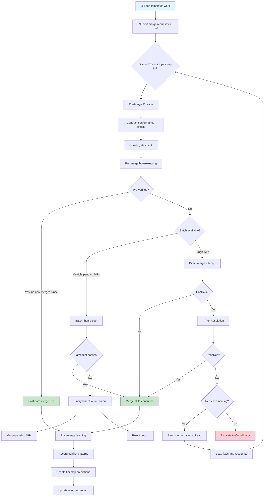
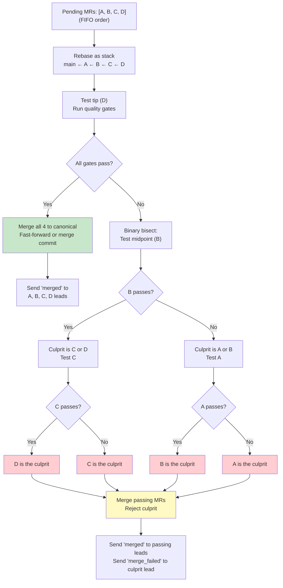
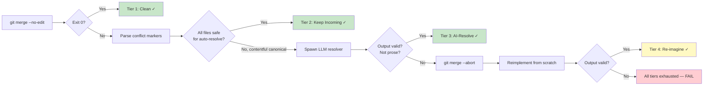
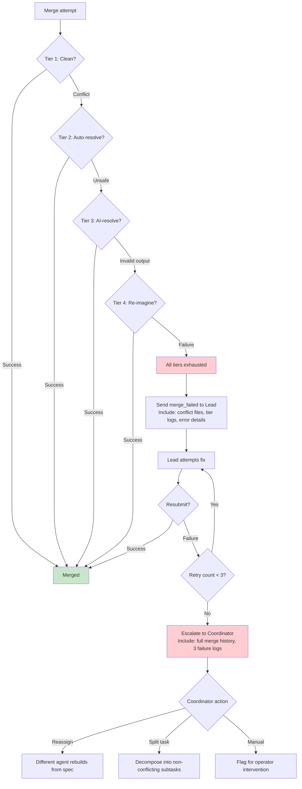

# 07 — Merge System

**Document type:** System specification
**Status:** DRAFT
**Date:** 2026-03-18
**Scope:** Branch integration, conflict resolution, and merge queue for the unified platform
**Depends on:** `01-product-charter.md` (vision), `05-platform-comparison.md` (source platform analysis)
**Source platforms:** Gas Town Refinery (batch-then-bisect), Overstory (4-tier resolution), ATSA (contract-first prevention)

---

## 1. Merge Philosophy

### Why Merging Is Hard in Multi-Agent Systems

When 30 agents work on the same codebase in parallel, their branches diverge from canonical and from each other. The longer branches live, the more they diverge. The more they diverge, the harder they are to merge. This is not a new problem — CI systems have fought it for decades. What is new is the volume: 30 branches completing per hour instead of 30 per week.

### Five Principles

**1. Prevention over resolution.** File ownership prevents MOST conflicts. No two agents can own the same file. If agent A owns `src/api/routes.ts` and agent B owns `src/ui/App.tsx`, their branches will never conflict on implementation files. The merge system handles the remaining conflicts — state files, shared configs, generated files, and the rare ownership violation.

**2. Keep incoming by default.** Agent work IS the new work. When an agent's changes conflict with canonical, the agent's intent usually wins — someone asked for that work to be done. But safety checks prevent data loss: if canonical has substantive content that would be silently discarded, the system escalates to a higher resolution tier instead of overwriting.

**3. FIFO queue, not priority.** First-done, first-merged. This is simpler than priority-based merging and avoids starvation. Earlier completions tend to be simpler and less conflict-prone. The canonical branch stays maximally up-to-date for later merges, reducing cumulative drift.

**4. Escalate, don't block.** When automated resolution fails, the system tries the next tier. When all tiers fail, it escalates to a lead. When the lead fails, it escalates to the coordinator. The pipeline never stalls waiting for human intervention on a single merge — other branches continue processing.

**5. Learn from history.** Every merge outcome is recorded. Conflict patterns that consistently fail at lower tiers are automatically skipped. Past successful resolutions are injected into AI prompts. The merge system gets smarter over time.

---

## 2. Merge Queue Architecture

### Queue Processor Role

The Queue Processor is a persistent agent — one per project — that owns the merge queue. It is the equivalent of Gas Town's Refinery and Overstory's merge queue processor. It runs continuously, processing merge requests in FIFO order.

**Responsibilities:**
- Accept merge requests from builders via mail protocol
- Validate pre-merge requirements (contracts, quality gates)
- Execute the batch-then-bisect algorithm
- Invoke 4-tier conflict resolution when needed
- Report results to leads via mail protocol
- Record merge outcomes to the expertise store

**Lifecycle:** Persistent. Survives session crashes via checkpoint. Respawned by the monitor if it goes down.

### Merge Request Schema

```sql
CREATE TABLE merge_requests (
    id              TEXT PRIMARY KEY,        -- UUID
    branch          TEXT NOT NULL,            -- e.g. 'worker/builder-alpha/task-0042'
    agent_id        TEXT NOT NULL,            -- e.g. 'builder-alpha'
    work_item_id    TEXT,                     -- link to work graph
    status          TEXT NOT NULL DEFAULT 'pending'
                    CHECK (status IN (
                        'pending',           -- waiting in queue
                        'validating',        -- running pre-merge checks
                        'merging',           -- merge in progress
                        'merged',            -- successfully landed on canonical
                        'conflict',          -- conflict detected, resolution in progress
                        'failed',            -- all resolution tiers exhausted
                        'rejected'           -- pre-merge validation failed
                    )),
    submitted_at    TIMESTAMP NOT NULL DEFAULT CURRENT_TIMESTAMP,
    validated_at    TIMESTAMP,               -- when pre-merge checks completed
    processed_at    TIMESTAMP,               -- when merge attempt started
    completed_at    TIMESTAMP,               -- when final status was set
    tier_used       INT,                     -- which resolution tier succeeded (1-4)
    conflict_files  JSON,                    -- ['src/api/routes.ts', 'src/types.ts']
    resolution_log  JSON,                    -- per-file: {file, tier_attempted, tier_resolved, strategy}
    error_message   TEXT,
    warnings        JSON,                    -- non-blocking issues found during merge
    retry_count     INT NOT NULL DEFAULT 0,
    max_retries     INT NOT NULL DEFAULT 3,
    pre_verified    BOOLEAN DEFAULT FALSE,   -- did agent pre-verify before submission?
    verification_at TIMESTAMP,               -- when pre-verification was done
    batch_id        TEXT,                     -- links MRs processed in the same batch
    FOREIGN KEY (agent_id) REFERENCES agents(id),
    FOREIGN KEY (work_item_id) REFERENCES work_items(id)
);

CREATE INDEX idx_mr_status ON merge_requests(status);
CREATE INDEX idx_mr_submitted ON merge_requests(submitted_at);
CREATE INDEX idx_mr_agent ON merge_requests(agent_id);
CREATE INDEX idx_mr_batch ON merge_requests(batch_id);
```

### Merge Outcome Schema

```sql
CREATE TABLE merge_outcomes (
    id              TEXT PRIMARY KEY,
    merge_request_id TEXT NOT NULL,
    tier            INT NOT NULL,            -- 1-4
    file_path       TEXT NOT NULL,
    strategy        TEXT NOT NULL             -- 'clean', 'keep_incoming', 'union', 'ai_resolve', 'reimagine'
                    CHECK (strategy IN (
                        'clean', 'keep_incoming', 'union',
                        'ai_resolve', 'reimagine', 'failed'
                    )),
    canonical_hash  TEXT,                    -- git blob hash of canonical version
    incoming_hash   TEXT,                    -- git blob hash of incoming version
    resolved_hash   TEXT,                    -- git blob hash of resolved version
    resolution_ms   INT,                     -- time to resolve this file
    success         BOOLEAN NOT NULL,
    error_detail    TEXT,
    created_at      TIMESTAMP DEFAULT CURRENT_TIMESTAMP,
    FOREIGN KEY (merge_request_id) REFERENCES merge_requests(id)
);

CREATE INDEX idx_mo_file ON merge_outcomes(file_path);
CREATE INDEX idx_mo_tier ON merge_outcomes(tier);
```

---

## 3. Merge Flow Overview



---

## 4. Pre-Merge Pipeline

Before any merge attempt, four checks run in sequence. Failure at any step rejects the MR with a specific reason.

### 4.1 Contract Conformance Check

The contract auditor verifies that the implementation matches declared contracts. This catches integration failures before they hit the merge queue.

```
Input:  branch files + contract definitions (OpenAPI, AsyncAPI, Pydantic, TypeScript, JSON Schema)
Output: conformance report {pass: boolean, violations: [{contract, file, rule, detail}]}
Block:  Any violation blocks the merge
```

**Example violation:**
```json
{
  "contract": "contracts/api/users.openapi.yaml",
  "file": "src/api/users/routes.ts",
  "rule": "response_shape",
  "detail": "POST /users response missing 'created_at' field declared in schema"
}
```

### 4.2 Quality Gate Check

The QA report must meet minimum thresholds. These are configurable per project.

| Dimension | Default Threshold | Blocking? |
|-----------|-------------------|-----------|
| Functional correctness | >= 3/5 | Yes |
| Contract conformance | >= 3/5 | Yes |
| Security | >= 3/5 | Yes |
| Performance | >= 2/5 | No (warning) |
| Maintainability | >= 2/5 | No (warning) |
| CRITICAL blockers | 0 | Yes |

### 4.3 Pre-Merge Housekeeping

Prepare the working tree for a clean merge.

```
Step 1: Verify canonical branch
  $ git checkout main
  If already on main, skip.

Step 2: Auto-commit platform state files
  State files change during normal orchestration and are not "real" conflicts.
  Files matching these patterns are auto-committed before the merge:
    .tracker/**/*.json     (work tracker state)
    .agents/**/*.json      (agent state files)
    .expertise/**/*.json   (expertise store records)
    platform.config.yaml   (platform configuration)
    CLAUDE.md              (agent instructions)

  $ git add <state_files>
  $ git commit -m "auto: pre-merge state snapshot"

Step 3: Stash remaining dirty files
  $ git stash push -m "pre-merge-stash-{mr_id}"
  Restored after merge completes (success or failure).

Step 4: Delete overlapping untracked files
  Untracked files on canonical that would be overwritten by incoming branch:
  $ git diff --name-only --diff-filter=A {branch}
  For each file that exists untracked on canonical: delete it.
  Record deletions in warnings[].
```

### 4.4 Pre-Verification (Optional, Builder-Side)

Builders can pre-verify before submitting their MR. This runs the full quality gate suite on a rebased branch, allowing the Queue Processor to skip re-testing.

```
Builder workflow (before submitting MR):
  1. git fetch origin main
  2. git rebase origin/main
  3. Run full gate suite: build, test, lint, typecheck
  4. Run contract conformance check
  5. If all pass:
       Submit MR with pre_verified = true, verification_at = now()
  6. If any fail:
       Fix issues, repeat from step 2

Queue Processor fast-path check:
  IF mr.pre_verified = true
  AND no new merges to canonical since mr.verification_at
  THEN skip batch testing, merge immediately (~5 seconds)
  ELSE proceed with normal batch-then-bisect
```

**Why this matters:** Pre-verification shifts compute cost from the merge queue to the builder. A pre-verified MR that lands without conflict saves the queue 3-10 minutes of gate testing. At 30 MRs per hour, this is the difference between a queue that keeps up and one that falls behind.

---

## 5. Batch-Then-Bisect Algorithm

When multiple MRs are pending, the Queue Processor batches them for efficiency. Testing each MR individually is O(n). Batch-then-bisect is O(1) in the happy path and O(log n) in the failure path.

### Algorithm



### Worked Example

```
Queue state at T=0:
  pending: [MR-A (auth service), MR-B (user API), MR-C (dashboard UI), MR-D (config update)]

Step 1 — Rebase as stack:
  main ← MR-A ← MR-B ← MR-C ← MR-D
  All 4 branches rebased sequentially onto main.
  Each rebase may trigger conflict resolution (4-tier) independently.

Step 2 — Test the tip (MR-D):
  Run: build → test → lint → typecheck → contract conformance
  Result: FAIL (test suite: 2 failures in user API integration tests)

Step 3 — Bisect:
  Midpoint = MR-B
  Run quality gates on MR-B stack (main ← MR-A ← MR-B)
  Result: FAIL (same 2 failures)

  New midpoint = MR-A
  Run quality gates on MR-A stack (main ← MR-A)
  Result: PASS

  Conclusion: MR-B is the culprit.

Step 4 — Partial merge:
  Merge MR-A to main.
  Reject MR-B: send merge_failed to MR-B's lead with failure details.
  Re-queue MR-C and MR-D (they need re-testing on the new main that includes MR-A).

Total test runs: 3 (tip, midpoint, quarter) instead of 4 (one per MR).
With 8 MRs: worst case is 4 test runs instead of 8.
```

### Batch Size Limits

| Condition | Max Batch Size | Rationale |
|-----------|----------------|-----------|
| Default | 8 | Bisect depth of 3 (log2 8) keeps worst case manageable |
| Pre-verified MRs in batch | 16 | Pre-verified MRs are less likely to fail |
| After 2 consecutive batch failures | 4 | Reduce blast radius when things are unstable |
| After circuit breaker trip | 1 | Process one at a time until stability returns |

### Batch ID Assignment

All MRs processed in the same batch share a `batch_id`. This enables:
- Post-mortem analysis: "Which batches had failures?"
- Correlation: "MR-B's failure was only detectable in a batch with MR-A"
- Throughput tracking: "Average batch size is trending down — investigate"

---

## 6. 4-Tier Conflict Resolution

When `git merge` encounters conflicts during any merge attempt (direct or within a batch rebase), the 4-tier resolution system activates. Each tier is attempted in order. If a tier fails or is skipped (based on historical learning), the next tier is tried.



### Tier 1: Clean Merge

The happy path. No conflicts.

```bash
git merge --no-edit {branch}
```

Exit code 0 means every file merged cleanly. This is the most common outcome when file ownership is enforced — agent A's files do not overlap with agent B's files.

**Expected frequency:** ~80% of merges when ownership is enforced, ~40% without.

### Tier 2: Auto-Resolve (Keep Incoming)

When git reports conflicts, parse each conflicting file's conflict markers and resolve by keeping the incoming (agent's) changes.

```
For each conflicting file:

  1. Read conflict markers:
     <<<<<<< HEAD
     canonical content
     =======
     incoming (agent) content
     >>>>>>> branch

  2. Safety check — hasContentfulCanonical():
     Strip whitespace, comments, and boilerplate from canonical side.
     If remaining content is non-empty:
       → This file has real canonical content that would be lost.
       → Escalate this file to Tier 3.
       → Continue auto-resolving other files.

  3. Union merge check:
     If file matches a merge=union gitattribute pattern:
       → Concatenate both sides (canonical + incoming).
       → Dedup-on-read handles any duplicates.
       → Mark resolved.

  4. Default: keep incoming.
     Replace conflict block with incoming content only.
     Mark resolved.

  5. After all files processed:
     If any files escalated to Tier 3: proceed to Tier 3 for those files.
     If all files resolved: git add + git commit. Done.
```

**Example — safe auto-resolve:**
```
File: src/config/defaults.ts

<<<<<<< HEAD
export const MAX_RETRIES = 3;
=======
export const MAX_RETRIES = 5;
export const RETRY_DELAY_MS = 1000;
>>>>>>> worker/builder-alpha/task-0042

Safety check: canonical has "export const MAX_RETRIES = 3;" — but this is a
simple value that the agent intentionally changed. hasContentfulCanonical()
returns false for single-line value changes in config files.

Resolution: keep incoming.
```

**Example — unsafe, escalate:**
```
File: src/api/middleware/auth.ts

<<<<<<< HEAD
export function validateToken(token: string): boolean {
  const decoded = jwt.verify(token, process.env.JWT_SECRET);
  if (decoded.exp < Date.now() / 1000) return false;
  if (decoded.iss !== 'platform') return false;
  return true;
}
=======
export function validateToken(token: string): boolean {
  const decoded = jwt.verify(token, process.env.JWT_SECRET);
  return decoded.exp > Date.now() / 1000;
}
>>>>>>> worker/builder-beta/task-0078

Safety check: canonical has substantive logic (issuer check) that incoming
removes. hasContentfulCanonical() returns true — 3 lines of non-trivial logic.

Resolution: escalate to Tier 3. Do not silently discard the issuer check.
```

### Tier 3: AI-Resolve

For files where auto-resolve would lose content, spawn an LLM session with full context.

**Prompt template:**

```
You are a merge conflict resolver. Given the following conflict,
output ONLY the resolved file content. No explanation, no markdown
fencing, no commentary. Output the raw file content exactly as it
should appear on disk.

FILE: {file_path}

CANONICAL (main):
---
{canonical_content}
---

INCOMING (branch {branch_name}, agent {agent_id}):
---
{incoming_content}
---

CONFLICT MARKERS:
---
{raw_conflict_content}
---

CONTEXT:
- The incoming changes implement: {work_item_description}
- File ownership: {owner_agent_id}
- Contract constraints: {relevant_contract_summary}

PAST RESOLUTIONS (from expertise store):
{past_resolutions_for_similar_files}
```

**Validation checks on output:**

| Check | Detection | Action if Failed |
|-------|-----------|------------------|
| Prose detection | Regex for conversational patterns: `^(Sure\|Here\|I'll\|Let me\|The resolved)` | Escalate to Tier 4 |
| Markdown fencing | Output starts with `` ``` `` | Strip fencing, re-validate |
| Length sanity | Output is <10% or >300% of expected length | Escalate to Tier 4 |
| Syntax validation | Parse output as the file's language (if parser available) | Escalate to Tier 4 |
| Conflict marker remnants | Output contains `<<<<<<<` or `>>>>>>>` | Escalate to Tier 4 |

**Historical enrichment:** The expertise store is queried for past successful resolutions involving the same file or similar conflict patterns. These are included in the prompt to guide the LLM toward proven strategies.

**Runtime-neutral:** The prompt is sent via the platform's runtime adapter interface. Any configured LLM (Claude, Codex, Gemini) can serve as the resolver. The adapter's `buildPrintCommand()` method handles runtime-specific invocation.

### Tier 4: Re-imagine (Nuclear Option)

When AI-resolve fails — the LLM responded with prose, produced invalid syntax, or generated content that fails validation — abort the merge entirely and reimplement from scratch.

```
Step 1: Abort the merge
  $ git merge --abort

Step 2: For each conflicted file:
  a. Get canonical version:
     $ git show main:{file_path} > /tmp/canonical
  b. Get branch version:
     $ git show {branch}:{file_path} > /tmp/incoming
  c. Spawn LLM with reimplementation prompt:

     "You are reimplementing changes. Given the CANONICAL version of a file
      and a BRANCH version that contains desired changes, produce a new
      version that applies the branch's intended changes onto the canonical
      base. Output ONLY the file content, no explanation.

      CANONICAL VERSION:
      {canonical_content}

      BRANCH VERSION (changes to apply):
      {incoming_content}

      WORK ITEM: {work_item_description}
      CONTRACT: {relevant_contract_summary}"

  d. Validate output (same checks as Tier 3)
  e. If valid: write to file path
  f. If invalid: mark file as unresolvable

Step 3: If all files resolved:
  $ git add {resolved_files}
  $ git commit -m "merge: reimagined {branch} onto main (tier 4)"

Step 4: If any files unresolvable:
  Merge fails. Escalate to lead.
```

**Why this works:** The LLM understands INTENT, not just text. Given both versions, it can see what the branch was trying to accomplish and apply that intent to the current canonical. This is fundamentally different from conflict resolution — it is re-creation guided by two reference implementations.

### Per-File Tier Routing

Not every file in a merge uses the same tier. The resolution is per-file:

```
Merge of branch worker/builder-alpha/task-0042:

  src/api/routes.ts        → Tier 1 (clean, no conflict)
  src/api/types.ts         → Tier 1 (clean, no conflict)
  src/config/defaults.ts   → Tier 2 (auto-resolve, keep incoming)
  src/api/middleware/auth.ts → Tier 3 (AI-resolve, contentful canonical)
  .tracker/state.json      → Tier 2 (union merge, state file)

  Overall merge: Tier 3 (highest tier used)
```

The `tier_used` field on the merge request records the highest tier invoked. The `resolution_log` JSON records per-file detail.

---

## 7. Post-Merge Learning

After every merge attempt (success or failure), the system records outcomes to the expertise store. This data drives three feedback loops.

### 7.1 Record Conflict Pattern

```json
{
  "type": "merge-conflict",
  "domain": "infrastructure",
  "merge_request_id": "mr-0042",
  "branch": "worker/builder-alpha/task-0042",
  "agent_id": "builder-alpha",
  "files": [
    {
      "path": "src/api/middleware/auth.ts",
      "tier_attempted": [2, 3],
      "tier_resolved": 3,
      "strategy": "ai_resolve",
      "resolution_summary": "Merged incoming simplified validation with canonical issuer check. Kept both constraints."
    }
  ],
  "overall_tier": 3,
  "success": true,
  "duration_ms": 12400,
  "timestamp": "2026-03-18T14:22:00Z"
}
```

### 7.2 Update Tier Skip Predictions

The system maintains a skip table: file pattern + conflict type combinations that have failed at specific tiers enough times to justify skipping.

```sql
CREATE TABLE tier_skip_rules (
    id              TEXT PRIMARY KEY,
    file_pattern    TEXT NOT NULL,     -- glob, e.g. 'src/api/middleware/*.ts'
    tier            INT NOT NULL,      -- tier to skip (1-3)
    fail_count      INT NOT NULL,      -- times this tier failed for this pattern
    success_count   INT NOT NULL,      -- times this tier succeeded for this pattern
    skip_threshold  INT DEFAULT 2,     -- skip after this many consecutive failures
    active          BOOLEAN DEFAULT TRUE,
    last_updated    TIMESTAMP,
    UNIQUE(file_pattern, tier)
);
```

**Rules:**
- If a file+pattern has failed Tier 2 twice with zero successes, skip Tier 2 for future merges of matching files. Go directly to Tier 3.
- If Tier 3 has failed for a pattern, go directly to Tier 4.
- If a tier later succeeds for a previously-skipped pattern, reset the skip rule. Patterns change over time.

### 7.3 Update Agent Scorecard

Track merge performance per agent to inform routing decisions.

| Metric | Calculation | Used For |
|--------|-------------|----------|
| Merge success rate | merged / (merged + failed) over last 30 days | Agent reliability score |
| Average tier used | mean(tier_used) over last 30 days | Conflict tendency — lower is better |
| Pre-verification accuracy | pre_verified merges that passed / total pre_verified | Trust in pre-verification |
| Average merge duration | mean(completed_at - processed_at) | Queue throughput planning |
| Conflict frequency by file | count of conflicts per owned file | Ownership boundary quality |

Agents with consistently high merge success rates get priority in routing decisions. Agents with consistently high conflict rates may indicate an ownership boundary problem that the coordinator should investigate.

---

## 8. Merge Quality Gate

Quality checks that must pass before a merge is accepted. These run as part of the pre-merge pipeline (Section 4) or during batch testing (Section 5).

| Gate | Source | Blocking? | When Checked |
|------|--------|-----------|--------------|
| Build passes | CI / local build | Yes | Pre-merge + batch test |
| Tests pass | CI / local test suite | Yes | Pre-merge + batch test |
| Lint clean | CI / local linter | Yes | Pre-merge + batch test |
| Type check passes | CI / local typecheck | Yes | Pre-merge + batch test |
| Contract conformance | Contract auditor | Yes | Pre-merge validation |
| QA report scores >= threshold | QA gate | Yes (if CRITICAL blockers) | Pre-merge validation |
| Cognitive review | Quality layer | Yes (for non-trivial changes) | Post-merge, pre-release |
| Design audit | Quality layer | No (warning only) | Post-merge, pre-release |
| File ownership check | Policy engine | Yes | Pre-merge validation |
| No secret leaks | Secret scanner | Yes | Pre-merge validation |

### Gate Override

In emergencies, a coordinator-level agent can force a merge past quality gates. This requires an explicit reason and is logged permanently.

```sql
CREATE TABLE gate_overrides (
    id              TEXT PRIMARY KEY,
    merge_request_id TEXT NOT NULL,
    gate_name       TEXT NOT NULL,
    overridden_by   TEXT NOT NULL,      -- coordinator agent ID
    reason          TEXT NOT NULL,       -- e.g. 'production hotfix, test suite timeout'
    timestamp       TIMESTAMP DEFAULT CURRENT_TIMESTAMP,
    FOREIGN KEY (merge_request_id) REFERENCES merge_requests(id)
);
```

Override events trigger an alert to the operator and are flagged in the run ledger.

---

## 9. Error Handling and Escalation

### Escalation Chain



### Circuit Breaker

The merge queue has a circuit breaker that prevents infinite merge loops.

| Condition | Threshold | Action |
|-----------|-----------|--------|
| Single MR failures | 3 retries (configurable) | Stop retrying, escalate to coordinator |
| Consecutive batch failures | 3 batches | Reduce batch size to 1, alert operator |
| Queue depth growing | > 20 pending for > 30 min | Alert operator, suggest adding builder capacity |
| Tier 4 rate | > 30% of merges in last hour | Alert operator — ownership boundaries may need revision |
| Total failures per hour | > 10 | Pause queue, alert operator, require manual restart |

### Failure Message Protocol

When a merge fails, the Queue Processor sends a structured message via the mail system:

```json
{
  "type": "merge_failed",
  "to": "lead-alpha",
  "from": "queue-processor",
  "payload": {
    "merge_request_id": "mr-0042",
    "branch": "worker/builder-alpha/task-0042",
    "agent_id": "builder-alpha",
    "retry_count": 1,
    "max_retries": 3,
    "conflict_files": ["src/api/middleware/auth.ts"],
    "tiers_attempted": [1, 2, 3, 4],
    "highest_tier": 4,
    "error": "Tier 4 reimagination produced invalid TypeScript (parse error at line 42)",
    "suggestion": "The auth middleware has diverged significantly from the contract. Consider rebasing onto latest main and reimplementing the validateToken function.",
    "canonical_hash": "abc1234",
    "branch_hash": "def5678"
  }
}
```

---

## 10. Gitattributes Configuration

The `.gitattributes` file configures per-path merge strategies. These rules are enforced by git itself during Tier 1 and by the auto-resolver during Tier 2.

```gitattributes
# ─── State files: union merge ───────────────────────────────────
# Platform state changes during normal orchestration. Both sides
# are valid; concatenate and dedup-on-read.
.tracker/**/*.json    merge=union
.agents/**/*.json     merge=union
.expertise/**/*.json  merge=union

# ─── Generated files: always take incoming ──────────────────────
# Generated files are reproducible. The incoming version was
# generated from newer source, so it wins.
*.generated.ts        merge=ours
*.generated.go        merge=ours
*.generated.py        merge=ours
dist/**/*             merge=ours
build/**/*            merge=ours

# ─── Contracts: always take canonical ───────────────────────────
# Contracts are shared agreements. Individual agents cannot
# unilaterally change them. Contract changes go through the
# contract-author workflow, not builder branches.
contracts/**/*        merge=theirs

# ─── Lock files: always take canonical ──────────────────────────
# Lock files must be regenerated after merge, not merged.
# Take canonical and regenerate.
*.lock                merge=theirs
package-lock.json     merge=theirs
yarn.lock             merge=theirs
pnpm-lock.yaml        merge=theirs
go.sum                merge=theirs

# ─── Ownership map: always take canonical ───────────────────────
# Ownership changes require coordinator approval.
ownership.yaml        merge=theirs

# ─── Changelogs and release notes: union merge ──────────────────
# Multiple agents may add entries. Concatenate both sides.
CHANGELOG.md          merge=union
```

### Post-Merge Lock File Regeneration

After any merge that touches dependency manifests (`package.json`, `go.mod`, `Cargo.toml`, etc.), the Queue Processor runs lock file regeneration:

```bash
# Detect which package manager is in use
if [ -f package.json ]; then
    npm install --package-lock-only  # or pnpm/yarn equivalent
elif [ -f go.mod ]; then
    go mod tidy
elif [ -f Cargo.toml ]; then
    cargo generate-lockfile
fi

git add *.lock package-lock.json yarn.lock pnpm-lock.yaml go.sum Cargo.lock
git commit --amend --no-edit  # fold into the merge commit
```

---

## 11. Merge System CLI

Commands for interacting with the merge queue. These are available to all agents via the platform CLI.

### Submit

```bash
# Submit a merge request
platform merge submit --branch worker/builder-alpha/task-0042 --agent builder-alpha

# Submit with pre-verification flag
platform merge submit --branch worker/builder-alpha/task-0042 --agent builder-alpha --pre-verified

# Submit with explicit work item link
platform merge submit --branch worker/builder-alpha/task-0042 --agent builder-alpha --work-item task-0042
```

### Query

```bash
# List merge queue (default: pending and merging)
platform merge list
# Output:
# ID        BRANCH                              AGENT           STATUS    SUBMITTED
# mr-0042   worker/builder-alpha/task-0042       builder-alpha   pending   2m ago
# mr-0041   worker/builder-beta/task-0039        builder-beta    merging   5m ago
# mr-0040   worker/builder-gamma/task-0037       builder-gamma   merged    8m ago

# Filter by status
platform merge list --status pending
platform merge list --status failed

# View details of a specific MR
platform merge show mr-0042
# Output:
# ID:              mr-0042
# Branch:          worker/builder-alpha/task-0042
# Agent:           builder-alpha
# Work Item:       task-0042
# Status:          conflict
# Submitted:       2026-03-18T14:20:00Z
# Tier Used:       3 (AI-resolve)
# Conflict Files:  src/api/middleware/auth.ts
# Retry Count:     1/3
# Pre-Verified:    yes (at 2026-03-18T14:18:00Z)

# View merge history
platform merge history --days 7
platform merge history --agent builder-alpha
platform merge history --tier 4  # show all Tier 4 reimaginations
```

### Process

```bash
# Process next pending MR
platform merge process

# Process all pending MRs (batch-then-bisect)
platform merge process --all

# Process with explicit batch size
platform merge process --all --batch-size 4

# Dry run (validate but don't merge)
platform merge process --dry-run
```

### Administrative

```bash
# Force merge — skip quality gates (requires coordinator role)
platform merge force --branch hotfix/prod-down --reason "production outage, test suite timeout"

# Retry a failed MR
platform merge retry mr-0042

# Cancel a pending MR
platform merge cancel mr-0042

# Pause the queue (stop processing, keep accepting submissions)
platform merge pause --reason "investigating batch failures"

# Resume the queue
platform merge resume

# View queue health metrics
platform merge health
# Output:
# Queue Status:    ACTIVE
# Pending:         3
# Processing:      1
# Merged (1h):     12
# Failed (1h):     1
# Avg Merge Time:  45s
# Avg Tier:        1.3
# Batch Size:      8
# Circuit Breaker: CLOSED
```

---

## 12. Concrete Scenario: Full Merge Lifecycle

A complete walkthrough of a merge from submission to landing, demonstrating the interaction between all subsystems.

### Setup

Three builders complete work simultaneously:
- **builder-alpha**: Added user authentication endpoint (`src/api/auth/`)
- **builder-beta**: Updated shared middleware (`src/api/middleware/auth.ts`)
- **builder-gamma**: Added dashboard page (`src/ui/dashboard/`)

builder-alpha pre-verified. builder-beta and builder-gamma did not.

### Timeline

```
T+0s    builder-alpha submits MR (pre_verified=true, verified at T-30s)
T+2s    builder-beta submits MR
T+5s    builder-gamma submits MR

T+6s    Queue Processor picks up batch [alpha, beta, gamma]
        Check: alpha is pre-verified, but beta and gamma are not.
        Decision: cannot fast-path alpha alone (batch integrity).
        Proceed with batch-then-bisect for all 3.

T+7s    Pre-merge pipeline:
        - Contract conformance: all 3 pass
        - Quality gates: all 3 pass
        - Housekeeping: auto-commit state files, stash dirty

T+10s   Rebase as stack: main ← alpha ← beta ← gamma
        - alpha rebases cleanly
        - beta rebases cleanly
        - gamma rebases cleanly (no file overlap with alpha or beta)

T+12s   Test tip (gamma):
        Run: build → test → lint → typecheck
        Result: FAIL (2 test failures in auth middleware tests)

T+15s   Bisect — test midpoint (beta):
        Run quality gates on main ← alpha ← beta
        Result: FAIL (same 2 test failures)

T+18s   Bisect — test quarter (alpha):
        Run quality gates on main ← alpha
        Result: PASS

T+19s   Conclusion: beta is the culprit.

T+20s   Merge alpha to main:
        git merge --no-edit worker/builder-alpha/task-auth
        Tier 1: clean merge. No conflicts.
        Record: {tier: 1, success: true, conflict_files: []}

T+22s   Attempt to merge gamma onto new main (which now includes alpha):
        git merge --no-edit worker/builder-gamma/task-dashboard
        Tier 1: clean merge. gamma's files (src/ui/dashboard/) do not
        overlap with alpha's files (src/api/auth/).
        Record: {tier: 1, success: true, conflict_files: []}

T+23s   Send results:
        → builder-alpha lead: merged (tier 1)
        → builder-gamma lead: merged (tier 1)
        → builder-beta lead: merge_failed
          "Test failures in src/api/middleware/auth.ts integration tests.
           The auth middleware issuer check was removed but tests still
           expect it. Rebase onto latest main and fix."

T+25s   Post-merge learning:
        - Record: batch of 3, 2 merged, 1 rejected
        - Record: builder-beta merge failure (first failure, retry 1/3)
        - Update alpha scorecard: merge_success_count++
        - Update gamma scorecard: merge_success_count++
        - Update beta scorecard: merge_failure_count++

T+300s  builder-beta's lead fixes the issue, resubmits
T+305s  Queue Processor picks up beta (single MR, no batch needed)
T+308s  Pre-merge validation passes
T+310s  git merge --no-edit worker/builder-beta/task-middleware
        Tier 2: conflict on src/api/middleware/auth.ts
        (alpha's merge changed the file, beta's branch has older version)
        hasContentfulCanonical() → true (alpha added new auth logic)
        Escalate to Tier 3.

T+315s  Tier 3: AI-resolve
        Prompt includes: canonical (with alpha's auth endpoint),
        incoming (beta's middleware changes), past resolution history.
        LLM output: merged file with both alpha's new auth endpoint
        logic and beta's middleware improvements.
        Validation: passes syntax check, no prose, no markers.
        Tier 3 success.

T+316s  Commit resolved merge.
        Record: {tier: 3, success: true, conflict_files: ['src/api/middleware/auth.ts']}

T+317s  Send: builder-beta lead: merged (tier 3, 1 file AI-resolved)
        Post-merge learning: record auth.ts conflict pattern,
        AI resolution strategy, for future reference.
```

---

## 13. Relationship to Other Subsystems

The merge system does not operate in isolation. It connects to six other platform subsystems.

| Subsystem | Merge System Interaction |
|-----------|-------------------------|
| **Work Graph** | MRs link to work items via `work_item_id`. Merge success updates work item status to `completed`. Merge failure updates to `blocked`. |
| **Policy Engine** | File ownership rules are checked before merge. Contract conformance is verified. Quality gate thresholds are enforced. |
| **Mail System** | MR submission, status updates, failure notifications, and escalations all use the mail protocol. |
| **Expertise Store** | Conflict patterns are recorded after every merge. Historical resolutions are queried before Tier 3 attempts. Tier skip predictions are stored and updated. |
| **Agent Scorecards** | Merge success rate, average tier, pre-verification accuracy, and conflict frequency are tracked per agent. These inform the router's dispatch decisions. |
| **Runtime Manager** | Tier 3 and Tier 4 resolutions spawn LLM sessions via the runtime adapter interface. Any configured runtime can serve as the resolver. |

---

## 14. Configuration

All merge system behavior is configurable per project via `platform.config.yaml`.

```yaml
merge:
  queue:
    enabled: true
    strategy: fifo                    # fifo | priority (future)
    max_batch_size: 8
    max_retries: 3
    circuit_breaker:
      consecutive_failures: 3         # pause after N consecutive batch failures
      total_failures_per_hour: 10     # pause after N total failures in 1 hour
      tier4_rate_threshold: 0.30      # alert if >30% of merges need Tier 4
      queue_depth_alert: 20           # alert if >20 pending for >30 min

  resolution:
    tiers_enabled: [1, 2, 3, 4]       # disable tiers by removing from list
    tier2_safety_check: true           # enable hasContentfulCanonical()
    tier3_runtime: null                # null = use default runtime, or specify adapter
    tier3_max_duration_ms: 60000       # timeout for AI resolution
    tier4_max_duration_ms: 120000      # timeout for reimagination
    tier_skip_threshold: 2             # skip a tier after N consecutive failures

  pre_verification:
    enabled: true
    trust_duration_ms: 300000          # 5 min — how long a pre-verification is valid
    fast_path: true                    # allow skipping batch test for pre-verified MRs

  quality_gates:
    build: { required: true }
    test: { required: true }
    lint: { required: true }
    typecheck: { required: true }
    contract_conformance: { required: true }
    qa_report: { required: true, block_on_critical: true }
    cognitive_review: { required: true, for: "non-trivial" }
    design_audit: { required: false }  # warning only
    ownership_check: { required: true }
    secret_scan: { required: true }

  housekeeping:
    auto_commit_patterns:
      - ".tracker/**/*.json"
      - ".agents/**/*.json"
      - ".expertise/**/*.json"
      - "platform.config.yaml"
      - "CLAUDE.md"
    stash_dirty: true
    delete_overlapping_untracked: true
    regenerate_lockfiles: true
```

---

## 15. Design Decisions and Tradeoffs

### Why FIFO Instead of Priority?

**Decision:** FIFO (first-done, first-merged).

**Alternatives considered:**
- Priority-based (merge critical work first)
- Shortest-branch-first (less divergence = fewer conflicts)
- Dependency-ordered (merge foundations before features)

**Rationale:** FIFO is the simplest strategy that works. Earlier completions have less drift from canonical, so they naturally have fewer conflicts. Priority-based merging risks starvation — low-priority branches accumulate conflicts the longer they wait. Dependency ordering adds complexity with marginal benefit when file ownership prevents most conflicts.

### Why Batch-Then-Bisect Instead of One-at-a-Time?

**Decision:** Batch up to 8 MRs, test the tip, bisect on failure.

**Alternatives considered:**
- One-at-a-time (simple, predictable, O(n) tests)
- Merge-train (GitLab-style, each MR tested with all predecessors)

**Rationale:** At 30 MRs per hour with a 3-minute test suite, one-at-a-time cannot keep up (90 minutes of testing per hour). Batch-then-bisect is O(1) in the happy path (one test for the whole batch) and O(log n) worst case. The tradeoff is that a single failure causes re-testing, but with pre-verification and file ownership reducing failure rates, the happy path dominates.

### Why Keep Incoming by Default Instead of Manual Resolution?

**Decision:** Tier 2 keeps the agent's changes and discards canonical (with safety check).

**Alternatives considered:**
- Always manual resolution
- Always keep canonical (conservative)
- Three-way merge with manual review

**Rationale:** Agent work is the new work — someone asked for it to be done. At 30 agents, manual resolution is the bottleneck. The `hasContentfulCanonical()` safety check catches cases where canonical content matters, escalating those files to Tier 3 instead of silently discarding.

### Why Re-imagine Instead of Failing Hard?

**Decision:** Tier 4 reimplements from scratch instead of giving up after Tier 3.

**Alternatives considered:**
- Fail after Tier 3, require manual resolution
- Always reimplement (skip Tier 2 and 3)

**Rationale:** At scale, manual resolution is the bottleneck. Tier 4 keeps the pipeline flowing by leveraging the LLM's ability to understand intent. The LLM has the canonical version, the branch version, the work item description, and the contract — enough context to rewrite intelligently. If Tier 4 also fails, THEN it fails hard and escalates.

---

## Source Material

| Source | Location | Relevance |
|--------|----------|-----------|
| Overstory merge system | `overstory_deepdive/source-material/05-merge-system.md` | 4-tier resolution, FIFO queue, mulch-informed learning, pre-merge housekeeping |
| Gas Town worker roles | `gastown_deepdive/source-material/03-worker-roles.md` | Refinery role, batch-then-bisect, escalation to Witness |
| Gas Town convoys | `gastown_deepdive/source-material/06-convoys-and-workflows.md` | Pre-verification fast path, GatesParallel, MR verdict loop |
| ATSA design spec | `docs/skill-ecosystem-design-spec.md` | Contract conformance, file ownership, QA schema |
| Product charter | `01-product-charter.md` | Merge system as value proposition 3.7, design principles |
| Platform comparison | `05-platform-comparison.md` | Cross-platform merge role mapping |

---

*This document specifies the HOW of merge resolution. The WHY is in `01-product-charter.md` Section 3.7. The quality intelligence that feeds the merge gates is specified in the quality pipeline document. The mail protocol used for merge notifications is specified in the messaging system document.*
