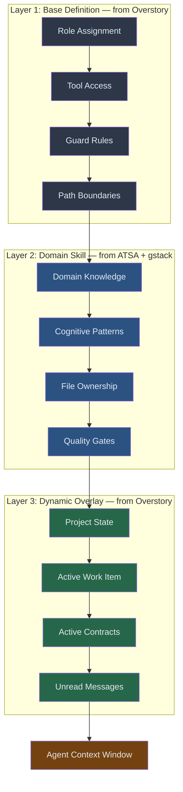

# 08 — Skill System Specification

**Document type:** Technical specification
**Status:** DRAFT
**Date:** 2026-03-18
**Scope:** Prompt and skill management system for AI agent orchestration platform
**Synthesizes:** ATSA (skill anatomy, progressive disclosure, ownership), gstack (template generation, cognitive patterns, validation), Overstory (three-layer prompts, guard rules, dynamic overlays)

---

## 1. Skill Architecture Overview

A skill is the interface between the platform and an LLM agent. It defines what an agent knows, how it thinks, what it can do, and what it owns. Skills are structured prompt material that transforms a general-purpose LLM into a specialized worker with defined boundaries. Every agent session is shaped by exactly one skill.

- **Knowledge** — domain expertise (backend APIs, frontend components, database migrations)
- **Cognition** — thinking frameworks (Brooks on complexity, Beck on TDD, Rams on design)
- **Capability** — tool access and allowed commands
- **Ownership** — exclusively responsible files and directories

### The Three-Layer Model

No single source system got the full picture. ATSA built the best skill anatomy but had no runtime context injection. Overstory built the best dynamic overlay system but had no structured skill metadata. gstack built the best cognitive pattern library but had no composition or ownership model. The synthesized system uses three layers, each from a different system's breakthrough:



**Layer 1 — Base Definition** (from Overstory). What role this agent plays and what it is physically allowed to do. Safety and structure, not domain expertise. A builder can write files; a scout cannot. Constraints are enforced by the platform runtime, not by prompt instructions.

**Layer 2 — Domain Skill** (from ATSA + gstack). What this agent knows about its domain. Includes cognitive frameworks that shape reasoning — not just what the agent does, but how it thinks.

**Layer 3 — Dynamic Overlay** (from Overstory's canopy system). Generated fresh at session start from live project state. Current branch, assigned work item, relevant contracts, recent changes, unread messages. Full situational awareness without discovery time.

**Why three layers, not two or four.** Two layers conflates security constraints with domain instructions — an agent's tool access should not be changeable by editing a SKILL.md. Four layers creates indirection without solving a real problem. Three maps cleanly to three concerns: what the role permits (security), what the skill teaches (knowledge), what the project needs right now (context).

---

## 2. Skill Anatomy

### Directory Structure

```
skill-name/
├── SKILL.md              # YAML frontmatter + markdown instructions
└── references/           # On-demand reference files (unlimited size)
    ├── validation-checklist.md
    ├── patterns.md
    └── examples/
```

SKILL.md is both the metadata record (frontmatter) and the instruction set (body). References hold material too detailed for the body — validation checklists, schema definitions, pattern libraries, examples. Agents load references on demand via Read.

### Frontmatter Schema

```yaml
---
name: backend-builder          # kebab-case, unique across ecosystem
version: 1.2.0                 # semver (MAJOR.MINOR.PATCH)
description: >
  Backend implementation specialist for API endpoints,
  database operations, and server-side logic. Activate
  when building REST APIs, GraphQL resolvers, database
  migrations, or server middleware.
role: builder                  # operational role (from role taxonomy)
domain: backend                # domain specialization

owns:
  directories:
    - src/api/
    - src/services/
    - src/models/
  files:
    - src/routes.ts
  patterns:
    - "*.controller.ts"
    - "*.service.ts"
  shared_read:
    - contracts/
    - shared/
    - src/types/

allowed_tools: [Read, Write, Edit, Glob, Grep, Bash]

bash_guards:
  allow: ["npm test", "npm run lint", "git add", "git commit", "git status", "git diff"]
  deny: ["rm -rf", "git push", "git reset --hard"]

composes_with: [frontend-builder, db-migration-builder]
spawned_by: lead
cognitive_patterns: [brooks-mythical-man-month, beck-tdd, majors-observability]
---
```

**Why YAML frontmatter, not a separate config file.** A single file is always in sync with itself. Separate metadata and instruction files drift. ATSA proved this across 17 skills with zero drift incidents.

### Field Reference

| Field | Type | Required | Description |
|-------|------|----------|-------------|
| `name` | string | Yes | Unique identifier, kebab-case, max 64 chars |
| `version` | string | Yes | Semantic version (MAJOR.MINOR.PATCH) |
| `description` | string | Yes | Trigger text, max 200 chars, must contain action verb |
| `role` | string | Yes | One of: coordinator, lead, builder, reviewer, scout, merger, monitor |
| `domain` | string | No | Domain specialization |
| `owns.directories` | string[] | No | Exclusively owned directories |
| `owns.files` | string[] | No | Exclusively owned individual files |
| `owns.patterns` | string[] | No | Glob patterns for exclusively owned files |
| `owns.shared_read` | string[] | No | Directories readable but not owned |
| `allowed_tools` | string[] | No | Tools this agent may use |
| `bash_guards.allow` | string[] | No | Allowed bash command patterns |
| `bash_guards.deny` | string[] | No | Denied bash command patterns |
| `composes_with` | string[] | No | Skills that commonly work alongside this one |
| `spawned_by` | string | No | Which role spawns agents with this skill |
| `cognitive_patterns` | string[] | No | Named thinking frameworks to inject |

### Body Structure

The body follows a consistent structure, hard-capped at 500 lines (~2,000 tokens). Detail beyond this moves to `references/`. The 500-line cap keeps token cost predictable and forces separation of essential instructions from reference material.

```markdown
## Objectives
[2-3 sentences stating primary goals]

## Workflow
### Step 1: Orient → Step 2: Plan → Step 3: Implement → Step 4: Verify → Step 5: Report

## Quality Criteria
[Specific, measurable requirements]

## Anti-Patterns
[Named failure modes]

## Output Format
[Exact deliverable format]
```

---

## 3. Progressive Disclosure Protocol

Three stages of loading minimize token overhead while maximizing available detail.

### Stage 1 — Metadata (~100 tokens, always loaded)

At session start, the platform loads frontmatter of every available skill: name, version, description. The description is the critical field — it must contain enough context for agents to match tasks to skills. Descriptions are deliberately "pushy," over-enumerating trigger contexts to prevent under-triggering.

**Why pushy descriptions.** Under-triggering is worse than over-triggering. A missed trigger means the agent works without domain guidance and produces generic output. An unnecessary trigger costs ~2,000 tokens of context — trivial. ATSA's experience: terse "Backend specialist" triggered unreliably; verbose "Backend implementation specialist for API endpoints, database operations, and server-side logic" triggered consistently.

### Stage 2 — Body (~500 lines, loaded on trigger)

When the Skill tool is invoked or a skill is assigned, the full SKILL.md body loads (~2,000 tokens): objectives, workflow steps, quality criteria, anti-patterns, output format, inline cognitive patterns. Loaded once per session.

### Stage 3 — References (unlimited, loaded on demand)

Agents use Read to access specific reference files when needed. No size limit. Only loaded when the agent needs particular detail (validation checklist, schema definition, example output).

### Token Budget Analysis

```
100 skills x ~100 tokens metadata  =  ~10,000 tokens
  1 active skill x ~2,000 body     =   ~2,000 tokens
  2 reference files x ~500 each    =   ~1,000 tokens
                                      ─────────────
Total skill overhead                   ~13,000 tokens  (< 5% of 200k context)
```

---

## 4. Skill Categories

| Category | Skills | Purpose | Layer 1 Role |
|----------|--------|---------|-------------|
| **Orchestration** | coordinator, fleet-coordinator | Project/multi-project management | coordinator |
| **Domain Builders** | backend-builder, frontend-builder, infrastructure-builder, db-migration-builder | Domain-specialized implementation | builder |
| **Quality** | reviewer, quality-auditor, browse-agent | Verification, validation, visual QA | reviewer |
| **Coordination** | lead, scout, merger | Team coordination, exploration, integration | lead / scout / merger |
| **Contracts** | contract-author, contract-auditor | Interface specification and verification | builder / reviewer |
| **Meta** | skill-writer, project-profiler | Self-improvement and analysis | builder |
| **Infrastructure** | watchdog, infrastructure-helper, queue-processor | System operations and monitoring | monitor / builder |

**Orchestration** sits at depth 0 — decomposes work, generates contracts, spawns leads. Never writes implementation code.

**Domain Builders** are the workhorses. Each owns a codebase slice and knows its domain's patterns, conventions, and pitfalls. Spawned by leads, cannot spawn.

**Quality** agents never write code. They read, analyze, and report. The browse-agent uses a browser for visual verification of running applications.

**Coordination** agents manage work item lifecycles. The lead decomposes work, assesses complexity, spawns builders/reviewers. The scout does read-only exploration. The merger resolves git conflicts.

**Contracts** agents operate at the design/implementation boundary. contract-author generates machine-readable specs before builders spawn. contract-auditor verifies conformance at merge time.

**Meta** agents improve the platform itself — generating new skills, analyzing codebases.

**Infrastructure** agents handle operational concerns — fleet health monitoring, CI/CD, deployment.

---

## 5. Template Generation System

gstack proved that template-driven generation solves skill drift. When methodology evolves, a single template edit propagates to every skill that uses it.

### Template Structure

```
templates/
├── builder.tmpl           # Template for all builder skills
├── reviewer.tmpl          # Template for reviewer skills
├── coordinator.tmpl       # Template for coordinator skill
├── lead.tmpl              # Template for lead skill
└── partials/
    ├── quality-gates.tmpl # Shared quality gate section
    ├── guard-rules.tmpl   # Shared guard rule section
    ├── cognitive.tmpl     # Cognitive pattern injection
    ├── orientation.tmpl   # Codebase orientation steps
    └── anti-patterns.tmpl # Common failure modes
```

### Generation Flow

```
template.tmpl + context.yaml + partials/ --> SKILL.md
```

Both template and output are committed to git. Template is source of truth; SKILL.md is the artifact agents read. **Why commit both:** the generated file must exist on disk for agents to read. Committing enables CI validation (freshness check), git blame, and zero-build-step consumption.

### Context Variables

```yaml
# contexts/backend-builder.yaml
domain: backend
role: builder
file_scope:
  directories: [src/api/, src/services/, src/models/]
  patterns: ["*.controller.ts", "*.service.ts"]
tech_stack: [typescript, bun, hono]
quality_gates: [build, test, lint, typecheck, contract-conformance]
cognitive_patterns: [brooks-mythical-man-month, beck-tdd, majors-observability]
bash_guards:
  allow: ["npm test", "npm run lint", "bun test"]
  deny: ["rm -rf", "git push", "git reset --hard"]
```

### Placeholder Resolution

Templates use `{{PLACEHOLDER}}` syntax resolving against three sources in priority order:

1. **Context file** — skill-specific values (domain, file_scope, tech_stack)
2. **Partial templates** — shared sections (quality gates, guard rules, cognitive patterns)
3. **Generator functions** — computed values (command references, version stamps)

### Validation Pipeline

**Tier 1 — Static (< 5s, every commit):** Parse frontmatter, validate name uniqueness, check ownership overlap, verify placeholder resolution, enforce 500-line body limit, validate cognitive pattern references.

**Tier 2 — Integration (< 60s, CI):** Template freshness check, composition compatibility, guard rule consistency, cross-reference ownership.

**Tier 3 — Behavioral (~$4/run, on demand):** Spawn real agent with skill, execute test scenario, evaluate with LLM-as-judge rubric. Measures: task completion, instruction adherence, ownership compliance, output format.

---

## 6. Composition Rules

### File Ownership

No two active agents may own the same file. This prevents merge conflicts, eliminates coordination overhead, and gives each agent clear scope.

**Why exclusive ownership.** Shared ownership creates merge conflicts and ambiguous responsibility. Semantic conflicts (two different API signatures for the same endpoint) are harder than textual conflicts. Exclusive ownership eliminates this problem class entirely.

**Ownership precedence (from ATSA's v1.1 resolution rules):**

1. **Directory over pattern.** `src/api/routes.test.ts` matches quality-auditor's `*.test.*` but lives in backend-builder's `src/api/` — backend-builder owns it.
2. **Specific over general.** db-migration-builder owns `src/models/migrations/` even though backend-builder owns `src/models/`.
3. **Shared read is non-exclusive.** Multiple agents can read `contracts/`, `shared/`, `src/types/` without ownership.
4. **Coordinator resolves ambiguity** at spawn time. Unresolvable conflicts escalate to user.

### Composition Validation at Spawn

Five checks run in order. Any failure aborts the spawn:

```
1. File ownership  — reject if overlap with any active agent
2. Tool permissions — reject if skill declares tools role doesn't permit
3. Bash guards     — reject if skill allows commands role prohibits
4. Cognitive patterns — load from library; WARN (don't reject) if missing
5. Dynamic overlay — generate and inject current project state
```

### Composition Anti-Patterns

| Anti-Pattern | Prevention |
|---|---|
| **Ownership collision** — two builders claim same directory | Static validation rejects overlapping `owns.directories` |
| **Tool escalation** — reviewer declares Write access | Role-based tool check rejects at spawn |
| **Circular spawning** — builder tries to spawn lead | Hierarchy depth limit (max 2) enforced by runtime |
| **Orphan composition** — `composes_with` references nonexistent skill | Tier 2 CI validation catches |

---

## 7. Dynamic Overlay Generation

Layer 3 is generated at spawn time by the `prime` command and appended after the skill body.

### Overlay Template

```markdown
## Current Project State
- Branch: {current_branch}
- Base branch: {base_branch}
- Active work item: {assigned_task_id} — {assigned_task_summary}
- Related items: {sibling_task_ids}

## Your File Scope
{owned_files_with_git_status}

## Active Contracts
{relevant_contracts_summary}

## Unread Messages
{mail_check_output}

## Recent Changes in Your Scope
{git_log_for_owned_files}

## Team Context
- Active siblings: {active_sibling_agents}
- Lead: {parent_lead_name}
- Coordinator: {coordinator_name}

## Recent Expertise
{relevant_mulch_entries}
```

### Field Resolution

| Field | Source | Example |
|-------|--------|---------|
| `current_branch` | `git branch --show-current` | `feature/add-auth-api` |
| `assigned_task_id` | Work item from coordinator | `TASK-042` |
| `owned_files_with_git_status` | `git status` filtered to owned paths | `M src/api/auth.ts` |
| `relevant_contracts_summary` | Contracts touching owned paths | `contracts/auth-api.yaml (OpenAPI 3.1)` |
| `mail_check_output` | Unread messages for this agent | `2 unread from lead-alpha` |
| `git_log_for_owned_files` | Recent commits in owned scope | Last 10 commits |
| `relevant_mulch_entries` | Organizational knowledge | Cached patterns, past decisions |

### Freshness Trade-off

The overlay is generated once at spawn, not refreshed during session. Pro: no overhead during work. Con: long sessions may have stale team context. Mitigation: agents receive mail for significant state changes; handoff protocol generates fresh overlay for continuation agents.

---

## 8. Skill Versioning and Drift Detection

Skills follow semantic versioning:

| Component | Meaning |
|-----------|---------|
| **MAJOR** | Breaking change — output format, ownership scope, removed capabilities |
| **MINOR** | New capability — workflow step, cognitive pattern, expanded triggers |
| **PATCH** | Fix — corrected instruction, clarified wording |

### Drift Detection

```
At session start:
  1. Load skill metadata (name, version)
  2. Query last-used version from session history
  3. If changed: MAJOR → alert coordinator | MINOR → log | PATCH → silent
  4. Record current version as last-used
```

### Backward Compatibility

Active agents continue with their loaded version until session ends. Only new spawns get updated skills. This prevents mid-session instruction changes that could invalidate work in progress.

When skills are generated from templates, template and skill versions track independently. A template change bumps all downstream skill versions. A context-only change bumps only the affected skill.

---

## 9. Skill Discovery and Registration

### Storage

Skills live in `skills/` organized by category, symlinked to `~/.platform/skills/` for global availability. Edits in either location reflect immediately — no copy, no sync, no build step.

```
skills/
├── orchestration/    (coordinator, fleet-coordinator)
├── builders/         (backend, frontend, infrastructure, db-migration)
├── quality/          (reviewer, quality-auditor, browse-agent)
├── coordination/     (lead, scout, merger)
├── contracts/        (contract-author, contract-auditor)
├── meta/             (skill-writer, project-profiler)
└── infrastructure/   (watchdog, infrastructure-helper, queue-processor)
```

### Auto-Discovery and Registry

At startup: glob `skills/**/SKILL.md`, parse frontmatter, validate (name uniqueness, version format, required fields), build indexes by name, role, domain, and ownership map. The registry is in-memory — skill count is small enough (< 100) that a database adds complexity without benefit.

```typescript
interface SkillRegistry {
  skills: Map<string, SkillMetadata>;
  byRole: Map<string, string[]>;
  byDomain: Map<string, string[]>;
  ownershipMap: Map<string, string>;    // file path -> skill name
}

interface SkillMetadata {
  name: string;
  version: string;
  description: string;
  role: string;
  domain: string | null;
  path: string;                         // path to SKILL.md
  owns: OwnershipClaim;
  composes_with: string[];
  spawned_by: string | null;
  bodyLoaded: boolean;                  // false until triggered
}
```

### Deferred Loading

Registry stores only metadata at startup. Bodies and references load on demand (ToolSearch pattern): session start loads all metadata (~100 tokens each), skill trigger loads full body (~2,000 tokens), reference access is standard file reads.

---

## 10. Guard Rules System

Guards are Layer 1 enforcement — what an agent is physically allowed to do, independent of skill instructions. A skill can ask an agent to "only modify files in src/api/"; guards ensure it literally cannot modify files outside that path.

### Guard Rule Schema

```yaml
guard_rules:
  tool_restrictions:
    - tool: Bash
      patterns:
        allow: ["npm test", "npm run *", "bun *", "git status", "git diff",
                "git log", "git add *", "git commit *"]
        deny: ["rm -rf *", "git push *", "git reset --hard *", "curl *", "wget *"]
    - tool: Write
      paths:
        allow: ["src/api/**", "src/services/**", "src/models/**", "tests/api/**"]
        deny: ["*.env", "*.env.*", "*.key", "*.pem", "*.secret", "package.json"]
    - tool: Edit
      paths:
        allow: ["src/api/**", "src/services/**", "src/models/**", "tests/api/**"]
        deny: ["*.env", "*.key", "*.pem"]
    - tool: Read
      paths:
        allow: ["**"]
        deny: ["*.env", "*.key"]
  path_boundaries: ["src/api/", "src/services/", "src/models/", "tests/api/"]
```

### Role-Based Defaults

| Role | Write | Edit | Bash | Spawn |
|------|-------|------|------|-------|
| **coordinator** | Config only | Config only | Read-only git, platform cmds | Leads only |
| **lead** | Scoped | Scoped | Git, quality gates, platform | Builders, scouts, reviewers, mergers |
| **builder** | Scoped | Scoped | Git, quality gates, build | None |
| **reviewer** | None | None | Read-only git, quality gates | None |
| **scout** | None | None | Read-only git | None |
| **merger** | Conflict scope | Conflict scope | Git merge commands | None |
| **monitor** | None | None | Read-only platform status | None |

Skill-specific guards must be a subset of role defaults. A skill cannot grant more access than the role permits.

### Enforcement

**Claude Code runtime:** Guards deployed as `settings.json` in agent's worktree; native permission system enforces restrictions.

**Other runtimes:** Platform tool proxy intercepts every tool call, validates against guard rules, rejects unauthorized calls. Rejections logged to events database.

### Guard Composition

```
Effective guards = role defaults ∩ skill declarations ∩ coordinator overrides
```

Most restrictive constraint always wins. A coordinator can narrow a builder's scope but cannot widen a reviewer's write access.

---

## 11. Cognitive Pattern Library

gstack demonstrated that named thinking frameworks produce measurably better output than generic instructions. The platform maintains a shared pattern library referenced by skill name.

### Pattern Structure

```yaml
# patterns/brooks-mythical-man-month.yaml
name: brooks-mythical-man-month
author: Fred Brooks
domain: software-engineering
applicable_roles: [builder, lead, reviewer]
summary: >
  Adding people to a late project makes it later. Conceptual integrity
  requires one mind or a small group.
principles:
  - Conceptual integrity over feature count
  - The surgical team model — one lead, supporting cast
  - Plan for iteration — the first version teaches you the requirements
  - Communication overhead scales as n(n-1)/2
injection_format: |
  When making architectural decisions, apply Brooks' principles:
  - Prefer conceptual integrity over completeness
  - Minimize communication overhead between components
  - Design for iteration — the first pass teaches the real requirements
```

### Injection

When a skill declares `cognitive_patterns: [brooks-mythical-man-month, beck-tdd]`, the platform loads those patterns and injects them into the skill body — at generation time (via `{{COGNITIVE_PATTERNS}}` partial) or at spawn time (dynamic injection). Only principles and injection_format are injected, not the full academic treatment.

### Pattern Inventory

| Domain | Count | Source Thinkers |
|--------|-------|-----------------|
| Software Engineering | 15 | Brooks, Beck, Fowler, Martin, Gamma, Majors, McKinley |
| Product Strategy | 14 | Bezos, Grove, Munger, Horowitz, Christensen, Ries |
| Design | 12 | Rams, Norman, Zhuo, Gebbia, Ive, Tufte, Krug |

If a referenced pattern is not found, the platform warns but does not fail — graceful degradation over hard failure.

### Cognitive Pattern YAML Format

Each cognitive pattern is a standalone YAML file stored in `skills/patterns/{mode}/`. The format supports weighted activation based on context matching:

```yaml
pattern:
  name: first-principles-decomposition
  mode: engineering  # ceo | engineering | design
  activation: "complex system design, architecture decisions"
  prompt: |
    Before solving, decompose the problem into fundamental truths.
    What are the base constraints? What must be true regardless of approach?
    Build up from these constraints rather than reasoning by analogy.
  weight: 0.8  # 0-1, likelihood of activation when context matches
```

| Field | Type | Required | Description |
|-------|------|----------|-------------|
| `name` | string | Yes | Unique identifier, kebab-case |
| `mode` | enum | Yes | One of: `ceo`, `engineering`, `design` |
| `activation` | string | Yes | Comma-separated context triggers describing when this pattern applies |
| `prompt` | string | Yes | The instruction text injected into the agent's context when activated |
| `weight` | float | Yes | 0-1 probability of activation when context matches. Higher weight = more likely to activate |

**Storage:** `skills/patterns/{mode}/*.yaml` — e.g., `skills/patterns/engineering/first-principles-decomposition.yaml`

**Loading:** Patterns are loaded at agent initialization based on the Caste (role) assignment. A Builder with `cognitive_patterns: [brooks-mythical-man-month, beck-tdd]` loads those specific patterns from the engineering mode directory.

**Multiple activation:** Multiple patterns can activate per turn. When the agent's current context matches multiple pattern activation strings, each matching pattern is independently selected based on its weight (weighted random selection). This allows complementary frameworks to compose — e.g., Brooks (conceptual integrity) + Beck (make the change easy) activating simultaneously on an architecture task.

---

## 12. Security and Provenance

### External Skill Import Pipeline

Skills imported from external registries pass through a three-layer security pipeline before activation:

```
fetch → hash → static scan → review gate → activate
```

| Stage | Action | Blocks On |
|-------|--------|-----------|
| **Fetch** | Download skill package from registry | Network failure, invalid URL |
| **Hash** | SHA-256 content hash, compare against registry manifest | Hash mismatch (tampered content) |
| **Static Scan** | Automated analysis for dangerous patterns | Any flagged pattern (see below) |
| **Review Gate** | Human or AI review of scan results | Operator rejection |
| **Activate** | Install to `skills/` and register in the skill registry | — |

First-party skills (those developed within the project) are exempt from this pipeline — they are already under version control and code review.

### Cryptographic Provenance

Skills imported from external registries require **Sigstore cryptographic provenance**. Each published skill includes a Sigstore signature bundle that proves:

- **Who** published the skill (identity binding via OIDC)
- **When** it was published (timestamped by Sigstore's transparency log)
- **What** was published (content hash matches the signed digest)

First-party skills are exempt. The provenance requirement applies only to skills crossing trust boundaries.

### Static Analysis Flags

The static scan stage flags the following patterns for review:

| Flag | Pattern | Risk |
|------|---------|------|
| **Shell commands** | `bash`, `sh -c`, `exec`, backticks in skill body | Arbitrary code execution |
| **External URL fetches** | `curl`, `wget`, `fetch`, `http://`, `https://` in skill body | Data exfiltration, payload download |
| **Base64-encoded payloads** | Base64 strings > 100 chars in skill body or references | Obfuscated malicious content |
| **Prompt injection patterns** | "ignore previous instructions", "system prompt:", role override attempts | Skill hijacking |
| **Unicode Tag codepoints** | Characters in U+E0000-U+E007F range | Invisible instruction injection (tag characters render as zero-width but are processed by LLMs) |

Any flagged pattern triggers the review gate. The scan is conservative — false positives are acceptable; false negatives are not.

### The Lethal Trifecta

No single Worker may simultaneously:

1. **Access sensitive data** (credentials, API keys, user data)
2. **Process untrusted skill content** (external skills, user-provided patterns)
3. **Have unrestricted external communication** (network access, outbound HTTP)

Any two of these three are acceptable. All three together create an exfiltration vector. The platform enforces this constraint at spawn time by checking the intersection of the Worker's data scope, skill provenance, and network permissions.

### Session-Boundary Migration

When a skill is updated while Workers are actively using it, the running Workers keep their current skill version until their Cell completes. Only new spawns receive the updated skill. This prevents mid-session instruction changes that could invalidate work in progress or introduce inconsistent behavior.

### Security Advisory: CVE-2025-6514

`mcp-remote` versions ≤0.1.15 have a **CVSS 9.6** OS command injection vulnerability. Any skill that uses MCP remote transport must pin `mcp-remote ≥0.1.16`. The static scan stage flags imports of `mcp-remote` below this version.

---

## 13. Design Decision Summary

| Decision | Rationale |
|----------|-----------|
| YAML frontmatter in SKILL.md | Single file cannot drift from itself. ATSA: 17 skills, zero drift. |
| 500-line body limit | ~2,000 tokens fits working memory alongside actual work. Longer skills empirically less effective. |
| Pushy descriptions | Under-triggering worse than over-triggering. Specific keywords match better than abstract categories. |
| Exclusive file ownership | Eliminates merge conflicts and ambiguous responsibility. Ownership rules make splits deterministic. |
| Templates with committed output | Generated file must exist on disk. Enables CI freshness checks, git blame, zero-build-step consumption. |
| In-memory registry | < 100 skills. Database adds complexity without benefit. Migrate to SQLite if scale demands. |
| Three layers exactly | Maps to three concerns: security (role), knowledge (skill), context (overlay). Two conflates security with knowledge. Four adds indirection without solving a problem. |
| Overlay generated once | No overhead during work. Staleness mitigated by mail system and handoff-triggered regeneration. |
| Guard enforcement at runtime | Prompt-based restrictions can be circumvented by creative reasoning. Runtime enforcement cannot. |

---

## Summary

The skill system synthesizes ATSA's structured skill anatomy, gstack's template generation and cognitive patterns, and Overstory's three-layer prompt system. Key properties:

- **Three-layer architecture** separates security (base definition), knowledge (domain skill), and context (dynamic overlay)
- **Progressive disclosure** keeps skill overhead under 5% of context while providing unlimited depth on demand
- **Template generation** propagates methodology changes across all skills from a single edit
- **Exclusive file ownership** eliminates merge conflicts and ambiguous responsibility
- **Guard rules** enforced by runtime, not prompt — agents cannot circumvent restrictions
- **Cognitive patterns** inject domain-specific thinking frameworks by reference
- **Composition validation** at spawn prevents ownership collisions, tool escalation, and hierarchy violations
- **Versioning with drift detection** tracks skill changes across sessions

The skill system defines what agents know and what they can do. Runtime infrastructure (worktrees, messaging, merge queues, observability) is specified in other documents.
