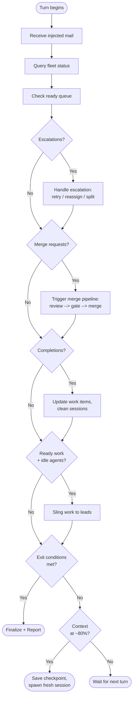
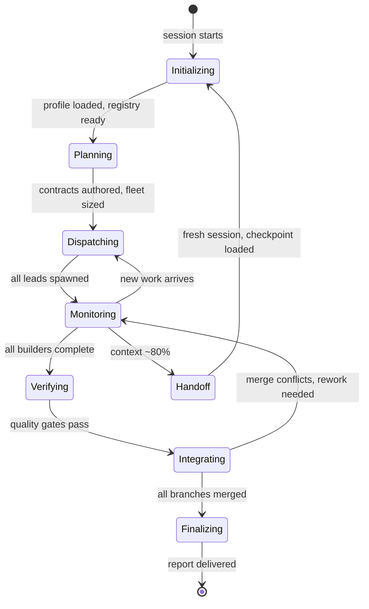
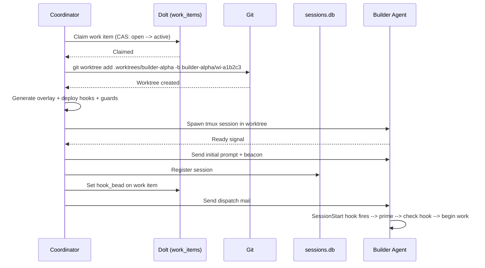
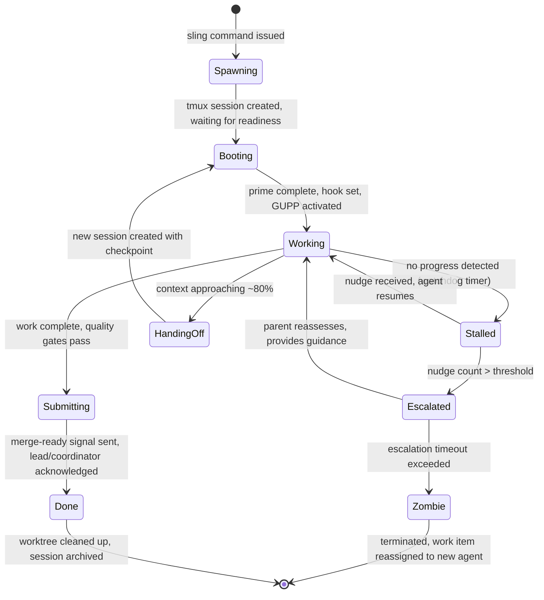
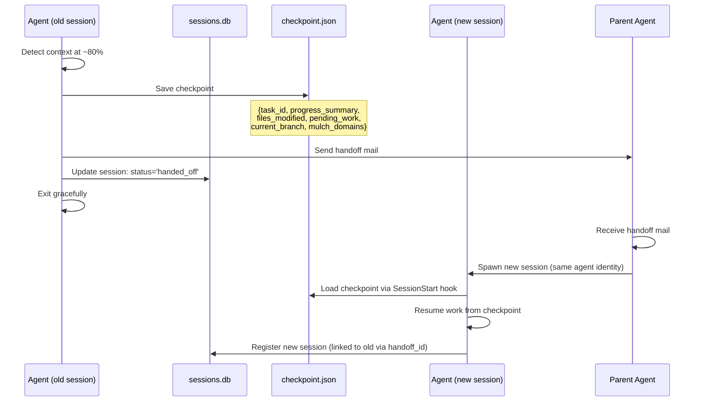
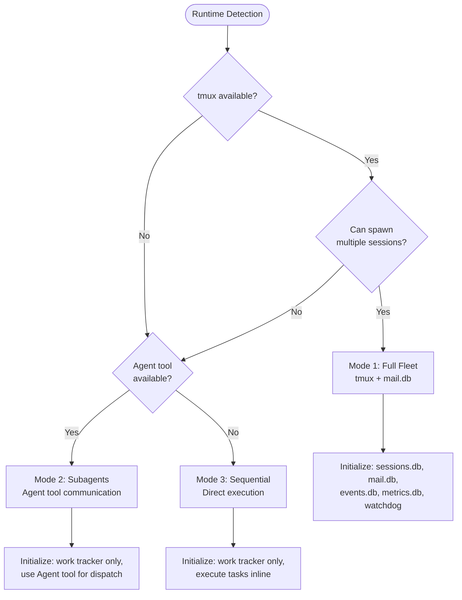

# 09 - Orchestration Engine Specification

Comprehensive specification of the orchestration engine for a clean-sheet AI agent
orchestration platform. Synthesizes the coordinator loop from Overstory's hook-driven
architecture, GUPP and convoy systems from Gas Town, ATSA's 14-phase build playbook,
and runtime degradation strategies from all three.

---

## 1. Orchestration Philosophy

### "Your Session IS the Orchestrator"

The coordinator is not a daemon. It is not a state machine. It is not a cron job polling
a database. The coordinator is a full LLM agent running in a Claude/Gemini/etc. session,
with the same reasoning capabilities as any other agent in the fleet.

This is the fundamental architectural decision. Traditional workflow engines (Temporal,
Airflow, Step Functions) use deterministic replay and stateless worker functions.
This platform uses a superintelligent coordinator that can reason about fleet state,
make nuanced dispatch decisions, handle ambiguous escalations, and adapt strategy
mid-build -- all within the same session that manages the work.

The coordinator's power comes from three sources:

1. **Full LLM reasoning.** Every dispatch decision, every escalation response, every
   exit-condition check benefits from the same model that writes code. The coordinator
   can read a builder's error log and decide whether to retry, reassign, split the task,
   or change the approach entirely.

2. **Hook-driven event injection.** The coordinator does not poll. Agent messages are
   injected into its context via `UserPromptSubmit` hooks. Each turn, the coordinator
   sees its own pending work plus any new mail from the fleet.

3. **Persistent state in databases.** The coordinator's ephemeral context is backed by
   durable state in `sessions.db`, `work_items` (Dolt), `mail.db`, `events.db`, and
   `metrics.db`. When context fills up, a fresh session loads state from these stores
   and continues seamlessly.

### GUPP: "Work on Hooks Must Run"

The Gas Town Universal Propulsion Principle is the platform's fundamental coordination
axiom. Every agent has a hook -- a pinned work item. When an agent starts (or restarts),
it checks its hook and begins working immediately. No waiting for instructions. No
asking for permission. No being polite.

GUPP solves the hardest problem in agent orchestration: agents stop. Context windows
fill up, sessions crash, models get polite and wait for input. GUPP creates a
self-perpetuating cycle:

```
Agent starts session
  --> SessionStart hook fires --> prime (load context, check hook)
    --> Hook has work --> execute immediately
      --> Context fills --> handoff --> new session starts
        --> SessionStart hook fires --> prime --> check hook --> continues work
```

GUPP applies at every level of the hierarchy:

- **Coordinator** checks for unprocessed mail and ready work items
- **Leads** check for dispatched tasks and builder completion reports
- **Builders** check for assigned work on their hook
- **Watchdog** checks for stale agents needing intervention

The nudge system exists because LLMs sometimes ignore GUPP and wait politely for
input. A nudge is a direct interrupt (via tmux `send-keys` or RPC `followUp()`) that
reminds the agent to check its hook. The nudge content is irrelevant -- agents are
prompted so strictly about GUPP that any input triggers a hook check.

### NDI: Nondeterministic Idempotence

Recovery is not encoded as a rigid state machine. When an agent crashes mid-task, the
replacement session scans the work item's state (acceptance criteria, step completion
markers, files modified, branch state) and figures out what to do next. The AI evaluates
the partial state and self-corrects.

```
Agent crashes at step 5 of 10
  --> New session starts for this agent identity
    --> Checks hook --> finds work item with molecule steps
      --> Scans steps --> step 5 partially done
        --> AI evaluates the state
          --> Figures out the fix --> completes step 5
            --> Continues to step 6...10
```

The path is nondeterministic (the AI might take a different approach on retry), but the
outcome -- the workflow completing -- is deterministic because:

- Work items have acceptance criteria per step
- AI can detect and recover from partial completions
- All state is persisted (Dolt for work items, git for code, SQLite for sessions)
- Nothing is lost on crash -- only the ephemeral context

NDI provides workflow guarantees "plenty good enough for a developer tool." The key
insight is that AI can handle nondeterminism because it reasons about partial states.
Traditional workflow engines need determinism because their workers are stateless functions.

### Progressive Scaling

The engine works with 1 agent or 30. The same coordinator loop, the same dispatch
mechanism, the same quality gates -- just different runtime modes:

| Fleet Size | Mode | Coordination |
|-----------|------|-------------|
| 1 agent | Sequential | Direct execution, no overhead |
| 2-5 agents | Subagents | Agent tool within coordinator context |
| 5-30 agents | Full fleet | Separate sessions, mail-based coordination |

The coordinator detects the available runtime and degrades gracefully. A build planned
for 10 agents can run with 1 -- it just takes longer.

### Evidence-Driven Decisions

The coordinator does not make decisions based on heuristics or fixed rules. It queries
data stores and makes decisions based on evidence:

- **Dispatch decisions** based on work item dependency graph, agent scorecards, and
  current fleet capacity
- **Retry vs. reassign** based on error type, agent history, and retry count
- **Quality gates** based on structured qa-report.json with 5-dimension scoring
- **Exit conditions** based on work tracker state, merge queue depth, and quality scores
- **Context handoff** based on token usage metrics and session duration
- **Fleet sizing** based on task complexity assessment and historical throughput data

---

## 2. The Coordinator Loop

The coordinator loop is not a polling daemon. It is an LLM agent whose turns are
triggered by user interaction (or automated nudges), with fleet mail automatically
injected at each turn via hooks.

### Hook Wiring

```json
{
  "hooks": {
    "SessionStart": [{
      "command": "platform prime --role coordinator"
    }],
    "UserPromptSubmit": [{
      "command": "platform mail check --inject"
    }]
  }
}
```

- **SessionStart** fires once: loads project profile, fleet state, skill registry,
  work tracker connection, and any checkpoint from a previous session
- **UserPromptSubmit** fires every turn: queries `mail.db` for unread messages to
  the coordinator, formats them as text, injects into context

### Main Loop

```
COORDINATOR MAIN LOOP (each turn):

  1. RECEIVE CONTEXT
     - Injected mail from fleet (via UserPromptSubmit hook)
     - User message (if any)

  2. CHECK FLEET STATUS
     - Query sessions.db for all active agents
     - Identify: idle, working, stalled, zombie, completed
     - Note any agents approaching context limits

  3. CHECK READY QUEUE
     - Query work_items for status='open' with all dependencies resolved
     - Compute: items ready for dispatch, items blocked, items in progress

  4. PROCESS MAIL (priority order)
     a. ESCALATIONS (urgent)
        - Circuit-broken builders, lead failures, watchdog alerts
        - Decide: retry, reassign, split task, manual intervention
     b. MERGE REQUESTS (high)
        - Builder or lead reports work complete, branch ready
        - Trigger merge pipeline: review --> quality gate --> merge queue
     c. COMPLETION REPORTS (normal)
        - Agents report work done
        - Update work items, check convoy progress
        - Clean up agent session and worktree
     d. STATUS UPDATES (low)
        - Progress reports, questions, information
        - Respond or acknowledge as needed

  5. DISPATCH READY WORK
     - Match ready items to idle leads
     - For each dispatch: sling work item to lead
     - Leads decompose and spawn builders as needed

  6. CHECK EXIT CONDITIONS
     - All work items resolved?
     - Merge queue empty?
     - Quality gates passed?
     - If all met --> finalize and report

  7. CHECK CONTEXT HEALTH
     - If approaching ~80% context window --> trigger handoff
     - Save checkpoint, spawn fresh coordinator session

  8. WAIT FOR NEXT TURN
     - User sends a message, or
     - Automated nudge fires (every N minutes if no user interaction)
```

### Flow Diagram



### Coordinator State Machine

The coordinator itself has a lifecycle:



---

## 3. Phase-Based Build Playbook

Synthesized from ATSA's 14 phases into a practical 7-phase workflow. Each phase has
clear entry criteria, actions, and exit criteria. The coordinator advances through
phases based on evidence, not timers.

### Phase 0: Initialize

**Entry:** Coordinator session starts (or resumes from checkpoint).

**Actions:**
1. Load project profile (`profile.yaml`) -- tech stack, conventions, directory map
2. Detect runtime environment -- tmux available? Agent tool? Sequential only?
3. Load skill registry -- available skills, cognitive patterns, domain specializations
4. Connect to work tracker (Dolt) -- existing work items, dependency graph
5. If checkpoint exists: load previous state, skip completed phases
6. Run `platform doctor` -- verify dependencies, databases, config

**Exit criteria:** Profile loaded, runtime detected, tracker connected, no critical
doctor failures.

### Phase 1: Plan

**Entry:** Phase 0 complete.

**Actions:**
1. Analyze requirements -- user request, spec files, existing issues
2. Author contracts -- OpenAPI specs, TypeScript interfaces, JSON schemas, Pydantic models
3. Compute dependency graph -- which tasks depend on which
4. Determine file ownership map -- exclusive ownership, no overlaps between agents
5. Size the agent fleet -- based on task count, complexity, and available runtime

**Fleet sizing logic:**

```
task_count = number of leaf work items
complexity = avg(estimated_effort) across items

if sequential_mode:
    fleet_size = 1
else if task_count <= 3:
    fleet_size = 1 lead, task_count builders
else if task_count <= 10:
    fleet_size = 2 leads, min(task_count, 8) builders, 1 watchdog
else:
    fleet_size = ceil(task_count / 5) leads, min(task_count, 20) builders, 1 watchdog
```

**Exit criteria:** All work items created with acceptance criteria. Dependency graph
resolved. File ownership map has no overlaps. Fleet size determined.

### Phase 2: Dispatch

**Entry:** Phase 1 complete.

**Actions:**
1. Spawn watchdog (if fleet > 3 agents)
2. Spawn leads for each work stream
3. Sling work items to leads based on domain alignment
4. Leads decompose tasks and assess complexity:
   - **Simple** (1-3 files) -- lead does it directly
   - **Moderate** (3-6 files) -- spawn one builder, self-verify
   - **Complex** (6+ files) -- full scout --> build --> review pipeline
5. Leads spawn builders with: work item, worktree, file scope, quality gates
6. Track all agents in `sessions.db`

**Exit criteria:** All work items assigned. All agents spawned and booting.

### Phase 3: Build

**Entry:** Phase 2 complete (or ongoing -- phases 2-3 overlap as work items become ready).

**Actions:**
1. Builders work in isolated worktrees
2. Watchdog patrols fleet health (every 30 seconds to 5 minutes depending on config)
3. Builders follow work item molecule steps:
   - Load context and understand task
   - Create branch, implement changes
   - Run quality gates (tests, lint, types)
   - Submit completion report via mail
4. Leads verify builder output (or spawn independent reviewer)
5. Builders that pass verification submit merge-ready signal
6. Failed builders receive feedback and retry (up to circuit breaker limit)

**Exit criteria:** All builders have submitted or been circuit-broken.

### Phase 4: Verify

**Entry:** Builder reports completion.

**Actions per completed builder:**
1. Lead spawns independent reviewer (or self-verifies for simple tasks)
2. Reviewer validates:
   - Code correctness against acceptance criteria
   - Contract conformance (types match, API matches spec)
   - Quality standards (no AI slop, proper error handling, test coverage)
3. Contract auditor checks machine-readable conformance
4. Quality auditor runs design audit (cognitive patterns if configured)
5. QA gate produces `qa-report.json` with 5-dimension scoring:
   - `contract_conformance` (1-5)
   - `code_quality` (1-5)
   - `test_coverage` (1-5)
   - `security` (1-5)
   - `performance` (1-5)

**Blocking criteria:** CRITICAL blockers, or any dimension score < 3.

**Exit criteria:** All work items have passing QA reports.

### Phase 5: Integrate

**Entry:** Work item passes verification.

**Actions:**
1. Queue processor enqueues verified branch into merge queue
2. 4-tier conflict resolution for each merge:

```
Tier 1: Clean merge (git merge --no-edit)
  |
  +--> Success --> done
  +--> Conflict -->
        |
Tier 2: Auto-resolve (keep incoming, with safety checks)
  |
  +--> Success --> done
  +--> Contentful canonical conflict -->
        |
Tier 3: AI-resolve (headless LLM resolves conflict)
  |
  +--> Success --> done
  +--> Prose output or failure -->
        |
Tier 4: Reimagine (abort merge, reimplement changes onto canonical)
  |
  +--> Success --> done
  +--> Failure --> escalate to coordinator for human intervention
```

3. Integration tests run on merged result
4. Post-merge learning updates expertise store (mulch) with conflict patterns

**Merge ordering:** FIFO (first-done, first-merged). Simpler branches merge first,
keeping canonical branch maximally current for later merges.

**Exit criteria:** All verified branches merged. Integration tests pass.

### Phase 6: Finalize

**Entry:** All work items resolved, all branches merged.

**Actions:**
1. Verify all work items in `resolved` or `closed` status
2. Generate final QA report -- aggregate across all work items
3. Run retrospective analysis:
   - Which agents performed best (scorecard update)
   - Which tasks required retries (process improvement)
   - Which merge tiers were needed (conflict prediction improvement)
   - Total cost, duration, token usage
4. Update agent scorecards with performance data
5. Record patterns to expertise store for future builds
6. Clean up: remove worktrees, close agent sessions, archive run data

**Exit criteria:** Final report delivered. All resources cleaned up.

---

## 4. Work Dispatch (Sling Mechanism)

`sling` is the fundamental primitive for assigning work. It does everything needed to
get an agent working on a task: claims the work, creates isolation, loads context,
spawns the session, and sets the hook.

### CLI Interface

```bash
# Coordinator dispatches to lead
platform sling <work-item-id> --to <lead-name>

# Lead dispatches to builder
platform sling <work-item-id> --to <builder-name> \
  --worktree <path> \
  --branch <branch> \
  --files "src/api/routes.ts,src/api/routes.test.ts"

# Auto-dispatch: assign all ready items to idle agents
platform sling --auto

# Override runtime for this dispatch
platform sling <work-item-id> --to <builder-name> --runtime pi

# Override cognitive mode
platform sling <work-item-id> --to <builder-name> --mode "staff-engineer"
```

### Sling Process (12 Steps)

```
platform sling wi-a1b2c3 --to builder-alpha --worktree .worktrees/builder-alpha

  1. VALIDATE
     - Check hierarchy depth limit (max 3 levels)
     - Check agent doesn't already have hooked work
     - Check work item is in 'open' or 'ready' status

  2. CLAIM WORK ITEM
     - Atomic compare-and-swap: status open --> active, assignee --> builder-alpha
     - In Dolt: single UPDATE with WHERE status='open' (race-safe)
     - Record claim timestamp

  3. CREATE WORKTREE
     - git worktree add <path> -b builder-alpha/wi-a1b2c3
     - Base branch: canonical (main) or specified --base-branch

  4. LOAD SKILL
     - Resolve skill for agent role + domain specialization
     - Load full SKILL.md body (progressive disclosure: now is the time)

  5. GENERATE OVERLAY
     - Template variables: {{AGENT_NAME}}, {{TASK_ID}}, {{BRANCH_NAME}},
       {{FILE_SCOPE}}, {{QUALITY_GATES}}, {{EXPERTISE}}, {{PARENT_AGENT}}
     - Write overlay to worktree instruction path

  6. DEPLOY HOOKS
     - Write runtime-specific config to worktree:
       Claude: .claude/settings.local.json (SessionStart + UserPromptSubmit hooks)
       Pi: .pi/extensions/overstory-guard.json
       Codex: AGENTS.md
       Gemini: GEMINI.md

  7. DEPLOY GUARDS
     - Tool restrictions based on capability (builder, scout, reviewer)
     - Bash pattern guards (allowed/denied commands)
     - Path boundary enforcement (agent restricted to worktree)

  8. SPAWN SESSION
     - tmux: tmux new-session -d -s builder-alpha -c <worktree-path>
     - Subagent: Agent tool invocation within parent context
     - Headless: Bun.spawn with NDJSON event stream

  9. WAIT FOR READY
     - Poll tmux pane content for readiness signal
     - Handle permission dialogs (auto-approve)
     - Timeout after configurable threshold

 10. SEND INITIAL PROMPT
     - Beacon verification (for Claude Code: resend if TUI swallowed Enter)
     - Initial prompt includes: task summary, hook reference, GUPP reminder

 11. REGISTER SESSION
     - Insert into sessions.db: agent_name, session_id, pid, tmux_session,
       task_id, worktree_path, branch_name, capability, parent_agent, depth
     - Record spawn event in events.db

 12. SET HOOK
     - Update work item: hook_bead --> wi-a1b2c3
     - Agent will find this on next hook check
     - Send dispatch mail to agent
```

### Sling Sequence Diagram



---

## 5. Agent Lifecycle

Every agent -- coordinator, lead, builder, scout, reviewer, watchdog -- follows the
same lifecycle. The specifics vary by role, but the state machine is universal.

### State Machine



### State Descriptions

| State | Description | Duration | Transitions |
|-------|-------------|----------|-------------|
| **Spawning** | `sling` command issued, worktree being created | Seconds | --> Booting |
| **Booting** | Session starting, hooks deploying, waiting for TUI ready | 5-30 seconds | --> Working |
| **Working** | Active execution. Hook set, GUPP engaged | Minutes to hours | --> Submitting, Stalled, HandingOff |
| **Submitting** | Quality gates passed, completion report sent | Seconds | --> Done |
| **Done** | Work complete, waiting for cleanup | Seconds | --> [terminated] |
| **Stalled** | Watchdog detected no progress beyond threshold | Until nudge or escalation | --> Working, Escalated |
| **Escalated** | Parent notified, awaiting intervention | Until parent acts | --> Working, Zombie |
| **Zombie** | Agent unresponsive after all intervention attempts | Until termination | --> [terminated] |
| **HandingOff** | Context approaching limit, saving checkpoint | Seconds | --> Booting (new session) |

### Agent Identity vs. Session

A critical distinction inherited from Gas Town:

- **Identity** is persistent. Agent `builder-alpha` accumulates a CV (completed tasks,
  expertise domains, scorecard) across multiple assignments.
- **Session** is ephemeral. Each assignment creates a fresh LLM session. Sessions come
  and go; the identity endures.

```
builder-alpha (identity)
  ├── Session 1: wi-a1b2c3 (auth module)    -- completed, merged
  ├── Session 2: wi-d4e5f6 (rate limiter)   -- completed, merged
  ├── Session 3: wi-g7h8i9 (websocket)      -- stalled, handed off
  ├── Session 3b: wi-g7h8i9 (continuation)  -- completed, merged
  └── Session 4: wi-j0k1l2 (caching)        -- in progress
```

### Three-Layer Agent Model

```typescript
interface AgentLayers {
  // Layer 1: Identity (permanent across all assignments)
  identity: {
    name: string;                  // "builder-alpha"
    capability: string;            // "builder"
    created: string;               // ISO timestamp
    sessionsCompleted: number;     // cumulative
    expertiseDomains: string[];    // learned over time
    scorecard: AgentScorecard;     // performance metrics
  };

  // Layer 2: Sandbox (persists across sessions for one assignment)
  sandbox: {
    worktreePath: string;          // ".worktrees/builder-alpha"
    branchName: string;            // "builder-alpha/wi-a1b2c3"
    taskId: string;                // "wi-a1b2c3"
    fileScope: string[];           // owned files
    qualityGates: QualityGate[];   // required checks
  };

  // Layer 3: Session (ephemeral, one LLM runtime)
  session: {
    id: string;                    // unique session ID
    pid: number | null;            // OS process ID
    tmuxSession: string;           // tmux session name
    startedAt: string;             // session start time
    tokenUsage: TokenUsage;        // running count
    checkpoint: Checkpoint | null; // saved on handoff
  } | null;
}
```

---

## 6. Worktree Isolation

Every builder works in an isolated git worktree. This is the foundation of safe parallel
execution -- agents cannot accidentally modify each other's files, create merge conflicts
through concurrent edits, or corrupt the canonical branch.

### One Agent, One Worktree, One Session

```
project-root/
├── .worktrees/
│   ├── lead-api/                 # Lead for API work stream
│   │   └── (full repo checkout on branch lead-api/stream-1)
│   ├── builder-alpha/            # Builder implementing auth
│   │   └── (full repo checkout on branch builder-alpha/wi-a1b2c3)
│   ├── builder-bravo/            # Builder implementing routes
│   │   └── (full repo checkout on branch builder-bravo/wi-d4e5f6)
│   └── reviewer-one/             # Reviewer validating builder-alpha
│       └── (full repo checkout on branch reviewer-one/review-a1b2c3)
├── src/                          # Canonical (main branch, coordinator works here)
└── ...
```

### Branch Naming Convention

```
{agent-name}/{work-item-id}

Examples:
  builder-alpha/wi-a1b2c3        # Builder working on specific task
  lead-api/stream-1              # Lead's coordination branch
  reviewer-one/review-a1b2c3     # Reviewer's read-only branch
  scout-recon/explore-frontend   # Scout's exploration branch
```

### File Scope Enforcement

Agents are restricted to their declared file scope via guard rules:

```yaml
# Builder-alpha's dispatch
fileScope:
  - "src/auth/**"
  - "src/middleware/jwt.ts"
  - "tests/auth/**"

# Guard rule enforcement:
# - Write/Edit tool calls to paths outside scope --> BLOCKED
# - Bash commands touching paths outside worktree --> BLOCKED
# - Git operations scoped to agent's branch only
```

The platform enforces file scope at two levels:

1. **Guard rules** (preventive) -- tool calls to out-of-scope paths are rejected
   before execution
2. **Merge-time validation** (detective) -- if an agent somehow modifies out-of-scope
   files, the diff is flagged during merge review

### Worktree Lifecycle

```
Dispatch (sling)
  --> git worktree add .worktrees/<agent> -b <agent>/<task-id>
    --> Agent works in worktree
      --> Completion: branch pushed, merge-ready signal sent
        --> Merge: branch merged to canonical via merge queue
          --> Cleanup: git worktree remove .worktrees/<agent>
```

Worktrees are cleaned up automatically after successful merge. Failed or abandoned
worktrees are cleaned up by the watchdog during patrol.

---

## 7. Circuit Breaker

The circuit breaker prevents infinite retry loops. When an agent fails a task repeatedly,
the system escalates rather than burning tokens on futile retries.

### Escalation Cascade

```
Agent fails task (quality gate rejection, test failure, merge failure, or timeout)
  |
  +--> Retry 1: SAME AGENT, SAME APPROACH
  |    - Agent receives failure feedback
  |    - Attempts fix based on error message
  |    - retry_count incremented on work item
  |
  +--> Retry 2: SAME AGENT, DIFFERENT APPROACH
  |    - Load alternative cognitive pattern
  |    - Agent receives "try a fundamentally different approach" instruction
  |    - May include: relevant mulch expertise, example solutions, design hints
  |
  +--> Retry 3: CIRCUIT BREAK
       |
       +--> Escalation mail sent to parent (lead or coordinator)
       |
       +--> Parent decides:
            |
            +--> REASSIGN: Kill agent, sling task to different agent
            |    (different identity = different "personality" = different approach)
            |
            +--> SPLIT: Decompose task into smaller subtasks
            |    (the original task was too complex for one agent)
            |
            +--> SIMPLIFY: Reduce scope or acceptance criteria
            |    (the task as specified is not achievable)
            |
            +--> ESCALATE: Send to coordinator or human
                 (this requires judgment beyond the lead's capability)
```

### Configuration

```yaml
circuitBreaker:
  maxRetries: 3                    # retries before circuit break
  retryDelayMs: 0                  # no delay (agent retries immediately)
  escalationTarget: "parent"       # send to parent agent
  alternativePatterns:             # cognitive patterns for retry 2
    - "munger-inversion"           # "What would make this fail? Avoid that."
    - "bezos-disagree-commit"      # "Pick a direction and commit."
```

### Circuit Breaker State on Work Item

```sql
-- Work item columns tracking circuit breaker state
retry_count      INT DEFAULT 0,    -- incremented on each retry
quality_score    DOUBLE,           -- last quality gate score
agent_state      VARCHAR(32),      -- 'working', 'stuck', 'circuit_broken'
close_reason     TEXT,             -- failure details on circuit break
```

### Failure Classification

Not all failures are equal. The circuit breaker classifies failures to choose the
right retry strategy:

| Failure Type | Retry Strategy | Example |
|-------------|---------------|---------|
| Test failure | Same approach, fix the bug | Unit test assertion failure |
| Lint failure | Same approach, fix the style | ESLint/Biome violation |
| Type error | Same approach, fix the types | TypeScript compilation error |
| Quality gate < 3 | Different approach | Reviewer rejected design |
| Merge conflict | Merge specialist | Branch diverged too far |
| Timeout | New agent (session may be stuck) | Context window exhaustion |
| Crash | New agent (runtime failure) | Process died, OOM |

---

## 8. Context Management

Context windows are finite. Every agent will eventually run out of context. The platform
treats this as a normal operational event, not an error.

### Detection

```yaml
contextManagement:
  handoffThreshold: 0.80           # trigger at 80% of context window
  warningThreshold: 0.70           # log warning at 70%
  checkIntervalTurns: 5            # check usage every N turns
```

Token usage is tracked per session via:
- Runtime transcript parsing (Claude Code JSONL transcripts)
- Metrics store snapshots (periodic token counts)
- Heuristic estimation (for runtimes without transcript access)

### Handoff Protocol



### Checkpoint Schema

```typescript
interface SessionCheckpoint {
  agentName: string;               // same identity across sessions
  taskId: string;                  // work item being processed
  sessionId: string;               // outgoing session ID
  timestamp: string;               // when checkpoint was saved
  progressSummary: string;         // human-readable: "Completed auth module, JWT
                                   // middleware 80% done, tests not started"
  filesModified: string[];         // files changed in this session
  currentBranch: string;           // git branch name
  pendingWork: string;             // what remains: "Write JWT validation tests,
                                   // connect middleware to routes"
  nextSteps: string[];             // ordered list of immediate next actions
  mulchDomains: string[];          // expertise domains loaded this session
  errorContext: string | null;     // if handing off due to error, what happened
}
```

### Compaction (Long-Running Agents)

For persistent agents (coordinator, watchdog), context management also includes
compaction of old data:

- **Work items:** Old resolved items summarized by AI ("Completed 12 auth tasks,
  all merged") and full history preserved in Dolt (`AS OF` queries)
- **Mail:** Old threads archived, summaries retained in context
- **Events:** Only recent events loaded; historical events queryable via CLI
- **Scorecards:** Cumulative, not per-session -- always compact

---

## 9. Runtime Degradation

The platform supports three runtime modes, auto-detected at startup with graceful
degradation. The same orchestration logic works in all modes -- only the communication
mechanism changes.

### Mode 1: Full Fleet (tmux / Multi-Session)

The primary mode. Each agent runs in a separate tmux session (or equivalent terminal
multiplexer). Communication via SQLite mail. Maximum parallelism.

```
┌─────────────────────────────────────────────────────┐
│  tmux server                                         │
│                                                      │
│  ┌─────────────┐  ┌─────────────┐  ┌─────────────┐ │
│  │ coordinator  │  │ lead-api    │  │ watchdog     │ │
│  │ (Claude)     │  │ (Claude)    │  │ (Claude)     │ │
│  └──────┬──────┘  └──────┬──────┘  └──────┬──────┘ │
│         │                │                │          │
│  ┌──────┴──────┐  ┌──────┴──────┐  ┌──────┴──────┐ │
│  │ builder-a   │  │ builder-b   │  │ builder-c   │ │
│  │ (Pi)        │  │ (Claude)    │  │ (Codex)     │ │
│  └─────────────┘  └─────────────┘  └─────────────┘ │
│                                                      │
│  All communicate via mail.db (SQLite WAL mode)       │
└─────────────────────────────────────────────────────┘
```

**Requirements:** tmux, multiple terminal sessions, sufficient system resources.

**Capabilities:**
- Full parallelism (10-30+ concurrent agents)
- Mixed runtimes (Claude, Pi, Codex, Gemini in same fleet)
- Mail-based coordination (async, persistent, queryable)
- Watchdog patrol (daemon-style monitoring)
- Cost tracking per agent
- Nudge via tmux `send-keys` or RPC `followUp()`

### Mode 2: Subagents (Agent Tool)

Moderate parallelism within a single coordinator session. The coordinator uses the
runtime's Agent tool (or equivalent) to spawn child tasks.

```
┌─────────────────────────────────────────────┐
│  Coordinator Session (Claude Code)           │
│                                              │
│  ┌────────────┐  ┌────────────┐             │
│  │ Agent tool  │  │ Agent tool  │            │
│  │ (builder-a) │  │ (builder-b) │            │
│  └────────────┘  └────────────┘             │
│                                              │
│  Communication via Agent tool return values  │
│  No mail.db needed. No tmux needed.          │
└─────────────────────────────────────────────┘
```

**Requirements:** Runtime with Agent tool support (Claude Code, Codex).

**Capabilities:**
- Moderate parallelism (limited by coordinator context window)
- Same-runtime only (all agents use coordinator's runtime)
- Direct communication (Agent tool return values)
- No external infrastructure needed
- Simpler but less scalable

**Limitations:**
- Agent context consumes coordinator context
- No mixed runtimes
- No persistent mail (communication is ephemeral)
- No watchdog (coordinator monitors directly)

### Mode 3: Sequential (Single Session)

Fallback mode. One agent, one task at a time. No parallelism. The coordinator
IS the only agent.

```
┌─────────────────────────────────────────────┐
│  Single Session (any runtime)                │
│                                              │
│  Coordinator works through tasks serially:   │
│  Task 1 --> Task 2 --> Task 3 --> ...       │
│                                              │
│  No dispatch. No fleet. No mail.             │
│  Direct execution with quality gates.        │
└─────────────────────────────────────────────┘
```

**Requirements:** Any runtime. No external infrastructure.

**Capabilities:**
- Works everywhere
- Minimal overhead
- Quality gates still enforced
- Context handoff still available (for long task lists)

**Limitations:**
- No parallelism
- Slow for large builds
- Single point of failure (one session crash = restart from checkpoint)

### Auto-Detection Logic



### Runtime Detection Implementation

```bash
# Auto-detection sequence (run at coordinator startup)

# Check 1: tmux
if command -v tmux &>/dev/null && [ -n "$TMUX" ]; then
    HAS_TMUX=true
fi

# Check 2: Can we spawn new tmux sessions?
if [ "$HAS_TMUX" = true ]; then
    tmux new-session -d -s __probe_test 2>/dev/null && \
        tmux kill-session -t __probe_test 2>/dev/null && \
        CAN_MULTI_SESSION=true
fi

# Check 3: Agent tool available?
# (detected by the runtime adapter -- Claude Code always has it)

# Decision:
if [ "$CAN_MULTI_SESSION" = true ]; then
    RUNTIME_MODE="fleet"
elif [ "$HAS_AGENT_TOOL" = true ]; then
    RUNTIME_MODE="subagent"
else
    RUNTIME_MODE="sequential"
fi
```

### Degradation is Transparent

The coordinator loop (Section 2) is identical in all three modes. The only difference
is the dispatch mechanism:

| Action | Fleet Mode | Subagent Mode | Sequential Mode |
|--------|-----------|---------------|----------------|
| Dispatch work | `platform sling` (tmux) | `Agent` tool call | Inline execution |
| Receive results | Mail injection (hook) | Agent tool return | Direct return value |
| Monitor health | Watchdog patrol | Coordinator checks | Not needed |
| Nudge stalled | `tmux send-keys` | Not applicable | Not applicable |
| Merge branches | Merge queue processor | `git merge` | `git merge` |

---

## 10. Fleet Monitoring

### The Watchdog Agent

The watchdog is a persistent agent (depth 0, like the coordinator) that patrols fleet
health. It runs in its own tmux session, has read access to all state, and communicates
recommendations to the coordinator via mail.

```
WATCHDOG PATROL LOOP:

  Configurable interval (default: 30 seconds mechanical, 5 minutes AI triage)

  TIER 0 — MECHANICAL CHECKS (every 30 seconds):
    For each active agent in sessions.db:
      1. Process alive?
         - Check tmux session exists: tmux has-session -t <agent-name>
         - Check PID alive: kill -0 <pid>
         - If neither: mark ZOMBIE, notify coordinator

      2. Activity recent?
         - Query events.db: last event timestamp for agent
         - If stale (> staleThresholdMs): mark STALLED

      3. State consistent?
         - Compare sessions.db state vs. observed reality
         - If mismatch: log reconciliation note

    Progressive escalation for stalled agents:
      Level 0: warn    — log "agent may be stalled"
      Level 1: nudge   — tmux send-keys "Check your hook. GUPP."
      Level 2: escalate — mail coordinator with agent status
      Level 3: terminate — kill tmux session, reassign work

    Between escalation levels: wait nudgeIntervalMs (default: 60s)

  TIER 1 — AI TRIAGE (when Tier 0 is ambiguous):
    - Capture tmux pane content for stalled agent
    - Send to headless LLM: "Is this agent working, stuck, or errored?"
    - LLM classifies: {working, stuck, errored, completed}
    - Result drives next action (continue waiting, nudge, escalate)

  TIER 2 — MONITOR AGENT (persistent, optional):
    - Dedicated Claude Code session analyzing fleet patterns
    - Reads all state: sessions, mail, events, metrics
    - Detects systemic issues: "all builders stuck on same dependency"
    - Sends recommendations to coordinator
```

### Fleet Health Dashboard

```bash
# Real-time fleet status
platform fleet status

┌─────────────────────────────────────────────────────────────┐
│ Fleet Status (run-2026-03-18T10:00:00)                       │
├──────────────┬───────────┬──────────┬────────┬──────────────┤
│ Agent        │ State     │ Task     │ Uptime │ Tokens       │
├──────────────┼───────────┼──────────┼────────┼──────────────┤
│ coordinator  │ WORKING   │ --       │ 45m    │ 125k/200k    │
│ lead-api     │ WORKING   │ stream-1 │ 40m    │ 80k/200k     │
│ builder-alpha│ WORKING   │ wi-a1b2  │ 15m    │ 30k/200k     │
│ builder-bravo│ SUBMITTING│ wi-d4e5  │ 25m    │ 95k/200k     │
│ builder-delta│ STALLED   │ wi-g7h8  │ 30m    │ 45k/200k     │
│ watchdog     │ PATROLLING│ --       │ 44m    │ 15k/200k     │
├──────────────┴───────────┴──────────┴────────┴──────────────┤
│ Queue: 3 ready, 2 blocked, 1 in merge                        │
│ Convoys: 1 active (Feature-Auth: 4/7 items done)             │
│ Cost: $2.47 estimated this run                               │
└─────────────────────────────────────────────────────────────┘
```

### Metrics Store Integration

The watchdog writes health check results to `metrics.db`:

```typescript
interface HealthCheck {
  agentName: string;
  timestamp: string;
  processAlive: boolean;
  tmuxAlive: boolean;
  pidAlive: boolean | null;
  lastActivity: string;
  state: "working" | "stalled" | "zombie" | "completed" | "idle";
  escalationLevel: 0 | 1 | 2 | 3;
  action: "none" | "nudge" | "escalate" | "terminate" | "investigate";
  reconciliationNote: string | null;
}
```

### Heartbeat Cascade

Inspired by Gas Town's supervision hierarchy:

```
Watchdog (persistent, timer-driven)
  |
  +--> Checks all agents every 30 seconds (Tier 0)
  |
  +--> For stalled agents: AI triage (Tier 1)
  |
  +--> Escalates to coordinator if intervention needed
  |
  +--> Coordinator makes the call:
       +--> Nudge the agent
       +--> Kill and reassign
       +--> Split the task
       +--> Ask the human
```

### Exponential Backoff for Patrols

When the fleet is healthy and no work needs attention, patrol frequency decreases:

```
Patrol finds issues    --> next patrol in 30 seconds
Patrol finds nothing   --> next patrol in 60 seconds
Still nothing          --> next patrol in 2 minutes
Still nothing          --> next patrol in 5 minutes (max backoff)

Any mutation event (sling, merge, escalation) --> reset to 30 seconds
```

---

## 11. CLI Commands

### Fleet Management

```bash
# Status
platform fleet status              # All active agents, tasks, uptime, tokens
platform fleet status --json       # Machine-readable output
platform fleet status --verbose    # Include health check details

# Spawn
platform fleet spawn builder \
  --name builder-alpha \
  --skill backend-agent \
  --worktree .worktrees/builder-alpha \
  --runtime claude \
  --mode staff-engineer

# Shutdown
platform fleet kill <agent-name>   # Graceful: save checkpoint, exit
platform fleet kill --all          # Shutdown entire fleet gracefully
platform fleet kill <agent-name> --force  # Immediate termination (no checkpoint)

# Identity
platform fleet agents              # List all agent identities (including inactive)
platform fleet cv <agent-name>     # Show agent's cumulative CV
platform fleet scorecard <agent>   # Show agent's performance scorecard
```

### Work Dispatch

```bash
# Dispatch to specific agent
platform sling <item-id> --to <agent-name>

# Auto-dispatch all ready items to idle agents
platform sling --auto

# Dispatch with overrides
platform sling <item-id> --to <agent> \
  --runtime pi \
  --mode release-engineer \
  --files "src/deploy/**" \
  --skip-review
```

### Convoy (Multi-Item Tracking)

```bash
# Create convoy from multiple work items
platform convoy create "Auth Feature" wi-a1b2 wi-d4e5 wi-g7h8 --notify

# List active convoys
platform convoy list

# Show convoy progress
platform convoy show <convoy-id>

# Add items to existing convoy
platform convoy add <convoy-id> wi-j0k1 wi-l2m3

# Launch: auto-spawn agents for all items in convoy
platform convoy launch <convoy-id>
```

### Monitoring and Observability

```bash
# Project-level status
platform status                    # Overall project: phases, queue, convoys, cost

# Dashboard
platform dashboard                 # Live TUI dashboard (2s refresh)
platform dashboard --interval 1000 # Custom refresh interval

# Agent inspection
platform inspect <agent-name>      # Deep dive: tool calls, mail, events, tmux
platform inspect <agent> --follow  # Continuous polling

# Trace
platform trace <agent-name>       # Chronological event timeline
platform trace <task-id>           # All events for a work item

# Errors
platform errors                    # Aggregated error view across fleet
platform errors --agent <name>     # Single agent errors

# Replay
platform replay                    # Interleaved chronological replay
platform replay --agent a --agent b # Compare two agents

# Feed
platform feed --follow             # Live event stream
platform feed --problems           # Stuck agent detection

# Costs
platform costs                     # Summary: tokens, cost per agent, total
platform costs --live              # Real-time token usage for active agents
platform costs --by-capability     # Group by role with subtotals
```

### Context Management

```bash
# Prime: load context for current or specified agent
platform prime                     # Prime current session
platform prime --agent <name>      # Prime specific agent

# Checkpoint: save current progress
platform checkpoint                # Save checkpoint.json in agent dir

# Handoff: trigger context handoff
platform handoff                   # Save checkpoint, exit, let parent respawn

# Doctor: health check
platform doctor                    # Run all 11 categories of checks
platform doctor --category config  # Single category
platform doctor --fix              # Auto-fix fixable issues
```

### Mail

```bash
# Send
platform mail send --to <agent> --subject "Task update" --body "..."
platform mail send --to @builders --subject "Rebase" --body "..."  # Broadcast

# Check
platform mail check                # Show unread mail
platform mail check --inject       # Inject into context (for hooks)

# List
platform mail list --from <agent> --unread
platform mail list --to coordinator --since 1h

# Reply
platform mail reply <msg-id> --body "Use REST, not GraphQL"

# Purge
platform mail purge --days 7
platform mail purge --agent old-builder
```

### Merge

```bash
# Queue
platform merge queue               # Show merge queue
platform merge queue --pending     # Only pending items

# Merge specific branch
platform merge --branch <branch>   # Process through 4-tier resolution

# Merge queue processing
platform merge process             # Process next item in FIFO queue
platform merge process --all       # Process entire queue
```

### Build Lifecycle

```bash
# Full build (runs phases 0-6)
platform build <spec-or-requirements>

# Individual phases
platform init                      # Phase 0: Initialize
platform plan <requirements>       # Phase 1: Plan (contracts, deps, sizing)
platform dispatch                  # Phase 2: Dispatch (spawn leads)
platform verify <task-id>          # Phase 4: Verify (review + QA gate)
platform integrate                 # Phase 5: Integrate (merge queue)
platform finalize                  # Phase 6: Finalize (report + cleanup)
```

---

## Summary: Design Provenance

Every component in this specification has clear provenance from the source systems:

| Component | Primary Source | Secondary Source | ATSA Contribution |
|-----------|---------------|-----------------|-------------------|
| Coordinator loop | Overstory (hooks) | Gas Town (GUPP) | Phase structure |
| Sling mechanism | Gas Town (`gt sling`) | Overstory (`ov sling`) | File ownership |
| Agent lifecycle | Gas Town (polecats) | Overstory (sessions) | QA gates |
| Worktree isolation | Overstory | Gas Town (rig worktrees) | -- |
| Circuit breaker | ATSA | Gas Town (MR verdict loop) | Cognitive patterns |
| Context handoff | Gas Town (`gt handoff`) | Overstory (checkpoints) | -- |
| Merge queue | Overstory (4-tier) | Gas Town (batch-bisect) | Contract auditing |
| Watchdog | Overstory (3-tier) | Gas Town (Deacon/Witness) | -- |
| Runtime degradation | ATSA (two-runtime) | Overstory (9 adapters) | -- |
| Convoy system | Gas Town | -- | -- |
| Mail system | Overstory (SQLite) | Gas Town (town mail) | -- |
| NDI | Gas Town | -- | -- |
| Quality gates | ATSA (5-dimension) | Overstory (configurable) | -- |
| Fleet dashboard | Gas Town (`gt feed`) | Overstory (`ov dashboard`) | -- |

The platform takes Gas Town's operational chaos tolerance, Overstory's clean abstractions,
and ATSA's quality discipline, and synthesizes them into a single coherent engine.
