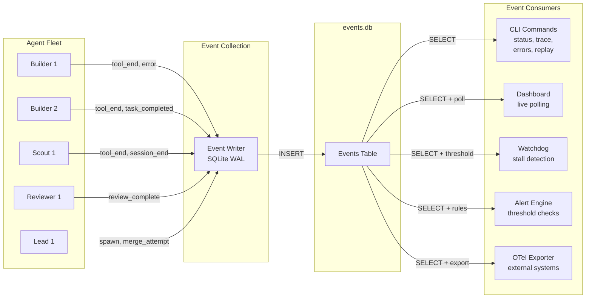
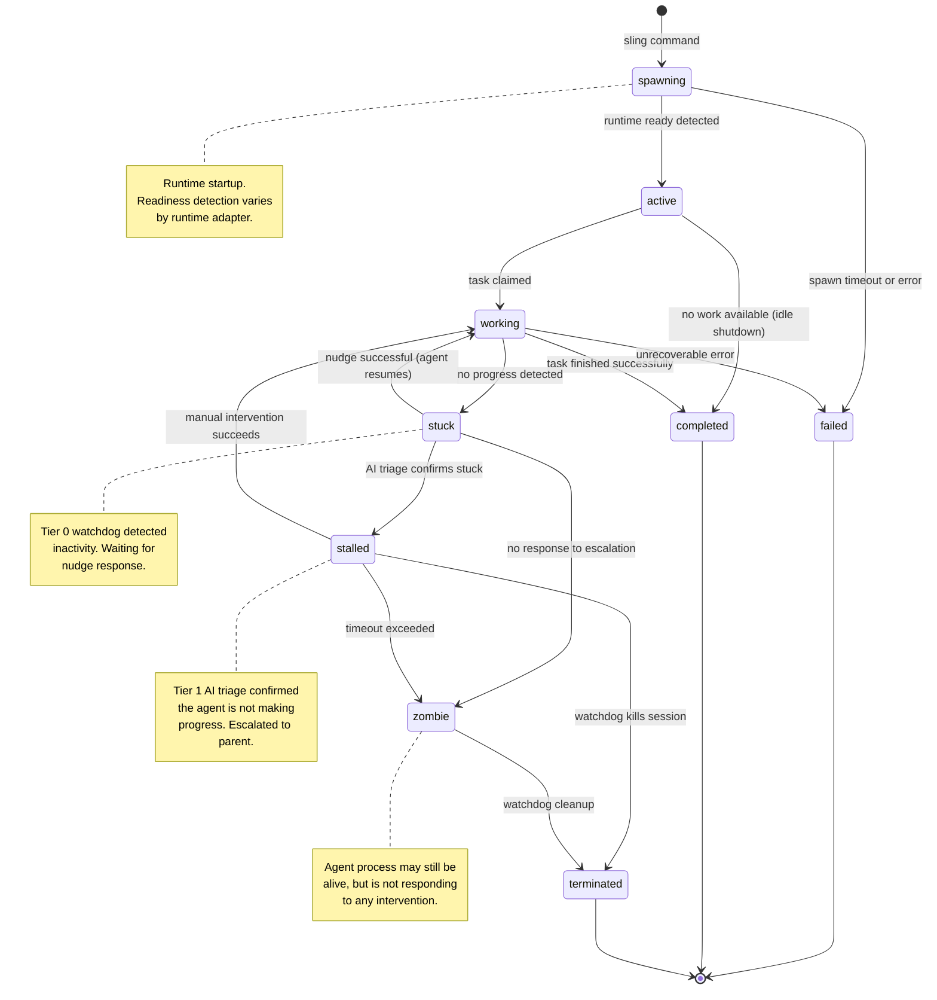
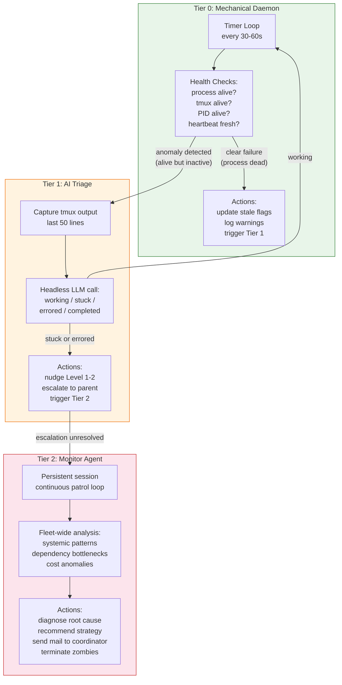
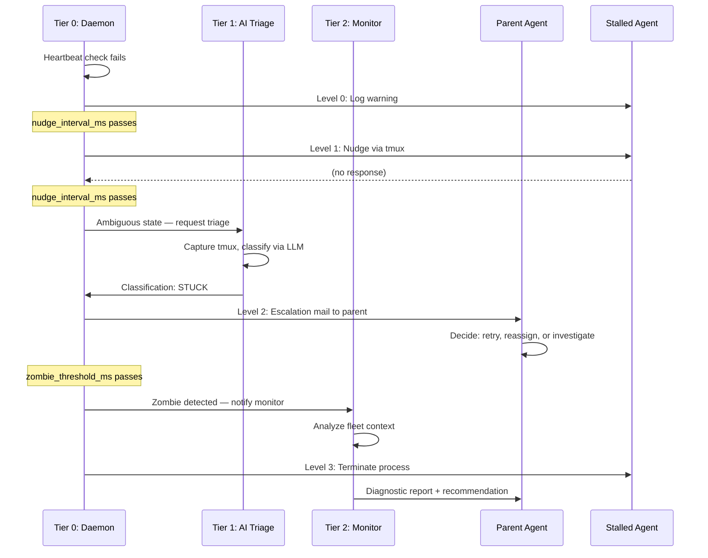
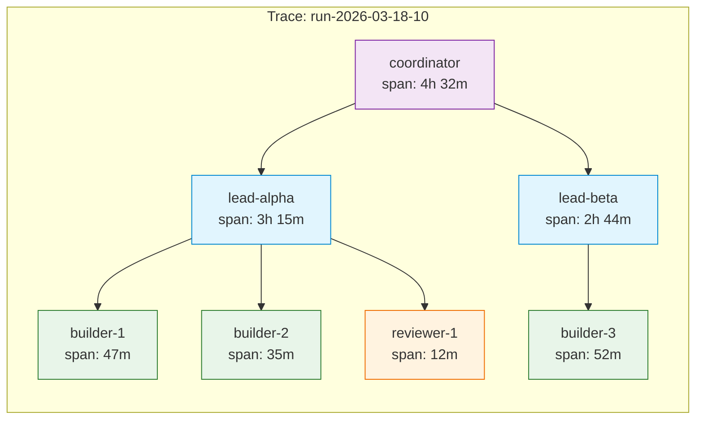
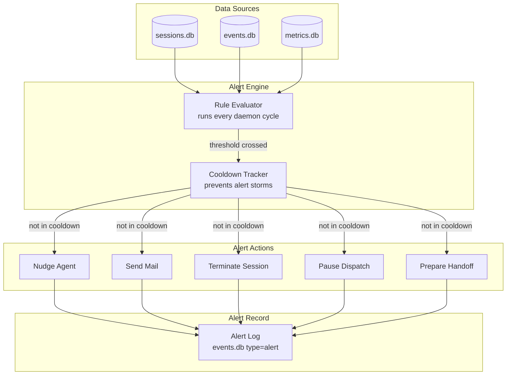

# 13 -- Observability

**Document type:** Technical specification
**Status:** DRAFT
**Date:** 2026-03-18
**Scope:** Monitoring, metrics, and observability subsystem for the unified platform
**Prerequisites:** 03-system-architecture.md, 05-data-model.md, 06-communication-model.md

---

## 1. Observability Philosophy

### Why Agent Observability Is Different

Service observability assumes long-running processes that respond to requests.
Agent observability deals with a fundamentally different substrate:

- **Agents are autonomous.** They decide what to do next. You cannot predict
  their behavior from their inputs.
- **Sessions are ephemeral.** An agent session might last 5 minutes or 2 hours.
  Context windows fill up. Sessions crash. Models go down mid-task.
- **Context is finite.** Every token of observability data injected into an
  agent's context displaces a token of useful work. Observability must be
  cheap at the point of collection.
- **Cost is proportional to attention.** Unlike CPU cycles, LLM tokens are
  expensive. A stalled agent burning $0.50/minute of idle token consumption
  is a financial emergency, not a performance curiosity.

Traditional three-pillar observability (logs, metrics, traces) maps imperfectly.
The platform adapts the pillars to agent reality:

| Pillar | Traditional | Agent Equivalent |
|--------|------------|------------------|
| Logs | Application log lines | Structured events (tool calls, spawns, errors, mail) |
| Metrics | Request rate, latency, error rate | Token usage, cost, throughput, quality scores |
| Traces | Distributed request traces | Agent session lineage (coordinator -> lead -> builder) |

### The Five Questions

Every CLI command, dashboard view, and alert rule exists to answer one of
these five questions:

1. **What is every agent doing right now?**
   Fleet status, current tasks, context usage, last activity.

2. **Which agents are stuck, slow, or zombie?**
   Heartbeat freshness, stall detection, progressive escalation.

3. **How much is this costing?**
   Token usage per agent, per task, per convoy. Projected run cost.

4. **What is the quality trend?**
   Review scores, merge success rates, gate pass rates, retry counts.

5. **Where are the bottlenecks?**
   Merge queue depth, dependency chains, agent wait times, tool call
   durations.

If the system cannot answer all five within 10 seconds, the observability
stack has failed.

### Design Principles

**If you cannot see it, you cannot fix it.** Full visibility into every agent
session, every tool call, every message, every merge attempt. No silent
failures. No unobserved state transitions.

**Collect everything, inject nothing.** Observability data is written to SQLite
databases outside the agent's context window. Agents do not pay token costs for
monitoring. The watchdog reads observability data; agents produce it as a
side effect of normal operation.

**Operational data is ephemeral.** Events, metrics, and session records are
instance-local SQLite databases. They do not need version control, federation,
or git history. They can be deleted and rebuilt without data loss (the work
state in Dolt is the source of truth).

**Progressive detail.** Fleet status in one command. Drill into a single
agent with `inspect`. Full chronological replay with `trace`. Cost breakdown
with `costs`. Each command adds detail without requiring the previous one.

---

## 2. Event System

The event store is the central nervous system of observability. Every
significant agent action produces a typed event. Events are the raw material
from which dashboards, alerts, traces, and replays are constructed.

### events.db Schema

```sql
CREATE TABLE events (
    id INTEGER PRIMARY KEY AUTOINCREMENT,
    run_id TEXT,
    session_id TEXT NOT NULL,
    agent_id TEXT NOT NULL,
    event_type TEXT NOT NULL,
    tool_name TEXT,
    tool_args TEXT,
    tool_duration_ms INTEGER,
    level TEXT CHECK (level IN ('debug', 'info', 'warn', 'error'))
        DEFAULT 'info',
    data JSON,
    timestamp TIMESTAMP DEFAULT CURRENT_TIMESTAMP
);

CREATE INDEX idx_events_type ON events(event_type);
CREATE INDEX idx_events_agent ON events(agent_id);
CREATE INDEX idx_events_session ON events(session_id);
CREATE INDEX idx_events_time ON events(timestamp);
CREATE INDEX idx_events_run ON events(run_id);
CREATE INDEX idx_events_level ON events(level);
```

**Database configuration:**

```sql
PRAGMA journal_mode = WAL;
PRAGMA busy_timeout = 5000;
PRAGMA synchronous = NORMAL;
```

WAL mode is essential. With 10+ agents writing events concurrently, WAL
provides non-blocking reads and sub-millisecond write transactions.

### Event Types

| Type | Level | Description | Data Payload |
|------|-------|-------------|--------------|
| `tool_start` | debug | Agent began a tool call | `{tool, args_summary}` |
| `tool_end` | info | Agent completed a tool call | `{tool, duration_ms, success, result_summary}` |
| `session_start` | info | Agent session created | `{role, runtime, model, worktree, parent_session}` |
| `session_end` | info | Agent session terminated | `{exit_code, reason, duration_ms}` |
| `spawn` | info | Agent spawned a child | `{child_id, child_role, worktree, depth}` |
| `error` | error | Error occurred | `{error_type, message, stack, recoverable}` |
| `merge_attempt` | info | Merge queue processed a branch | `{branch, tier, success, conflicts[]}` |
| `merge_success` | info | Branch merged cleanly | `{branch, tier, merge_commit}` |
| `merge_failure` | warn | Merge failed | `{branch, tier, conflict_files[], error}` |
| `review_complete` | info | Code review finished | `{verdict, findings_count, scores}` |
| `mail_sent` | debug | Agent dispatched a message | `{to, subject, protocol_type}` |
| `mail_received` | debug | Agent read a message | `{from, subject, protocol_type}` |
| `task_claimed` | info | Agent claimed a work item | `{work_item_id, priority, title}` |
| `task_completed` | info | Agent finished a work item | `{work_item_id, duration_ms, quality_score}` |
| `checkpoint` | info | Context checkpoint saved | `{progress_pct, completed_steps, remaining_steps}` |
| `handoff` | warn | Context exhaustion handoff | `{from_session, to_session, reason, checkpoint_path}` |
| `quality_gate` | info | QA gate evaluated | `{gate_name, passed, score, blockers[]}` |
| `nudge` | info | Agent nudged by watchdog | `{level, reason, target_agent}` |
| `escalation` | warn | Issue escalated up hierarchy | `{from, to, issue, severity}` |
| `heartbeat` | debug | Agent liveness signal | `{status, context_usage_pct, current_task}` |
| `stall_detected` | warn | Agent appears stuck | `{agent_id, idle_duration_ms, last_tool}` |
| `zombie_detected` | error | Agent unresponsive | `{agent_id, last_heartbeat, action_taken}` |
| `cost_threshold` | warn | Cost limit approaching | `{current_cost, threshold, agent_id}` |
| `custom` | info | Extension point | `{...}` (user-defined) |

### Smart Arg Filtering

Tool arguments are filtered before storage to prevent context pollution and
sensitive data leakage:

```typescript
interface ToolFilter {
  // Always preserved (useful for debugging)
  preserveFilePathArgs: true;
  preserveCommandArgs: true;

  // Truncated (large content is noise in event logs)
  maxContentBodyLength: 200;      // chars, then "...[truncated]"
  maxArrayElements: 5;            // show first 5, then "...[+N more]"

  // Redacted (security)
  redactPatterns: [
    /(?:api[_-]?key|token|password|secret)\s*[:=]\s*\S+/gi,
    /(?:Bearer|Basic)\s+\S+/gi,
    /[A-Za-z0-9+/]{40,}/g         // long base64 strings
  ];

  // Dropped (irrelevant noise)
  dropKeys: ['raw_content', 'full_response', 'binary_data'];
}
```

### Event Store Interface

```typescript
interface EventStore {
  // Write
  insert(event: InsertEvent): number;
  insertBatch(events: InsertEvent[]): number[];

  // Read
  getByAgent(agentId: string, opts?: QueryOpts): StoredEvent[];
  getBySession(sessionId: string, opts?: QueryOpts): StoredEvent[];
  getByRun(runId: string, opts?: QueryOpts): StoredEvent[];
  getByType(eventType: string, opts?: QueryOpts): StoredEvent[];
  getErrors(opts?: QueryOpts): StoredEvent[];
  getTimeline(opts: TimelineOpts): StoredEvent[];

  // Aggregation
  getToolStats(opts?: QueryOpts): ToolStats[];
  correlateToolEnd(agentId: string, toolName: string):
    { startId: number; durationMs: number } | null;

  // Maintenance
  purge(opts: PurgeOpts): number;
  close(): void;
}

interface QueryOpts {
  since?: string;       // ISO timestamp
  until?: string;       // ISO timestamp
  limit?: number;       // max results (default 100)
  level?: EventLevel;   // filter by min level
  offset?: number;      // pagination
}
```

### Event Flow Diagram



---

## 3. Session Tracking

Sessions are the unit of agent lifecycle. Each time an agent spawns -- whether
a fresh start or a handoff continuation -- a new session record is created.
Session tracking answers: who ran, for how long, doing what, and what happened.

### sessions.db Schema

```sql
CREATE TABLE sessions (
    id TEXT PRIMARY KEY,
    run_id TEXT,
    agent_id TEXT NOT NULL,
    agent_name TEXT NOT NULL,
    role TEXT NOT NULL,
    depth INTEGER NOT NULL CHECK (depth BETWEEN 0 AND 3),
    parent_session_id TEXT,
    status TEXT CHECK (status IN (
        'spawning', 'active', 'working', 'stuck',
        'completed', 'failed', 'stalled', 'zombie', 'terminated'
    )) DEFAULT 'spawning',
    started_at TIMESTAMP NOT NULL DEFAULT CURRENT_TIMESTAMP,
    completed_at TIMESTAMP,
    last_heartbeat TIMESTAMP,
    last_tool_call TIMESTAMP,
    worktree_path TEXT,
    tmux_session TEXT,
    tmux_pane TEXT,
    pid INTEGER,
    runtime TEXT NOT NULL,
    model TEXT,
    work_item_id TEXT,
    branch_name TEXT,
    merge_result TEXT,
    error_message TEXT,
    checkpoint_file TEXT,
    context_usage_pct REAL DEFAULT 0.0,
    handoff_from TEXT,
    handoff_to TEXT
);

CREATE INDEX idx_sessions_agent ON sessions(agent_id);
CREATE INDEX idx_sessions_status ON sessions(status);
CREATE INDEX idx_sessions_run ON sessions(run_id);
CREATE INDEX idx_sessions_parent ON sessions(parent_session_id);
CREATE INDEX idx_sessions_started ON sessions(started_at);
```

### Session State Machine



### Session Lineage

Sessions form a tree rooted at the coordinator. The `parent_session_id` field
creates the lineage chain used for trace propagation:

```
coordinator-session-001
  ├── lead-alpha-session-002
  │   ├── builder-1-session-003
  │   ├── builder-2-session-004
  │   │   └── builder-2-session-007 (handoff continuation)
  │   └── scout-1-session-005
  └── lead-beta-session-006
      ├── builder-3-session-008
      └── reviewer-1-session-009
```

This tree is queryable via recursive CTE:

```sql
-- Get all descendant sessions of a coordinator run
WITH RECURSIVE session_tree AS (
    SELECT id, agent_name, role, depth, parent_session_id, status
    FROM sessions
    WHERE id = :root_session_id

    UNION ALL

    SELECT s.id, s.agent_name, s.role, s.depth, s.parent_session_id, s.status
    FROM sessions s
    JOIN session_tree st ON s.parent_session_id = st.id
)
SELECT * FROM session_tree ORDER BY depth, agent_name;
```

---

## 4. Metrics Collection

Metrics track resource consumption: tokens in, tokens out, cost, time, and
productivity indicators. Unlike events (which record what happened), metrics
record how much.

### metrics.db Schema

```sql
CREATE TABLE session_metrics (
    id TEXT PRIMARY KEY,
    session_id TEXT NOT NULL,
    agent_id TEXT NOT NULL,
    run_id TEXT,

    -- Token consumption
    input_tokens INTEGER DEFAULT 0,
    output_tokens INTEGER DEFAULT 0,
    cache_read_tokens INTEGER DEFAULT 0,
    cache_creation_tokens INTEGER DEFAULT 0,
    total_tokens INTEGER DEFAULT 0,

    -- Cost
    estimated_cost_usd REAL DEFAULT 0.0,
    model_used TEXT,

    -- Timing
    started_at TIMESTAMP,
    completed_at TIMESTAMP,
    duration_ms INTEGER DEFAULT 0,

    -- Productivity
    tool_call_count INTEGER DEFAULT 0,
    turns_completed INTEGER DEFAULT 0,
    files_read INTEGER DEFAULT 0,
    files_written INTEGER DEFAULT 0,
    lines_changed INTEGER DEFAULT 0,

    -- Quality
    tests_run INTEGER DEFAULT 0,
    tests_passed INTEGER DEFAULT 0,
    quality_score REAL,
    review_findings INTEGER DEFAULT 0,

    -- Merge
    merge_attempts INTEGER DEFAULT 0,
    merge_successes INTEGER DEFAULT 0,

    -- Work
    tasks_claimed INTEGER DEFAULT 0,
    tasks_completed INTEGER DEFAULT 0
);

CREATE INDEX idx_metrics_session ON session_metrics(session_id);
CREATE INDEX idx_metrics_agent ON session_metrics(agent_id);
CREATE INDEX idx_metrics_run ON session_metrics(run_id);
CREATE INDEX idx_metrics_started ON session_metrics(started_at);
```

### Token Snapshots

Point-in-time token usage for live agents, enabling real-time cost tracking:

```sql
CREATE TABLE token_snapshots (
    id INTEGER PRIMARY KEY AUTOINCREMENT,
    session_id TEXT NOT NULL,
    agent_id TEXT NOT NULL,
    input_tokens INTEGER DEFAULT 0,
    output_tokens INTEGER DEFAULT 0,
    cache_read_tokens INTEGER DEFAULT 0,
    cache_creation_tokens INTEGER DEFAULT 0,
    estimated_cost_usd REAL DEFAULT 0.0,
    model_used TEXT,
    captured_at TIMESTAMP DEFAULT CURRENT_TIMESTAMP
);

CREATE INDEX idx_snapshots_session ON token_snapshots(session_id);
CREATE INDEX idx_snapshots_agent ON token_snapshots(agent_id);
CREATE INDEX idx_snapshots_time ON token_snapshots(captured_at);
```

Snapshots are captured periodically (default: every 60 seconds) by the
watchdog daemon. They enable cost-over-time graphs and burn-rate alerting.

### Derived Metrics

These are computed on query, not stored. Each maps to a CLI command or
dashboard widget.

| Metric | Computation | CLI |
|--------|-------------|-----|
| Cost per work item | `SUM(estimated_cost_usd) GROUP BY work_item_id` | `platform costs --bead wi-xxx` |
| Cost per convoy | `SUM(cost) JOIN convoy_items ON work_item_id` | `platform costs --convoy cv-xxx` |
| Agent efficiency | `tasks_completed / (total_tokens / 1000)` | `platform metrics --agent xxx` |
| Token burn rate | `delta(total_tokens) / delta(time)` over snapshots | `platform costs --live` |
| Review precision | `true_positives / (true_positives + false_positives)` | `platform metrics --agent reviewer-1` |
| Merge success rate | `merge_successes / merge_attempts` | `platform metrics --merge` |
| Time to resolution | `completed_at - started_at` per work item | `platform metrics --ttm` |
| Fleet utilization | `active_sessions / total_sessions` | `platform status` |
| Quality trend | `AVG(quality_score) OVER (PARTITION BY run_id)` | `platform metrics --quality` |
| Cache hit rate | `cache_read_tokens / (input_tokens + cache_read_tokens)` | `platform costs --cache` |

### Runtime-Agnostic Pricing

Cost estimation normalizes across runtimes and models:

```typescript
interface PricingTable {
  [model: string]: {
    inputPerMillion: number;
    outputPerMillion: number;
    cacheReadPerMillion: number;
    cacheCreationPerMillion: number;
  };
}

const PRICING: PricingTable = {
  'claude-opus-4':     { inputPerMillion: 15.00, outputPerMillion: 75.00,
                         cacheReadPerMillion: 1.50, cacheCreationPerMillion: 18.75 },
  'claude-sonnet-4':   { inputPerMillion: 3.00,  outputPerMillion: 15.00,
                         cacheReadPerMillion: 0.30, cacheCreationPerMillion: 3.75 },
  'claude-haiku-3.5':  { inputPerMillion: 0.80,  outputPerMillion: 4.00,
                         cacheReadPerMillion: 0.08, cacheCreationPerMillion: 1.00 },
  'gpt-4.1':           { inputPerMillion: 2.00,  outputPerMillion: 8.00,
                         cacheReadPerMillion: 0.50, cacheCreationPerMillion: 2.50 },
  'gemini-2.5-pro':    { inputPerMillion: 1.25,  outputPerMillion: 10.00,
                         cacheReadPerMillion: 0.32, cacheCreationPerMillion: 1.56 },
};
```

Each runtime adapter implements `parseTranscript()` to extract token counts
from its native transcript format. The pricing module computes cost from
normalized token counts.

---

## 5. Three-Tier Watchdog System

The watchdog is the self-healing mechanism. It detects stuck, crashed, and
zombie agents and remediates them without human intervention. Three tiers
provide escalating intelligence at escalating cost.

### Tier Architecture



### Tier 0: Mechanical Daemon

A background process that runs on a timer. No LLM calls, no AI -- pure
mechanical checks against observable state.

```bash
platform watch --interval 30000 --background
```

**Check sequence (every cycle):**

```
FOR EACH session WHERE status IN ('active', 'working', 'stuck'):

  1. PROCESS CHECK
     Is the PID still alive? (kill -0 $PID)
     If NO → mark session as 'failed', log error event, skip remaining checks

  2. TMUX CHECK
     Does the tmux session exist? (tmux has-session -t $session)
     If NO → mark session as 'zombie', log error event, skip remaining checks

  3. HEARTBEAT CHECK
     Is last_heartbeat within stale_threshold_ms?
     If NO → mark as 'stalled', emit stall_detected event

  4. ACTIVITY CHECK
     Is last_tool_call within stale_threshold_ms?
     If NO and status != 'stuck':
       → Update status to 'stuck'
       → Emit stall_detected event
       → Increment escalation level

  5. CONTEXT CHECK
     Is context_usage_pct > 85%?
     If YES → emit cost_threshold event (context exhaustion imminent)

  6. STATE RECONCILIATION
     Does recorded status match observed reality?
     If NO → log reconciliation event with mismatch details
```

**Health check record:**

```typescript
interface HealthCheck {
  agentName: string;
  sessionId: string;
  timestamp: string;
  processAlive: boolean;
  tmuxAlive: boolean;
  pidAlive: boolean | null;
  lastHeartbeat: string;
  lastToolCall: string;
  contextUsagePct: number;
  state: SessionStatus;
  observedState: 'alive' | 'dead' | 'ambiguous';
  action: 'none' | 'nudge' | 'escalate' | 'terminate' | 'investigate';
  reconciliationNote: string | null;
}
```

### Tier 1: AI Triage

Triggered when Tier 0 detects an ambiguous situation: the process is alive,
the tmux session exists, but the agent has not made a tool call in N minutes.
Is it genuinely stuck, or is it reasoning about a hard problem?

**Triage sequence:**

```
1. CAPTURE tmux output (last 50 lines)
   tmux capture-pane -t $session -p -S -50

2. SEND to headless LLM for classification
   claude --print --model haiku <<EOF
   You are analyzing an AI agent's terminal output to determine its state.

   Agent: $agent_name
   Role: $role
   Task: $task_description
   Last tool call: $minutes_ago minutes ago
   Terminal output:
   ---
   $tmux_output
   ---

   Classify this agent's state as exactly one of:
   - WORKING: Agent is actively reasoning or waiting for a tool response
   - STUCK: Agent is in a loop, waiting for input, or not making progress
   - ERRORED: Agent encountered an error and stopped
   - COMPLETED: Agent finished its task but did not signal completion

   Respond with: STATE: <classification>
   REASON: <one-sentence explanation>
   ACTION: <recommended action>
   EOF

3. PARSE classification and act:
   WORKING   → reset stale timer, no action
   STUCK     → nudge (Level 1), then escalate (Level 2) if no response
   ERRORED   → escalate immediately to parent
   COMPLETED → prompt agent to send worker_done signal
```

**Cost:** ~$0.01-0.03 per triage (Haiku, ~500 input tokens, ~50 output tokens).
At one triage every 5 minutes for a fleet of 10 agents, worst case ~$0.36/hour.

### Tier 2: Monitor Agent

A persistent Claude Code session that patrols the entire fleet. Unlike Tier 1
(ephemeral, per-agent), the Monitor has continuous context about fleet patterns
and history.

```bash
platform monitor start     # spawns persistent monitor session
platform monitor stop      # graceful shutdown
platform monitor status    # is the monitor running?
```

**Monitor capabilities:**

```typescript
interface MonitorCapabilities {
  // Data access (read-only)
  readSessions(): Session[];
  readEvents(opts: QueryOpts): StoredEvent[];
  readMetrics(opts: QueryOpts): SessionMetrics[];
  readMail(agent: string): Message[];
  readMergeQueue(): MergeQueueEntry[];

  // Analysis
  detectSystemicIssues(): Issue[];        // all builders stuck on same dep
  detectCostAnomalies(): CostAnomaly[];   // agent burning 3x expected cost
  detectQualityDrift(): QualityAlert[];   // review scores declining

  // Actions
  sendMail(to: string, message: Message): void;
  nudgeAgent(agent: string, text: string): void;
  escalateToCoordinator(issue: string, severity: string): void;
  recommendAction(context: string): string;
}
```

**Patrol loop (implemented as a wisp molecule):**

```
EVERY patrol_interval_ms (default: 120000):

  1. FLEET SCAN
     Read all active sessions, recent events, current metrics

  2. PATTERN DETECTION
     - Multiple agents stuck on same dependency → dependency bottleneck
     - Merge queue depth > threshold → merge backlog
     - Agent retry count > 3 on same task → task too hard for role
     - Cost burn rate > 2x average → cost anomaly
     - Review scores declining over last N reviews → quality drift

  3. TRIAGE SUPPORT
     For any agents flagged by Tier 0/1, review full context:
     - Recent events, mail history, tool call patterns
     - Compare to known patterns in expertise store
     - Generate diagnosis and recommended action

  4. REPORT
     Send summary mail to coordinator:
     - Fleet health: N active, N idle, N stuck, N zombie
     - Anomalies detected (if any)
     - Recommendations (if any)
     - Cost update: $X spent this run, projected $Y total
```

### Watchdog Configuration

```yaml
watchdog:
  enabled: true
  daemon_interval_ms: 30000         # Tier 0 check frequency
  stale_threshold_ms: 300000        # 5 min no activity = stale
  zombie_threshold_ms: 600000       # 10 min no response = zombie
  nudge_interval_ms: 60000          # 1 min between escalation levels
  max_escalation_level: 3           # 0=warn, 1=nudge, 2=escalate, 3=terminate

  tier1:
    enabled: true
    model: 'claude-haiku-3.5'       # cheap model for classification
    tmux_capture_lines: 50
    max_concurrent_triages: 3

  tier2:
    enabled: true
    model: 'claude-sonnet-4'        # smarter model for fleet analysis
    patrol_interval_ms: 120000      # 2 min patrol cycle
    auto_start: false               # manual start for solo developer
```

### Escalation Ladder



---

## 6. Dashboard and CLI

### Fleet Status View

The primary entry point. One command, full fleet picture.

```bash
platform status
```

```
Fleet Status                                    2026-03-18 14:32:07
═════════════════════════════════════════════════════════════════════
Fleet: 12 active  2 idle  0 stuck  0 zombie     Run: run-2026-03-18-10
Cost:  $4.32 today (2.1M in / 890K out)         Uptime: 4h 32m

AGENTS
  Name             Role        Status   Task                    Ctx    Last Activity
  ─────────────────────────────────────────────────────────────────────────────────
  coordinator      coordinator active   orchestrate-build       42%    12s ago
  lead-alpha       lead        active   decompose-auth          67%    8s ago
  lead-beta        lead        active   decompose-api           31%    3s ago
  builder-1        builder     working  wi-a1b2 (auth service)  55%    1s ago
  builder-2        builder     working  wi-c3d4 (api gateway)   23%    4s ago
  builder-3        builder     idle     --                       0%    12m ago
  builder-4        builder     working  wi-e5f6 (data layer)    71%    2s ago
  reviewer-1       reviewer    working  review wi-a1b2          12%    6s ago
  reviewer-2       reviewer    idle     --                       0%    8m ago
  scout-1          scout       working  explore-schema          18%    15s ago
  watchdog         monitor     active   patrol cycle #47         9%    30s ago
  queue-proc       merger      working  merge queue (depth: 3)  14%    5s ago

MERGE QUEUE
  Pending: 3  |  Processing: 1  |  Merged today: 7  |  Failed: 1

CONVOYS
  cv-user-auth     [████████░░]  80%   4/5 items done    ETA: 25m
  cv-api-layer     [███░░░░░░░]  30%   3/10 items done   ETA: 2h 10m

COST BREAKDOWN (top 3)
  builder-1:  $1.23  (28%)   builder-4:  $0.98  (23%)   lead-alpha:  $0.67  (16%)
```

### Agent Inspection

Deep drill-down into a single agent.

```bash
platform inspect builder-1
```

```
Agent: builder-1                                2026-03-18 14:32:15
═════════════════════════════════════════════════════════════════════
Session:    sess-x7y8z9        Runtime: claude-code    Model: sonnet-4
Role:       builder            Depth:   2              Parent: lead-alpha
Worktree:   .platform/worktrees/builder-1
Branch:     worker/builder-1/wi-a1b2c3
Task:       wi-a1b2c3 — Implement user authentication service
Started:    2026-03-18 13:45:22 (47m ago)
Context:    55% (est. ~45m remaining at current rate)

RECENT TOOL CALLS (last 10)
  14:31:58  Edit       src/services/auth.ts          280ms  ✓
  14:31:42  Read       src/middleware/jwt.ts           45ms  ✓
  14:31:30  Bash       npm test -- --grep auth        3.2s  ✓
  14:31:12  Edit       src/services/auth.test.ts     190ms  ✓
  14:30:55  Read       contracts/api-auth-v1.yaml      38ms  ✓
  14:30:41  Grep       "validateToken" src/           120ms  ✓
  14:30:22  Edit       src/services/auth.ts          310ms  ✓
  14:29:58  Bash       npm run lint                   1.8s  ✓
  14:29:30  Read       src/routes/auth.routes.ts       42ms  ✓
  14:29:15  Glob       **/*.test.ts                    85ms  ✓

METRICS
  Tokens:     145K in / 62K out / 12K cache    Cost: $1.23
  Tool calls: 87    Turns: 34    Files modified: 4
  Tests:      12 run, 12 passed

MAIL (2 sent, 1 received)
  Sent:     worker_done (wi-g7h8) to lead-alpha       14:10:22
  Sent:     status (progress update) to lead-alpha     13:55:00
  Received: assign (wi-a1b2c3) from lead-alpha         13:45:30
```

### Chronological Trace

Full event timeline, optionally across multiple agents.

```bash
platform trace builder-1 --since "30m ago" --limit 50
platform trace --run run-2026-03-18-10 --limit 200
platform replay --agent builder-1 --agent builder-2  # interleaved
```

### Error Aggregation

```bash
platform errors
platform errors --agent builder-1
platform errors --run run-2026-03-18-10
platform errors --since "1h ago"
```

### Cost Analysis

```bash
platform costs                           # summary for current run
platform costs --live                    # real-time token burn rates
platform costs --agent builder-1         # single agent breakdown
platform costs --bead wi-a1b2c3          # cost per work item
platform costs --convoy cv-user-auth     # cost per convoy
platform costs --by-role                 # grouped by role (builder, lead, etc.)
platform costs --run run-xxx             # full run breakdown
```

### Live Feed

Real-time event stream for terminal monitoring.

```bash
platform feed --follow                   # all events, live tail
platform feed --follow --agent builder-1 # single agent
platform feed --follow --level warn      # warnings and errors only
platform feed --follow --type merge_*    # merge events only
```

---

## 7. Audit Trail

An append-only log of all significant state changes. Unlike events (which
track agent actions), the audit trail tracks mutations to persistent state:
work items, agents, merge requests, convoys.

The audit trail lives in Dolt (not SQLite) because it is part of the
permanent record and benefits from version control.

### audit_log Table

```sql
CREATE TABLE audit_log (
    id CHAR(36) NOT NULL DEFAULT (UUID()),
    timestamp DATETIME NOT NULL DEFAULT CURRENT_TIMESTAMP,
    actor TEXT NOT NULL,
    action TEXT NOT NULL,
    entity_type TEXT NOT NULL,
    entity_id TEXT NOT NULL,
    before_state JSON,
    after_state JSON,
    reason TEXT,

    PRIMARY KEY (id),
    INDEX idx_audit_timestamp (timestamp),
    INDEX idx_audit_actor (actor),
    INDEX idx_audit_entity (entity_type, entity_id),
    INDEX idx_audit_action (action)
);
```

**Field semantics:**

| Field | Description | Examples |
|-------|-------------|----------|
| `actor` | Who performed the action | `builder-1`, `coordinator`, `system`, `human` |
| `action` | What was done | `create`, `claim`, `update`, `close`, `merge`, `escalate`, `nudge`, `terminate` |
| `entity_type` | What was acted upon | `work_item`, `session`, `convoy`, `merge_request`, `agent`, `config` |
| `entity_id` | Identifier of the entity | `wi-a1b2c3`, `sess-x7y8z9`, `cv-user-auth` |
| `before_state` | State before mutation (JSON snapshot) | `{"status": "open", "assignee": null}` |
| `after_state` | State after mutation (JSON snapshot) | `{"status": "active", "assignee": "builder-1"}` |
| `reason` | Why the action was taken | `"claimed for implementation"`, `"zombie timeout"` |

**Append-only invariant:** Rows are never updated or deleted. The audit trail
is the complete history of all mutations. Dolt commit history provides an
additional layer of immutability -- even if a row were somehow deleted, the
previous Dolt commit would still contain it.

### Query Patterns

```sql
-- What happened to a specific work item?
SELECT timestamp, actor, action, reason
FROM audit_log
WHERE entity_type = 'work_item' AND entity_id = 'wi-a1b2c3'
ORDER BY timestamp;

-- What did a specific agent do?
SELECT timestamp, action, entity_type, entity_id, reason
FROM audit_log
WHERE actor = 'builder-1'
ORDER BY timestamp DESC
LIMIT 50;

-- All escalations in the last hour
SELECT *
FROM audit_log
WHERE action = 'escalate'
  AND timestamp > NOW() - INTERVAL 1 HOUR
ORDER BY timestamp;
```

---

## 8. OpenTelemetry Integration

For environments that want to export observability data to external stacks
(Grafana, Datadog, Jaeger, VictoriaMetrics), the platform provides an OTel
integration layer. This is opt-in with zero overhead when disabled.

### Configuration

```bash
# Enable OTLP export
export PLATFORM_OTEL_METRICS_URL="http://localhost:8428/opentelemetry/api/v1/push"
export PLATFORM_OTEL_TRACES_URL="http://localhost:4318/v1/traces"

# Or enable stdout export for development
export PLATFORM_OTEL_STDOUT="true"
```

When neither variable is set, no-op providers are installed. Zero allocations,
zero overhead.

### Span Structure

Every CLI command and agent session creates spans:

```
platform.command.sling                    [coordinator]
  └── platform.session.builder-1          [builder-1, 47m]
        ├── platform.tool.Read            [45ms]
        ├── platform.tool.Edit            [280ms]
        ├── platform.tool.Bash            [3.2s]
        ├── platform.mail.send            [2ms]
        └── platform.quality_gate         [1.8s]

platform.command.merge                    [coordinator]
  └── platform.merge.wi-a1b2c3           [12s]
        ├── platform.merge.attempt.tier1  [8s, success]
        └── platform.merge.commit         [4s]
```

**Span attributes:**

```typescript
interface SpanAttributes {
  'platform.command': string;
  'platform.version': string;
  'platform.agent': string;
  'platform.role': string;
  'platform.session_id': string;
  'platform.run_id': string;
  'platform.model': string;
  'platform.work_item_id'?: string;
}
```

### Exported Metrics

| Metric | Type | Description |
|--------|------|-------------|
| `platform.tokens.input` | counter | Total input tokens consumed |
| `platform.tokens.output` | counter | Total output tokens consumed |
| `platform.cost.usd` | counter | Total estimated cost in USD |
| `platform.sessions.active` | gauge | Number of active agent sessions |
| `platform.merge.queue_depth` | gauge | Number of pending merge requests |
| `platform.merge.duration_ms` | histogram | Merge operation latency |
| `platform.tool.duration_ms` | histogram | Tool call latency |
| `platform.errors.total` | counter | Total error events |
| `platform.quality.score` | histogram | Quality gate scores |
| `platform.db.retry_count` | counter | Database retry attempts |
| `platform.db.lock_wait_ms` | histogram | Time waiting for DB locks |

### Trace Context Propagation

Trace context flows through the agent hierarchy via session lineage:



The `parent_session_id` in sessions.db maps directly to OTel parent span IDs.
When exporting, the session tree becomes a trace tree.

### Recommended Local Stack

```yaml
# docker-compose.observability.yml
services:
  victoria-metrics:
    image: victoriametrics/victoria-metrics:latest
    ports: ["8428:8428"]
    volumes: ["./data/vm:/victoria-metrics-data"]

  victoria-logs:
    image: victoriametrics/victoria-logs:latest
    ports: ["9428:9428"]
    volumes: ["./data/vl:/victoria-logs-data"]

  grafana:
    image: grafana/grafana:latest
    ports: ["3000:3000"]
    volumes: ["./grafana/dashboards:/var/lib/grafana/dashboards"]
    environment:
      - GF_SECURITY_ADMIN_PASSWORD=admin
```

---

## 9. Expertise Store (Organizational Memory)

The expertise store captures patterns learned from agent operations. It is
the bridge between observability (what happened) and intelligence (what to
do about it). Derived from Overstory's Mulch system.

### expertise Table

```sql
CREATE TABLE expertise (
    id CHAR(36) NOT NULL DEFAULT (UUID()),
    domain TEXT NOT NULL,
    pattern TEXT NOT NULL,
    context TEXT,
    source_agent TEXT,
    source_session TEXT,
    confidence REAL DEFAULT 0.5 CHECK (confidence BETWEEN 0.0 AND 1.0),
    created_at DATETIME NOT NULL DEFAULT CURRENT_TIMESTAMP,
    last_used DATETIME,
    use_count INTEGER DEFAULT 0,

    PRIMARY KEY (id),
    INDEX idx_expertise_domain (domain),
    INDEX idx_expertise_confidence (confidence DESC),
    INDEX idx_expertise_used (last_used DESC)
);
```

### Domains

| Domain | What Is Learned | Example Pattern |
|--------|----------------|-----------------|
| `merge` | Conflict resolution strategies | "Files in src/services/ commonly conflict on import blocks. Resolve by taking the union of imports." |
| `review` | Common review findings | "Auth endpoints missing rate limiting is a recurring P1. Always check." |
| `build` | Build configuration insights | "This project requires NODE_ENV=test for test suite. .env.test is not auto-loaded." |
| `debug` | Debugging patterns | "EPERM errors on .platform/worktrees usually mean a stale lock file. Remove .git/worktrees/*/locked." |
| `routing` | Agent assignment heuristics | "Builder-1 completes auth tasks 30% faster than other builders (3 prior completions)." |
| `convention` | Project-specific conventions | "This codebase uses barrel exports. Every directory has an index.ts re-exporting all modules." |

### Confidence Scoring

Confidence starts at 0.5 and updates based on outcomes:

```
ON SUCCESSFUL USE:
  confidence = min(1.0, confidence + 0.1 * (1.0 - confidence))
  use_count += 1
  last_used = NOW()

ON FAILED USE:
  confidence = max(0.0, confidence - 0.15)

ON NO USE FOR 30 DAYS:
  confidence = max(0.1, confidence * 0.9)   // decay
```

Entries with confidence < 0.1 are candidates for pruning.

### Integration Points

The expertise store enriches three subsystems:

1. **Merge conflict resolution.** Before AI-assisted merge (Tier 3), the merger
   queries `domain = 'merge'` for patterns matching the conflicting files.
   Relevant patterns are injected into the merge prompt.

2. **Agent routing.** The dispatcher queries `domain = 'routing'` to prefer
   agents with demonstrated expertise in the task's domain.

3. **Monitor agent.** The Tier 2 watchdog reads expertise to distinguish
   between genuine anomalies and known patterns.

---

## 10. Alerting and Escalation

Configurable alert rules that trigger actions when thresholds are crossed.
Alerts bridge the gap between passive observability (data collection) and
active response (intervention).

### Alert Rule Schema

```yaml
alerts:
  # Agent health
  - name: agent_stalled
    description: "Agent has not made a tool call in 5 minutes"
    condition: "last_tool_call < now() - interval '5 minutes'"
    scope: per_session
    action: nudge_level_1
    cooldown_ms: 300000

  - name: agent_zombie
    description: "Agent unresponsive to all interventions for 10 minutes"
    condition: "last_heartbeat < now() - interval '10 minutes' AND escalation_level >= 2"
    scope: per_session
    action: terminate_and_reassign
    cooldown_ms: 0     # no cooldown, act immediately

  # Cost
  - name: cost_threshold_agent
    description: "Single agent cost exceeds $10"
    condition: "estimated_cost_usd > 10.00"
    scope: per_session
    action: notify_coordinator
    cooldown_ms: 600000

  - name: cost_threshold_daily
    description: "Daily fleet cost exceeds $50"
    condition: "sum(estimated_cost_usd) WHERE started_at > today() > 50.00"
    scope: global
    action: notify_coordinator
    cooldown_ms: 3600000

  - name: cost_burn_rate
    description: "Agent token burn rate exceeds 3x fleet average"
    condition: "agent_burn_rate > 3 * avg_fleet_burn_rate"
    scope: per_session
    action: notify_coordinator
    cooldown_ms: 600000

  # Merge queue
  - name: merge_failure_spike
    description: "More than 3 merge failures in the last hour"
    condition: "count(merge_failure events) WHERE timestamp > now() - '1h' > 3"
    scope: global
    action: pause_dispatch
    cooldown_ms: 1800000

  - name: merge_queue_deep
    description: "Merge queue depth exceeds 10"
    condition: "merge_queue_depth > 10"
    scope: global
    action: notify_coordinator
    cooldown_ms: 600000

  # Quality
  - name: quality_degradation
    description: "Average quality score over last 5 reviews below 3.0"
    condition: "avg(quality_score) OVER last 5 reviews < 3.0"
    scope: global
    action: escalate_coordinator
    cooldown_ms: 1800000

  - name: test_failure_rate
    description: "Test pass rate below 80%"
    condition: "tests_passed / tests_run < 0.80"
    scope: per_session
    action: notify_parent
    cooldown_ms: 600000

  # Context
  - name: context_exhaustion_imminent
    description: "Agent context usage above 85%"
    condition: "context_usage_pct > 85"
    scope: per_session
    action: prepare_handoff
    cooldown_ms: 60000
```

### Alert Actions

| Action | Effect |
|--------|--------|
| `nudge_level_1` | Send tmux nudge to the agent |
| `nudge_level_2` | Send escalation mail to parent agent |
| `terminate_and_reassign` | Kill session, create new session for same task |
| `notify_coordinator` | Send mail to coordinator with alert details |
| `notify_parent` | Send mail to the agent's parent (lead or coordinator) |
| `escalate_coordinator` | Send urgent mail to coordinator, request strategy change |
| `pause_dispatch` | Temporarily stop dispatching new work (cool-down period) |
| `prepare_handoff` | Trigger context checkpoint and handoff sequence |

### Alert Event Flow



---

## 11. Doctor System

`platform doctor` runs a comprehensive health check across all observability
databases and infrastructure. It detects misconfigurations, data inconsistencies,
and infrastructure problems before they cause operational failures.

```bash
platform doctor                    # all checks
platform doctor --category db      # database checks only
platform doctor --fix              # auto-fix fixable issues
platform doctor --verbose          # show passing checks too
```

### Check Categories

| Category | Checks | Example |
|----------|--------|---------|
| `db` | SQLite databases exist, WAL mode enabled, not corrupted | "events.db: WAL mode OK" |
| `sessions` | Active sessions have matching tmux processes | "builder-1: session active, tmux alive" |
| `consistency` | Recorded states match observed reality | "builder-2: recorded=working, tmux=dead -> MISMATCH" |
| `config` | Watchdog config valid, alert rules parseable | "watchdog.daemon_interval_ms: 30000 OK" |
| `permissions` | Database files have correct permissions (0600) | "mail.db: mode 0600 OK" |
| `disk` | Database sizes within expected bounds | "events.db: 45MB (OK, threshold 500MB)" |
| `connectivity` | Dolt server reachable, OTel endpoint responding | "Dolt: port 3307 OK" |
| `orphans` | No orphaned worktrees, tmux sessions, or PID files | "2 orphaned worktrees found (fixable)" |

### Auto-Fix Actions

| Issue | Fix |
|-------|-----|
| Orphaned worktree | `git worktree remove --force` |
| Orphaned tmux session | `tmux kill-session -t` |
| Missing WAL mode | `PRAGMA journal_mode=WAL` |
| Stale session record (process dead) | Update status to `terminated` |
| Oversized events.db | Purge events older than 7 days |

---

## 12. CLI Command Reference

All observability commands support `--json` for machine-readable output.
This is the interface that agents (particularly the monitor and coordinator)
use to query observability data programmatically.

```bash
# Fleet overview
platform status [--json] [--all] [--verbose]

# Live dashboard (continuous polling)
platform dashboard [--interval 2000] [--all]

# Agent deep inspection
platform inspect <agent> [--follow] [--limit N] [--no-tmux]

# Chronological event timeline
platform trace <agent|run> [--since TIMESTAMP] [--limit N] [--level LEVEL]

# Interleaved multi-agent replay
platform replay [--run RUN] [--agent A --agent B] [--since TS] [--limit N]

# Error aggregation
platform errors [--agent A] [--run RUN] [--since TS]

# Live event stream
platform feed [--follow] [--agent A] [--type TYPE] [--level LEVEL]

# Cost analysis
platform costs [--live] [--agent A] [--bead WI] [--convoy CV]
               [--by-role] [--run RUN] [--self]

# Session metrics
platform metrics [--last N] [--agent A] [--merge] [--quality] [--ttm]

# Run management
platform run [list|show|complete] [--last N]

# Watchdog
platform watch [--interval MS] [--background]
platform monitor [start|stop|status]

# Health check
platform doctor [--category CAT] [--fix] [--verbose]
```

---

## 13. Data Retention and Compaction

Observability databases grow continuously. Without retention policies, they
consume disk space and slow queries.

### Retention Policies

| Database | Default Retention | Configurable | Purge Command |
|----------|------------------|--------------|---------------|
| `events.db` | 7 days | `observability.events.retention_days` | `platform events purge --older-than 7d` |
| `sessions.db` | 30 days (completed) | `observability.sessions.retention_days` | `platform sessions purge --older-than 30d` |
| `metrics.db` | 30 days | `observability.metrics.retention_days` | `platform metrics purge --older-than 30d` |
| `token_snapshots` | 3 days | `observability.snapshots.retention_days` | automatic (daemon cycle) |
| `audit_log` (Dolt) | Permanent | N/A | never purged (use Dolt compaction) |

### Automatic Compaction

The watchdog daemon runs compaction on each cycle:

```
1. PURGE token_snapshots older than retention threshold
2. PURGE debug-level events older than 1 day
3. PURGE info-level events older than retention threshold
4. PURGE completed sessions older than retention threshold
5. VACUUM databases if free page ratio > 25%
```

### Capacity Planning

At 12 concurrent agents running for 8 hours:

| Database | Write Rate | Daily Size | 7-Day Size |
|----------|-----------|------------|------------|
| `events.db` | ~30 events/min | ~50 MB | ~350 MB |
| `sessions.db` | ~5 sessions/hr | ~1 MB | ~7 MB |
| `metrics.db` | ~5 records/hr | ~500 KB | ~3.5 MB |
| `token_snapshots` | ~12 snapshots/min | ~20 MB | ~60 MB (3-day retention) |

Total observability storage: under 500 MB with default retention. SQLite
handles this trivially.

---

## 14. Relationship to Other Specifications

| Specification | Relationship |
|---------------|-------------|
| **03-system-architecture.md** | Observability is a cross-cutting concern spanning all five layers. The Process Monitor (Layer 5) feeds the watchdog. Session Orchestrator (Layer 2) reads fleet status. |
| **05-data-model.md** | The audit_log and expertise tables live in Dolt alongside work_items. Agent scorecards reference metrics data. |
| **06-communication-model.md** | The watchdog uses `health_check` and `health_response` protocol messages. Alert actions send mail via the message bus. The nudge system is documented there. |
| **07-merge-system.md** | Merge events (`merge_attempt`, `merge_success`, `merge_failure`) are primary event types. Merge queue depth is a dashboard metric and alert trigger. |

---

*This document specifies the HOW of observability. The WHAT (what agents do)
is driven by the orchestration state machine in 03-system-architecture.md.
The WHERE (SQLite vs Dolt) is decided in 05-data-model.md. The WHEN (check
intervals, retention periods) is configured per-project in config.yaml.*
