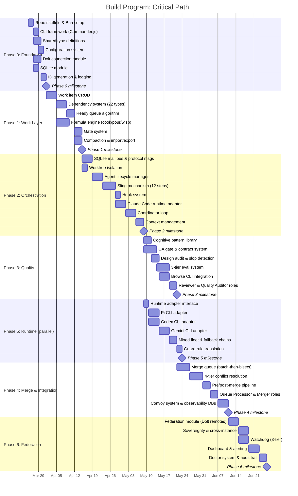

# 16 - Build Program

**Document type:** Phased execution plan
**Status:** DRAFT
**Date:** 2026-03-18
**Scope:** Build roadmap for the clean-sheet AI agent orchestration platform specified in documents 01-15
**Prerequisite reading:** 01-product-charter, 03-system-architecture, 04-role-taxonomy, 05-data-model, 09-orchestration-engine

---

## 1. Build Philosophy

Five principles govern the execution sequence.

**Bottom-up construction.** Data layer first, then orchestration, then quality, then polish. Each upper layer depends on the stability of the layers beneath it. You cannot dispatch work without a work tracker. You cannot gate merges without a quality layer. You cannot federate without a merge system.

**Every phase is deployable.** This is not waterfall. At the end of Phase 0, you have a CLI that connects to databases. At the end of Phase 1, you have a usable work tracker. At the end of Phase 2, you can spawn and coordinate agents. Each phase delivers standalone value. If the project stops at any phase boundary, the completed work is useful.

**Dogfood from Phase 2.** Once agent spawning works, the platform builds itself. Phase 3 onward should be planned, tracked, and dispatched through the platform's own work tracker and orchestration engine. Dogfooding exposes integration issues that unit tests miss and generates real operational data for the observability layer.

**Contracts first within each phase.** Before implementing any component, define its TypeScript interfaces, data schemas, and CLI contract. The interface definitions from `03-system-architecture.md` (SkillLayer, WorkLayer, RuntimeLayer, QualityLayer, OrchestrationToWork, OrchestrationToRuntime) are the starting contracts. Implementations are validated against these contracts at merge time.

**Quality gates from day one.** Phase 0 includes the test harness and linting configuration. Every subsequent phase writes tests alongside implementation. The QA gate becomes automated in Phase 3, but manual verification against acceptance criteria is required from Phase 0.

---

## 2. Phase 0: Foundation (Weeks 1-2)

**Goal:** Repository scaffold, shared types, CLI skeleton, database connectivity, dev environment.

### Deliverables

| Component | Description | Estimated Effort |
|-----------|-------------|-----------------|
| Repo structure | Monorepo layout following file ownership principles from 03-system-architecture | 2h |
| TypeScript/Bun setup | `bunfig.toml`, `tsconfig.json`, strict mode, path aliases, build/test/lint scripts | 3h |
| CLI framework | Commander.js with subcommand groups: `work`, `fleet`, `mail`, `merge`, `config`, `doctor` | 6h |
| Shared types | `WorkItem`, `Dependency`, `AgentIdentity`, `AgentSession`, `Checkpoint`, `Formula`, `Convoy`, `Evidence` from 05-data-model | 8h |
| Configuration system | `config.yaml` (committed) + `config.local.yaml` (gitignored), layered resolution: defaults < project < local < env < CLI flags | 4h |
| Dolt connection module | MySQL2 client, connection pool (10 conns), auto-start/stop with reference counting, retry with exponential backoff, circuit breaker | 8h |
| SQLite module | WAL mode, busy timeout 5000ms, schema migration runner, factory for mail/sessions/events/metrics databases | 6h |
| Hash-based ID generator | `wi-{base36(random)}` default, counter mode `wi-{sequential}` configurable, content hash (SHA-256) for dedup | 3h |
| Logging and error handling | Structured JSON logging, error classification (transient vs. permanent), redaction of sensitive patterns | 4h |
| Dev environment | `.env.example`, Dolt server install script, tmux session template, pre-commit hooks | 3h |

### Acceptance Criteria

- [ ] `platform --help` shows all subcommand groups with descriptions
- [ ] `platform --version` displays version from package.json
- [ ] `platform config show` displays merged configuration (defaults + project + local + env)
- [ ] `platform config set <key> <value>` persists to config.local.yaml
- [ ] Dolt connection test passes: `platform doctor --category dolt` returns green
- [ ] SQLite databases created with correct schemas: `platform doctor --category sqlite` returns green
- [ ] All shared types compile under `strict: true` TypeScript with zero errors
- [ ] `bun test` runs and passes (initial test suite for types, config, ID generation)
- [ ] `bun run lint` passes with zero warnings
- [ ] Hash-based IDs are unique across 100,000 generations (collision test)
- [ ] Content hash produces identical output for identical inputs across runs

### Dependencies

None. This is the foundation. Directory structure follows `src/{cli,core,db,work,orchestration,quality,merge,runtime,federation}/` with `tests/{unit,integration,fixtures}/`.

---

## 3. Phase 1: Work Layer (Weeks 2-4)

**Goal:** Durable issue tracking with dependency graph, ready queue, formulas, and gates. A standalone work tracker usable from the CLI.

### Deliverables

| Component | Description | Estimated Effort |
|-----------|-------------|-----------------|
| Work item CRUD | `create`, `show`, `update`, `close`, `list`, `search` with full ~50 column schema in Dolt | 12h |
| Validation engine | Title required (max 500), priority 0-4, status transitions enforced, closed_at rules, metadata JSON validation | 4h |
| Dependency system | 22 typed edges, `addDep`, `removeDep`, `getDeps`, cycle detection (recursive CTE, depth 100) | 10h |
| Ready queue | `computeBlockedIDs` algorithm, `ready_items` SQL view (recursive CTE), 3 sort policies (hybrid, priority, oldest) | 8h |
| Atomic claim | Compare-and-swap: `UPDATE SET assignee WHERE assignee IS NULL`, `ErrAlreadyClaimed` | 2h |
| Formula engine | TOML parser, `cook` (formula to protomolecule), `pour` (proto to molecule), `wisp` (proto to ephemeral) | 16h |
| Gate system | `gh:run`, `gh:pr`, `timer`, `human`, `mail`, `contract` gate types, resolution checking, timeout handling | 8h |
| Compaction module | 2-tier compaction (30d/90d), LLM summarization, snapshot preservation, `AS OF` recovery path | 8h |
| Import/export | JSON and CSV import/export of work items with dependency preservation | 4h |
| CLI commands | `platform work create`, `show`, `update`, `close`, `list`, `ready`, `deps add/remove/show`, `formula cook/pour/wisp` | 8h |

### Acceptance Criteria

- [ ] `platform work create --title "Build auth module" --priority 1 --type task` creates a work item in Dolt and returns its ID
- [ ] `platform work show <id>` displays all populated columns in human-readable format
- [ ] `platform work list --status open --priority 1` filters correctly
- [ ] `platform work update <id> --status active --assignee builder-alpha` updates atomically
- [ ] `platform work close <id> --reason "Implemented and merged"` sets closed_at and validates transition
- [ ] `platform work deps add <source> <target> --type blocks` creates dependency edge
- [ ] `platform work deps add` rejects cycles in `blocks` edges (recursive CTE check)
- [ ] `platform work ready` returns only unblocked, non-deferred, non-ephemeral open items
- [ ] Ready queue respects transitive blocking through parent-child edges (depth limit 50)
- [ ] `platform work claim <id> --agent builder-alpha` succeeds once, fails on second attempt (CAS)
- [ ] `platform formula cook mol-standard-build` creates protomolecule with template items
- [ ] `platform formula pour <proto-id> --var feature=auth` creates molecule with substituted variables
- [ ] `platform formula wisp <proto-id>` creates ephemeral items in wisps table
- [ ] Gate resolution: timer gates auto-resolve after timeout, manual gates resolve on explicit command
- [ ] `platform work compact --tier 1` summarizes eligible items, preserves snapshots
- [ ] `platform work export --format json > backup.json` and `platform work import backup.json` round-trip without data loss
- [ ] All operations produce Dolt commits with meaningful messages

### Dependencies

Phase 0 (database connectivity, shared types, CLI framework, ID generation).

---

## 4. Phase 2: Communication & Orchestration Core (Weeks 4-6)

**Goal:** Agents can be spawned in isolated worktrees, coordinated through a mail bus, and managed through their full lifecycle. The platform can run a multi-agent build.

### Deliverables

| Component | Description | Estimated Effort |
|-----------|-------------|-----------------|
| SQLite mail bus | `mail.db` schema: messages table with `id`, `from`, `to`, `subject`, `body`, `type`, `read`, `created_at`, `thread_id`, `in_reply_to` | 6h |
| Protocol messages | 15 typed message formats: `dispatch`, `worker_done`, `merge_ready`, `escalation`, `nudge`, `status_update`, `handoff`, `checkpoint`, `convoy_update`, `gate_cleared`, `review_verdict`, `merge_result`, `broadcast`, `shutdown`, `heartbeat` | 8h |
| Broadcast groups | `@all`, `@builders`, `@leads`, `@reviewers`, group membership resolution | 2h |
| Worktree isolation | `git worktree add/remove`, branch naming convention `{agent}/{task-id}`, cleanup on completion | 6h |
| Agent lifecycle manager | State machine: spawning -> booting -> working -> submitting -> done (plus stalled, escalated, zombie, handing_off), state transitions enforced in code | 10h |
| Sling mechanism | 12-step dispatch: validate, claim, create worktree, load skill, generate overlay, deploy hooks, deploy guards, spawn session, wait for ready, send prompt, register session, set hook | 16h |
| Hook system | `SessionStart` -> `platform prime`, `UserPromptSubmit` -> `platform mail check --inject`, hook deployment to worktree | 6h |
| Claude Code runtime adapter | `buildSpawnCommand()`, `deployConfig()`, `detectReady()`, `parseTranscript()`, `buildEnv()`, tmux session management | 12h |
| Tmux session management | `new-session`, `send-keys`, `capture-pane`, `has-session`, `kill-session`, readiness detection, beacon verification | 6h |
| Coordinator loop (basic) | Hook-driven main loop: receive mail, check fleet, check ready queue, process mail by priority, dispatch ready work, check exit conditions, check context health | 10h |
| Session tracking | `sessions.db` schema: `agent_name`, `session_id`, `pid`, `tmux_session`, `task_id`, `worktree_path`, `branch_name`, `capability`, `parent_agent`, `depth`, `state`, `started_at`, `last_activity` | 4h |
| Context management | Checkpoint save/load, handoff protocol (detect ~80%, save checkpoint, notify parent, spawn continuation), `platform checkpoint`, `platform handoff` | 8h |
| CLI commands | `platform fleet status/spawn/kill`, `platform sling`, `platform mail send/check/list/reply`, `platform prime`, `platform checkpoint`, `platform handoff` | 8h |

### Acceptance Criteria

- [ ] `platform sling <work-id> --to builder-alpha` creates worktree, spawns tmux session, delivers initial prompt
- [ ] Agent receives context via `SessionStart` -> `platform prime` hook
- [ ] `platform mail send --to builder-alpha --subject "Update" --body "..."` delivers message to mail.db
- [ ] `platform mail check` returns unread messages for current agent
- [ ] `platform mail check --inject` formats unread messages as context injection text
- [ ] Broadcast to `@builders` delivers to all agents with capability "builder"
- [ ] Coordinator processes mail by priority: escalations > merge requests > completions > status updates
- [ ] Coordinator dispatches ready work to idle agents via sling
- [ ] `platform fleet status` shows all active agents with state, task, uptime, and token estimate
- [ ] Agent state transitions are enforced: builders cannot spawn sub-agents (depth 2 limit)
- [ ] `platform handoff` saves checkpoint JSON and notifies parent agent
- [ ] New session in same sandbox loads checkpoint and resumes work
- [ ] `platform fleet kill <agent>` sends graceful shutdown, saves checkpoint, cleans session
- [ ] Worktree cleanup: `git worktree remove` runs after successful merge
- [ ] Beacon verification: re-send initial prompt if Claude Code TUI swallows first Enter
- [ ] Guard rules: builder cannot execute `sling`, `git push to main`, or write outside worktree

### Dependencies

Phase 0 (database modules, CLI framework), Phase 1 (work items for dispatch, ready queue for scheduling).

---

## 5. Phase 3: Quality Layer (Weeks 6-8)

**Goal:** Quality intelligence integrated into the build pipeline. Cognitive review, contract enforcement, design audit, and eval system operational.

### Deliverables

| Component | Description | Estimated Effort |
|-----------|-------------|-----------------|
| Cognitive pattern library | 41 patterns organized by mode (CEO/14, Engineering/15, Design/12), pattern loader, composable pattern sets | 8h |
| Role-specific pattern loading | Pattern sets mapped to roles + specializations: backend-builder gets Unix Philosophy + Postel's Law, frontend-builder gets Norman 3 Levels + Krug, reviewers get Chesterton's Fence + Dijkstra | 4h |
| QA gate | `qa-report.json` schema (5 dimensions: contract_conformance, code_quality, test_coverage, security, performance), `evaluateGate()`, blocking logic: proceed=false or CRITICAL blocker or any score < 3 | 8h |
| Contract authoring module | Generate contracts from templates: OpenAPI 3.1, AsyncAPI 2.6, Pydantic, TypeScript interfaces, JSON Schema. CLI: `platform contract author <spec>` | 12h |
| Contract auditing module | Verify implementation matches contract. Diff generation, conformance scoring, violation catalog. CLI: `platform contract audit <contract> <implementation>` | 12h |
| Design audit | 80-item rubric across 10 categories (visual hierarchy, typography, color, spacing, interactive elements, responsive, motion, content quality, AI slop, performance perception). Scored report output | 8h |
| AI slop detection | 10 anti-patterns: purple gradients, 3-column grids, excessive drop shadows, generic stock imagery, buzzword density, orphaned CTAs, rainbow dividers, faux-3D buttons, gratuitous animations, hollow microcopy | 4h |
| 3-tier eval system | Tier 1: static validation (parse commands against registries, free, <1s). Tier 2: E2E testing (spawn sessions, record NDJSON, ~$3.85/run). Tier 3: LLM-as-judge (planted-bug fixtures, ~$0.15/run) | 16h |
| Browse CLI integration | Playwright daemon, cold start 3-5s, subsequent 100-200ms, AI-native ref system, screenshot capture, accessibility testing | 12h |
| Reviewer role implementation | Independent read-only verification, two-pass review (CRITICAL then INFORMATIONAL), structured PASS/FAIL verdict with findings | 6h |
| Quality Auditor role implementation | Contract conformance checking, design audit execution, AI slop detection, structured audit report with scores | 6h |
| CLI commands | `platform qa gate <report>`, `platform contract author`, `platform contract audit`, `platform eval run`, `platform browse <url>` | 6h |

### Acceptance Criteria

- [ ] `platform patterns list --mode engineering` returns 15 engineering patterns with descriptions
- [ ] Pattern loading respects role + specialization: backend-builder receives different patterns than frontend-builder
- [ ] Patterns compose: loading "bezos-doors" + "altman-leverage" produces merged overlay
- [ ] `platform qa gate qa-report.json` returns PASS/BLOCK with blocking reasons
- [ ] QA gate blocks when: any CRITICAL blocker exists, contract_conformance < 3, security < 3
- [ ] `platform contract author --type openapi --spec requirements.md` generates valid OpenAPI 3.1
- [ ] `platform contract audit --contract api.yaml --impl src/routes/` produces conformance report with score
- [ ] Contract audit detects: missing endpoints, type mismatches, missing error codes, extra undocumented endpoints
- [ ] Design audit produces 80-item scored report with pass/fail per item and overall score
- [ ] AI slop detection flags at least 8 of 10 planted anti-patterns in test fixtures
- [ ] Tier 1 eval: validates all skill SKILL.md commands against command registry in <1s
- [ ] Tier 2 eval: spawns agent session, pipes prompt, records NDJSON output, extracts diagnostics
- [ ] Tier 3 eval: LLM-as-judge evaluates planted-bug fixture, returns structured pass/fail
- [ ] `platform browse screenshot <url>` captures screenshot and saves to evidence directory
- [ ] Browse CLI accessibility test returns WCAG violations for test page with known issues
- [ ] Reviewer produces structured verdict: files reviewed, issues found (with severity), recommendation

### Dependencies

Phase 2 (agent lifecycle for reviewer/auditor roles, mail for communication, sling for dispatching quality agents).

---

## 6. Phase 4: Merge & Integration (Weeks 8-10)

**Goal:** Complete merge pipeline with quality gates, batch-then-bisect algorithm, learning, and convoy tracking. Multiple builders can submit, merge, and land code safely.

### Deliverables

| Component | Description | Estimated Effort |
|-----------|-------------|-----------------|
| Merge queue | FIFO queue with batch-then-bisect: collect pending MRs, rebase as stack, test tip, bisect on failure | 16h |
| 4-tier conflict resolution | Tier 1: clean merge. Tier 2: auto-resolve non-overlapping. Tier 3: AI-assisted semantic resolution. Tier 4: reimagine (rewrite from spec) | 16h |
| Pre-merge pipeline | Contract conformance check, QA gate evaluation, lint/test verification, file ownership validation | 8h |
| Post-merge learning | Record conflict patterns, resolution strategies, merge success rates to expertise store (mulch) | 6h |
| Gitattributes configuration | Merge strategies per file type: `*.lock` -> ours, `*.json` -> merge, `*.sql` -> union | 2h |
| Queue Processor role | Persistent agent processing merge queue, spawns Mergers for Tier 3, reports results to coordinator | 8h |
| Merger role | Leaf agent for AI-assisted conflict resolution, understands both sides, produces correct merge | 6h |
| Integration testing framework | Cross-agent integration tests: spawn multiple builders, verify merged result compiles and passes | 8h |
| Convoy system | `platform convoy create/list/show/add/launch`, convoy lifecycle (created -> active -> landed -> failed), progress tracking | 8h |
| Events database | `events.db` schema: tool_start, tool_end, session_start, session_end, mail_sent, mail_received, spawn, error, progress, result. Smart arg filtering, secret redaction | 6h |
| Metrics collection | `metrics.db` schema: token usage, cost tracking per agent/runtime, session duration, merge results, quality scores. Periodic snapshots | 6h |
| CLI commands | `platform merge queue/process`, `platform convoy create/list/show/add/launch`, `platform events`, `platform metrics` | 6h |

### Acceptance Criteria

- [ ] Two builders submit MRs to merge queue, both merge cleanly in batch (Tier 1)
- [ ] Conflicting MRs trigger Tier 2 auto-resolution for non-overlapping changes
- [ ] Tier 2 failure escalates to Tier 3: headless LLM resolves semantic conflict
- [ ] Tier 3 failure escalates to Tier 4: builder respawned with spec + conflict context
- [ ] Batch-then-bisect: 4 branches queued, tip test fails, bisect identifies failing branch in log2(4) = 2 tests
- [ ] Pre-merge pipeline rejects MR when contract audit fails (conformance score < 3)
- [ ] Pre-merge pipeline rejects MR when files modified outside declared ownership scope
- [ ] Post-merge learning records: conflict file patterns, resolution tier used, success/failure outcome
- [ ] `platform merge queue` shows pending MRs with status, branch, agent, queued time
- [ ] `platform merge process --all` processes entire queue in FIFO order
- [ ] `platform convoy create "Auth Feature" wi-a1 wi-a2 wi-a3` creates convoy tracking all three items
- [ ] Convoy transitions to `landed` when all constituent work items are closed and merged
- [ ] `platform events --agent builder-alpha --since 1h` returns chronological event timeline
- [ ] `platform metrics --costs` shows per-agent and per-runtime cost breakdown
- [ ] Metrics persist across sessions: aggregate cost for a multi-session agent is cumulative
- [ ] Integration test: 3 builders implement different modules, all merge, combined result compiles

### Dependencies

Phase 2 (worktree isolation, agent lifecycle, mail for merge coordination), Phase 3 (QA gate for pre-merge checks, contract audit for conformance verification).

---

## 7. Phase 5: Runtime Neutrality (Weeks 10-12)

**Goal:** Multiple LLM runtimes supported. Mixed fleets where Claude coordinates and other runtimes build.

### Deliverables

| Component | Description | Estimated Effort |
|-----------|-------------|-----------------|
| Runtime adapter interface | Standard `AgentRuntime` contract: `buildSpawnCommand()`, `deployConfig()`, `detectReady()`, `parseTranscript()`, `buildEnv()`, optional `connect()`, `headless` flag | 6h |
| Auto-detection algorithm | Detect available runtimes at startup: check for `claude`, `pi`, `codex`, `gemini` CLIs, probe capabilities | 4h |
| Pi CLI adapter | ~250 lines, `.pi/extensions/` config, RPC connection support, guard rule translation | 10h |
| Codex CLI adapter | ~300 lines, headless/sandbox mode, NDJSON event stream parsing, AGENTS.md instruction file | 10h |
| Gemini CLI adapter | ~350 lines, GEMINI.md instruction file, multi-modal task support, large context window handling | 10h |
| Instruction file generation | Template-based generation: CLAUDE.md (Claude Code), AGENTS.md (Codex), GEMINI.md (Gemini), generic markdown | 6h |
| Mixed fleet configuration | Per-role runtime preferences: coordinators on Opus, builders on Sonnet/Pi, scouts on Haiku, reviewers on Codex | 4h |
| Fallback chains | Runtime preference chain per role with automatic failover: preferred -> secondary -> fallback | 4h |
| Runtime degradation | Full fleet (tmux) -> subagents (Agent tool) -> sequential. Auto-detection at startup, transparent to coordinator loop | 6h |
| Guard rule translation | Translate platform guard rules to each runtime's native mechanism: Claude `allowedTools`, Pi guard JSON, Codex sandbox config | 6h |
| Cost normalization | Per-runtime token pricing, unified cost tracking across heterogeneous fleet | 4h |

### Acceptance Criteria

- [ ] `platform fleet spawn builder --runtime pi --name builder-pi` spawns a Pi agent in a worktree
- [ ] `platform fleet spawn builder --runtime codex --name builder-codex` spawns a Codex agent
- [ ] `platform fleet spawn builder --runtime gemini --name builder-gemini` spawns a Gemini agent
- [ ] Mixed fleet: Claude coordinator dispatches to Pi builder and Codex builder simultaneously
- [ ] Instruction file generation: sling to Codex produces AGENTS.md in worktree, sling to Gemini produces GEMINI.md
- [ ] Fallback: if Pi CLI not available, builder falls back to Claude Sonnet automatically
- [ ] Guard rules translate: builder on Codex cannot execute `sling` or `git push` (enforced by sandbox)
- [ ] `platform fleet status` shows runtime column for each agent (claude, pi, codex, gemini)
- [ ] `platform costs --by-runtime` shows cost breakdown per LLM provider
- [ ] Auto-detection: `platform doctor --category runtimes` lists all detected runtimes with version
- [ ] Runtime degradation: when tmux unavailable, coordinator falls back to subagent mode without configuration change
- [ ] Sequential mode: when neither tmux nor Agent tool available, coordinator executes tasks inline

### Dependencies

Phase 2 (agent lifecycle, sling mechanism, tmux session management -- the core dispatch infrastructure that adapters plug into).

---

## 8. Phase 6: Federation & Scale (Weeks 12-14)

**Goal:** Multi-instance synchronization, fleet monitoring at scale, production readiness. Two instances can share work and agent reputations.

### Deliverables

| Component | Description | Estimated Effort |
|-----------|-------------|-----------------|
| Federation module | Dolt remote push/pull, `federation_peers` table, peer registration, sync scheduling | 12h |
| Sovereignty tiers | T1 (public: all data syncs), T2 (selective: configurable filters), T3 (private: work items only, no agent data), T4 (anonymous: content-addressed dedup only) | 6h |
| Multi-instance topology | Peer discovery, topology mapping, configurable sync intervals | 6h |
| Cross-instance work routing | `external:<instance>:<id>` references, cross-instance dependency tracking via `tracks` edge type | 6h |
| Agent portability | Agent CVs and scorecards sync via federation, portable identity across instances | 4h |
| Content-addressed dedup | SHA-256 content hash comparison during sync, duplicate suppression | 4h |
| 3-tier watchdog system | Tier 0: mechanical daemon (30s process checks). Tier 1: AI triage (headless LLM classifies stuck vs working). Tier 2: monitor agent (persistent session, fleet pattern analysis) | 12h |
| Dashboard | Live TUI: fleet status, queue depth, convoy progress, cost tracking, alert feed. `platform dashboard` with configurable refresh | 12h |
| Alerting and escalation rules | Configurable thresholds: stall timeout, retry count, cost budget, queue depth. Alert channels: mail, log, external webhook | 6h |
| Doctor system | 11+ health check categories: config, dolt, sqlite, runtimes, worktrees, sessions, mail, hooks, guards, federation, skills | 8h |
| Audit trail | Complete event history: who did what, when, with what evidence. Queryable via CLI and SQL | 4h |
| OTel integration (optional) | OpenTelemetry trace/metric export for teams with existing observability infrastructure | 6h |

### Acceptance Criteria

- [ ] `platform federation add peer-beta --remote https://dolthub.com/org/work-db --sovereignty t2` registers peer
- [ ] `platform federation sync` pushes local changes and pulls remote changes from all peers
- [ ] Two instances create work items independently, sync, and both see all items without duplicates
- [ ] Content hash prevents duplicate work items: same logical item created on both instances appears once after sync
- [ ] Sovereignty T3: work items sync but agent scorecards do not
- [ ] Sovereignty T4: only content hashes sync for dedup, no work item content
- [ ] Cross-instance dependency: `platform work deps add wi-local tracks external:beta:wi-remote` creates non-blocking reference
- [ ] Agent portability: agent CV synced to remote is loadable by remote instance
- [ ] Watchdog Tier 0: detects dead tmux session within 30 seconds, marks agent as zombie
- [ ] Watchdog Tier 1: AI triage correctly classifies stuck agent vs. agent doing long computation
- [ ] Watchdog Tier 2: monitor agent detects "all builders stuck on same dependency" pattern
- [ ] `platform dashboard` renders live TUI with fleet grid, queue depth, convoy progress, cost ticker
- [ ] Alert fires when: agent stalled > 5 minutes, retry count > 3, cost budget exceeded
- [ ] `platform doctor` runs all health categories and produces scored report
- [ ] `platform doctor --fix` auto-fixes: stale worktrees, orphaned sessions, missing indexes
- [ ] Audit trail: every work item change, agent spawn, merge result queryable with `platform events --trace <id>`

### Dependencies

Phase 4 (merge system for federation sync, convoy system for cross-instance tracking), Phase 5 (runtime adapters for mixed fleet monitoring).

---

## 9. Critical Path Analysis



### Critical Path

The critical path runs through:

```
Phase 0 (Foundation) -> Phase 1 (Work Layer) -> Phase 2 (Orchestration) -> Phase 3 (Quality) -> Phase 4 (Merge) -> Phase 6 (Federation)
```

Phase 5 (Runtime Neutrality) is off the critical path. It can run in parallel with Phase 3 after Phase 2 completes. Both Phase 3 and Phase 5 must complete before Phase 6 begins.

Total critical path duration: **14 weeks** (assuming one primary developer with agent assistance from Phase 2 onward).

---

## 10. Parallelization Opportunities

### Inter-Phase Parallelism

| Parallel Track A | Parallel Track B | Starts After | Constraint |
|-----------------|-----------------|-------------|-----------|
| Phase 3 (Quality) | Phase 5 (Runtime) | Phase 2 | Both depend on orchestration core; neither depends on the other |
| Phase 4 early design (merge queue spec) | Phase 3 implementation | Phase 2 | Merge queue design can start while quality layer is being built |
| Skill templates/patterns authoring | Any phase | Phase 0 | Content creation is independent of code |
| Documentation | Any phase | Phase 0 | Docs follow implementation with minimal dependency |

### Intra-Phase Parallelism

**Phase 0:** Dolt module and SQLite module can be built in parallel (no interdependency). CLI framework and shared types are independent.

**Phase 1:** Work item CRUD and formula engine can start simultaneously after Phase 0. Dependency system and gate system can be built in parallel once CRUD is done.

**Phase 2:** Mail bus and worktree isolation are independent. Both must complete before sling mechanism. Claude Code adapter and hook system can be built in parallel.

**Phase 3:** Cognitive patterns, contract modules, and Browse CLI are three independent streams. Eval system depends on contract module completion. Reviewer and Quality Auditor roles depend on all three streams.

**Phase 4:** Merge queue and convoy system are independent. Conflict resolution depends on merge queue. Events and metrics databases are independent of merge logic.

**Phase 5:** Pi, Codex, and Gemini adapters can be built in parallel after the interface is defined. Each adapter is independent (~200-400 lines, self-contained).

**Phase 6:** Federation module and watchdog system are independent. Dashboard depends on both. Doctor system is independent.

### Dogfooding Acceleration

From Phase 2 onward, the platform can manage its own build:

| Phase Being Built | Platform Features Used |
|-------------------|----------------------|
| Phase 3 | Work tracking (Phase 1), agent dispatch (Phase 2), mail coordination (Phase 2) |
| Phase 4 | + Quality gates (Phase 3), contract auditing (Phase 3) |
| Phase 5 | + Merge queue (Phase 4), convoy tracking (Phase 4) |
| Phase 6 | + Mixed runtime fleet (Phase 5), all quality intelligence (Phase 3) |

Each subsequent phase uses more of the platform, generating real operational data and exposing integration issues earlier.

---

## 11. Risk Register

| # | Risk | Likelihood | Impact | Mitigation |
|---|------|-----------|--------|-----------|
| R1 | **Dolt performance at scale** — Ready queue recursive CTE may be slow with 10,000+ work items | Medium | High | Benchmark in Phase 1 with synthetic data (10k items, 50k edges). If CTE exceeds 100ms, implement materialized view with trigger-based refresh. SQLite fallback for ready queue computation. |
| R2 | **Context management complexity** — Handoff protocol may lose state or produce incoherent continuations | Medium | Medium | Start with manual handoff in Phase 2 (checkpoint command, human triggers continuation). Automate detection only after manual path is proven. Keep checkpoint schema minimal. |
| R3 | **Runtime adapter quirks** — Each LLM CLI has different readiness signals, error formats, and session semantics | High | Medium | Build Claude adapter first (most tested, primary runtime). Defer Pi/Codex/Gemini to Phase 5 after patterns are established. Each adapter gets its own integration test suite. |
| R4 | **Merge queue complexity** — Batch-then-bisect with 4-tier resolution is the most complex single component | Medium | High | Implement FIFO single-merge first (Tier 1 only). Add batching in iteration 2. Add Tier 2-3 in iteration 3. Tier 4 (reimagine) is Phase 4 stretch goal. Each tier is independently testable. |
| R5 | **Browser automation reliability** — Playwright daemon may be fragile across OS versions and in headless environments | Medium | Medium | Isolate Browse CLI as an optional module. All quality gates work without browser. Design audit degrades to code-only analysis when Playwright unavailable. |
| R6 | **LLM cost overrun** — Dogfooding and eval system may consume unexpected token budgets | Low | Medium | Cost tracking from Phase 2. Hard budget limits per agent and per run. Tier 3 evals (LLM-as-judge) default to off; opt-in per skill. Use Haiku for mechanical tasks (scouts, watchdog). |
| R7 | **Agent infinite loops** — Agents may enter retry loops or spawn loops that burn tokens | Medium | High | Circuit breaker implemented in Phase 2 (max 3 retries). Watchdog patrol from Phase 4 (stall detection). Token budget per session enforced at runtime adapter level. |
| R8 | **Federation merge conflicts** — Dolt three-way merge may produce unexpected results with complex schemas | Low | High | Defer federation to Phase 6 (last phase). Test extensively with synthetic multi-instance scenarios. Hash-based IDs eliminate insert conflicts. Cell-level merge reduces update conflicts. |
| R9 | **Skill system backwards compatibility** — Platform skill format may diverge from existing ATSA SKILL.md format | Low | Low | Document migration path in Phase 0. Support both formats with adapter layer. Progressive adoption: old skills work, new features require new format. |
| R10 | **Tmux dependency** — Not all environments have tmux. Docker containers, CI, Windows are common cases | Medium | Medium | Runtime degradation (Phase 2): subagent mode works without tmux. Sequential mode works without any external dependency. Document tmux installation for primary audience (macOS/Linux developers). |

---

## 12. Team Sizing

### Phase 0: Foundation (Weeks 1-2)

| Metric | Value |
|--------|-------|
| Parallel agents | 1 (human-driven, sequential) |
| Roles | 1 developer |
| Estimated tokens | ~500K (scaffolding, type definitions, CLI setup) |
| Estimated cost | $5-10 |
| Calendar time | 2 weeks |

### Phase 1: Work Layer (Weeks 2-4)

| Metric | Value |
|--------|-------|
| Parallel agents | 1-2 (human + 1 Claude Code session) |
| Roles | 1 developer, 1 builder agent (ad hoc) |
| Estimated tokens | ~2M (CRUD implementation, SQL schema, formula engine) |
| Estimated cost | $15-30 |
| Calendar time | 2 weeks |

### Phase 2: Orchestration Core (Weeks 4-6)

| Metric | Value |
|--------|-------|
| Parallel agents | 2-3 (human + 2 Claude Code sessions) |
| Roles | 1 developer/coordinator, 2 builder agents |
| Estimated tokens | ~4M (mail bus, sling mechanism, lifecycle manager, Claude adapter) |
| Estimated cost | $30-60 |
| Calendar time | 2 weeks |

### Phase 3: Quality Layer (Weeks 6-8)

| Metric | Value |
|--------|-------|
| Parallel agents | 3-5 (dogfooding begins) |
| Roles | 1 coordinator, 1 lead, 2-3 builders, 1 reviewer |
| Estimated tokens | ~6M (contract system, eval system, Browse CLI are substantial) |
| Estimated cost | $50-100 |
| Calendar time | 2 weeks |

### Phase 4: Merge & Integration (Weeks 8-10)

| Metric | Value |
|--------|-------|
| Parallel agents | 4-6 (full pipeline operational) |
| Roles | 1 coordinator, 1 lead, 3-4 builders, 1 reviewer, 1 quality auditor |
| Estimated tokens | ~8M (merge queue is complex, integration testing is extensive) |
| Estimated cost | $60-120 |
| Calendar time | 2 weeks |

### Phase 5: Runtime Neutrality (Weeks 10-12)

| Metric | Value |
|--------|-------|
| Parallel agents | 3-5 (adapters are independent) |
| Roles | 1 coordinator, 1 lead, 2-3 builders (one per adapter), 1 reviewer |
| Estimated tokens | ~5M (adapters are ~300 lines each, mostly boilerplate) |
| Estimated cost | $40-80 |
| Calendar time | 2 weeks (overlaps with Phase 3-4) |

### Phase 6: Federation & Scale (Weeks 12-14)

| Metric | Value |
|--------|-------|
| Parallel agents | 5-8 (full platform capabilities available) |
| Roles | 1 coordinator, 2 leads, 3-4 builders, 1 reviewer, 1 quality auditor, 1 watchdog |
| Estimated tokens | ~10M (dashboard, watchdog, federation are substantial) |
| Estimated cost | $80-150 |
| Calendar time | 2 weeks |

### Totals

| Metric | Value |
|--------|-------|
| Total calendar time | 14 weeks |
| Total estimated tokens | ~35M |
| Total estimated cost | $280-550 |
| Peak parallel agents | 8 (Phase 6) |
| Minimum viable product | Phase 2 complete (~$50-100, 6 weeks) |

---

## 13. Milestone Summary

| Milestone | Week | What You Can Do | Value Proposition |
|-----------|------|----------------|-------------------|
| **M0: CLI boots** | 2 | Run `platform --help`, connect to Dolt and SQLite, generate IDs | Dev environment operational |
| **M1: Work tracker** | 4 | Track work items, manage dependencies, query ready queue, run formulas | Standalone durable task management (replaces manual tracking) |
| **M2: Multi-agent builds** | 6 | Spawn agents, dispatch work, coordinate via mail, merge branches | Platform builds software with multiple concurrent agents |
| **M3: Quality intelligence** | 8 | Cognitive review, contract enforcement, design audit, eval system | Work is verified, not just completed |
| **M4: Merge pipeline** | 10 | Batch-then-bisect merge queue, 4-tier conflict resolution, convoys | Safe integration of parallel work streams |
| **M5: Runtime neutrality** | 12 | Mixed fleet with Claude + Pi + Codex + Gemini, fallback chains | Not locked to one LLM vendor |
| **M6: Federation** | 14 | Multi-instance sync, watchdog, dashboard, production monitoring | Team-scale deployment with observability |

### Exit Criteria for "1.0"

All of the following must be true:

1. A non-trivial feature (50+ files, 3+ agents) has been built using the platform
2. The platform successfully built at least one phase of itself (dogfood proof)
3. Contract conformance rate > 95% across dogfood builds
4. Merge queue handles 10+ concurrent branches without human intervention
5. Context handoff succeeds > 90% of the time (measured across dogfood sessions)
6. `platform doctor` reports all-green on a fresh install with documented setup steps
7. At least 2 runtime adapters functional beyond Claude Code
8. Federation sync works between 2 instances without data loss

---

*This document specifies the WHEN and HOW MUCH. The WHAT is specified in documents 01-15. The architecture is in 03-system-architecture. The data model is in 05-data-model. The orchestration engine is in 09-orchestration-engine.*
