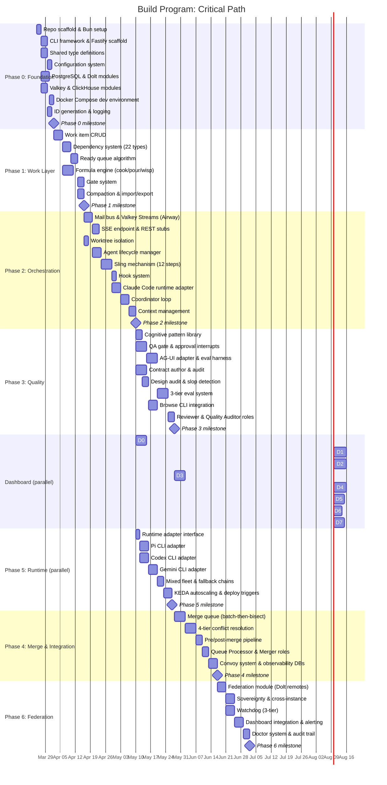

# 16 - Build Program

**Document type:** Phased execution plan
**Status:** DRAFT
**Date:** 2026-03-18
**Scope:** Build roadmap for the clean-sheet AI agent orchestration platform specified in documents 01-15
**Prerequisite reading:** 01-product-charter, 03-system-architecture, 04-role-taxonomy, 05-data-model, 09-orchestration-engine

---

## 1. Build Philosophy

Five principles govern the execution sequence.

**Bottom-up construction.** Data layer first, then orchestration, then quality, then polish. Each upper layer depends on the stability of the layers beneath it. You cannot dispatch work without a work tracker. You cannot gate merges without a quality layer. You cannot federate without a merge system.

**Every phase is deployable.** This is not waterfall. At the end of Phase 0, you have a CLI and HTTP server that connect to databases. At the end of Phase 1, you have a usable work tracker. At the end of Phase 2, you can spawn and coordinate agents (and observe them via SSE). Each phase delivers standalone value. If the project stops at any phase boundary, the completed work is useful.

**Dogfood from Phase 2.** Once agent spawning works, the platform builds itself. Phase 3 onward should be planned, tracked, and dispatched through the platform's own work tracker and orchestration engine. Dogfooding exposes integration issues that unit tests miss and generates real operational data for the observability layer.

**Contracts first within each phase.** Before implementing any component, define its TypeScript interfaces, data schemas, and CLI contract. The interface definitions from `03-system-architecture.md` (SkillLayer, WorkLayer, RuntimeLayer, QualityLayer, OrchestrationToWork, OrchestrationToRuntime) are the starting contracts. Implementations are validated against these contracts at merge time.

**Quality gates from day one.** Phase 0 includes the test harness and linting configuration. Every subsequent phase writes tests alongside implementation. The QA gate becomes automated in Phase 3, but manual verification against acceptance criteria is required from Phase 0.

---

## 2. Phase 0: Foundation (Weeks 1-2)

**Goal:** Repository scaffold, shared types, CLI skeleton, HTTP server skeleton, database connectivity, Docker Compose dev environment.

### Deliverables

| Component | Description | Source | Estimated Effort |
|-----------|-------------|--------|-----------------|
| Repo structure | Monorepo layout following file ownership principles from 03-system-architecture | Building from scratch | 2h |
| TypeScript/Bun setup | `bunfig.toml`, `tsconfig.json`, strict mode, path aliases, build/test/lint scripts | Building from scratch | 3h |
| CLI framework | Commander.js with subcommand groups: `work`, `fleet`, `mail`, `merge`, `config`, `doctor`, `serve` | Building from scratch | 6h |
| Fastify service scaffold | `platform serve` HTTP server skeleton — Fastify with TypeBox validation, health endpoint, graceful shutdown, shared with CLI via core library | Wrapping Fastify | 8h |
| Shared types | `WorkItem`, `Dependency`, `AgentIdentity`, `AgentSession`, `Checkpoint`, `Formula`, `Convoy`, `Evidence` from 05-data-model | Building from scratch | 8h |
| Configuration system | `config.yaml` (committed) + `config.local.yaml` (gitignored), layered resolution: defaults < project < local < env < CLI flags | Building from scratch | 4h |
| PostgreSQL module | Connection pool (pg + Drizzle ORM), schema migration runner (drizzle-kit), retry with exponential backoff, circuit breaker. Hosts: sessions, events, metrics, mail | Wrapping pg/Drizzle | 8h |
| Dolt connection module | MySQL2 client for work graph only, connection pool (10 conns), auto-start/stop with reference counting | Wrapping Dolt | 6h |
| Valkey module | ioredis client, connection pool, pub/sub for The Airway event bus, Streams consumer groups for durable event delivery | Wrapping ioredis | 6h |
| ClickHouse module | @clickhouse/client, schema for analytics/observability (deferred population — schema only in P0, writes begin P3+) | Wrapping ClickHouse client | 4h |
| Hash-based ID generator | `wi-{base36(random)}` default, counter mode `wi-{sequential}` configurable, content hash (SHA-256) for dedup | Building from scratch | 3h |
| Logging and error handling | Structured JSON logging (pino), error classification (transient vs. permanent), redaction of sensitive patterns | Wrapping pino | 4h |
| Docker Compose dev environment | `docker-compose.yml` with PostgreSQL, Valkey, ClickHouse, Dolt server. `.env.example`, tmux session template, pre-commit hooks | Building from scratch | 6h |

### Acceptance Criteria

- [ ] `platform --help` shows all subcommand groups with descriptions
- [ ] `platform --version` displays version from package.json
- [ ] `platform serve` starts Fastify HTTP server, responds to `GET /health` with 200
- [ ] `platform serve --port 3000` binds to specified port, graceful shutdown on SIGTERM
- [ ] `platform config show` displays merged configuration (defaults + project + local + env)
- [ ] `platform config set <key> <value>` persists to config.local.yaml
- [ ] PostgreSQL connection test passes: `platform doctor --category postgres` returns green
- [ ] Dolt connection test passes: `platform doctor --category dolt` returns green
- [ ] Valkey connection test passes: `platform doctor --category valkey` returns green
- [ ] ClickHouse connection test passes: `platform doctor --category clickhouse` returns green
- [ ] `docker compose up` starts all backing services, `platform doctor` reports all-green
- [ ] All shared types compile under `strict: true` TypeScript with zero errors
- [ ] `bun test` runs and passes (initial test suite for types, config, ID generation)
- [ ] `bun run lint` passes with zero warnings
- [ ] Hash-based IDs are unique across 100,000 generations (collision test)
- [ ] Content hash produces identical output for identical inputs across runs

### Dependencies

None. This is the foundation. Directory structure follows `src/{cli,server,core,db,work,orchestration,quality,merge,runtime,federation}/` with `tests/{unit,integration,fixtures}/`.

---

## 3. Phase 1: Work Layer (Weeks 2-4)

**Goal:** Durable issue tracking with dependency graph, ready queue, formulas, and gates. A standalone work tracker usable from the CLI.

### Deliverables

| Component | Description | Source | Estimated Effort |
|-----------|-------------|--------|-----------------|
| Work item CRUD | `create`, `show`, `update`, `close`, `list`, `search` with full ~50 column schema in Dolt | Building from scratch | 12h |
| Validation engine | Title required (max 500), priority 0-4, status transitions enforced, closed_at rules, metadata JSON validation | Building from scratch | 4h |
| Dependency system | 22 typed edges, `addDep`, `removeDep`, `getDeps`, cycle detection (recursive CTE, depth 100) | Building from scratch | 10h |
| Ready queue | `computeBlockedIDs` algorithm, `ready_items` SQL view (recursive CTE), 3 sort policies (hybrid, priority, oldest) | Building from scratch | 8h |
| Atomic claim | Compare-and-swap: `UPDATE SET assignee WHERE assignee IS NULL`, `ErrAlreadyClaimed` | Building from scratch | 2h |
| Formula engine | TOML parser, `cook` (formula to protomolecule), `pour` (proto to molecule), `wisp` (proto to ephemeral) | Building from scratch | 16h |
| Gate system | `gh:run`, `gh:pr`, `timer`, `human`, `mail`, `contract` gate types, resolution checking, timeout handling | Building from scratch | 8h |
| Compaction module | 2-tier compaction (30d/90d), LLM summarization, snapshot preservation, `AS OF` recovery path | Building from scratch | 8h |
| Import/export | JSON and CSV import/export of work items with dependency preservation | Building from scratch | 4h |
| CLI commands | `platform work create`, `show`, `update`, `close`, `list`, `ready`, `deps add/remove/show`, `formula cook/pour/wisp` | Building from scratch | 8h |

### Acceptance Criteria

- [ ] `platform work create --title "Build auth module" --priority 1 --type task` creates a work item in Dolt and returns its ID
- [ ] `platform work show <id>` displays all populated columns in human-readable format
- [ ] `platform work list --status open --priority 1` filters correctly
- [ ] `platform work update <id> --status active --assignee builder-alpha` updates atomically
- [ ] `platform work close <id> --reason "Implemented and merged"` sets closed_at and validates transition
- [ ] `platform work deps add <source> <target> --type blocks` creates dependency edge
- [ ] `platform work deps add` rejects cycles in `blocks` edges (recursive CTE check)
- [ ] `platform work ready` returns only unblocked, non-deferred, non-ephemeral open items
- [ ] Ready queue respects transitive blocking through parent-child edges (depth limit 50)
- [ ] `platform work claim <id> --agent builder-alpha` succeeds once, fails on second attempt (CAS)
- [ ] `platform formula cook mol-standard-build` creates protomolecule with template items
- [ ] `platform formula pour <proto-id> --var feature=auth` creates molecule with substituted variables
- [ ] `platform formula wisp <proto-id>` creates ephemeral items in wisps table
- [ ] Gate resolution: timer gates auto-resolve after timeout, manual gates resolve on explicit command
- [ ] `platform work compact --tier 1` summarizes eligible items, preserves snapshots
- [ ] `platform work export --format json > backup.json` and `platform work import backup.json` round-trip without data loss
- [ ] All operations produce Dolt commits with meaningful messages

### Dependencies

Phase 0 (database connectivity, shared types, CLI framework, ID generation).

---

## 4. Phase 2: Communication & Orchestration Core (Weeks 4-6)

**Goal:** Agents can be spawned in isolated worktrees, coordinated through a mail bus, and managed through their full lifecycle. The platform can run a multi-agent build. HTTP server provides parallel output channel for real-time build observation.

### Deliverables

| Component | Description | Source | Estimated Effort |
|-----------|-------------|--------|-----------------|
| PostgreSQL mail bus | Mail schema in PostgreSQL: messages table with `id`, `from`, `to`, `subject`, `body`, `type`, `read`, `created_at`, `thread_id`, `in_reply_to`. NOTIFY/LISTEN for real-time delivery | Building from scratch | 6h |
| Protocol messages | 15 typed message formats: `dispatch`, `worker_done`, `merge_ready`, `escalation`, `nudge`, `status_update`, `handoff`, `checkpoint`, `convoy_update`, `gate_cleared`, `review_verdict`, `merge_result`, `broadcast`, `shutdown`, `heartbeat` | Building from scratch | 8h |
| Broadcast groups | `@all`, `@builders`, `@leads`, `@reviewers`, group membership resolution | Building from scratch | 2h |
| Valkey Streams event bus (The Airway) | Internal event backbone — all platform events (agent state changes, mail, build progress) published to Valkey Streams. Consumer groups for durable delivery to multiple subscribers | Building from scratch | 8h |
| SSE event endpoint | `GET /events/stream` — Fastify SSE route that reads from Valkey Streams and pushes to HTTP clients. Filterable by agent, phase, event type. Heartbeat keepalive | Building from scratch | 6h |
| REST build control stubs | `POST /builds/start`, `POST /builds/{id}/pause`, `POST /builds/{id}/resume`, `DELETE /builds/{id}` — route stubs with validation, wired to coordinator commands. `GET /fleet/status` returns JSON fleet state | Building from scratch | 4h |
| Worktree isolation | `git worktree add/remove`, branch naming convention `{agent}/{task-id}`, cleanup on completion | Building from scratch | 6h |
| Agent lifecycle manager | State machine: spawning -> booting -> working -> submitting -> done (plus stalled, escalated, zombie, handing_off), state transitions enforced in code. State changes published to The Airway | Building from scratch | 10h |
| Sling mechanism | 12-step dispatch: validate, claim, create worktree, load skill, generate overlay, deploy hooks, deploy guards, spawn session, wait for ready, send prompt, register session, set hook | Building from scratch | 16h |
| Hook system | `SessionStart` -> `platform prime`, `UserPromptSubmit` -> `platform mail check --inject`, hook deployment to worktree | Building from scratch | 6h |
| Claude Code runtime adapter | `buildSpawnCommand()`, `deployConfig()`, `detectReady()`, `parseTranscript()`, `buildEnv()`, tmux session management | Building from scratch | 12h |
| Tmux session management | `new-session`, `send-keys`, `capture-pane`, `has-session`, `kill-session`, readiness detection, beacon verification | Building from scratch | 6h |
| Coordinator loop (basic) | Hook-driven main loop: receive mail, check fleet, check ready queue, process mail by priority, dispatch ready work, check exit conditions, check context health | Building from scratch | 10h |
| Session tracking | PostgreSQL sessions table: `agent_name`, `session_id`, `pid`, `tmux_session`, `task_id`, `worktree_path`, `branch_name`, `capability`, `parent_agent`, `depth`, `state`, `started_at`, `last_activity` | Building from scratch | 4h |
| Context management | Checkpoint save/load, handoff protocol (detect ~80%, save checkpoint, notify parent, spawn continuation), `platform checkpoint`, `platform handoff` | Building from scratch | 8h |
| CLI commands | `platform fleet status/spawn/kill`, `platform sling`, `platform mail send/check/list/reply`, `platform prime`, `platform checkpoint`, `platform handoff` | Building from scratch | 8h |

### Acceptance Criteria

- [ ] `platform sling <work-id> --to builder-alpha` creates worktree, spawns tmux session, delivers initial prompt
- [ ] Agent receives context via `SessionStart` -> `platform prime` hook
- [ ] `platform mail send --to builder-alpha --subject "Update" --body "..."` delivers message to PostgreSQL mail table
- [ ] `platform mail check` returns unread messages for current agent
- [ ] `platform mail check --inject` formats unread messages as context injection text
- [ ] Broadcast to `@builders` delivers to all agents with capability "builder"
- [ ] Agent state changes publish to Valkey Streams (The Airway) within 100ms
- [ ] `GET /events/stream` delivers SSE events in real time — agent spawns, state transitions, mail activity
- [ ] `GET /events/stream?agent=builder-alpha` filters to single agent's events
- [ ] `POST /builds/start` triggers coordinator, returns build ID
- [ ] `GET /fleet/status` returns JSON equivalent of `platform fleet status`
- [ ] Coordinator processes mail by priority: escalations > merge requests > completions > status updates
- [ ] Coordinator dispatches ready work to idle agents via sling
- [ ] `platform fleet status` shows all active agents with state, task, uptime, and token estimate
- [ ] Agent state transitions are enforced: builders cannot spawn sub-agents (depth 2 limit)
- [ ] `platform handoff` saves checkpoint JSON and notifies parent agent
- [ ] New session in same sandbox loads checkpoint and resumes work
- [ ] `platform fleet kill <agent>` sends graceful shutdown, saves checkpoint, cleans session
- [ ] Worktree cleanup: `git worktree remove` runs after successful merge
- [ ] Beacon verification: re-send initial prompt if Claude Code TUI swallows first Enter
- [ ] Guard rules: builder cannot execute `sling`, `git push to main`, or write outside worktree

### Dependencies

Phase 0 (database modules, CLI framework, Fastify scaffold), Phase 1 (work items for dispatch, ready queue for scheduling).

---

## 4a. Dashboard Parallel Track (Starts after Phase 2)

The dashboard is a parallel work stream that begins after Phase 2 delivers the HTTP server, SSE events, and Valkey Streams infrastructure. It converges with the spec track at Phase 6 for integration testing.

```
Spec Track:    P0 → P1 → P2 → P3 → P4 → P5 → P6
                              |
Dashboard:                    D0 → D1 → D2 → D3 → D4 → D5 → D6 → D7
```

**Architecture note:** The dashboard is served by `platform serve` (Fastify + React SSR or static SPA served from the same process). Not Tauri — no desktop shell. AG-UI is consumed at the dashboard boundary only; internal event transport is Valkey Streams. Dashboard reads spec databases (PostgreSQL, Dolt) and maintains its own UI tables (layouts, approvals, user preferences) in PostgreSQL.

### Dashboard Phases

| Phase | Name | Deliverables | Source | Depends On | Estimated Effort |
|-------|------|-------------|--------|-----------|-----------------|
| D0 | Foundation Shell | React scaffold served by `platform serve`, block registry (pluggable UI components), mock data layer, routing, theme system | Building from scratch | P2 complete | 16h |
| D1 | Core Visualization | DAG renderer (work item dependency graph), agent cards with status indicators, build progress timeline, fleet grid view | Wrapping React Flow | D0, P1 (work data) | 20h |
| D2 | Agent Communication | SSE streaming integration (consume `/events/stream`), xterm.js terminal panels (agent output), process management controls (start/pause/kill) | Wrapping xterm.js | D1, P2 (SSE endpoint) | 20h |
| D3 | Approval & QA Gates | Approval queue UI (list pending, approve/reject with notes), QA report visualization (5-dimension radar chart), interrupt lifecycle display, `PendingApproval` management | Building from scratch | D2, P3 (approval protocol) | 16h |
| D4 | Code Review & Contracts | Diff viewer (Monaco-based), contract compliance dashboard, file ownership visualization (tree map with agent colors), merge queue status | Wrapping Monaco | D3, P3 (contract audit), P4 (merge queue) | 20h |
| D5 | Observability | Langfuse/OTel trace viewer, metrics dashboards (token usage, cost tracking, latency percentiles), ClickHouse query integration, cost breakdown by agent/runtime/phase | Wrapping Langfuse | D4, P4 (events/metrics DBs) | 16h |
| D6 | Extensibility | Plugin architecture (register custom blocks), reactions system (emoji reactions on work items, approvals), notification preferences, webhook configuration | Building from scratch | D5 | 12h |
| D7 | Dashboard Polish | RBAC (role-based access for multi-user), performance optimization (virtual scrolling, query caching), E2E test suite (Playwright), accessibility audit. Converges with spec track P6 for integration testing | Building from scratch | D6 | 16h |

### Dashboard Acceptance Criteria

- [ ] D0: `platform serve` serves dashboard at `/dashboard`, renders shell with navigation and empty block slots
- [ ] D0: Block registry loads and renders mock blocks — at least 3 block types (card, table, chart)
- [ ] D1: DAG view renders work item dependency graph with 50+ nodes without performance degradation
- [ ] D1: Agent cards show real-time status (color-coded), current task, and uptime
- [ ] D2: SSE events stream to dashboard — agent spawn/state change visible within 1 second
- [ ] D2: xterm.js terminal shows live agent output, supports scrollback
- [ ] D3: Approval queue shows pending items, approve/reject actions update agent state within 2 seconds
- [ ] D3: QA report renders 5-dimension radar chart with drill-down per dimension
- [ ] D4: Diff viewer renders side-by-side diff with syntax highlighting for 10+ languages
- [ ] D4: File ownership tree map colors files by owning agent, click navigates to agent card
- [ ] D5: Trace viewer renders Langfuse/OTel spans with timing waterfall
- [ ] D5: Cost dashboard shows cumulative and per-agent cost, updates in real time
- [ ] D6: Custom block can be registered and rendered without modifying core dashboard code
- [ ] D7: E2E test suite covers all dashboard phases, runs in CI with Playwright
- [ ] D7: Virtual scrolling handles 1000+ work items in DAG view without frame drops

### Dashboard Dependencies

D0 requires P2 (HTTP server, SSE infrastructure). D3 requires P3 (approval protocol, AG-UI adapter). D4 requires P3+P4 (contract audit, merge queue). D5 requires P4 (events/metrics databases). D7 converges with P6 for final integration testing.

---

## 5. Phase 3: Quality Layer (Weeks 6-8)

**Goal:** Quality intelligence integrated into the build pipeline. Cognitive review, contract enforcement, design audit, eval system, approval interrupts, and AG-UI adapter operational. Dashboard parallel track begins after this phase's AG-UI adapter ships.

### Deliverables

| Component | Description | Source | Estimated Effort |
|-----------|-------------|--------|-----------------|
| Cognitive pattern library | 41 patterns organized by mode (CEO/14, Engineering/15, Design/12), pattern loader, composable pattern sets | Building from scratch | 8h |
| Role-specific pattern loading | Pattern sets mapped to roles + specializations: backend-builder gets Unix Philosophy + Postel's Law, frontend-builder gets Norman 3 Levels + Krug, reviewers get Chesterton's Fence + Dijkstra | Building from scratch | 4h |
| QA gate | `qa-report.json` schema (5 dimensions: contract_conformance, code_quality, test_coverage, security, performance), `evaluateGate()`, blocking logic: proceed=false or CRITICAL blocker or any score < 3 | Building from scratch | 8h |
| Approval interrupt protocol | Async agent suspension at QA gate: agent publishes `pending_approval` event to The Airway, state transitions to `awaiting_approval`, coordinator suspends dispatch. Resume on human decision (approve/reject/revise) via CLI or REST endpoint | Building from scratch | 10h |
| PendingApproval state | PostgreSQL `pending_approvals` table: `id`, `work_item_id`, `agent_name`, `gate_type` (qa/merge/deploy), `qa_report_json`, `requested_at`, `decided_at`, `decision` (approved/rejected/revision_requested), `decided_by`, `notes`. Indexed by status for queue queries | Building from scratch | 4h |
| Contract authoring module | Generate contracts from templates: OpenAPI 3.1, AsyncAPI 2.6, Pydantic, TypeScript interfaces, JSON Schema. CLI: `platform contract author <spec>` | Building from scratch | 12h |
| Contract auditing module | Verify implementation matches contract. Diff generation, conformance scoring, violation catalog. CLI: `platform contract audit <contract> <implementation>` | Building from scratch | 12h |
| Design audit | 80-item rubric across 10 categories (visual hierarchy, typography, color, spacing, interactive elements, responsive, motion, content quality, AI slop, performance perception). Scored report output | Building from scratch | 8h |
| AI slop detection | 10 anti-patterns: purple gradients, 3-column grids, excessive drop shadows, generic stock imagery, buzzword density, orphaned CTAs, rainbow dividers, faux-3D buttons, gratuitous animations, hollow microcopy | Building from scratch | 4h |
| AG-UI event adapter | Translates internal Hive events (from Valkey Streams) to AG-UI protocol format at the dashboard boundary. AG-UI is external-only — internal event transport remains Valkey Streams (The Airway). Adapter exposes AG-UI-compliant SSE endpoint for dashboard consumption | Building from scratch | 10h |
| Evaluation harness | Golden datasets (input/expected-output pairs), Vitest-based test patterns, trajectory evaluation (multi-step agent runs scored against expected outcomes). Moved up from Phase 6 — eval infrastructure is prerequisite for quality-gated dogfooding | Building from scratch | 12h |
| 3-tier eval system | Tier 1: static validation (parse commands against registries, free, <1s). Tier 2: E2E testing (spawn sessions, record NDJSON, ~$3.85/run). Tier 3: LLM-as-judge (planted-bug fixtures, ~$0.15/run) | Building from scratch | 16h |
| Browse CLI integration | Playwright daemon, cold start 3-5s, subsequent 100-200ms, AI-native ref system, screenshot capture, accessibility testing | Wrapping Playwright | 12h |
| Reviewer role implementation | Independent read-only verification, two-pass review (CRITICAL then INFORMATIONAL), structured PASS/FAIL verdict with findings | Building from scratch | 6h |
| Quality Auditor role implementation | Contract conformance checking, design audit execution, AI slop detection, structured audit report with scores | Building from scratch | 6h |
| CLI commands | `platform qa gate <report>`, `platform approval list/approve/reject`, `platform contract author`, `platform contract audit`, `platform eval run`, `platform browse <url>` | Building from scratch | 8h |

### Acceptance Criteria

- [ ] `platform patterns list --mode engineering` returns 15 engineering patterns with descriptions
- [ ] Pattern loading respects role + specialization: backend-builder receives different patterns than frontend-builder
- [ ] Patterns compose: loading "bezos-doors" + "altman-leverage" produces merged overlay
- [ ] `platform qa gate qa-report.json` returns PASS/BLOCK with blocking reasons
- [ ] QA gate blocks when: any CRITICAL blocker exists, contract_conformance < 3, security < 3
- [ ] QA gate BLOCK triggers `pending_approval` event on The Airway, agent state transitions to `awaiting_approval`
- [ ] `platform approval list` shows pending approvals with work item, agent, gate type, and wait time
- [ ] `platform approval approve <id> --notes "Looks good"` resumes suspended agent, records decision
- [ ] `platform approval reject <id> --notes "Fix tests"` transitions agent to revision, records decision
- [ ] `POST /approvals/{id}/decide` REST endpoint mirrors CLI approval commands
- [ ] PendingApproval records persist: queryable by status, gate type, decided_by
- [ ] AG-UI adapter translates Hive events to AG-UI protocol format at `/ag-ui/events` SSE endpoint
- [ ] AG-UI adapter covers: agent lifecycle events, tool calls, state transitions, text messages
- [ ] Internal event transport (The Airway) is unaffected — AG-UI is external-only at dashboard boundary
- [ ] Evaluation harness runs golden dataset suite: 10+ input/expected-output pairs, reports pass/fail with diffs
- [ ] Trajectory evaluation: multi-step agent run scored against expected tool call sequence
- [ ] `platform eval run --suite golden` executes evaluation suite, outputs structured results
- [ ] `platform contract author --type openapi --spec requirements.md` generates valid OpenAPI 3.1
- [ ] `platform contract audit --contract api.yaml --impl src/routes/` produces conformance report with score
- [ ] Contract audit detects: missing endpoints, type mismatches, missing error codes, extra undocumented endpoints
- [ ] Design audit produces 80-item scored report with pass/fail per item and overall score
- [ ] AI slop detection flags at least 8 of 10 planted anti-patterns in test fixtures
- [ ] Tier 1 eval: validates all skill SKILL.md commands against command registry in <1s
- [ ] Tier 2 eval: spawns agent session, pipes prompt, records NDJSON output, extracts diagnostics
- [ ] Tier 3 eval: LLM-as-judge evaluates planted-bug fixture, returns structured pass/fail
- [ ] `platform browse screenshot <url>` captures screenshot and saves to evidence directory
- [ ] Browse CLI accessibility test returns WCAG violations for test page with known issues
- [ ] Reviewer produces structured verdict: files reviewed, issues found (with severity), recommendation

### Dependencies

Phase 2 (agent lifecycle for reviewer/auditor roles, mail for communication, sling for dispatching quality agents).

---

## 6. Phase 4: Merge & Integration (Weeks 8-10)

**Goal:** Complete merge pipeline with quality gates, batch-then-bisect algorithm, learning, and convoy tracking. Multiple builders can submit, merge, and land code safely.

### Deliverables

| Component | Description | Source | Estimated Effort |
|-----------|-------------|--------|-----------------|
| Merge queue | FIFO queue with batch-then-bisect: collect pending MRs, rebase as stack, test tip, bisect on failure | Building from scratch | 16h |
| 4-tier conflict resolution | Tier 1: clean merge. Tier 2: auto-resolve non-overlapping. Tier 3: AI-assisted semantic resolution. Tier 4: reimagine (rewrite from spec) | Building from scratch | 16h |
| Pre-merge pipeline | Contract conformance check, QA gate evaluation, lint/test verification, file ownership validation | Building from scratch | 8h |
| Post-merge learning | Record conflict patterns, resolution strategies, merge success rates to expertise store (mulch) | Building from scratch | 6h |
| Gitattributes configuration | Merge strategies per file type: `*.lock` -> ours, `*.json` -> merge, `*.sql` -> union | Building from scratch | 2h |
| Queue Processor role | Persistent agent processing merge queue, spawns Mergers for Tier 3, reports results to coordinator | Building from scratch | 8h |
| Merger role | Leaf agent for AI-assisted conflict resolution, understands both sides, produces correct merge | Building from scratch | 6h |
| Integration testing framework | Cross-agent integration tests: spawn multiple builders, verify merged result compiles and passes | Building from scratch | 8h |
| Convoy system | `platform convoy create/list/show/add/launch`, convoy lifecycle (created -> active -> landed -> failed), progress tracking | Building from scratch | 8h |
| Events database | PostgreSQL events table: tool_start, tool_end, session_start, session_end, mail_sent, mail_received, spawn, error, progress, result. Smart arg filtering, secret redaction. Bulk writes to ClickHouse for analytics | Building from scratch | 6h |
| Metrics collection | PostgreSQL metrics table + ClickHouse materialized views: token usage, cost tracking per agent/runtime, session duration, merge results, quality scores. Periodic snapshots | Building from scratch | 6h |
| CLI commands | `platform merge queue/process`, `platform convoy create/list/show/add/launch`, `platform events`, `platform metrics` | Building from scratch | 6h |

### Acceptance Criteria

- [ ] Two builders submit MRs to merge queue, both merge cleanly in batch (Tier 1)
- [ ] Conflicting MRs trigger Tier 2 auto-resolution for non-overlapping changes
- [ ] Tier 2 failure escalates to Tier 3: headless LLM resolves semantic conflict
- [ ] Tier 3 failure escalates to Tier 4: builder respawned with spec + conflict context
- [ ] Batch-then-bisect: 4 branches queued, tip test fails, bisect identifies failing branch in log2(4) = 2 tests
- [ ] Pre-merge pipeline rejects MR when contract audit fails (conformance score < 3)
- [ ] Pre-merge pipeline rejects MR when files modified outside declared ownership scope
- [ ] Post-merge learning records: conflict file patterns, resolution tier used, success/failure outcome
- [ ] `platform merge queue` shows pending MRs with status, branch, agent, queued time
- [ ] `platform merge process --all` processes entire queue in FIFO order
- [ ] `platform convoy create "Auth Feature" wi-a1 wi-a2 wi-a3` creates convoy tracking all three items
- [ ] Convoy transitions to `landed` when all constituent work items are closed and merged
- [ ] `platform events --agent builder-alpha --since 1h` returns chronological event timeline
- [ ] `platform metrics --costs` shows per-agent and per-runtime cost breakdown
- [ ] Metrics persist across sessions: aggregate cost for a multi-session agent is cumulative
- [ ] Integration test: 3 builders implement different modules, all merge, combined result compiles

### Dependencies

Phase 2 (worktree isolation, agent lifecycle, mail for merge coordination), Phase 3 (QA gate for pre-merge checks, contract audit for conformance verification).

---

## 7. Phase 5: Runtime Neutrality (Weeks 10-12)

**Goal:** Multiple LLM runtimes supported. Mixed fleets where Claude coordinates and other runtimes build.

### Deliverables

| Component | Description | Source | Estimated Effort |
|-----------|-------------|--------|-----------------|
| Runtime adapter interface | Standard `AgentRuntime` contract: `buildSpawnCommand()`, `deployConfig()`, `detectReady()`, `parseTranscript()`, `buildEnv()`, optional `connect()`, `headless` flag | Building from scratch | 6h |
| Auto-detection algorithm | Detect available runtimes at startup: check for `claude`, `pi`, `codex`, `gemini` CLIs, probe capabilities | Building from scratch | 4h |
| Pi CLI adapter | ~250 lines, `.pi/extensions/` config, RPC connection support, guard rule translation | Building from scratch | 10h |
| Codex CLI adapter | ~300 lines, headless/sandbox mode, NDJSON event stream parsing, AGENTS.md instruction file | Building from scratch | 10h |
| Gemini CLI adapter | ~350 lines, GEMINI.md instruction file, multi-modal task support, large context window handling | Building from scratch | 10h |
| Instruction file generation | Template-based generation: CLAUDE.md (Claude Code), AGENTS.md (Codex), GEMINI.md (Gemini), generic markdown | Building from scratch | 6h |
| Mixed fleet configuration | Per-role runtime preferences: coordinators on Opus, builders on Sonnet/Pi, scouts on Haiku, reviewers on Codex | Building from scratch | 4h |
| Fallback chains | Runtime preference chain per role with automatic failover: preferred -> secondary -> fallback | Building from scratch | 4h |
| Runtime degradation | Full fleet (tmux) -> subagents (Agent tool) -> sequential. Auto-detection at startup, transparent to coordinator loop | Building from scratch | 6h |
| Guard rule translation | Translate platform guard rules to each runtime's native mechanism: Claude `allowedTools`, Pi guard JSON, Codex sandbox config | Building from scratch | 6h |
| Cost normalization | Per-runtime token pricing, unified cost tracking across heterogeneous fleet | Building from scratch | 4h |
| KEDA queue-depth autoscaling | KEDA ScaledObject definitions for agent pools — scale on Valkey Stream lag (pending message count), not CPU. CPU metrics are useless for LLM workloads. Configurable min/max replicas per role | Wrapping KEDA | 8h |
| Deployment migration triggers | Docker Compose (dev) → single-VPS Docker (staging) → Kubernetes (production). Documented trigger thresholds: >3 concurrent users → single-VPS, >10 concurrent builds → Kubernetes. Helm charts for K8s deployment | Building from scratch | 10h |

### Acceptance Criteria

- [ ] `platform fleet spawn builder --runtime pi --name builder-pi` spawns a Pi agent in a worktree
- [ ] `platform fleet spawn builder --runtime codex --name builder-codex` spawns a Codex agent
- [ ] `platform fleet spawn builder --runtime gemini --name builder-gemini` spawns a Gemini agent
- [ ] Mixed fleet: Claude coordinator dispatches to Pi builder and Codex builder simultaneously
- [ ] Instruction file generation: sling to Codex produces AGENTS.md in worktree, sling to Gemini produces GEMINI.md
- [ ] Fallback: if Pi CLI not available, builder falls back to Claude Sonnet automatically
- [ ] Guard rules translate: builder on Codex cannot execute `sling` or `git push` (enforced by sandbox)
- [ ] `platform fleet status` shows runtime column for each agent (claude, pi, codex, gemini)
- [ ] `platform costs --by-runtime` shows cost breakdown per LLM provider
- [ ] Auto-detection: `platform doctor --category runtimes` lists all detected runtimes with version
- [ ] Runtime degradation: when tmux unavailable, coordinator falls back to subagent mode without configuration change
- [ ] Sequential mode: when neither tmux nor Agent tool available, coordinator executes tasks inline
- [ ] KEDA ScaledObject scales builder pool from 0 to 5 when Valkey Stream lag exceeds threshold
- [ ] KEDA scales down to 0 when no pending work items for 5 minutes
- [ ] `platform deploy --target vps` generates Docker Compose for single-VPS deployment
- [ ] `platform deploy --target k8s` generates Helm chart with KEDA ScaledObjects
- [ ] Migration trigger documented: >3 concurrent users → single-VPS, >10 concurrent builds → Kubernetes

### Dependencies

Phase 2 (agent lifecycle, sling mechanism, tmux session management -- the core dispatch infrastructure that adapters plug into). Phase 0 (Valkey for KEDA scaling metrics).

---

## 8. Phase 6: Federation & Scale (Weeks 12-14)

**Goal:** Multi-instance synchronization, fleet monitoring at scale, production readiness, dashboard convergence. Two instances can share work and agent reputations. Dashboard track D7 converges here for integration testing.

### Deliverables

| Component | Description | Source | Estimated Effort |
|-----------|-------------|--------|-----------------|
| Federation module | Dolt remote push/pull, `federation_peers` table, peer registration, sync scheduling | Building from scratch | 12h |
| Sovereignty tiers | T1 (public: all data syncs), T2 (selective: configurable filters), T3 (private: work items only, no agent data). T4 (anonymous: content-addressed dedup only) deferred — requires content-addressed identity system not yet specified | Building from scratch | 6h |
| Multi-instance topology | Peer discovery, topology mapping, configurable sync intervals | Building from scratch | 6h |
| Cross-instance work routing | `external:<instance>:<id>` references, cross-instance dependency tracking via `tracks` edge type | Building from scratch | 6h |
| Agent portability | Agent CVs and scorecards sync via federation, portable identity across instances | Building from scratch | 4h |
| Content-addressed dedup | SHA-256 content hash comparison during sync, duplicate suppression | Building from scratch | 4h |
| 3-tier watchdog system | Tier 0: mechanical daemon (30s process checks). Tier 1: AI triage (headless LLM classifies stuck vs working). Tier 2: monitor agent (persistent session, fleet pattern analysis) | Building from scratch | 12h |
| Dashboard integration testing | Dashboard track D7 converges here. End-to-end tests: dashboard shows federation status, cross-instance work items render in DAG view, approval flow works across instances | Building from scratch | 8h |
| Alerting and escalation rules | Configurable thresholds: stall timeout, retry count, cost budget, queue depth. Alert channels: mail, log, external webhook, dashboard notification | Building from scratch | 6h |
| Doctor system | 11+ health check categories: config, postgres, dolt, valkey, clickhouse, runtimes, worktrees, sessions, mail, hooks, guards, federation, skills | Building from scratch | 8h |
| Audit trail | Complete event history: who did what, when, with what evidence. Queryable via CLI, REST, and SQL | Building from scratch | 4h |
| OTel integration | OpenTelemetry trace/metric export for teams with existing observability infrastructure. Feeds dashboard observability views (D5) | Wrapping OTel SDK | 6h |

### Acceptance Criteria

- [ ] `platform federation add peer-beta --remote https://dolthub.com/org/work-db --sovereignty t2` registers peer
- [ ] `platform federation sync` pushes local changes and pulls remote changes from all peers
- [ ] Two instances create work items independently, sync, and both see all items without duplicates
- [ ] Content hash prevents duplicate work items: same logical item created on both instances appears once after sync
- [ ] Sovereignty T3: work items sync but agent scorecards do not
- [ ] Sovereignty T4: deferred (noted in roadmap — requires content-addressed identity system design)
- [ ] Cross-instance dependency: `platform work deps add wi-local tracks external:beta:wi-remote` creates non-blocking reference
- [ ] Agent portability: agent CV synced to remote is loadable by remote instance
- [ ] Watchdog Tier 0: detects dead tmux session within 30 seconds, marks agent as zombie
- [ ] Watchdog Tier 1: AI triage correctly classifies stuck agent vs. agent doing long computation
- [ ] Watchdog Tier 2: monitor agent detects "all builders stuck on same dependency" pattern
- [ ] Dashboard integration test: full build visible in dashboard from start to merge (E2E with Playwright)
- [ ] Dashboard shows federation peer status, cross-instance work items render correctly in DAG view
- [ ] Alert fires when: agent stalled > 5 minutes, retry count > 3, cost budget exceeded
- [ ] `platform doctor` runs all health categories and produces scored report
- [ ] `platform doctor --fix` auto-fixes: stale worktrees, orphaned sessions, missing indexes
- [ ] Audit trail: every work item change, agent spawn, merge result queryable with `platform events --trace <id>`

### Dependencies

Phase 4 (merge system for federation sync, convoy system for cross-instance tracking), Phase 5 (runtime adapters for mixed fleet monitoring). Dashboard track D7 converges here for integration testing.

---

## 9. Critical Path Analysis



### Critical Path

The critical path runs through:

```
Phase 0 (Foundation) → Phase 1 (Work Layer) → Phase 2 (Orchestration) → Phase 3 (Quality) → Phase 4 (Merge) → Phase 6 (Federation)
```

Three parallel tracks branch off Phase 2:
- **Phase 5 (Runtime Neutrality)** — can run in parallel with Phase 3. Both must complete before Phase 6.
- **Dashboard track (D0-D7)** — starts after Phase 2, runs alongside spec phases. D3 depends on Phase 3 (approval protocol). D7 converges with Phase 6 for integration testing.

Total critical path duration: **14 weeks** for spec track (assuming one primary developer with agent assistance from Phase 2 onward). Dashboard track adds **~8 weeks** of parallel work, with final convergence at Phase 6.

---

## 10. Parallelization Opportunities

### Inter-Phase Parallelism

| Parallel Track A | Parallel Track B | Starts After | Constraint |
|-----------------|-----------------|-------------|-----------|
| Phase 3 (Quality) | Phase 5 (Runtime) | Phase 2 | Both depend on orchestration core; neither depends on the other |
| Dashboard (D0-D7) | Phase 3-6 (spec track) | Phase 2 | Dashboard reads spec DBs. D3 needs P3 approval protocol. D7 converges with P6 |
| Phase 4 early design (merge queue spec) | Phase 3 implementation | Phase 2 | Merge queue design can start while quality layer is being built |
| Skill templates/patterns authoring | Any phase | Phase 0 | Content creation is independent of code |
| Documentation | Any phase | Phase 0 | Docs follow implementation with minimal dependency |

### Intra-Phase Parallelism

**Phase 0:** PostgreSQL/Dolt modules and Valkey/ClickHouse modules can be built in parallel (no interdependency). CLI framework, Fastify scaffold, and shared types are independent. Docker Compose ties them together at the end.

**Phase 1:** Work item CRUD and formula engine can start simultaneously after Phase 0. Dependency system and gate system can be built in parallel once CRUD is done.

**Phase 2:** Mail bus and worktree isolation are independent. Valkey Streams (The Airway) and SSE endpoint can be built in parallel with agent lifecycle. Both must complete before sling mechanism. Claude Code adapter and hook system can be built in parallel.

**Phase 3:** Cognitive patterns, contract modules, and Browse CLI are three independent streams. AG-UI adapter and approval interrupt protocol are independent of contract modules. Eval harness depends on QA gate completion. Reviewer and Quality Auditor roles depend on all streams.

**Phase 4:** Merge queue and convoy system are independent. Conflict resolution depends on merge queue. Events and metrics databases are independent of merge logic.

**Phase 5:** Pi, Codex, and Gemini adapters can be built in parallel after the interface is defined. Each adapter is independent (~200-400 lines, self-contained). KEDA autoscaling can be built in parallel with adapters.

**Phase 6:** Federation module and watchdog system are independent. Dashboard integration testing depends on both and on Dashboard track D7 completion. Doctor system is independent.

**Dashboard track:** D0-D2 are sequential (each builds on the last). D3 onward can overlap with spec track phases but has data dependencies on specific Phase 3/4 deliverables.

### Dogfooding Acceleration

From Phase 2 onward, the platform can manage its own build:

| Phase Being Built | Platform Features Used |
|-------------------|----------------------|
| Phase 3 | Work tracking (Phase 1), agent dispatch (Phase 2), mail coordination (Phase 2) |
| Phase 4 | + Quality gates (Phase 3), contract auditing (Phase 3) |
| Phase 5 | + Merge queue (Phase 4), convoy tracking (Phase 4) |
| Phase 6 | + Mixed runtime fleet (Phase 5), all quality intelligence (Phase 3) |

Each subsequent phase uses more of the platform, generating real operational data and exposing integration issues earlier.

---

## 11. Risk Register

| # | Risk | Likelihood | Impact | Mitigation |
|---|------|-----------|--------|-----------|
| R1 | **Dolt performance for work graph** — Ready queue recursive CTE may be slow with 10,000+ work items. Dolt is retained for work graph (branch-per-commit history) but is the least-proven database in the stack | Medium | High | Benchmark in Phase 1 with synthetic data (10k items, 50k edges). If CTE exceeds 100ms, implement materialized view with trigger-based refresh. PostgreSQL fallback for ready queue computation if Dolt proves untenable. |
| R2 | **Context management complexity** — Handoff protocol may lose state or produce incoherent continuations | Medium | Medium | Start with manual handoff in Phase 2 (checkpoint command, human triggers continuation). Automate detection only after manual path is proven. Keep checkpoint schema minimal. |
| R3 | **Runtime adapter quirks** — Each LLM CLI has different readiness signals, error formats, and session semantics | High | Medium | Build Claude adapter first (most tested, primary runtime). Defer Pi/Codex/Gemini to Phase 5 after patterns are established. Each adapter gets its own integration test suite. |
| R4 | **Merge queue complexity** — Batch-then-bisect with 4-tier resolution is the most complex single component | Medium | High | Implement FIFO single-merge first (Tier 1 only). Add batching in iteration 2. Add Tier 2-3 in iteration 3. Tier 4 (reimagine) is Phase 4 stretch goal. Each tier is independently testable. |
| R5 | **Browser automation reliability** — Playwright daemon may be fragile across OS versions and in headless environments | Medium | Medium | Isolate Browse CLI as an optional module. All quality gates work without browser. Design audit degrades to code-only analysis when Playwright unavailable. |
| R6 | **LLM cost overrun** — Dogfooding and eval system may consume unexpected token budgets | Low | Medium | Cost tracking from Phase 2. Hard budget limits per agent and per run. Tier 3 evals (LLM-as-judge) default to off; opt-in per skill. Use Haiku for mechanical tasks (scouts, watchdog). |
| R7 | **Agent infinite loops** — Agents may enter retry loops or spawn loops that burn tokens | Medium | High | Circuit breaker implemented in Phase 2 (max 3 retries). Watchdog patrol from Phase 4 (stall detection). Token budget per session enforced at runtime adapter level. |
| R8 | **Federation merge conflicts** — Dolt three-way merge may produce unexpected results with complex schemas | Low | High | Defer federation to Phase 6 (last phase). Test extensively with synthetic multi-instance scenarios. Hash-based IDs eliminate insert conflicts. Cell-level merge reduces update conflicts. |
| R9 | **Skill system backwards compatibility** — Platform skill format may diverge from existing ATSA SKILL.md format | Low | Low | Document migration path in Phase 0. Support both formats with adapter layer. Progressive adoption: old skills work, new features require new format. |
| R10 | **Tmux dependency** — Not all environments have tmux. Docker containers, CI, Windows are common cases | Medium | Medium | Runtime degradation (Phase 2): subagent mode works without tmux. Sequential mode works without any external dependency. Document tmux installation for primary audience (macOS/Linux developers). |
| R11 | **Service mesh complexity at scale** — PostgreSQL + Valkey + ClickHouse + Dolt is four backing services. Connection management, failure modes, and operational surface area increase with each service | Medium | Medium | Docker Compose abstracts local dev complexity. ClickHouse writes deferred to Phase 3+ (schema-only in Phase 0). Monitor connection pool health via `platform doctor`. Consider managed services (RDS, ElastiCache) for production to reduce ops burden. |
| R12 | **ClickHouse operational overhead before consumers exist** — Standing up ClickHouse in Phase 0 before any analytics queries exist (Phase 3+) adds cost and complexity with no immediate value | Low | Low | Phase 0 deploys ClickHouse in Docker Compose and creates schema only. No write paths until Phase 3 evaluation harness or Phase 4 events/metrics. If ClickHouse proves unnecessary, PostgreSQL with TimescaleDB extension is a drop-in fallback. |
| R13 | **Dashboard parallel track coordination overhead** — Dashboard and spec tracks have data dependencies (D3 needs P3, D4 needs P4). Misaligned delivery creates blocking waits or mock-data drift | Medium | Medium | Dashboard uses mock data layer (D0) that mirrors real schemas. Mock data is auto-generated from TypeScript types. Integration points are narrow (SSE endpoint, REST API, DB reads). Dashboard track can always progress with mocks; real data integration is a thin swap. |

---

## 12. Team Sizing

### Phase 0: Foundation (Weeks 1-2)

| Metric | Value |
|--------|-------|
| Parallel agents | 1 (human-driven, sequential) |
| Roles | 1 developer |
| Estimated tokens | ~500K (scaffolding, type definitions, CLI setup) |
| Estimated cost | $5-10 |
| Calendar time | 2 weeks |

### Phase 1: Work Layer (Weeks 2-4)

| Metric | Value |
|--------|-------|
| Parallel agents | 1-2 (human + 1 Claude Code session) |
| Roles | 1 developer, 1 builder agent (ad hoc) |
| Estimated tokens | ~2M (CRUD implementation, SQL schema, formula engine) |
| Estimated cost | $15-30 |
| Calendar time | 2 weeks |

### Phase 2: Orchestration Core (Weeks 4-6)

| Metric | Value |
|--------|-------|
| Parallel agents | 2-3 (human + 2 Claude Code sessions) |
| Roles | 1 developer/coordinator, 2 builder agents |
| Estimated tokens | ~4M (mail bus, sling mechanism, lifecycle manager, Claude adapter) |
| Estimated cost | $30-60 |
| Calendar time | 2 weeks |

### Phase 3: Quality Layer (Weeks 6-8)

| Metric | Value |
|--------|-------|
| Parallel agents | 3-5 (dogfooding begins) |
| Roles | 1 coordinator, 1 lead, 2-3 builders, 1 reviewer |
| Estimated tokens | ~6M (contract system, eval system, Browse CLI are substantial) |
| Estimated cost | $50-100 |
| Calendar time | 2 weeks |

### Phase 4: Merge & Integration (Weeks 8-10)

| Metric | Value |
|--------|-------|
| Parallel agents | 4-6 (full pipeline operational) |
| Roles | 1 coordinator, 1 lead, 3-4 builders, 1 reviewer, 1 quality auditor |
| Estimated tokens | ~8M (merge queue is complex, integration testing is extensive) |
| Estimated cost | $60-120 |
| Calendar time | 2 weeks |

### Phase 5: Runtime Neutrality (Weeks 10-12)

| Metric | Value |
|--------|-------|
| Parallel agents | 3-5 (adapters are independent) |
| Roles | 1 coordinator, 1 lead, 2-3 builders (one per adapter), 1 reviewer |
| Estimated tokens | ~5M (adapters are ~300 lines each, mostly boilerplate) |
| Estimated cost | $40-80 |
| Calendar time | 2 weeks (overlaps with Phase 3-4) |

### Phase 6: Federation & Scale (Weeks 12-14)

| Metric | Value |
|--------|-------|
| Parallel agents | 5-8 (full platform capabilities available) |
| Roles | 1 coordinator, 2 leads, 3-4 builders, 1 reviewer, 1 quality auditor, 1 watchdog |
| Estimated tokens | ~10M (dashboard, watchdog, federation are substantial) |
| Estimated cost | $80-150 |
| Calendar time | 2 weeks |

### Totals

| Metric | Value |
|--------|-------|
| Total calendar time | 14 weeks (spec track) + ~8 weeks parallel (dashboard track) |
| Total estimated tokens | ~35M (spec track) + ~15M (dashboard track) |
| Total estimated build cost (LLM API for dogfooding) | $280-550 |
| Peak parallel agents | 8 (Phase 6) |
| Minimum viable product | Phase 2 complete (~$50-100, 6 weeks) |

### Operational Costs (Running The Hive at Steady State)

| Category | Monthly Cost | Notes |
|----------|-------------|-------|
| LLM API (Opus coordinator + Sonnet builders) | $1,500-3,000 | Dominant cost. Assumes 5-10 builds/week, 3-5 agents per build |
| PostgreSQL (managed, e.g. RDS) | $50-100 | db.t4g.medium, 100GB storage |
| Valkey (managed, e.g. ElastiCache) | $50-100 | cache.t4g.medium, single-node |
| ClickHouse (managed or self-hosted) | $100-200 | Minimal until analytics volume grows |
| Dolt server | $0-50 | Self-hosted, low resource usage for work graph |
| Compute (Kubernetes or VPS) | $200-500 | 2-4 nodes for agent workers + platform services |
| Observability (Langfuse/OTel) | $50-100 | Self-hosted Langfuse or managed tier |
| **Total operational** | **$2,200-4,400/month** | **Optimizable with model routing + response caching** |

LLM costs dominate. Primary optimization levers: route mechanical tasks to Haiku ($0.25/MTok vs $15/MTok for Opus), cache common prompts (skill overlays, contract templates), and use structured outputs to reduce token waste.

---

## 13. Milestone Summary

| Milestone | Week | What You Can Do | Value Proposition |
|-----------|------|----------------|-------------------|
| **M0: CLI + HTTP server boot** | 2 | Run `platform --help`, `platform serve`, connect to PostgreSQL/Dolt/Valkey/ClickHouse via Docker Compose | Dev environment operational, both CLI and HTTP entry points |
| **M1: Work tracker** | 4 | Track work items, manage dependencies, query ready queue, run formulas | Standalone durable task management (replaces manual tracking) |
| **M2: Multi-agent builds** | 6 | Spawn agents, dispatch work, coordinate via mail, observe via SSE stream, control via REST | Platform builds software with multiple concurrent agents. Dashboard track begins |
| **M3: Quality intelligence** | 8 | Cognitive review, contract enforcement, design audit, eval system, approval interrupts, AG-UI adapter | Work is verified, not just completed. Human-in-the-loop approvals operational |
| **M4: Merge pipeline** | 10 | Batch-then-bisect merge queue, 4-tier conflict resolution, convoys | Safe integration of parallel work streams |
| **M5: Runtime neutrality** | 12 | Mixed fleet with Claude + Pi + Codex + Gemini, KEDA autoscaling, deployment migration | Not locked to one LLM vendor. Production deployment path clear |
| **M6: Federation + Dashboard** | 14 | Multi-instance sync, watchdog, full dashboard, production monitoring | Team-scale deployment with observability and visual control plane |

### Exit Criteria for "1.0"

All of the following must be true:

1. A non-trivial feature (50+ files, 3+ agents) has been built using the platform
2. The platform successfully built at least one phase of itself (dogfood proof)
3. Contract conformance rate > 95% across dogfood builds
4. Merge queue handles 10+ concurrent branches without human intervention
5. Context handoff succeeds > 90% of the time (measured across dogfood sessions)
6. `platform doctor` reports all-green on a fresh install with documented setup steps
7. At least 2 runtime adapters functional beyond Claude Code
8. Federation sync works between 2 instances without data loss
9. Dashboard renders live build with agent cards, DAG view, and approval queue (D0-D3 complete)
10. Approval interrupt round-trip: agent suspends at QA gate, human approves via dashboard, agent resumes — under 5 seconds

---

*This document specifies the WHEN and HOW MUCH. The WHAT is specified in documents 01-15. The architecture is in 03-system-architecture. The data model is in 05-data-model. The orchestration engine is in 09-orchestration-engine. The dashboard parallel track is detailed in the agentic-ui-dashboard plan (D0-D7 phase specs).*
