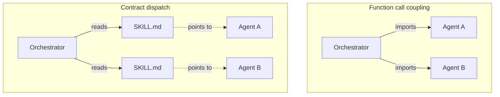

# Concept Explainer

The doc you write when someone needs to *understand* a concept, not just look up its API. The signature move is the live demo — a piece of the page the reader can poke at, where the concept becomes obvious through interaction in a way no paragraph can match.

Thariq's consistent-hashing demo is the canonical example: a ring you can add and remove nodes from, watching keys redistribute. Five seconds of poking teaches more than a page of prose.

## When this is the right pattern

- "Explain how token buckets work"
- "What is a SKILL.md and why does The Hive use them?"
- "How does the agent capability matcher decide?"
- "Walk me through what happens during a memory consolidation"

If the user wants a *map* of an existing system, use architecture-map. If they want to *compare* options, use comparison. Concept explainers are pedagogical — the goal is "I get it now."

## Structure

1. **Sources** header (instead of "Files read") — papers, docs, repos this draws from
2. **TL;DR** — the concept in one paragraph
3. **The demo** — the interactive piece, near the top, where curiosity is highest
4. **Why this matters** — the context that motivates the concept
5. **How it works** — the mechanics, often as a step-through with `<details>`
6. **Comparison table** — this concept vs related/alternative concepts
7. **Glossary** — hover-linked terms (or a sidebar of definitions)
8. **Where you'll see this** — pointers to where the concept shows up in the user's actual code

The demo is the soul of the doc. Everything else supports it.

## Vanilla JS approach

For most concept demos, vanilla JS is the right choice. Reasons:

- Self-contained: no React/Vue setup inside an HTML file
- The agent has full control of the rendering, so weird visualizations are easy
- File size stays small; the doc opens instantly
- Future-proof: vanilla JS from 2026 will work in 2036

A typical demo has:
- Some state (variables or a single `state` object)
- A `render()` function that redraws the SVG/DOM from state
- Event handlers that mutate state and call `render()`
- An optional `setInterval` for animations or simulations

```html
<div class="demo" id="demo">
  <svg viewBox="0 0 400 200" id="canvas"></svg>
  <div class="controls">
    <button onclick="addNode()">Add node</button>
    <button onclick="removeNode()">Remove node</button>
    <button onclick="reset()">Reset</button>
  </div>
  <p class="readout">Nodes: <span id="count">3</span> · Keys distributed: <span id="dist">balanced</span></p>
</div>

<script>
  const state = { nodes: [{id: 'A', angle: 0}, {id: 'B', angle: 120}, {id: 'C', angle: 240}] };
  const canvas = document.getElementById('canvas');

  function render() {
    canvas.innerHTML = state.nodes.map(n => {
      const x = 200 + 80 * Math.cos((n.angle - 90) * Math.PI / 180);
      const y = 100 + 80 * Math.sin((n.angle - 90) * Math.PI / 180);
      return `<circle cx="${x}" cy="${y}" r="12" fill="var(--accent)"/>
              <text x="${x}" y="${y+4}" text-anchor="middle" fill="white"
                    font-family="var(--sans)" font-size="11">${n.id}</text>`;
    }).join('');
    document.getElementById('count').textContent = state.nodes.length;
  }

  function addNode() {
    const id = String.fromCharCode(65 + state.nodes.length);
    state.nodes.push({id, angle: Math.random() * 360});
    render();
  }
  // ... etc
  render();
</script>
```

For more complex demos (graphs, animations, physics), D3 is acceptable as a CDN import. Three.js for 3D. Avoid heavier frameworks.

## Demo design principles

- **Interactive within 2 seconds of seeing the page.** No "click here to start" — the demo should already show something meaningful at rest, and inviting controls below it.
- **Show state, not just behavior.** Display the underlying state somewhere visible (count of nodes, current value, etc.) so the reader can connect cause to effect.
- **One concept per demo.** If the demo has more than 4 controls, you're trying to teach two things. Split it.
- **Reset button always.** Readers will break things; let them recover.
- **Reasonable defaults.** The demo's initial state should already be illustrative — don't make the reader configure it before they see anything interesting.

## The comparison table

After the demo, a table comparing the concept to neighbors. This is what cements understanding by drawing borders.

```html
<table class="compare">
  <thead>
    <tr><th></th><th>Token bucket</th><th>Leaky bucket</th><th>Fixed window</th></tr>
  </thead>
  <tbody>
    <tr><th>Burst tolerance</th><td>Yes (up to bucket size)</td><td>No</td><td>Sort of (within window)</td></tr>
    <tr><th>Smoothness</th><td>Bursty then smooth</td><td>Always smooth</td><td>Boundary spikes</td></tr>
    <tr><th>State per caller</th><td>2 numbers</td><td>2 numbers</td><td>1 counter + window start</td></tr>
    <tr><th>Best for</th><td>APIs with bursty clients</td><td>Traffic shaping</td><td>Crude rate limits</td></tr>
  </tbody>
</table>
```

```css
.compare { width: 100%; border-collapse: collapse; margin: 1.5rem 0;
           font-family: var(--sans); font-size: 0.9rem; }
.compare th, .compare td { padding: 0.6rem 0.8rem; text-align: left;
                            border-bottom: 1px solid var(--rule); vertical-align: top; }
.compare thead th { font-weight: 500; color: var(--muted); border-bottom-width: 2px; }
.compare tbody th { font-weight: 500; color: var(--muted); width: 25%; }
```

## The glossary — hover-linked terms

This is the polish move. Inline a `<dfn>` element with `data-def` and let CSS show the definition on hover.

```html
<p>The bucket holds <dfn data-def="The maximum number of tokens the bucket can hold; controls burst tolerance.">capacity</dfn> tokens, refilling at <dfn data-def="Tokens added per second.">rate</dfn>.</p>
```

```css
dfn { font-style: normal; border-bottom: 1px dotted var(--accent); cursor: help; position: relative; }
dfn:hover::after {
  content: attr(data-def);
  position: absolute; bottom: 100%; left: 0;
  background: var(--fg); color: var(--bg);
  font-family: var(--sans); font-size: 0.85rem; font-weight: normal;
  padding: 0.5rem 0.75rem; border-radius: 4px; white-space: normal;
  width: 240px; z-index: 10;
}
```

For touch users, add a sidebar glossary too — hover doesn't work on phones.

## Common gotchas

- **The demo doesn't survive the page being inspected.** Test that resetting works after a long session, that no `setInterval` leaks, that the state can be reset to genuinely-initial.
- **The concept got buried under the demo.** The demo is the hook, not the substance. After the demo, real prose explaining what just happened.
- **Glossary terms used before they're introduced.** Read the doc in order. If "consistent hashing" appears in TL;DR but is only defined in section 4, define it in TL;DR.
- **Comparison table that's too kind.** "X is great for A, Y is great for B" with no honest tradeoffs. The comparison should clarify by showing where each option *loses*.

## What the .md looks like

The .md describes the demo (it can't run it) and carries the substance — prose, comparison table, glossary. The HTML is what makes the demo come alive.

```markdown
---
title: SKILL.md as the operational contract
tags: [hive, skills, contracts, agents]
type: concept-explainer
html: ./skill-md-as-contract.html
date: 2026-05-09
sources: ["Anthropic skill docs", "orchestrator/skill-loader.ts", "the Jira-as-skill lunch-and-learn"]
related: ["[[hive-orchestrator]]", "[[agent-anatomy]]"]
---

# SKILL.md as the operational contract

> [!tldr]
> A SKILL.md is a markdown file with frontmatter that an agent reads when
> invoked. It declares what the agent does, when to use it, and what to
> expect. The Hive treats it as an operational contract — analogous to a
> Jira ticket. Both describe a unit of work in a form humans and machines
> can both read.

> [!example] Live demo
> The HTML companion has a live SKILL.md editor. Edit the frontmatter on
> the left, see how Claude would route to it on the right. Toggles for
> "with description" / "without description" show how triggering degrades
> when the description is weak.

## Why a contract, not a function call?

The orchestrator could call agents through TypeScript imports. That's
what most frameworks do. The Hive doesn't, because...

[prose argument]



## Anatomy of a SKILL.md

The frontmatter has three required fields and several optional ones...

[Step-through: name, description, body, references/]

## SKILL.md vs nearby ideas

| | SKILL.md | OpenAPI spec | Jira ticket | MCP server manifest |
|---|---|---|---|---|
| Audience | LLM agent | HTTP client | human + reviewer | LLM agent |
| Triggers | description match | endpoint match | manual assignment | tool listing |
| Lives with | the agent | the API | a project | the server |
| ... | | | | |

## In The Hive

[where SKILL.md files live, how the orchestrator loads them, the
discovery flow]

## Glossary

- **Capability tag** — a string in the frontmatter that the matcher uses
- **Agent manifest** — the registry's index of all known agents
- **Progressive disclosure** — the practice of putting load-bearing
  instructions in the SKILL.md body and detail in `references/`
- **Trigger phrase** — a phrase in the description that signals
  when this skill should activate
```

The HTML rendering of this:
- TL;DR callout → `.tldr` box
- `> [!example] Live demo` → not just a callout — this is the cue to actually build the live SKILL.md editor in the HTML, in this position
- Mermaid two-panel diagram → hand-SVG of the same two panels
- Comparison table → `.compare` styled
- Glossary → hover-linked `<dfn>` definitions inline + sidebar of the full list

The .md says "the demo lives in the HTML, here's what it does." The HTML actually runs the demo. Same content, different rendering — exactly the asymmetry the cardinal rule allows.

The .md is typically 200-350 lines for a concept explainer.
