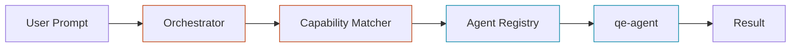
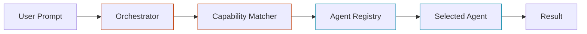

# The Markdown Document

The .md is the canonical source of truth. It's a real document — full prose, real structure — that lives in an Obsidian vault and is consumed by other agents and tools. The HTML is rendered *from* it. This file describes the .md format conventions.

## Frontmatter

YAML, fenced with `---`. Required fields:

```yaml
---
title: How the Hive orchestrator dispatches to agents
tags: [hive, architecture, orchestrator]
type: architecture-map
html: ./orchestrator-dispatch.html
date: 2026-05-09
---
```

| Field | Purpose |
|---|---|
| `title` | The H1 of both the .md and the HTML |
| `tags` | Obsidian-style flat tags. Use existing vault tags when possible. |
| `type` | `architecture-map` / `concept-explainer` / `comparison` / `feature-explainer` — drives rendering choices |
| `html` | Relative path to the rendered companion. Lets readers in the .md find the HTML. |
| `date` | ISO date the doc was written or last meaningfully updated |

Optional fields worth using:

```yaml
aliases: ["Hive dispatch", "How agents get picked"]
sources: ["orchestrator/dispatch.ts", "agents/manifest.json"]
status: stable | experimental | deprecated
related: ["[[skill-md-explainer]]", "[[hive-architecture]]"]
```

## Body structure

Open with the H1 (matching `title`), then a `> [!tldr]` callout. Then sections. Don't put prose between the H1 and the TL;DR — the TL;DR is the first content the reader sees.

```markdown
# How the Hive orchestrator dispatches to agents

> [!tldr]
> The orchestrator builds a task envelope from the user's prompt, picks
> an agent based on capability tags in the manifest, and hands off via a
> SKILL.md contract rather than a function call. Decoupling lets agents
> be swapped without touching the orchestrator.

## The map

[Mermaid diagram here]

## Components

### Orchestrator

[prose, code references, callouts]

### Capability matcher

[etc.]
```

H2s become the on-page nav entries in the HTML. Keep them parallel: all noun phrases, or all verb phrases — not mixed.

## Obsidian callouts

Use callouts for everything that isn't running prose. They render natively in Obsidian and translate cleanly to HTML components.

| Obsidian syntax | HTML component | When to use |
|---|---|---|
| `> [!tldr]` | `.tldr` | The standing summary at the top — every doc has one |
| `> [!info]` | `.callout` (default) | Asides, tangents, "by the way" |
| `> [!warning]` | `.callout.warning` | Gotchas, footguns, things that bite |
| `> [!tip]` | `.callout.tip` | Recommended approaches, idioms |
| `> [!example]` | `.callout.example` | Worked examples that aren't full sections |
| `> [!quote]` | `<blockquote>` | Quotes from sources |
| `> [!todo]` | `.callout.todo` | Outstanding work — these often surface as "things I noticed" gaps |

```markdown
> [!warning] Gotcha
> `burst` is bucket capacity, not rate. A caller idle for a minute can
> fire `burst` requests instantly even if `rate` is low.
```

The text after `[!type]` on the same line is the callout's title. Body follows on subsequent lines, all prefixed with `>`.

## Wiki links

Always `[[double-brackets]]` in the .md. Three forms:

```markdown
[[skill-md-explainer]]              — link by slug, displays as "skill-md-explainer"
[[skill-md-explainer|SKILL.md]]     — link by slug, displays as "SKILL.md"
[[skill-md-explainer#Anatomy]]      — link to a heading inside another note
```

At HTML render time, translate to plain anchors:

| .md | HTML |
|---|---|
| `[[skill-md-explainer]]` | `<a href="./skill-md-explainer.html">skill-md-explainer</a>` |
| `[[skill-md-explainer\|SKILL.md]]` | `<a href="./skill-md-explainer.html">SKILL.md</a>` |
| `[[skill-md-explainer#Anatomy]]` | `<a href="./skill-md-explainer.html#anatomy">skill-md-explainer › Anatomy</a>` |

For the heading link, lowercase and hyphenate the heading text to make the anchor — match how the HTML generates section IDs.

If the linked note has no companion HTML yet, the link still appears in the rendered HTML but as a faded link with `class="dangling"` — readers can see what's referenced even if it's not yet built. CSS:

```css
a.dangling { color: var(--muted); text-decoration: underline dotted; cursor: help; }
a.dangling::after { content: " ↗"; font-size: 0.85em; }
```

## File-referenced code blocks

Standard fenced code blocks with the language plus an optional file path:

````markdown
```ts orchestrator/dispatch.ts:21
function dispatch(envelope: Envelope) {
  const agent = matcher.find(envelope.capability);
  if (!agent) throw new NoMatchError(envelope);
  return agent.invoke(envelope);
}
```
````

The path-after-language convention is non-standard markdown but renders as plain code in tools that don't parse it. The HTML renderer extracts it and shows it as a small badge or a header above the code block.

## Mermaid diagrams

Standard Obsidian Mermaid blocks:

````markdown

````

Use the same `classDef` color names that map to the HTML's `--layer-1` / `--layer-2` CSS variables. This is how diagram parity stays sane — colors agree at the source level.

In the HTML, draw an independent hand-SVG with the same boxes, same arrows, same colors. Don't auto-convert. The Mermaid is for Obsidian/grep; the SVG is for the polished read.

## Ordinary markdown still works

All the normal Markdown is welcome — bullets, numbered lists, **bold**, *italic*, inline `code`, tables, blockquotes. Don't replace these with custom syntax. Only reach for callouts and wiki links when they earn their place.

Tables in particular travel well between .md and HTML — comparison docs lean on them. The HTML can apply the `.compare` styling to any markdown table.

## What the .md should NOT contain

- **HTML inline.** Don't put `<div>`s or `<style>` tags in the .md to "preview" the HTML. The .md is markdown. The HTML is HTML. They're separate.
- **Hand-SVG.** Same reason — Mermaid is the diagram in the .md. The hand-SVG only lives in the HTML.
- **JavaScript demos.** A live consistent-hashing demo can't run in markdown. Describe what the demo does in a `> [!example]` callout, and have it actually run in the HTML.
- **Pointers to "see the HTML for the real version."** The .md should stand on its own. If something can't be expressed in the .md, describe it in prose. The HTML adds *experience*, not *content*.

## Scale

A real .md document for an architecture map is typically 200-500 lines. A concept explainer is 150-400. A comparison is 250-600. Don't artificially compress — the .md is doing real work and length is fine. The constraint is *substance*, not brevity. If a section is short because there's not much to say, that's correct; if it's short because you're rushing, that's not.

## A worked frontmatter + opening

```markdown
---
title: How the Hive orchestrator dispatches to agents
tags: [hive, architecture, orchestrator, dispatch]
type: architecture-map
html: ./orchestrator-dispatch.html
date: 2026-05-09
sources: ["orchestrator/dispatch.ts", "orchestrator/envelope.ts", "agents/manifest.json"]
status: stable
related: ["[[skill-md-explainer]]", "[[agent-anatomy]]", "[[capability-matcher]]"]
---

# How the Hive orchestrator dispatches to agents

> [!tldr]
> The orchestrator builds a task envelope from the user's prompt, resolves
> it to an agent via the capability matcher reading the agent manifest,
> and hands off through the agent's SKILL.md contract. Decoupling means
> agents can be added, removed, or swapped without touching dispatch logic.

## The map



The orchestrator and matcher are layer-1 (orange) — they own the dispatch
decision. The registry and agents are layer-2 (blue) — they're the
catalog and the workers.

## Components

### Orchestrator

The orchestrator's job is small: turn a prompt into an envelope, ask the
matcher for an agent, invoke it...
```

That's the shape. Real prose. Real structure. Stands on its own when grep'd, ingested by another agent, or read in Obsidian. The HTML companion will *render* this differently — TL;DR styled, Mermaid replaced with hand-SVG, callouts boxed, wiki-links resolved — but the *content* is right here in the .md.
