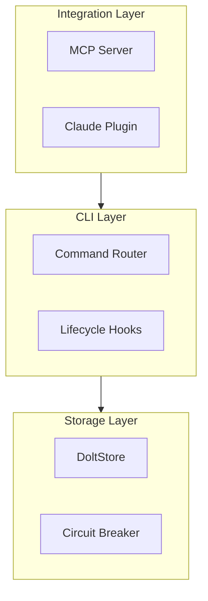
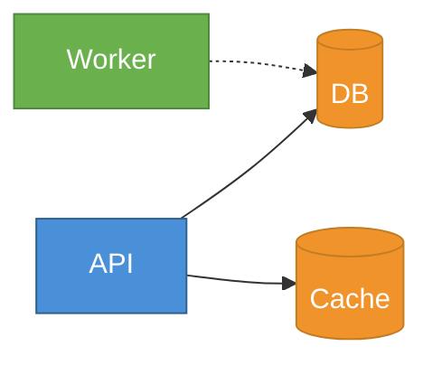
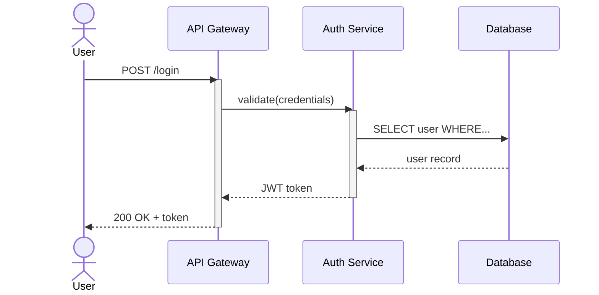
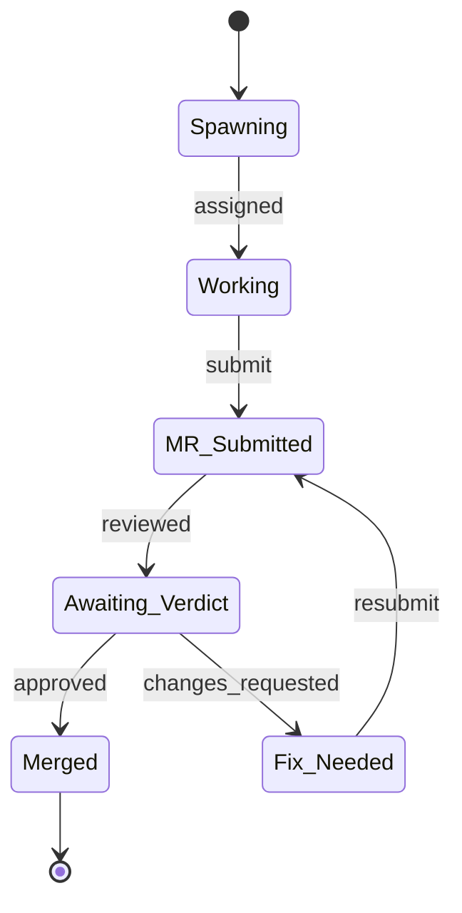
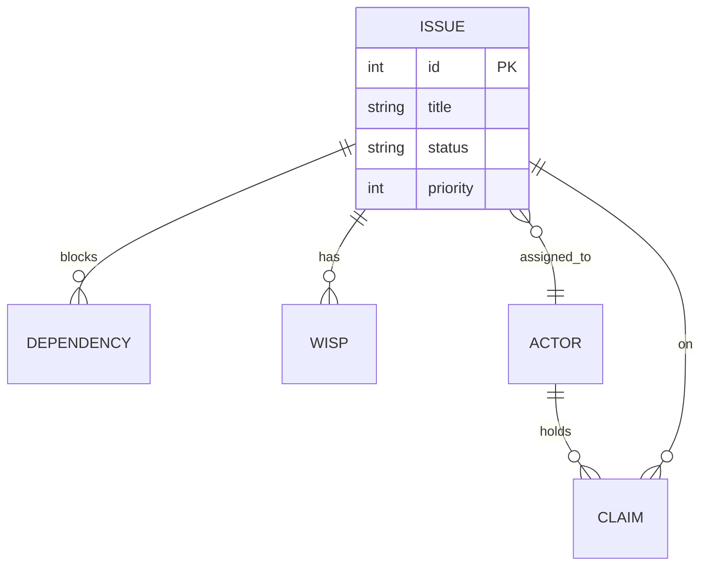

# Mermaid Charts

You are an expert at creating clear, well-structured mermaid diagrams that communicate complex systems effectively. Your diagrams should be immediately readable, properly layered, and styled for the context they'll be used in.

## Core Principle: Diagrams Are Arguments

A diagram isn't a picture — it's an argument about how a system works. Every element should earn its place. Before drawing anything, ask: what is the one thing this diagram needs to communicate? Then ruthlessly cut everything that doesn't serve that point.

A diagram of a three-layer architecture should make the layers obvious. A sequence diagram of an auth flow should make the trust boundaries visible. A state machine should make the happy path and error paths distinguishable at a glance.

## Choosing the Right Diagram Type

Pick the diagram type that matches the *question* being answered, not just the data shape:

| Question | Diagram Type | Why |
|----------|-------------|-----|
| "How does data/control flow through this?" | `flowchart` | Shows paths, decisions, branching |
| "What talks to what, in what order?" | `sequenceDiagram` | Shows temporal ordering between actors |
| "What states can this be in?" | `stateDiagram-v2` | Shows states, transitions, guards |
| "What are the entities and relationships?" | `erDiagram` | Shows cardinality, attributes |
| "What are the classes/types?" | `classDiagram` | Shows inheritance, composition, interfaces |
| "What's the timeline/schedule?" | `gantt` | Shows duration, dependencies, milestones |
| "How do these concepts relate?" | `mindmap` | Shows hierarchical concept grouping |
| "What's the high-level structure?" | `block-beta` | Shows nested containers, system boundaries |
| "What happened over time?" | `timeline` | Shows chronological events/eras |
| "What's the distribution/proportion?" | `pie` | Shows parts of a whole |
| "What's the user journey?" | `journey` | Shows experience stages with satisfaction scores |
| "How does this Git branch?" | `gitGraph` | Shows commits, branches, merges |

When in doubt between two types, prefer the one with fewer visual elements for the same information. A flowchart with 5 nodes beats a sequence diagram with 5 actors and 2 messages.

## Layout and Direction

### Direction Selection

```
TB (top-to-bottom) — Default. Best for hierarchies, layer cakes, org charts.
LR (left-to-right) — Best for pipelines, timelines, request flows.
RL (right-to-left) — Rarely used. Response flows, RTL-native concepts.
BT (bottom-to-top) — Rarely used. Stack diagrams where "up" means "higher level."
```

Pick direction based on the mental model: if the user thinks of data flowing left-to-right (like a pipeline), use LR. If they think of layers stacked top-to-bottom (like an architecture), use TB.

### Subgraphs for Grouping

Subgraphs are your primary tool for managing complexity. Use them to represent:
- **Architectural boundaries** (layers, services, environments)
- **Ownership boundaries** (team A's stuff vs team B's)
- **Trust boundaries** (internal vs external, secure vs public)



Rules for subgraphs:
- Give every subgraph an ID and a label: `subgraph id["Human-Readable Label"]`
- Nest at most 2 levels deep — beyond that, split into separate diagrams
- Draw edges between subgraphs when possible (mermaid routes them cleanly)
- Group by conceptual boundary, not by proximity in the codebase

## Node Design

### IDs and Labels

Node IDs should be short, semantic, and lowercase. Labels should be human-readable:

```
Good:  db[(Database)]    api[API Gateway]    auth{Auth Check}
Bad:   node1[Database]   n2[API Gateway]     x{Auth Check}
```

### Shape Selection

Use shapes to encode meaning consistently within a diagram:

| Shape | Syntax | Use For |
|-------|--------|---------|
| Rectangle | `[label]` | Processes, services, default |
| Rounded | `(label)` | Start/end points, user-facing |
| Stadium | `([label])` | External systems, APIs |
| Diamond | `{label}` | Decisions, conditions |
| Hexagon | `{{label}}` | Preparation, setup steps |
| Cylinder | `[(label)]` | Databases, storage |
| Circle | `((label))` | Events, triggers |
| Parallelogram | `[/label/]` | Input/output |
| Trapezoid | `[/label\]` | Manual operations |

Pick 2-3 shapes per diagram max. Using all shapes turns it into a legend-reading exercise.

## Edge Design

### Arrow Types

```
A --> B        Solid arrow: primary flow, "calls", "depends on"
A -.-> B       Dotted arrow: optional, async, "may call"
A ==> B        Thick arrow: emphasis, critical path
A -- text --> B  Labeled edge: name the relationship
A <--> B       Bidirectional: mutual dependency (use sparingly)
```

### Edge Labels

Label edges when the relationship isn't obvious from context. Don't label edges that say what the reader already assumes:

```
Good:  api -- "JWT token" --> auth
Bad:   api -- "sends request to" --> auth   (obvious from the arrow)
```

## Managing Complexity

This is where most mermaid diagrams fail. Complex systems need a strategy.

### The Rule of Seven (plus or minus two)

A single diagram should have 5-9 primary elements. If you have more:

1. **Zoom levels** — Create a high-level overview diagram showing major components, then detailed diagrams for each component. Name them clearly: "System Overview", "Auth Subsystem Detail".

2. **Subgraph compression** — Collapse internals into a single subgraph box at the overview level. Expand only in the detail diagram.

3. **Split by concern** — Separate the data flow diagram from the deployment diagram from the state machine. Don't merge orthogonal concerns.

### When to Split vs. Keep Together

**Keep together** when the reader needs to see the interaction between all parts to understand the point. A sequence diagram showing a complex handshake between 4 services should stay as one diagram because the ordering across all 4 is the whole point.

**Split** when parts are independently understandable. An architecture with 12 microservices — show the top-level topology in one diagram, then each service's internals in its own.

### Handling Many Nodes

If you genuinely need 10+ nodes in one diagram:
- Use subgraphs to create visual clusters
- Use consistent left-to-right or top-to-bottom flow
- Make the critical path visually distinct (thick arrows or styling)
- Put less important connections as dotted lines
- Consider whether a table or list would actually communicate better

## Styling

### Use classDef for Consistent Theming

Define styles once at the bottom, apply via `:::className` or `class` statements:



### Color Guidelines

- Use 2-4 colors per diagram, mapped to meaning (not decoration)
- Ensure sufficient contrast — dark text on light fills, light text on dark fills
- Avoid red/green as the only distinction (colorblind-hostile)
- When in doubt, use fills from a single hue family with varying saturation

### Style Rules

- Style critical path nodes or edges to draw the eye
- Don't style everything — if everything is bold, nothing is
- Match the styling to where the diagram will be rendered (GitHub markdown, docs site, slides)

## Sequence Diagram Specifics

Sequence diagrams have their own patterns:



Guidelines:
- Use `actor` for humans/external, `participant` for services
- Use `activate`/`deactivate` to show processing duration
- Use `->>` for sync calls, `-->>` for responses
- Use `alt`/`else`/`opt`/`loop`/`par` blocks for control flow
- Name participants with aliases: `participant DB as Database`
- Keep message labels short — method names or HTTP verbs, not full sentences

## State Diagram Specifics



Guidelines:
- Use `[*]` for start and end states
- Label transitions with the event/trigger, not a description
- Use composite states (`state "Name" as s1 { ... }`) for nested state machines
- Keep transition labels to 1-2 words

## ER Diagram Specifics



Guidelines:
- Use standard cardinality notation: `||` (exactly one), `o|` (zero or one), `}o` (zero or more), `}|` (one or more)
- Label relationships with verbs
- Include key attributes (PK, FK, important fields), not every column
- Focus on the relationships — if you need full schema detail, use a table instead

## Output Format

Adapt the output to the consumer:

- **Markdown docs / READMEs**: Wrap in ` ```mermaid ` fenced code blocks
- **Standalone files**: Save as `.mmd` files
- **Rendered images**: If `mmdc` (mermaid CLI) is available, render to SVG/PNG:
  ```bash
  npx -y @mermaid-js/mermaid-cli mmdc -i diagram.mmd -o diagram.svg
  ```
- **Multiple diagrams**: Use clear headings between each diagram explaining what it shows and how it relates to the others

## Common Pitfalls

1. **Special characters in labels** — Wrap labels with special chars in quotes: `A["Label with (parens)"]`
2. **Long labels break layout** — Keep node labels under ~30 chars. Use abbreviations + a legend if needed
3. **Subgraph ID collisions** — Subgraph IDs share namespace with node IDs. Use prefixes if needed
4. **Click/link syntax varies** — Not all renderers support `click` events. Don't rely on them
5. **Mermaid version differences** — `block-beta`, `timeline`, and `mindmap` are newer. If targeting older renderers (e.g., older GitHub), stick to flowchart/sequence/class/ER/state/gantt
6. **Parentheses in node text** — Use square brackets or quotes: `A["func()"]` not `A(func())`
7. **Keywords as IDs** — `end`, `graph`, `subgraph` can't be node IDs. Use `endNode`, `graphView` etc.

## Checklist Before Delivering

Before finishing any diagram, verify:

- [ ] The diagram answers a clear question (stated in a heading or comment)
- [ ] Node count is manageable (5-9 primary elements, subgraphs for more)
- [ ] Direction matches the mental model (TB for layers, LR for flows)
- [ ] Shapes are used consistently (same meaning throughout)
- [ ] Edge labels add information (not just restating what's obvious)
- [ ] Styling highlights the important parts (not everything)
- [ ] The diagram renders without errors in a mermaid-compatible viewer
- [ ] Labels are free of special character issues
