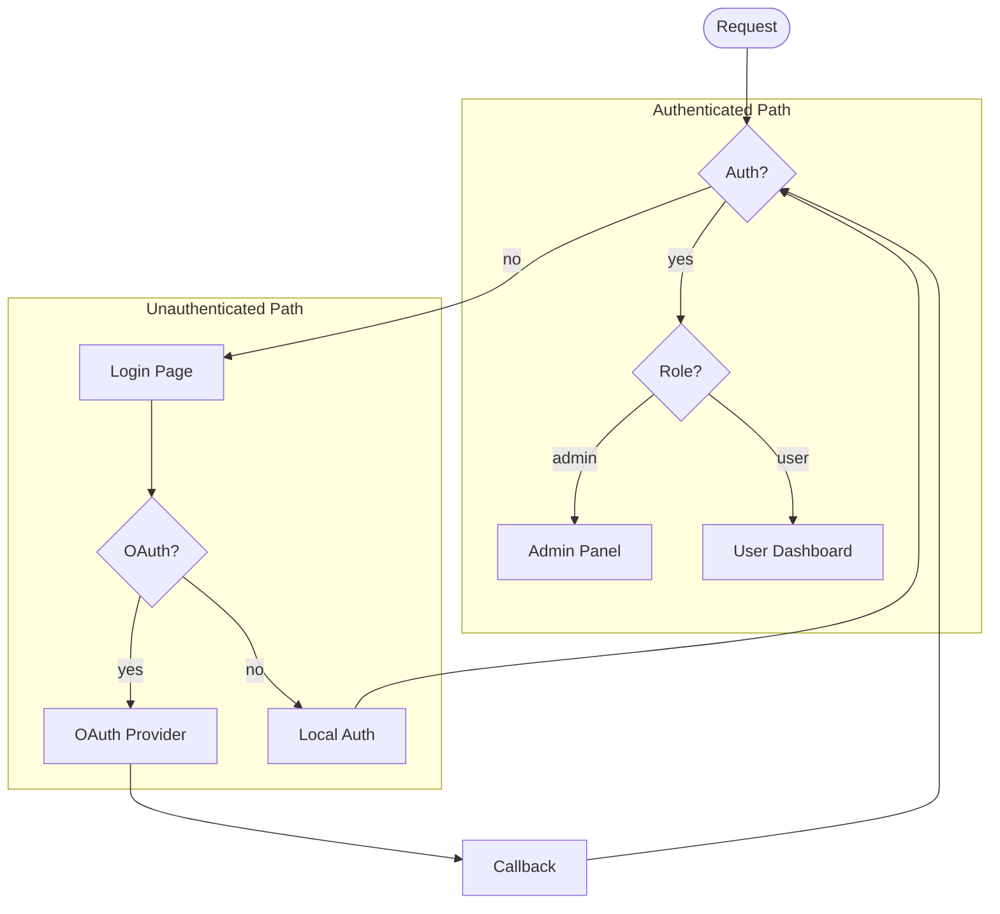
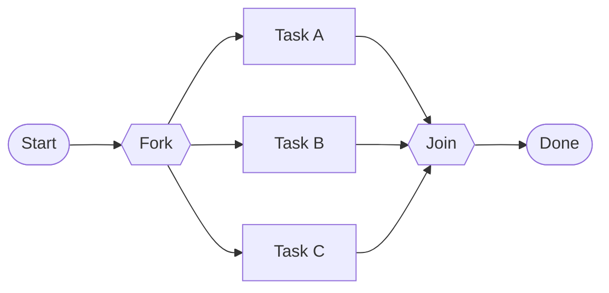
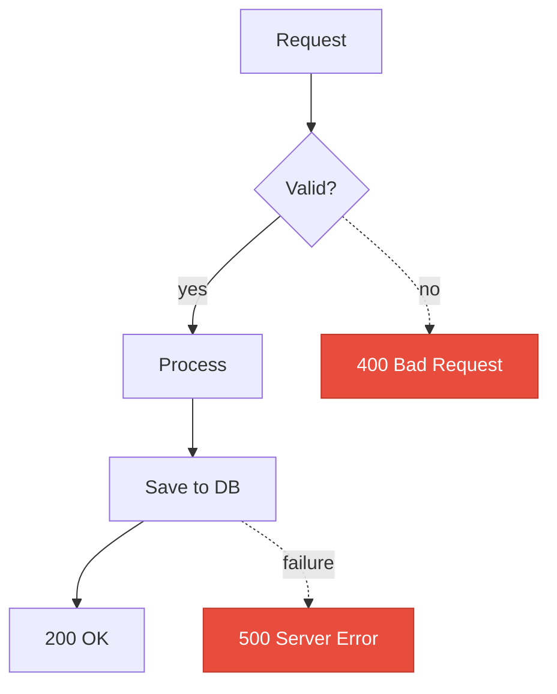
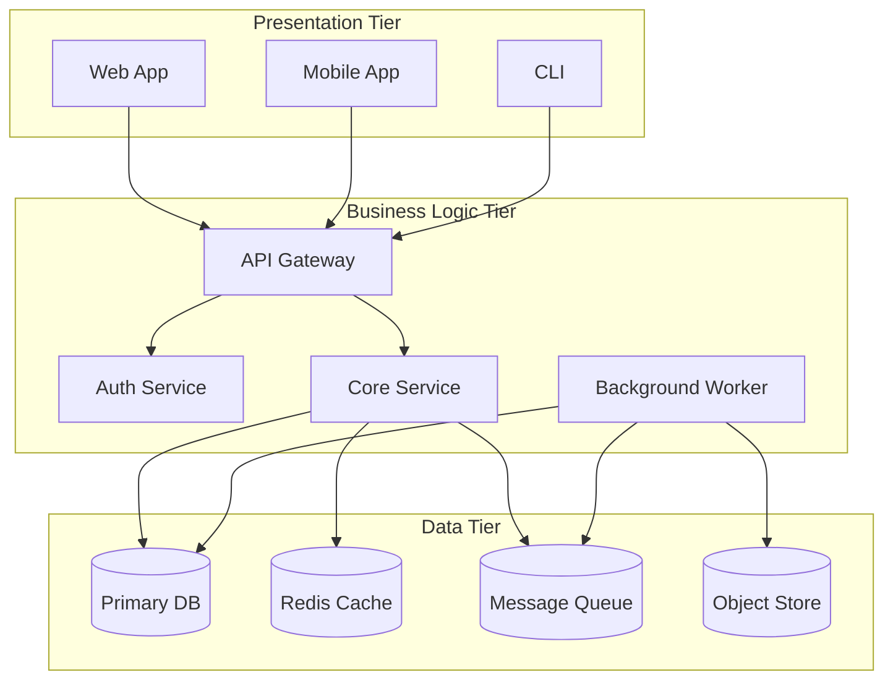
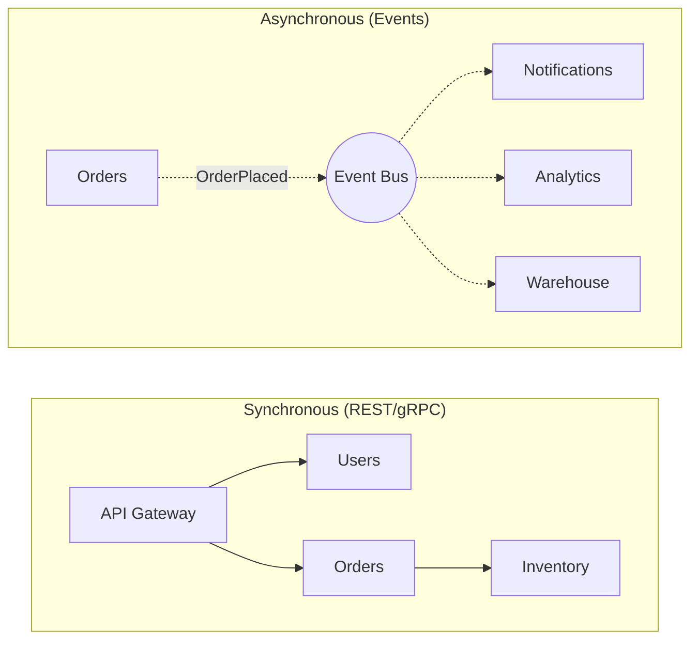
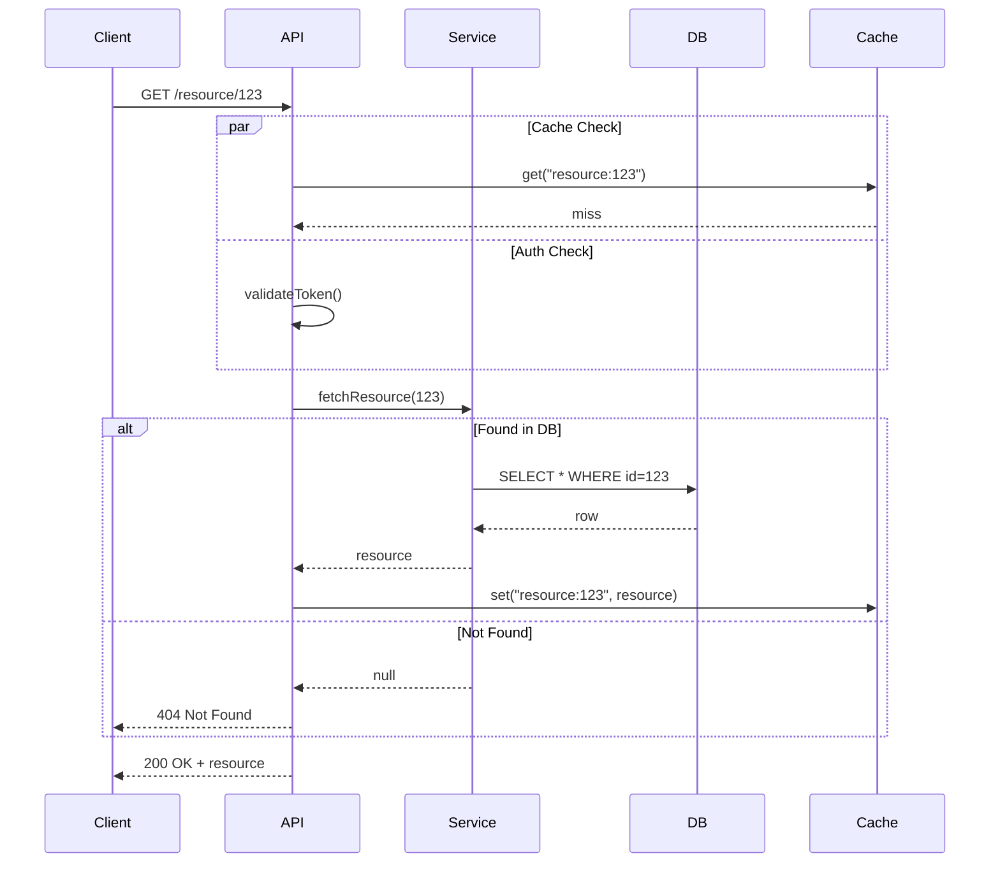
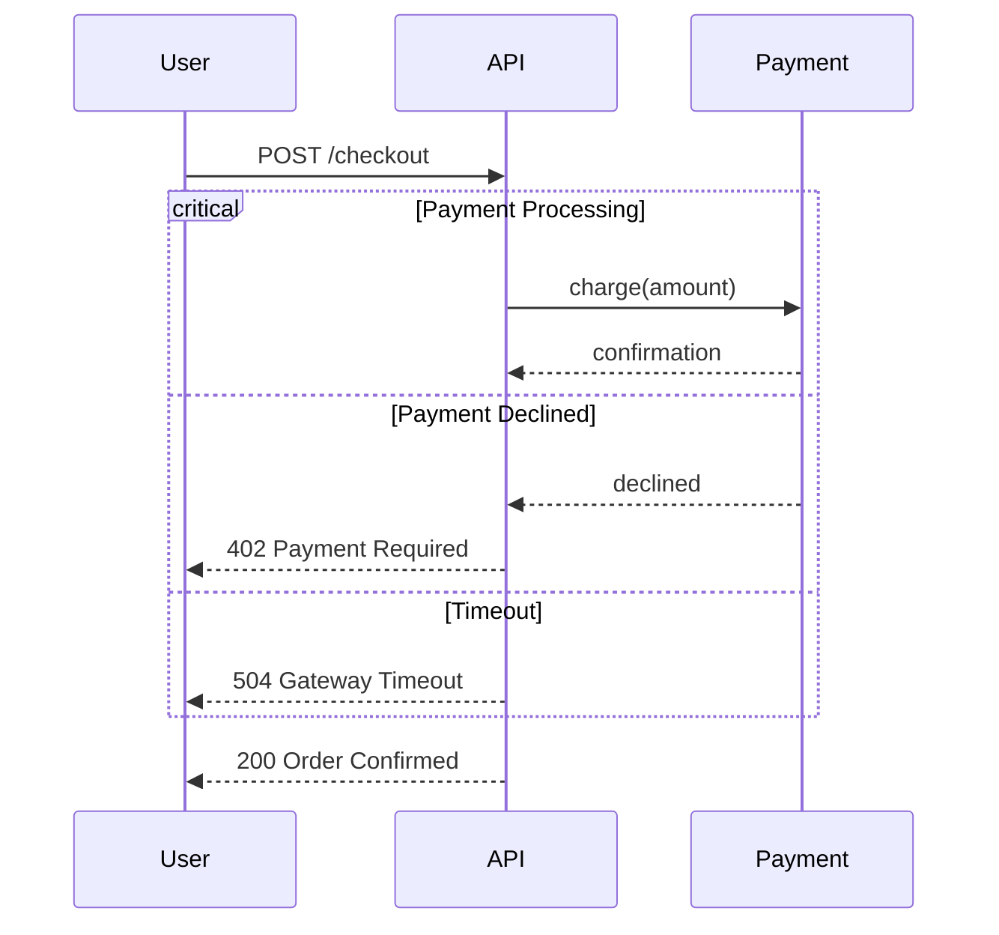
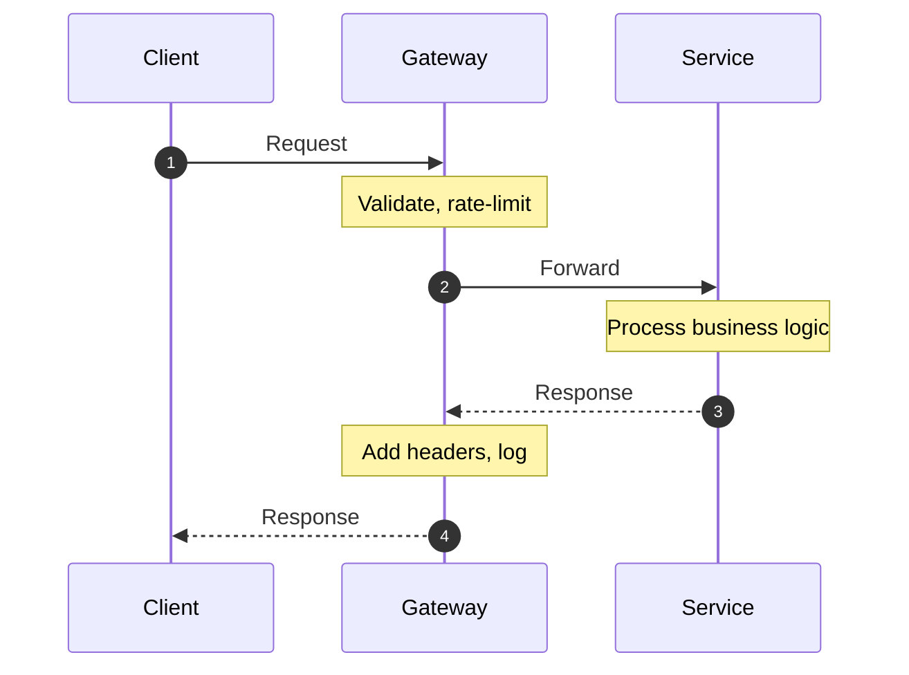
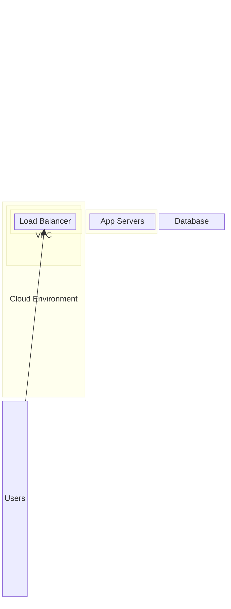
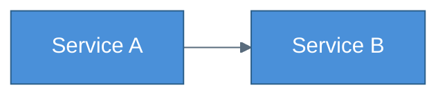

# Advanced Mermaid Patterns

Reference for complex diagram scenarios. Read this when the main SKILL.md guidance isn't sufficient for the task at hand.

## Table of Contents

1. [Multi-Diagram Document Structure](#multi-diagram-document-structure)
2. [Complex Flowcharts](#complex-flowcharts)
3. [Architecture Diagrams](#architecture-diagrams)
4. [Sequence Diagram Advanced Patterns](#sequence-diagram-advanced-patterns)
5. [Block-Beta for System Maps](#block-beta-for-system-maps)
6. [Theming and Branding](#theming-and-branding)
7. [Rendering Pipeline](#rendering-pipeline)

---

## Multi-Diagram Document Structure

When a system needs multiple diagrams, structure them as a narrative:

```markdown
# System Name — Architecture

## Overview
[High-level diagram showing major components and their relationships]

## Data Flow
[How data moves through the system — request/response paths]

## Component Detail: [Name]
[Zoomed-in view of one component's internals]

## State Lifecycle
[State machine for the primary entity]
```

Each diagram should be self-contained but reference the others by name. Use consistent node IDs across diagrams when the same component appears in multiple views — this helps the reader build a mental map.

---

## Complex Flowcharts

### Decision Trees

For multi-level decisions, use nested subgraphs to group related branches:



### Parallel Paths

Show parallel execution with a fork/join pattern:



### Error Handling Flows

Use dotted lines and red styling for error paths:



---

## Architecture Diagrams

### Three-Tier Architecture



### Microservice Communication

For microservice architectures, focus on the communication patterns:



---

## Sequence Diagram Advanced Patterns

### Parallel and Alternative Flows



### Critical and Break Blocks



### Numbered Steps with Notes



---

## Block-Beta for System Maps

Block-beta diagrams are excellent for showing containment and boundary relationships:



---

## Theming and Branding

### Custom Theme via Init Directive



### Dark Mode Friendly Colors

For diagrams that need to work on both light and dark backgrounds:

```
Primary:   fill:#4a90d9, stroke:#2c5f8a, color:#fff
Secondary: fill:#6ab04c, stroke:#4a8a3c, color:#fff
Warning:   fill:#f0932b, stroke:#c27d23, color:#fff
Error:     fill:#e74c3c, stroke:#c0392b, color:#fff
Neutral:   fill:#95a5a6, stroke:#7f8c8d, color:#fff
```

These have enough contrast to work on white, light gray, and dark backgrounds.

---

## Rendering Pipeline

### Using mermaid-cli (mmdc)

```bash
# Install
npm install -g @mermaid-js/mermaid-cli

# SVG (best for web)
mmdc -i diagram.mmd -o diagram.svg

# PNG (best for docs/slides)
mmdc -i diagram.mmd -o diagram.png -w 1200

# PDF
mmdc -i diagram.mmd -o diagram.pdf

# With custom theme
mmdc -i diagram.mmd -o diagram.svg -t dark

# With custom config
mmdc -i diagram.mmd -o diagram.svg -c mermaid.config.json
```

### Config File for Consistent Rendering

```json
{
  "theme": "default",
  "flowchart": {
    "curve": "basis",
    "padding": 20
  },
  "sequence": {
    "diagramMarginX": 20,
    "diagramMarginY": 10,
    "actorMargin": 50,
    "noteMargin": 10
  }
}
```

### Batch Rendering

```bash
# Render all .mmd files in a directory
for f in docs/diagrams/*.mmd; do
  mmdc -i "$f" -o "${f%.mmd}.svg"
done
```
