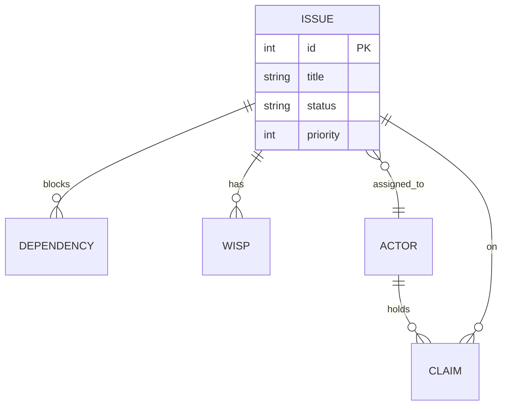

# ER Diagram

Answers "What are the entities and relationships?" — shows cardinality and key attributes.

## Pattern

## Guidelines

- Use standard cardinality notation: `||` (exactly one), `o|` (zero or one), `}o` (zero or more), `}|` (one or more)
- Label relationships with verbs
- Include key attributes (PK, FK, important fields), not every column
- Focus on the relationships — if you need full schema detail, use a table instead
