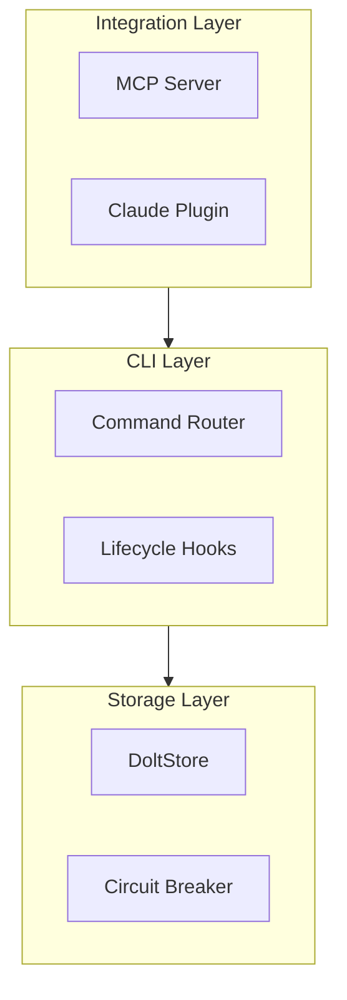
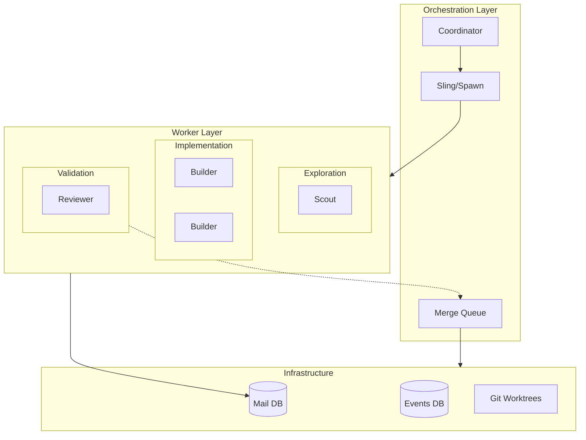
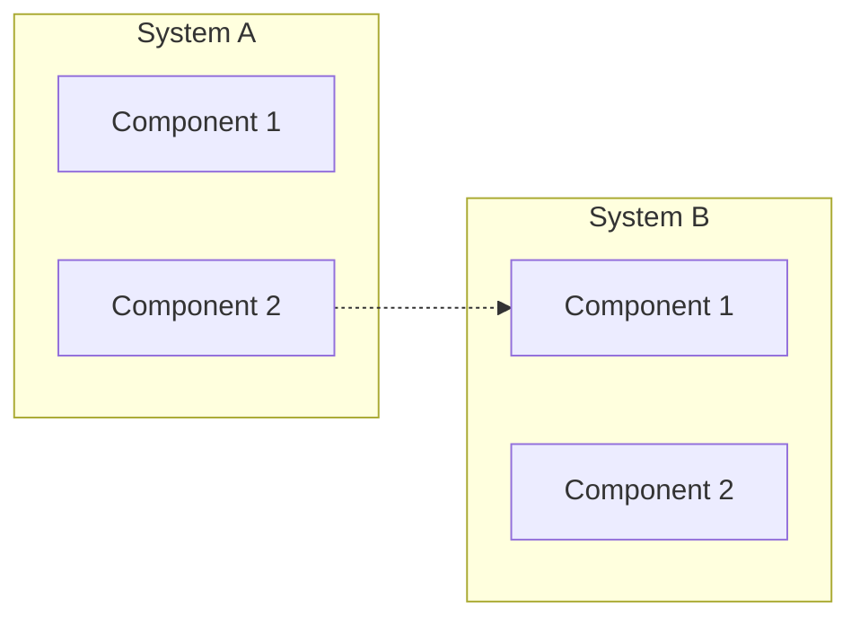

# Flowchart

Answers "How does data/control flow through this?" — shows paths, decisions, branching.

## Direction Selection

```text
TB (top-to-bottom) — Default. Best for hierarchies, layer cakes, org charts.
LR (left-to-right) — Best for pipelines, timelines, request flows.
RL (right-to-left) — Rarely used. Response flows, RTL-native concepts.
BT (bottom-to-top) — Rarely used. Stack diagrams where "up" means "higher level."
```

Pick direction based on the mental model: if the user thinks of data flowing left-to-right (like a pipeline), use LR. If they think of layers stacked top-to-bottom (like an architecture), use TB.

## Subgraphs for Grouping

Subgraphs are your primary tool for managing complexity. Use them to represent:

- **Architectural boundaries** (layers, services, environments)
- **Ownership boundaries** (team A's stuff vs team B's)
- **Trust boundaries** (internal vs external, secure vs public)



Rules for subgraphs:

- Give every subgraph an ID and a label: `subgraph id["Human-Readable Label"]`
- Nest at most 2 levels deep — beyond that, split into separate diagrams
- Draw edges between subgraphs when possible (mermaid routes them cleanly)
- Group by conceptual boundary, not by proximity in the codebase

## Node Design

### IDs and Labels

Node IDs should be short, semantic, and lowercase. Labels should be human-readable:

```text
Good:  db[(Database)]    api[API Gateway]    auth{Auth Check}
Bad:   node1[Database]   n2[API Gateway]     x{Auth Check}
```

### Shape Selection

Use shapes to encode meaning consistently within a diagram:

| Shape | Syntax | Use For |
|-------|--------|---------|
| Rectangle | `[label]` | Processes, services, default |
| Rounded | `(label)` | Start/end points, user-facing |
| Stadium | `([label])` | External systems, APIs |
| Diamond | `{label}` | Decisions, conditions |
| Hexagon | `{{label}}` | Preparation, setup steps |
| Cylinder | `[(label)]` | Databases, storage |
| Circle | `((label))` | Events, triggers |
| Parallelogram | `[/label/]` | Input/output |
| Trapezoid | `[/label\]` | Manual operations |

Pick 2-3 shapes per diagram max. Using all shapes turns it into a legend-reading exercise.

## Edge Design

### Arrow Types

```text
A --> B        Solid arrow: primary flow, "calls", "depends on"
A -.-> B       Dotted arrow: optional, async, "may call"
A ==> B        Thick arrow: emphasis, critical path
A -- text --> B  Labeled edge: name the relationship
A <--> B       Bidirectional: mutual dependency (use sparingly)
```

### Edge Labels

Label edges when the relationship isn't obvious from context. Don't label edges that say what the reader already assumes:

```text
Good:  api -- "JWT token" --> auth
Bad:   api -- "sends request to" --> auth   (obvious from the arrow)
```

## Subgraph Architecture for Large Systems

For systems with 10-30+ components, use subgraphs as the primary organizational tool:



**Key techniques:**

- **Nested subgraphs** (2 levels max) group related components within a layer
- **Edge-to-subgraph** connections (draw edges between subgraph IDs when possible — mermaid routes them cleanly)
- **Consistent coloring per layer** so the eye can track boundaries
- **Mixed edge styles** — solid for primary flow, dotted for secondary/optional paths, thick for critical path

## The Anchor Pattern for Cross-Cutting Connections

When multiple subgraphs all connect to a shared resource, avoid the "star explosion" where every node points to the same central node. Instead, use an anchor node per subgraph:

```text
BAD:  A1 --> DB, A2 --> DB, A3 --> DB, B1 --> DB, B2 --> DB  (5 crossing edges)
GOOD: subgraph_A --> DB, subgraph_B --> DB  (2 clean edges)
```

Draw the edge from the subgraph or from a representative node within it, not from every individual component.

## Multi-System Comparison Patterns

**Pattern 1: Side-by-Side Subgraphs** — best for "what does each system own?"



**Pattern 2: Layered with Shared Foundation** — best for "how do systems stack?" Use TB direction with shared infrastructure at the bottom and different systems as columns above it.

**Pattern 3: Hub-and-Spoke** — best for "what's the central coordinator?" Put the orchestrator/coordinator in the center, spoke out to each subsystem.
