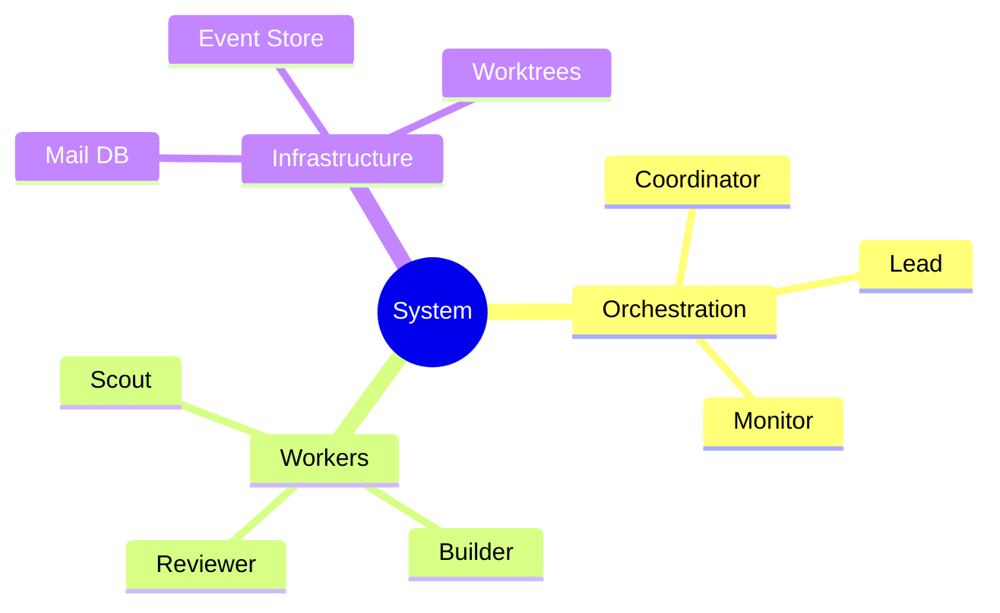

# Mindmap

Answers "How do these concepts relate?" — shows hierarchical concept grouping. Excellent for taxonomies, dependency types, role taxonomies, feature catalogs.

## Pattern

## Guidelines

- Use `root(( ))` for the central concept (double-paren for circle shape)
- Indent to show hierarchy — no explicit edge syntax needed
- Keep labels short (1-3 words per node)
- Use `::icon(fa fa-icon)` sparingly — only when it genuinely aids comprehension
- Best for 3-5 branches with 2-4 leaves each; beyond that, switch to flowchart with subgraphs
