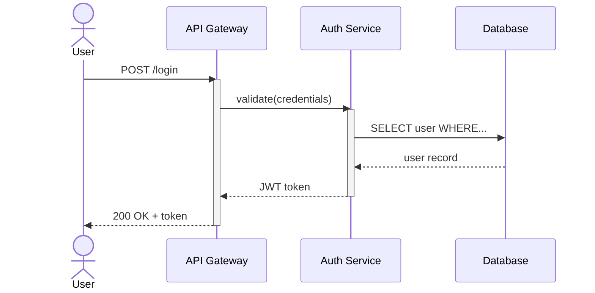

# Sequence Diagram

Answers "What talks to what, in what order?" — shows temporal ordering between actors.

## Pattern

## Guidelines

- Use `actor` for humans/external, `participant` for services
- Use `activate`/`deactivate` to show processing duration
- Use `->>` for sync calls, `-->>` for responses
- Use `alt`/`else`/`opt`/`loop`/`par` blocks for control flow
- Name participants with aliases: `participant DB as Database`
- Keep message labels short — method names or HTTP verbs, not full sentences
