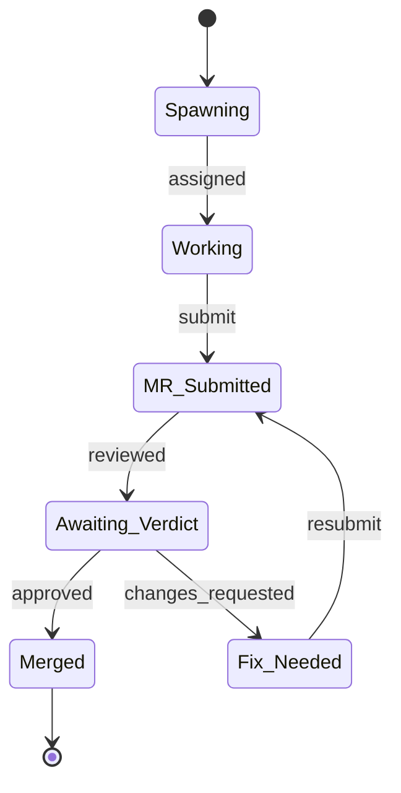

# State Diagram

Answers "What states can this be in?" — shows states, transitions, guards.

## Pattern

## Guidelines

- Use `[*]` for start and end states
- Label transitions with the event/trigger, not a description
- Use composite states (`state "Name" as s1 { ... }`) for nested state machines
- Keep transition labels to 1-2 words
